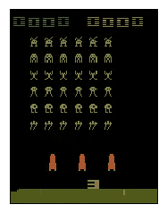
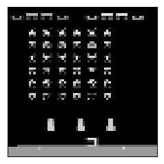
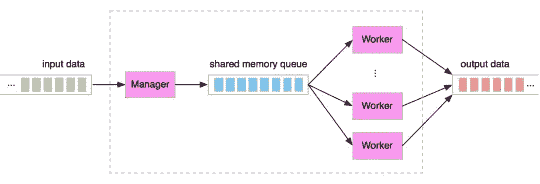
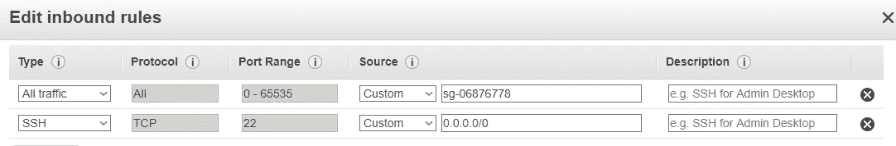
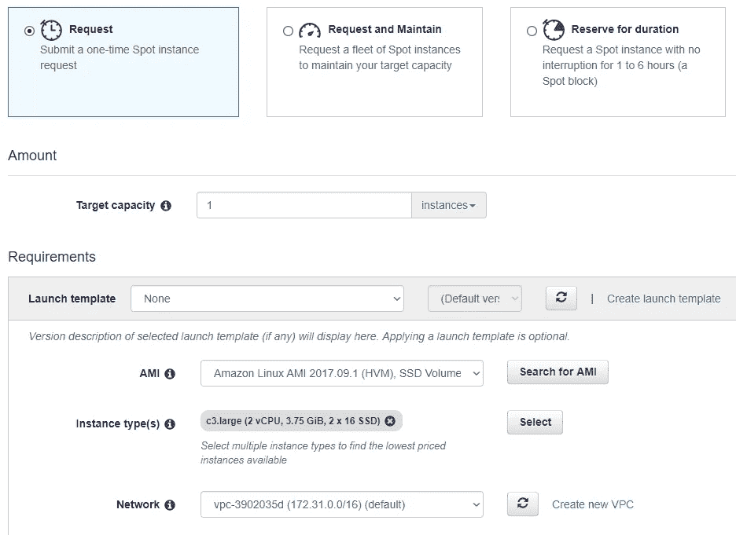
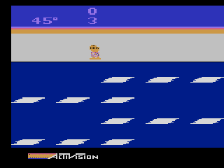
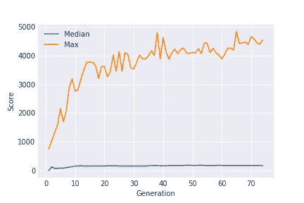
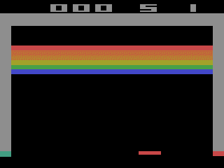
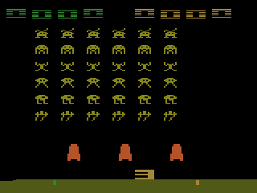

# 论文复制:深层神经进化

> 原文：<https://towardsdatascience.com/paper-repro-deep-neuroevolution-756871e00a66?source=collection_archive---------2----------------------->


Obligatory evolution picture. From [http://www.techcrates.com/evolution-of-computers-and-technology/](http://www.techcrates.com/evolution-of-computers-and-technology/)

在这篇文章中，我们复制了最近的优步论文“[深度神经进化:遗传算法是训练深度神经网络进行强化学习的一种有竞争力的替代方法](https://arxiv.org/abs/1712.06567)”，该论文令人惊讶地表明，在诸如 Atari 游戏等经过充分研究的问题上，简单的遗传算法有时比表面上先进的强化学习算法表现得更好。

在优步最终用这篇论文解决冻伤问题之前，我们自己将会在冻伤问题上达到艺术表现的状态，这是一个困扰强化学习算法多年的游戏。我们还将学习使用遗传算法训练神经网络的黑暗艺术。

在某种程度上，这可以被认为是我的深度强化学习的第 3 部分，但我认为这篇文章也可以独立存在。请注意，与之前的教程不同，这篇文章将使用 PyTorch 而不是 Keras，主要是因为这是我个人选择的，但也因为 PyTorch 确实更适合这个特定的用例。对于第 0 至第 2 部分，请参见:

[](https://becominghuman.ai/lets-build-an-atari-ai-part-0-intro-to-rl-9b2c5336e0ec) [## 用深度强化学习打败雅达利！(第 0 部分:RL 简介)

### 2013 年末，一家当时名不见经传的公司 DeepMind 在钢筋领域取得了突破…

becominghuman.ai](https://becominghuman.ai/lets-build-an-atari-ai-part-0-intro-to-rl-9b2c5336e0ec) 

# 设置环境

> 以下内容与 DQN (Mnih 等人，2015 年)相同:(1)数据预处理，(2)网络架构，以及(3)随机环境，以多达 30 个随机的初始无操作操作开始每一集。

很好，所以预处理和我们用 DQNs 做的一样！那非常方便。提醒一下，这需要做些什么:

*   我们应该使用 OpenAI gym 的“确定性 v4”环境，它们可以自动跳过 4 帧，这似乎是 DQN 论文中的标准。
*   我们应该使国家灰度，并调整其大小为 64 乘 64。我们还应该确保像素值在 0 和 1 之间，而不是 0 和 255 之间。
*   状态应该由我们看到的前 4 帧组成。

我使用 OpenCV 做了预处理，得到了:

请注意，我后来意识到，这做了调整大小的双线性插值，而我认为最近邻可能是规范，不清楚这是否可能有很大的影响，但值得注意。

就效果而言，这是我们看到的转变:



变成了:



基本上就是这样，现在我们只需要堆叠 4 个这样的元素来得到我们的状态。

# 模型

> 我们使用来自 Mnih 等人(2015)的更大的 DQN 架构，该架构包括 3 个具有 32、64 和 64 个信道的卷积层，后面是一个具有 512 个单元的隐藏层。卷积层使用 8 × 8、4 × 4 和 3 × 3 滤波器，步长分别为 4、2 和 1。所有隐藏层之后是整流器非线性(ReLU)。该网络包含超过 4M 个参数。

没有我们以前没见过的，让我们把它写下来！

好了，现在我们可以开始有趣的事情了:

# 遗传算法的简单解释

> *一种遗传算法(荷兰，1992；Eiben 等人，2003)进化出 N 个个体的群体 P(这里是神经网络参数向量θ，通常称为基因型)。在每一代，对每个θi 进行评估，产生一个适合度分数(又名奖励)F(θi)。我们的 GA 变体执行截断选择，其中前 T 个个体成为下一代的父母。为了产生下一代，下面的过程重复 N-1 次:通过替换均匀地随机选择一个父代，并通过对参数向量应用加性高斯噪声来进行变异:θ’=θ+σε其中ε∾N(0，I)。对于每个实验，根据经验确定适当的σ值，如补充信息(SI)表 3 所述。第 n 个个体是上一代最佳个体的未修改副本，这种技术称为精英主义。*

这对我来说似乎相当清楚，但我将尝试重新解释它:基本上，我们不是随机生成一个网络并使用梯度下降修改其权重，而是随机生成一组网络，构成一个“代”，然后评估它们。当然，他们中的一些人会表现得稍微好一点。我们挑选出表现最好的一个，留给下一代。然后在前几个网络中，我们通过多次复制它们并稍微修改每个副本的权重来创建新一代。因为每次只选择顶级网络，而且因为我们不断更换网络，所以我们的性能似乎应该不断提高，事实上也确实如此！

在我们的例子中，因为我们关注 Atari 游戏，所以群体大小是 5000，截断阈值是 10，σ参数是 0.005。他们提到的 I 参数，简单来说就是从一个单位方差的正态分布中抽样(I 是单位矩阵)。

那么，你可能会问，我们什么时候停止世代？优步非常清楚，他们在 10 亿**帧**后停止，而不是在固定数量的代后，所以我们将确保跟踪我们看到的帧数，一旦超过 10 亿就停止。提醒一下，神经网络上的帧和前向传递是有区别的，因为每次前向传递运行 4 帧是标准的(即网络每 4 帧只选择一个动作)。如果你在 OpenAI 健身房用了一个`Deterministic-v4`，这个 4 帧的跳帧是自动为你实现的，那么只需将你调用`.step`的次数乘以 4，当那个数达到十亿时就停止。

# 模型压缩

优步在这篇论文中提供的一个有趣的创新是在神经网络压缩方面。

> *我们提出了一种新的方法，通过将每个参数向量表示为一个初始化种子加上产生应用于θ的一系列突变的随机种子的列表，来紧凑地存储大参数向量。这项创新对于使遗传算法能够在深度神经网络的规模上工作至关重要，因此我们称之为深度遗传算法。这种技术的好处还在于提供了一种最先进的压缩方法(第 5 节)。*

正如上面的引用所暗示的，我们绝对需要**来实现这种压缩，不是因为它很酷，而是因为我们需要在几台不同的机器上工作，相互传递神经网络，并且能够有效地序列化神经网络，以便它们可以快速地从一台机器转移到另一台机器，这是非常重要的。**

幸运的是，实现这一点非常简单！正如论文中提到的，这只是关于记住我们每次生成随机数时使用的随机种子，即我们需要记住:

*   我们用来初始化网络的种子
*   我们每次进化网络权重时使用的种子。

就是这样！每当我们传递网络时，我们只是发送种子而不是实际的网络，在正确设置每个种子后，通过重新运行初始化和进化很容易重新创建它。

使用 PyTorch 设置随机种子的方法很简单`torch.manual_seed`，您可以向其传递一个数字。为了确保随机种子总是不同的，我传入了一个由 Python 的`random.randint`生成的数字，从 0 到 2^31 - 1 进行采样(你为什么问这个数字？我不确定哪些数字可以作为随机种子，但这确保了我传递的任何东西都适合 32 位有符号整数，我觉得这几乎肯定是可以接受的，而更大的数字可能就不行了)。

**学习:使用随机种子，而不是随机状态。**

PyTorch 还有一种方法可以使用`torch.get_rng_state`获得其当前的随机**状态**，并使用`torch.set_rng_state`设置它。起初我用这个是因为可能的随机状态比随机种子多得多，所以对我来说它看起来更“随机”。最大的问题是每个随机状态的大小已经是 5kB 左右了(相比之下，一个随机种子只有 4 个字节，或者少了 1000 倍)，这意味着我的系统由于涉及到大量的数据而变得非常慢。不要和我犯同样的错误！

既然我们理解了模型压缩和模型演化，我们就可以完成模型代码来处理这两者。我选择创建一个名为 CompressedModel 的单独的类来表示压缩模型，并且可以在两者之间来回切换。这需要对模型进行一些更新，以便它支持一个接受种子并对其进行演化的`evolve`函数，这样它就可以在初始化自己时接受种子。我们得到:

# 分布式计算:作业队列和现场实例

**公平的警告**:在这一部分，我假设你已经对 AWS 或其他一些云提供商有所了解，比如谷歌云或微软 Azure。如果你不知道，至少看看一些使用 AWS 进行深度学习的教程可能是值得的(例如:[https://towards data science . com/how-to-set-up-a-deep-learning-environment-on-AWS-with-keras-the ano-b 0f 39 e 3d 861 c)](/how-to-set-up-a-deep-learning-environment-on-aws-with-keras-theano-b0f39e3d861c))，或者至少意识到你可能必须进行一些谷歌搜索，因为我将跳过一些重要的基本内容。

使用遗传算法训练神经网络在以下方面不同于使用梯度下降训练神经网络:使用梯度下降，我们需要在单个网络上进行大量的数学运算，而使用遗传算法，我们需要在许多网络上进行少得多的数学运算(只是向前传递，而不是向前和向后)。这使得我们可以在大量的 CPU 上训练我们的遗传神经网络，而不是在单个 GPU 上。

我们说的有多大？让我们看看优步对此有什么看法:

> *当大量分布式计算可用时，GA 和 ES 都比 Q-learning 和策略梯度方法更快(这里，几十台机器上有 720 个 CPU 内核)。*

**720** ？哇哦。我倾向于认为我自己的硬件是相当高端和最新的，但即使在我的台式机和笔记本电脑之间，我总共有 8 个 CPU 核心…

那么这又是一篇使用了我们普通人完全无法获得的大量资源的论文吗？不是这样的！我们只是需要学习更多关于基础设施的知识。

## 作业队列

问题是，我们绝对不可能在一台机器上获得 720 个 CPU 内核。更合理的是，我们可以得到 64 或更多。这意味着如果我们想像优步那样处理东西，我们将需要多台机器。

为此，我们将使用任务队列的概念，有一个主人(或经理)和工人。主服务器将任务放到任务队列中，而工人将从队列中取出作业，运行它们，并将结果写回。这个过程可以在这个图表中看到。



Source: [https://www.alberton.info/batching_vs_latency_and_jobqueue_models.html](https://www.alberton.info/batching_vs_latency_and_jobqueue_models.html)

在我们的例子中，作业是评估当前一代中不同神经网络的性能，输出只是每个神经网络的分数，以及它们使用的帧数。这种体系结构的另一个优点是，它允许我们将主设备和工作设备放在不同的机器上，这有助于降低成本:我们可以将主设备放在功能不太强大但非常可靠的机器上，而将工作设备放在功能非常强大但不太可靠的机器上。这样我们可以保存我们的数据(因为所有东西都存储在主服务器上)，但是可以使用不可靠的廉价机器作为工人。

我们将使用的任务队列库是 [RQ](http://python-rq.org/) ，这是一个非常容易使用的任务队列库。它依赖于 Redis 数据库，您可以非常简单地将其安装在 Amazon 实例上。

你所需要做的就是确保*所有*你的工人所需要的代码都在一个`.py`文件中，而不是在一个笔记本中，因为 RQ 需要`.py`文件来创建工人进程。然而，你的主人可以在笔记本上。你可以把你需要的`.py`的任何部分导入到你的主笔记本中。

具体来说，以下内容应该在一个`.py`文件中:

*   神经网络模型的代码
*   神经网络压缩/解压缩代码
*   用于根据压缩模型和环境名称评估神经网络的函数，该函数至少返回分数和使用的帧数

然后，您的主代码可以使用`job = rq.enqueue(...)`将一个作业添加到队列中，该作业带有所讨论的函数和它应该采用的参数，并且它可以使用`job.result`得到结果，如果函数还没有返回，结果将是 None。您应该确保您的代码对于被丢弃的作业是健壮的:如果您长时间没有得到作业的结果，请确保它被重新排队。记得将**压缩的**神经网络作为参数传递给`enqueue`，因为这些需要序列化并通过网络传输，所以它们要小，这一点很重要。把这些放在一起，这是我最后的主代码。

一旦你有了所有这些，你应该为你的主人创建一个 AWS 实例，一个小型的就足够了，我个人使用了 t2.medium。你可以在上面安装任何你想要的 Linux，我个人使用了非深度学习的 Ubuntu 16.04 AMI。然后安装代理的所有依赖项，包括 redis-server、rq、pytorch 等。完成后，您应该做以下事情:

*   编辑刚刚创建的主机的安全组，以允许 redis 连接。为了确保不将 redis 服务器暴露给外界，您可以将流量限制为仅来自同一个安全组内部的流量。从现在开始，确保您创建的任何其他计算机都在同一个安全组中。理想情况下，您应该只启用 redis 流量，但是我懒得找出具体的方法，所以我启用了来自安全组的所有流量，如下所示:



*   找出你的主机的私有 IP(应该在 EC2 web 界面中)并创建以下两个文件:
    一个名为`redis.conf`的文件包含`bind <YOUR PRIVATE IP>` 一个名为`settings.py`的文件包含`REDIS_HOST = '<YOUR PRIVATE IP'`
*   运行 redis 服务器:`nohup redis-server redis.conf&`。`nohup`部分确保服务器将继续运行，即使您的连接中断，而最后的`&`确保它立即在后台运行，以便您可以做其他事情。
*   使用`rq worker -c settings`运行一个 RQ worker。
*   现在**通过运行您的主代码来测试**这是否可行，并确保作业确实由工人处理。
*   杀死 worker，回到 AWS 界面，点击你的实例，进入“Actions -> Images -> Create Image”，这将允许你创建一个包含你刚刚安装的所有包的 AMI，这样就可以很容易地在其他机器上启动 worker！

我们现在可以继续创建实际的工人。

## AWS Spot 实例

事实证明，访问大量 CPU 是相当容易的:例如，AWS 上的 c5.18xlarge 实例包含惊人的 72 个 CPU，是我们所需的 1/10！只要有 10 个这样的实例，我们就会拥有与优步使用的 CPU 数量完全相同的 CPU。甚至有一个实例有 96 个 CPU(m5.24xlarge)，但值得注意的是，它的 CPU 比 c5.18xlarge 略慢，而且它的每 CPU 成本略高，因为它也有更多的内存，这是我们并不真正需要的(c5.18xlarge 有 144 GB 的内存，m 5.24 x large 有 384 GB，但我记得我从未在我使用的任何机器上使用过超过 5 GB 的内存……)。

好的，那么要花多少钱？嗯，在美国西部地区，单个 c5.18xlarge 每小时的成本为 3.06 美元(其他地区应该差不多)，优步声称，他们能够使用相当于 10 个 c5.18xlarge 在大约一小时内训练他们的网络，因此，假设一切顺利，训练单个网络应该花费 30.60 美元。这其实没那么糟糕！但是我们可以使用**点实例**做得更好。

现货实例是亚马逊如何处理并非所有机器在任何给定时间都被预订的事实:他们为闲置机器的使用设立拍卖，出价最高的人可以获得这些机器。这使得价格更低，但有一个问题:如果有人超过你的最高出价，或者亚马逊必须满足全价要求，你正在使用的机器可能会被夺走。

此外，与常规的按需实例相比，您实际支付的价格更难预测:实例的现货价格会随着需求的增加和减少而波动，只要当前现货价格低于您的最高出价，您就总是支付当前现货价格。因此，如果一个实例以每小时 1 美元的价格交易，而你出价 2 美元，你可能一开始会支付 1 美元，但随着时间的推移，你可能会开始支付每小时 1.5 美元，或 0.5 美元等。幸运的是，实例市场现在足够稳定，这不是一个大问题:如果您只使用您的实例几个小时，最有可能您将支付您第一次创建 spot 实例时看到的价格的 5%左右。

不过总的来说，我们上面描述的设计对于 spot 实例来说是完美的，因为您可以让一个“主”服务器运行在一个小型的随需应变实例上，并使用您想要的任何数量的高 CPU spot 实例。如果您正确地编写了代码，它应该相对不会出现实例死亡:它只会重试作业，不会丢失数据。在撰写本文时，一个 c 5.18 x 大型 spot 实例的成本为 1.08 美元，比使用按需实例的成本低近 3 倍。这意味着，乐观地说，在一个游戏上训练应该花费大约 11 美元。然而，请注意，由于我训练了 3 个游戏(冻伤、突破和太空入侵者)以及我在这个过程中犯的许多错误，整个实验花费了我大约 115 美元，所以在开始做这个之前，请尽量格外小心或确保你愿意花费大约 100 美元。

那么，如何创建 spot 实例呢？让我们现在就做吧！作为一个提醒，请确保您对您的设置有足够的信心(即您已经创建了一个 AMI，并且您已经确认您可以轻松地在另一台机器上运行该系统)。

在 EC2 面板中，单击右侧的“Spot 请求”,然后单击“请求 Spot 实例”按钮。您将被带到此页面:



许多参数可以保留为默认值，只需记住执行以下操作:

*   选择你的总容量(10 会给你优步所使用的，但我个人选择使用 5 个实例，并简单地等待 2 小时，而不是 1 小时。您必须使用 ssh 访问每台机器，因此较低的数量更易于管理)。
*   选择您刚刚创建的 AMI。
*   从实例类型列表中删除 c3.large 实例类型，并添加一个 c5.18xlarge。“选择实例类型”窗口将实际显示所有可用的实例及其价格。
    *有可能在你看的时候另一个实例类型会对你更有利。我的建议是，在计算哪个实例是最好的时，只需将当前的现货价格除以 CPU 的数量，就可以得到每个 CPU 最便宜的实例。但是，请注意，名称以“c”开头的实例是计算优化的，这通常意味着它们的 CPU 比其他实例上的 CPU 更快，即使内核数量相同。*
*   选择与主服务器相同的可用性区域(可能没有必要)。
*   选择您先前创建/编辑的安全组。

一些可选的事情是设置您的最高价格(默认情况下是按需出价，这也是我推荐的价格)，并且可能在固定的时间内保留您的 spot 实例(这样可以保证您的实例在接下来的 3 个小时内不会被抢占，但是您可能会比普通的 spot 实例支付更多的费用)。

一旦完成，您就可以登录到各种 spot 实例并在其上运行 rq workers。这是我用来启动 72 个 workerss 并让每个 worker 将其日志写入不同文件的脚本:

```
for i in {0..72}
do
nohup rq worker -c settings > $i&
done
```

现在，假设您正在主盒上运行您的主代码，您应该最终在您的训练中取得进展！

## 英特尔 MKL 的一个重要消息

英特尔 MKL 公司是数值计算领域一个非常酷的新发展。这是一个由英特尔开发的速度极快的数学库，它利用最新的指令和多线程来非常快速地执行数值计算。PyTorch 使用它进行 CPU 计算，并帮助减少神经网络的 CPU 和 GPU 性能之间的差异(尽管 GPU 仍然更快)。

不幸的是，MKL 会给我们带来麻烦！这是因为它将自动使用几个 CPU 核心来向前传递单个神经网络，但我们已经设置好了，以便每个神经网络使用一个 CPU 核心。我发现这似乎让事情变得更慢，这就是为什么我建议在 MKL 禁用多线程。这可以通过在 python ( `conda install mkl-service`)中安装 mkl-service 并在导入 pytorch 之前将以下代码行放在 worker 文件的顶部来实现:

```
import mkl
mkl.set_num_threads(1)
```

# 我们来看结果！

最后是一两个小时后，看你选择用多少台机器，我们有结果了！

那么我们如何评价我们代理人的表现呢？优步对此有几点要说:

> 将我们的结果与其他算法的结果进行公平的比较是极其困难的，因为这种比较本质上在许多不同的方面是风马牛不相及的。一个重要的考虑因素是，是否在随机开始(随机数量的无操作动作)上对代理进行评估，这是他们接受训练的制度，或者从人类游戏中随机采样的开始，这测试一般化(Nair 等人，2015)。 ***由于我们没有从*** *抽取人力开工数的数据库，我们的代理商是用随机开工数进行评估的。在可能的情况下，我们将我们的结果与其他算法的结果进行比较，这些算法的随机开始结果是可用的。这对 DQN 和 ES 来说是正确的，但对 A3C 来说就不正确了，在 A3C 中，我们必须包括人类起跑的结果。*

我强调缺乏一个人类起点的数据库:我认为这太糟糕了，事实上似乎没有这样的数据库，我认为建立一个会很棒。

无论如何，听起来我们应该评估我们的代理的方式是在开始之前简单地使用随机数量的无操作操作，这就是我们最初是如何进行培训的。这里没有指定无操作的数量，但是其他地方给出的数量在 0 到 30 之间，所以这就是我们要做的。因为存在这种随机性(更不用说在单个 Atari 游戏中产生随机数的可能性)，我决定运行游戏 30 次，并显示最好、最差和中间值结果。开始了。

## 冻伤


Best score for Frostbite

我们可以看到，我们得到了一个对冻伤表现非常好的代理:4570 是它的最好成绩，接近优步的 4801，据我所知，这是目前最先进的水平！非常刺激。

不幸的是，这个代理甚至对随机启动都不够健壮！中位数只有 170，最差 160！我不清楚为什么优步没有报告这个问题:这是我的实现中的一个问题吗？一些发生在他们身上但他们没有报告的事情？实施过程中的问题？(例如，如果他们实现了糟糕的随机启动，这可能不可见)。



Median performance of the best agent for Frostbite

这似乎解释了当我经历几代人时，中值分数和最佳分数之间的巨大差异(优步的“中值”分数图没有使用这个定义，这就是为什么我不能将它们与我的发现进行比较:在优步的定义中，它是最佳代理在多次运行中的中值):这并不是说代理对其权重的微小变化非常敏感，而是他们对其起点的微小变化非常敏感！



Performance of the best and median agent at each generation

我真的很想在将来解决这个问题。在我看来，有两件事可以帮助解决这个问题:

*   不是在一次运行中而是在多次运行中评估每个神经网络，每次运行都以不同数量的不操作开始。
*   重温 epsilon 贪婪的遗传算法:这似乎很疯狂，因为它似乎不像 GA“需要”一个探索策略，这就是为什么优步没有实施一个，但它可能是探索不仅有助于强化学习代理发现新的高回报状态，而且有助于变得强大，以发现自己在不可预见的情况下。现在看起来 GA 网络过度适应了游戏中一个非常特殊的动作序列。编辑:在重新考虑这个问题后，我认为，虽然包含ε-greedy 可能有助于提高某些游戏的遗传算法的性能，但它可能会冻伤。这是因为在冻伤中，很容易通过一个单一的动作杀死自己(例如，在错误的时刻跳跃)，因此随机选择动作可能是危险的。相比之下，在像 breakout 这样的游戏中，通常很容易修复随机动作的效果(只需撤销上一个动作的移动)。这意味着我们需要一个更好的冻伤探索策略。

## 越狱



Best (!) performance for Breakout

哦，好家伙…煤气做**可怕的**在突破。为什么？

我可以看到几个原因:

*   你需要运行一个特定的动作，否则突围不会开始(具体来说，突围有 4 个动作:什么都不做，开始游戏，向左移动和向右移动)。当遵循诸如ε-贪婪的随机探索策略时，这不是问题，因为行动将在某个点或其他点被选择，但是没有任何探索，这意味着大部分代理将永远简单地什么也不做。为了防止这种情况，我甚至在最初几代中减少了游戏的最大长度，并惩罚了那些一直无所事事的代理。然而，显然它并没有那么好。
*   突破中很少有像素改变，所以代理继续执行相同的动作。
    *在冻伤中，即使代理什么都不做，也保证有差不多 50%的像素发生变化。在突破中，只有一个小球，桨，也许还有一两块砖会改变，而且只有当代理人实际做了一些事情。对于随机初始化的神经网络，这可能不足以让它决定执行不同的动作。*

同样，我认为有办法解决这个问题，包括在训练中加入贪婪探索。这值得进一步探索。

# 太空入侵者



Best performance on Space Invaders

代理在《太空入侵者》中表现相对较好，类似于我们在 [DQNs Part 2](https://becominghuman.ai/beat-atari-with-deep-reinforcement-learning-part-2-dqn-improvements-d3563f665a2c) 中训练的代理，虽然远非最先进，但仍然相当不错。此外，不管初始随机无操作，它实际上执行相同的操作。

然而，我对它的策略有点担心，至少在一开始，它只是简单地呆在左边并试图射击母舰:这看起来更像是一个怪异的局部最优，而不是代理已经获得的实际技能。我也很好奇是什么让它学到了看起来更像游戏中真正的技巧而不是懒惰的策略。

# 结论

我对优步论文中的结果感到兴奋。事实上，它在冻伤方面做得如此之好是非常惊人的，我不清楚这是否意味着传统的 RL 算法特别弱，或者 GA 惊人地强。然而，我认为，遗传算法似乎有一些优步没有指出的重大问题，部分原因是他们无法使用人类启动的数据库来评估他们的算法(我认为这将显示各种代理的脆弱性)，尝试解决这些问题会很有趣。我计划在未来尝试包括ε贪婪探索，我认为这将有助于代理的鲁棒性，正如优步指出的，有大量关于遗传算法的文献，他们只尝试了最基本的可能。谁知道更先进的气体会把我们带到哪里。