# 【论文摘要】音乐标注深度神经网络音频信号预处理方法的比较

> 原文：<https://towardsdatascience.com/paper-summary-a-comparison-of-audio-signal-preprocessing-methods-for-deep-neural-networks-on-92a7bfacce26?source=collection_archive---------11----------------------->

GIF from this [website](https://giphy.com/gifs/song-music-blog-PpfHisi2v5Yxa)

我的一个朋友正在用神经网络处理音频文件，他推荐我读这篇文章。

> **请注意，这篇帖子是为了我未来的自己复习这篇论文上的材料，而不是从头再看一遍。**

**摘要**

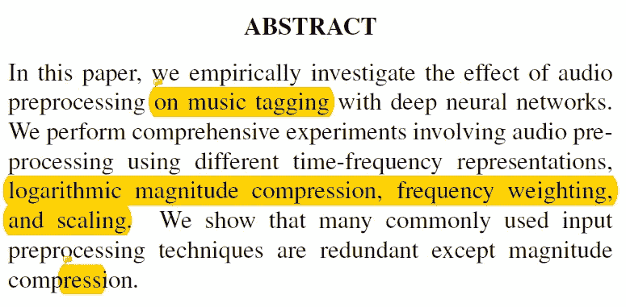

本文作者使用深度神经网络对[音乐标注](https://www.lifewire.com/what-is-music-tagging-2438569)进行了实验。他们比较了对数幅度压缩、[频率加权](https://www.cirrusresearch.co.uk/blog/2011/08/what-are-a-c-z-frequency-weightings/)和缩放等不同的预处理方法，发现幅度压缩是最好的预处理方法。

**简介**

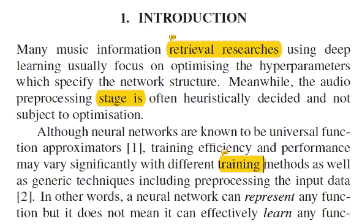

机器学习中的许多优化都是通过超参数调整来完成的，然而输入数据的质量不容忽视。这也适用于音频预处理，本文比较了对数压缩技术和数字音频压缩技术。

*log(X+alpha)其中 alpha 可以是任意常数，例如非常小的数(例如 10e-7)或 1*

其他预处理技术。

**实验和讨论**

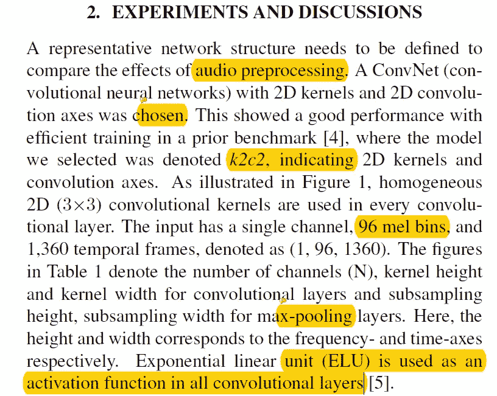

在本节中，作者描述了网络体系结构以及输入数据结构。简而言之，他们使用了一个具有 ELU 激活的卷积神经网络，输入数据的维数为(1，96，1360)。他们还从[百万首歌曲数据集](https://labrosa.ee.columbia.edu/millionsong/)中获取音乐数据，并使用离散傅立叶变换将音频转换为 96 * 1360 维。(使用 python 库 [Kapre](https://github.com/keunwoochoi/kapre) 和 [LibROSA](https://librosa.github.io/librosa/) 。)

**2.1。不同初始化的差异**

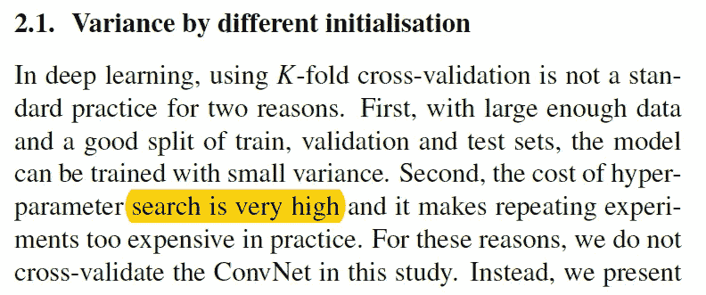

在这里，作者描述了他们没有选择使用 k 倍交叉验证的事实，相反，他们重复了 15 次实验，并比较了每次实验的 AUC 分数。

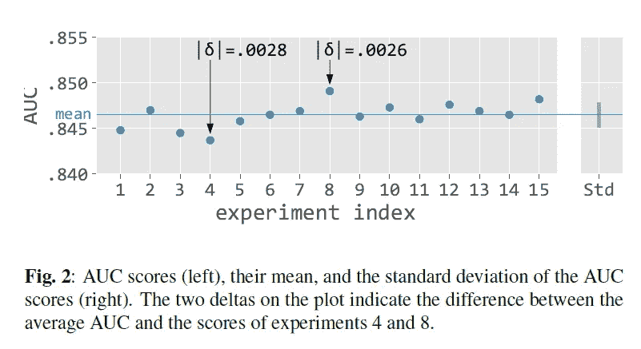

**2.2。时间-频率表示法**

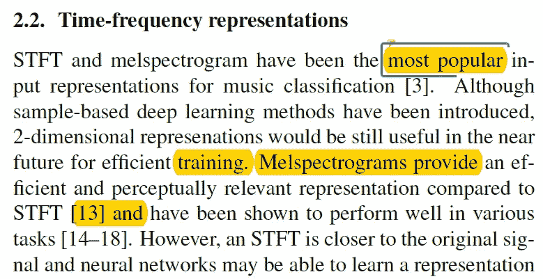

[STFT](https://en.wikipedia.org/wiki/Short-time_Fourier_transform) 和 [melspectrogram](http://www.fon.hum.uva.nl/praat/manual/MelSpectrogram.html) 是音频分类中最流行的表示输入数据的方法。(一般认为 melspectograms 是更小数据集的更好选择。)然而，当作者使用这两种预处理方法进行各种体验时，他们发现情况并非如此。

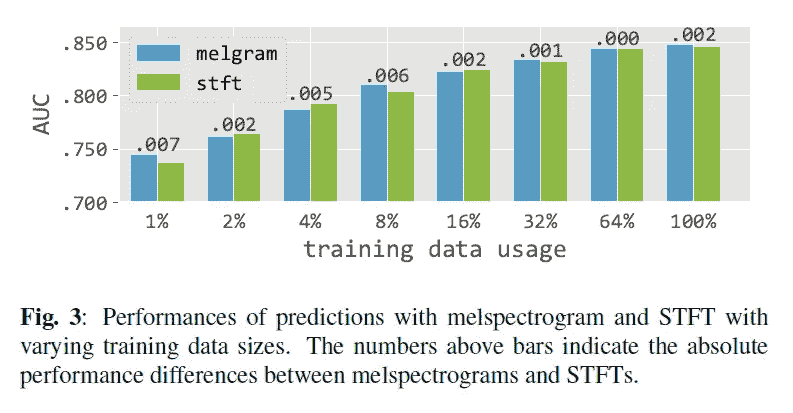

**2.3。比例效应和频率轴权重的分析**

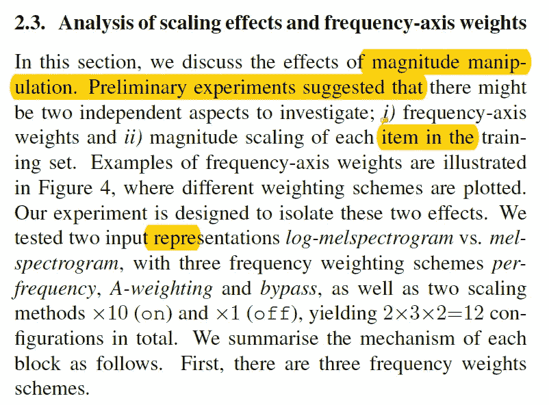

在本节中，作者试验了两种不同的输入表示 log-melspectrogram 和 melspectrogram，三种频率加权方案 per-frequency、A-weighting 和 bypass，以及两种缩放方法 X10 (on)和 X1 (off)。

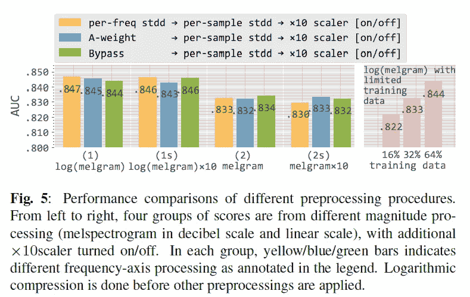

如上所述，当用 log()函数预处理音频时(使用或不使用缩放因子 10，我们可以观察到 AUC 分数的增加。

**2.4。量值的对数压缩**

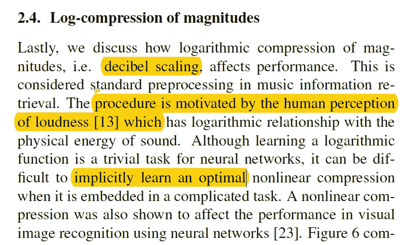

将 log()函数应用于音频文件是一个好主意的原因之一，因为它将数据的分布改变为高斯分布。如下所示，当对 melSpectrogram 应用 log()函数时，我们可以观察到平滑的钟形曲线。

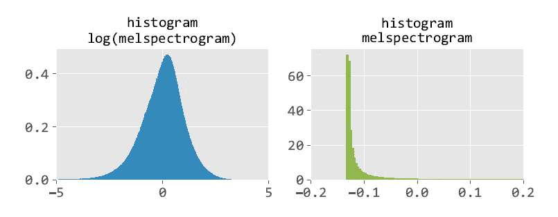

**结论**

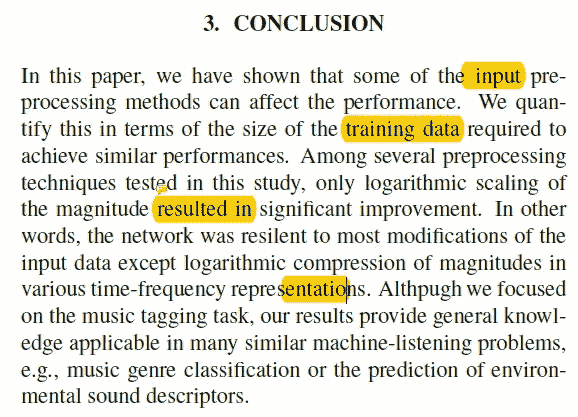

作者发现对数标度是音乐分类任务的最佳预处理方法。

**最后的话**

这是一本相当有趣的读物。

如果发现任何错误，请发电子邮件到 jae.duk.seo@gmail.com 给我，如果你想看我所有写作的列表，请[在这里查看我的网站](https://jaedukseo.me/)。

与此同时，请在我的 twitter [这里](https://twitter.com/JaeDukSeo)关注我，并访问[我的网站](https://jaedukseo.me/)，或我的 [Youtube 频道](https://www.youtube.com/c/JaeDukSeo)了解更多内容。我也实现了[广残网，请点击这里查看博文 pos](https://medium.com/@SeoJaeDuk/wide-residual-networks-with-interactive-code-5e190f8f25ec) t

**参考**

1.  Cho，k .，Fazekas，g .，Cho，k .，和 Sandler，M. (2017 年)。音乐标注深度神经网络音频信号预处理方法的比较。Arxiv.org。检索于 2018 年 6 月 23 日，来自[https://arxiv.org/abs/1709.01922](https://arxiv.org/abs/1709.01922)
2.  什么是 A、C 和 Z 频率权重？——noise news。(2011).噪音新闻。检索于 2018 年 6 月 24 日，来自[https://www . cirrus research . co . uk/blog/2011/08/what-are-a-c-z-frequency-weightings/](https://www.cirrusresearch.co.uk/blog/2011/08/what-are-a-c-z-frequency-weightings/)
3.  歌曲元数据以及为什么它隐藏在您的数字音乐文件中。(2018).救生索。检索于 2018 年 6 月 24 日，来自 https://www.lifewire.com/what-is-music-tagging-2438569
4.  百万首歌曲数据集。(2018).Labrosa.ee.columbia.edu。检索于 2018 年 6 月 24 日，来自 https://labrosa.ee.columbia.edu/millionsong/
5.  LibROSA — librosa 0.6.1 文档。(2018).librosa . github . io . 2018 年 6 月 24 日检索，来自[https://librosa.github.io/librosa/](https://librosa.github.io/librosa/)
6.  keunwochoi/kapre。(2018).GitHub。检索于 2018 年 6 月 24 日，来自[https://github.com/keunwoochoi/kapre](https://github.com/keunwoochoi/kapre)
7.  短时傅立叶变换。(2018).En.wikipedia.org。检索于 2018 年 6 月 24 日，来自[https://en.wikipedia.org/wiki/Short-time_Fourier_transform](https://en.wikipedia.org/wiki/Short-time_Fourier_transform)
8.  梅尔声谱图。(2018).Fon.hum.uva.nl .检索于 2018 年 6 月 24 日，来自[http://www.fon.hum.uva.nl/praat/manual/MelSpectrogram.html](http://www.fon.hum.uva.nl/praat/manual/MelSpectrogram.html)