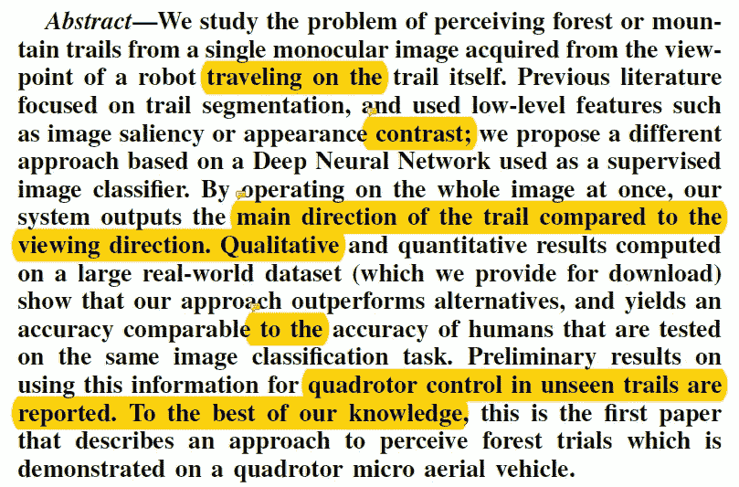
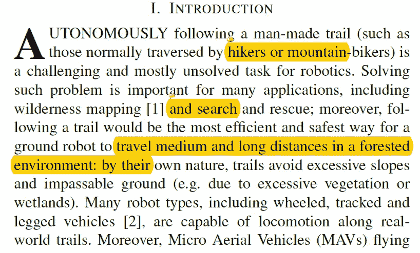
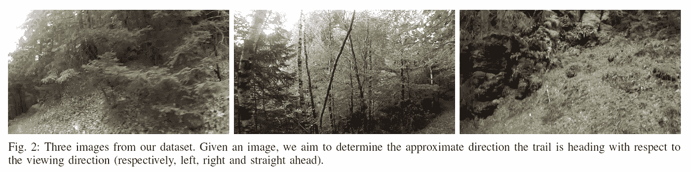
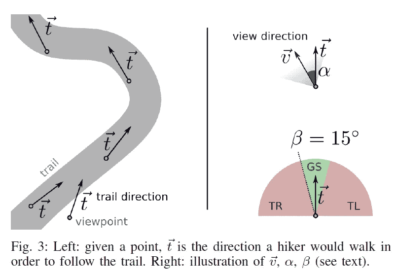
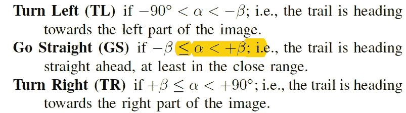
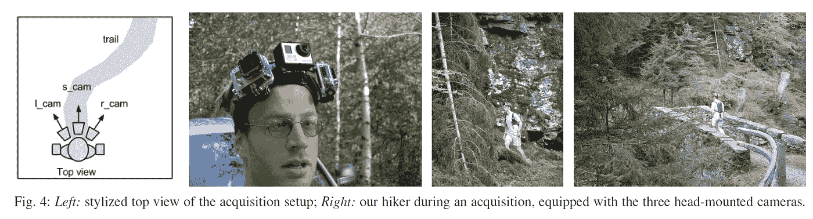
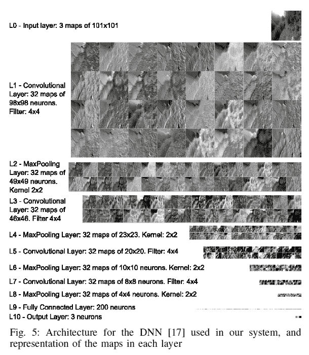
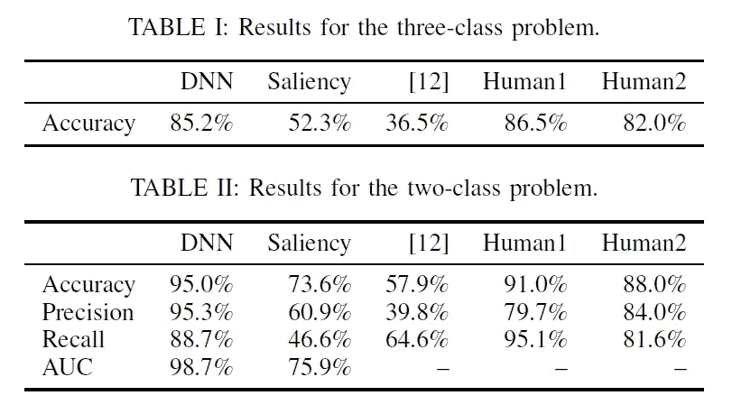
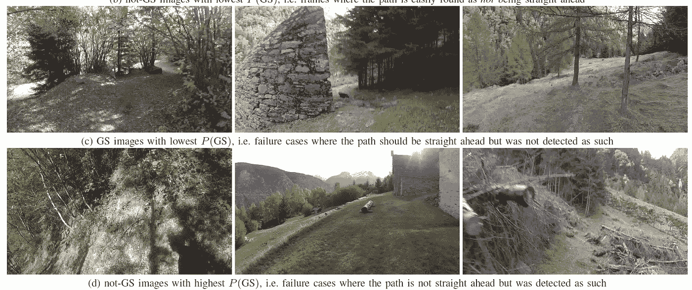
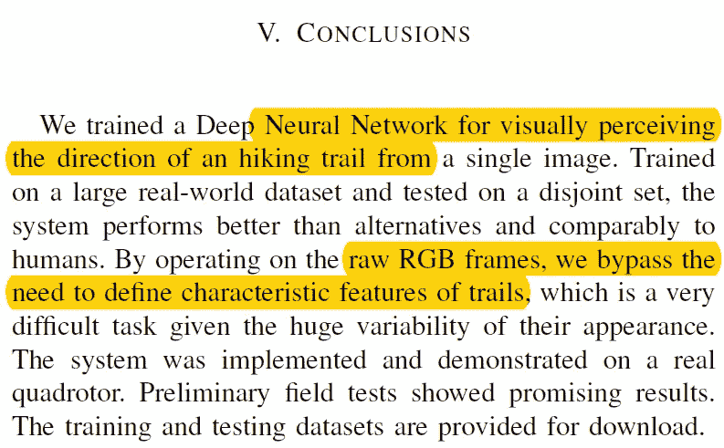

# 移动机器人视觉感知森林路径的机器学习方法

> 原文：<https://towardsdatascience.com/paper-summary-a-machine-learning-approach-to-visual-perception-of-forest-trails-for-mobile-acd5aecd33be?source=collection_archive---------9----------------------->

GIF form this [website](https://giphy.com/gifs/cheezburger-animation-epic-iWEIxgPiAq58c)

分类任务的一个很好的例子就是踪迹跟踪。

> **请注意，这篇文章是让未来的我回顾和回顾这篇论文上的材料，而不是从头再看一遍。**

**纸质视频**

Video from [AAAI Video Competition](https://www.youtube.com/channel/UCPnD-1TJvd-Sm7cbAbR83Jw)

论文作者也有很好的总结视频，如果有人感兴趣的话。

**摘要**

本文作者利用深度神经网络解决了森林山地路径导航问题，并且能够优于传统方法。(回到 2015 年)

**简介**

对于机器人来说，绕过人造小径，如徒步旅行者或山地自行车手走过的路，是极其困难的。(这是合理的，因为它不是典型的道路。).为了成功地穿越森林，机器人不仅要知道自己的位置，还要及时做出反应，修正自己的方向。

如上所述，对于一个人来说，甚至不清楚在某些路线上应该朝哪个方向走。通常，计算机视觉任务集中在高速公路类型的道路上，这些道路非常标准并且看起来彼此相似。解决这个问题的其他方法是通过分割，(即在给定的图像中执行分割，并查看道路在哪里。)但是执行好的分段本身就是一个极端的挑战。因此，作者通过人类追踪器收集的数据，将此作为分类任务。(解决这个问题的另一种方法是通过模仿学习，就像 NVDIA 对自动驾驶汽车所做的那样。)

**问题公式化/数据集/用于轨迹感知的深度神经网络**

在这一节中，作者描述了他们是如何将这一任务公式化为一个简单的分类任务的。总之，它们有一些轨迹方向 t 和观察点方向 v，根据这两个方向之间的角度(α),可以将其分为左、直或右。

接下来，作者描述了他们是如何获得这些数据的，同样是在短期内。一个人戴着三个不同角度的 go pro 相机，在小路上散步。(类似下面看到的东西。)

最后，他们描述了解决这一分类任务的网络架构。(典型的完全连接层的卷积层，共 10 层。)

**实验结果**

如上所述，作者进行了两个不同的实验。三个分类之一(左、右、直)和两个分类之一(直、非直)，且在这两个分类中，他们模型能够超越人类的准确性。

如上所述，网络表现非常好，但并不完美，有一些情况下，图像被错误地分类。最后，他们实现了一个简单的系统来执行无人机驾驶任务。

**结论**

总之，作者能够训练一个能够在森林小径中引导无人机的分类器。通过直接在 RGB 像素上执行分类，他们能够绕过痕迹特征形成的问题。

**遗言**

非常聪明的问题表述方式。

如果发现任何错误，请发电子邮件到 jae.duk.seo@gmail.com 给我，如果你希望看到我所有写作的列表，请[在这里查看我的网站](https://jaedukseo.me/)。

同时，在我的推特[这里](https://twitter.com/JaeDukSeo)关注我，并访问[我的网站](https://jaedukseo.me/)，或我的 [Youtube 频道](https://www.youtube.com/c/JaeDukSeo)了解更多内容。我也实现了[广残网，请点击这里查看博文 pos](https://medium.com/@SeoJaeDuk/wide-residual-networks-with-interactive-code-5e190f8f25ec) t。

**参考**

1.  使用深度神经网络在森林中进行四轴飞行器导航。(2018).YouTube。检索于 2018 年 6 月 25 日，来自[https://www.youtube.com/watch?time_continue=4&v = umrdt 3 zggpu](https://www.youtube.com/watch?time_continue=4&v=umRdt3zGgpU)
2.  (2018).Rpg.ifi.uzh.ch 检索于 2018 年 6 月 25 日，来自[http://rpg.ifi.uzh.ch/docs/RAL16_Giusti.pdf](http://rpg.ifi.uzh.ch/docs/RAL16_Giusti.pdf)
3.  (2018).People.idsia.ch 于 2018 年 6 月 25 日检索，来自[http://people.idsia.ch/~giusti/forest/web/](http://people.idsia.ch/~giusti/forest/web/)