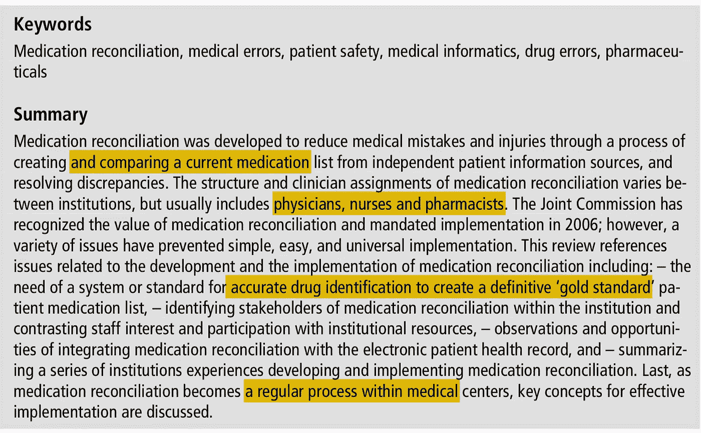
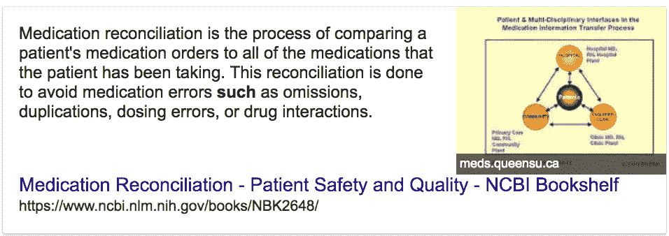
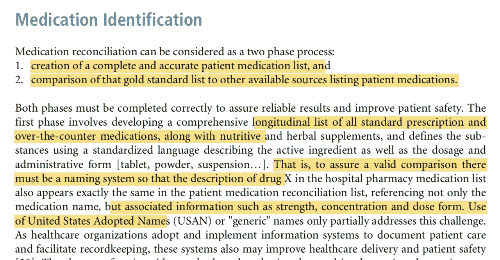
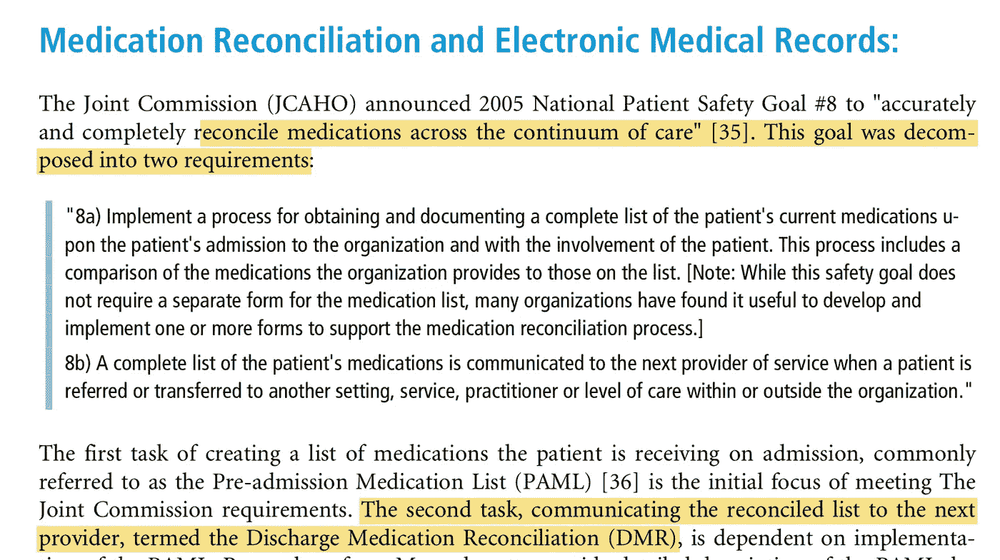

# [论文摘要]回顾临床工作人员和信息系统的药物调节问题和经验—第 1 部分

> 原文：<https://towardsdatascience.com/paper-summary-a-review-of-medication-reconciliation-issues-and-experiences-with-clinical-staff-3b07d16881b7?source=collection_archive---------11----------------------->

Image from this [website](https://pixabay.com/en/ehr-emr-electronic-medical-record-1476525/)

我想知道更多关于药物调节的事情，以及为什么这在医疗保健行业是一个如此麻烦的事情。另外，这篇文章很长，所以我会把它分成不同的部分。

> **请注意，这篇帖子是给未来的自己看的，用来回顾和复习这篇论文上的材料。**

**总结**

药物调节是一个过程，其中将患者的药物治疗历史列表与独立的患者信息源进行比较，以防止重复用药或在医疗保健机构(或提供者)之间发生错误。

Image from this [website](https://www.ncbi.nlm.nih.gov/books/NBK2648/)

该列表的内容因机构而异，但通常包含医生姓名和药物名称等。然而，尽管 2006 年[联合委员会](https://www.jointcommission.org/)已经认识到这一制度的重要性，但该制度的正确实施仍有待完成。因此，本文给出了该问题的概述和一些可能的解决方案。

**简介**

本质上，医疗错误仍然是患者伤害的重要来源(2010 年有 7000 例与医疗错误相关的药物死亡),并且与药物调节相关的停止伤害的过程早在 2003 年就已经开始。卫生保健提供者面临的一些问题是复杂的疾病名称以及患者使用的大量药物。

**背景**

作者介绍了产生药物和解程序的三个原因。一是非处方药的开发和销售增加。第二，仿制药的品牌名称变得越来越相似，从而造成混淆。最后是老年人群，他们可能缺乏清晰判断的能力(例如痴呆),但仍然必须服用各种药物。事实证明，记录每位患者服用的药物仍然是一项容易出错的任务。最常见的错误发生在从家庭护理到医院的过渡期间(换句话说，在住院期间)，遗漏家庭医疗是最常见的错误。

**药物识别**

作者指出，药物识别可分为两个部分。1)创建患者服用的药物的黄金标准列表，2)将该黄金标准列表与列出患者药物历史的其他可用来源进行比较。作者还指出，临床术语缺乏标准化使得药物识别具有挑战性。成功的系统可以在本地建立(意味着一个机构有自己的版本或程序来处理这些问题)，但这种方法使解决方案与其他医疗保健机构不兼容。

**用药对账和电子病历**

2005 年，联合委员会宣布成功的药物治疗和解是他们的第八大目标。创建药物列表的第一阶段称为入院前药物列表(PAML)，将该列表传送给其他医疗保健提供者的第二阶段称为出院药物调节(DMR)。当在 EHR 系统中被很好地采用时，该过程可以被自动化。

**纸质用药对账**

在卫生保健机构没有采用电子系统来交换信息的情况下，可以通过首先与患者(或他们的护理人员)交谈以了解他们正在服用的药物的名称来执行基于纸张的药物调节。然而，与电子方法相比，纸质方法可能缺乏准确性，并且更新列表的能力可能有限。

**遗言**

我相信这也是网络组件和人工智能系统可以创造效率的另一个领域。

如果发现任何错误，请发电子邮件到 jae.duk.seo@gmail.com 给我，如果你想看我所有写作的列表，请[在这里查看我的网站](https://jaedukseo.me/)。

同时，在我的 twitter [这里](https://twitter.com/JaeDukSeo)关注我，并访问[我的网站](https://jaedukseo.me/)，或我的 [Youtube 频道](https://www.youtube.com/c/JaeDukSeo)了解更多内容。我也实现了[广残网，请点击这里查看博文 pos](https://medium.com/@SeoJaeDuk/wide-residual-networks-with-interactive-code-5e190f8f25ec) t。

**参考**

1.  威特曼、布朗、s .、&波切利出版公司(2010 年)。对临床工作人员和信息系统的药物调节问题和经验的回顾。应用临床信息学，01(04)，442–461。doi:10.4338/ACI-2010–02-r-0010
2.  Barnsteiner，J. (2008 年)。药物调和。美国卫生保健研究和质量局。从[https://www.ncbi.nlm.nih.gov/books/NBK2648/](https://www.ncbi.nlm.nih.gov/books/NBK2648/)取回
3.  (2018).Jointcommission.org。检索于 2018 年 5 月 21 日，来自 https://www.jointcommission.org/