# [论文摘要]对基于反向传播的可视化的复杂行为的理论解释

> 原文：<https://towardsdatascience.com/paper-summary-a-theoretical-explanation-for-perplexing-behaviours-of-back-propagation-based-220083d7dddd?source=collection_archive---------5----------------------->

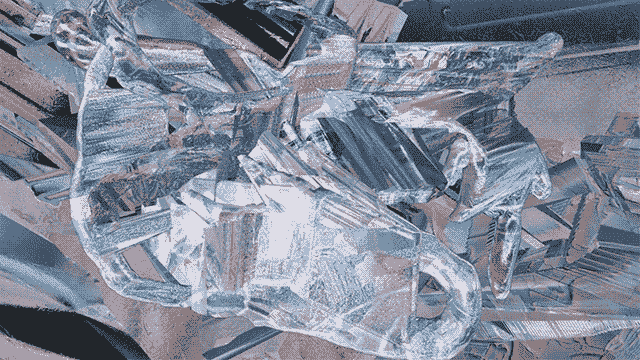

GIF from this [website](https://giphy.com/gifs/lauren-pelc-mcarthur-l0HlKlRMBvdzAFYYM)

我实际上也对这个想法很好奇，反向传播张量是什么样子的？关于这些张量我们能了解到什么？如果我们研究这些，我们有可能最终理解神经网络是如何学习的吗？这篇论文是我第一次读到这些话题。

> 请注意，这篇文章是为了让未来的我回顾并记住这篇文章的内容，而不是阅读整篇文章。

**摘要**

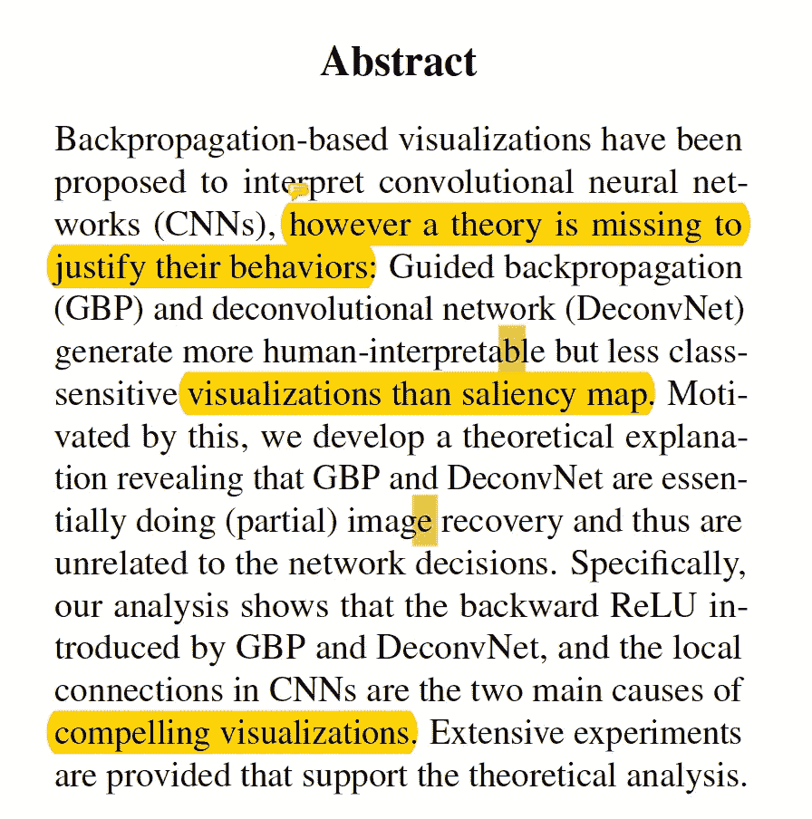

为了可视化和理解卷积神经网络(CNN)是如何学习的，引入了引导反向传播( [GBP](https://github.com/Lasagne/Recipes/blob/master/examples/Saliency%20Maps%20and%20Guided%20Backpropagation.ipynb) )和去卷积网络( [DeconvNet](https://papers.nips.cc/paper/5485-deep-convolutional-neural-network-for-image-deconvolution.pdf) ),但是在证明它们的行为时，一些理论丢失了。作者声称 GBP 和 DeconvNet 正在部分地进行图像恢复，因此与网络决策过程无关。

**简介**

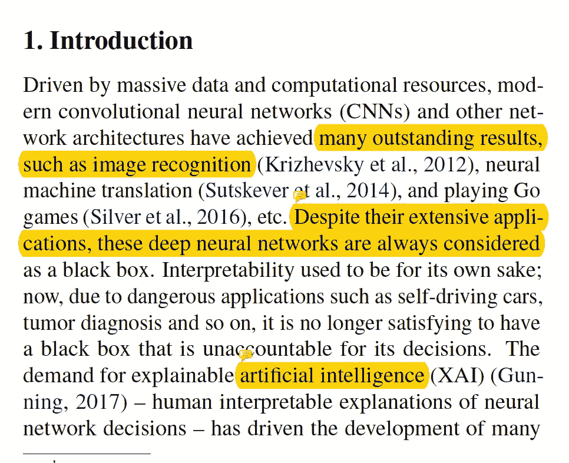

由于深度学习在自动驾驶汽车等危险情况下的使用越来越多，理解模型的内部工作变得至关重要。如上所述，已经引入了一些可视化反向传播的方法，但是这些方法真的回答了网络内部正在学习什么的问题吗？

GBP 和 DeconvNet 给出了比显著性映射技术更好的图像分辨率，然而，尽管类别不同，由它们的方法产生的可视化通常保持相同。(因此，在分辨率质量和指出图像中哪个位置被认为对网络重要之间可能会有一个折衷。)

> **本文提供的实验表明，GBP 和 DeconvNet 本质上是在进行(部分)图像恢复，而不是突出显示与类别相关的像素或可视化学习到的权重，这意味着原则上它们与神经网络的决策无关**

**基于反向传播的可视化**

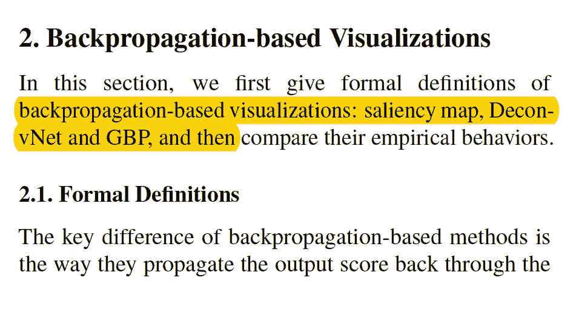

在这里，本文讨论了不同的方法之间的差异可视化的梯度反向传播和所有这些可以总结在一个图像。(我理解为显著图→正常背道具，Deconv →反向激活，GBP →两者结合)

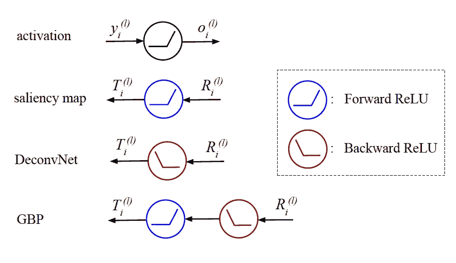

作者还为每种方法提供了良好的可视化效果。(通过观察它们，我们可以观察到来自 GBP 的结果非常清晰。)

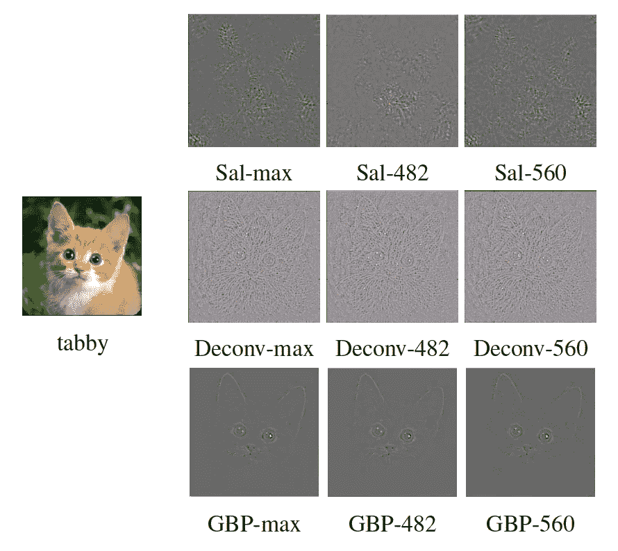

的确，为了成为一个好的可视化，人类的可解释性是非常重要的。然而，作者指出，GBP 和 DeconvNet 产生如此清晰的图像的原因是因为它们修改了真实的梯度，因此当模型试图执行分类时，阻碍了对哪些像素是重要的了解。

**理论解释**

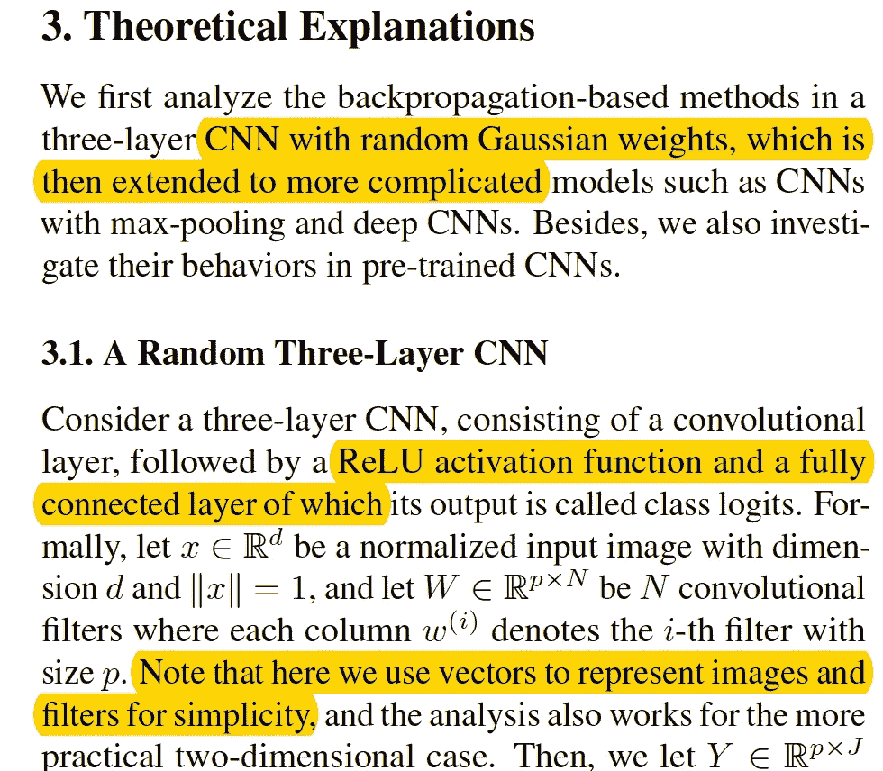

论文的这一部分涉及大量的数学知识，因为它不仅解释了前馈运算，还解释了非常简洁的方程中的反向传播。所以现在就下结论，我们可以注意到一些事情。

1.  显著图和去卷积可视化都应该产生随机噪声，传达关于输入图像和类逻辑的很少信息。
2.  然而，对于更复杂的模型，DeconvNet 的行为不像显著性映射。
3.  在一个简单的模型(如 3 层 cnn)中结合 backward ReLu() GBP 实际上可以近似地恢复原始图像。当我们希望了解网络的内部运作时，这是不可取的。旁注:当我们希望可视化清晰时，本地连接是非常重要的属性。

**理论解释:更真实的模型/预训练模型**

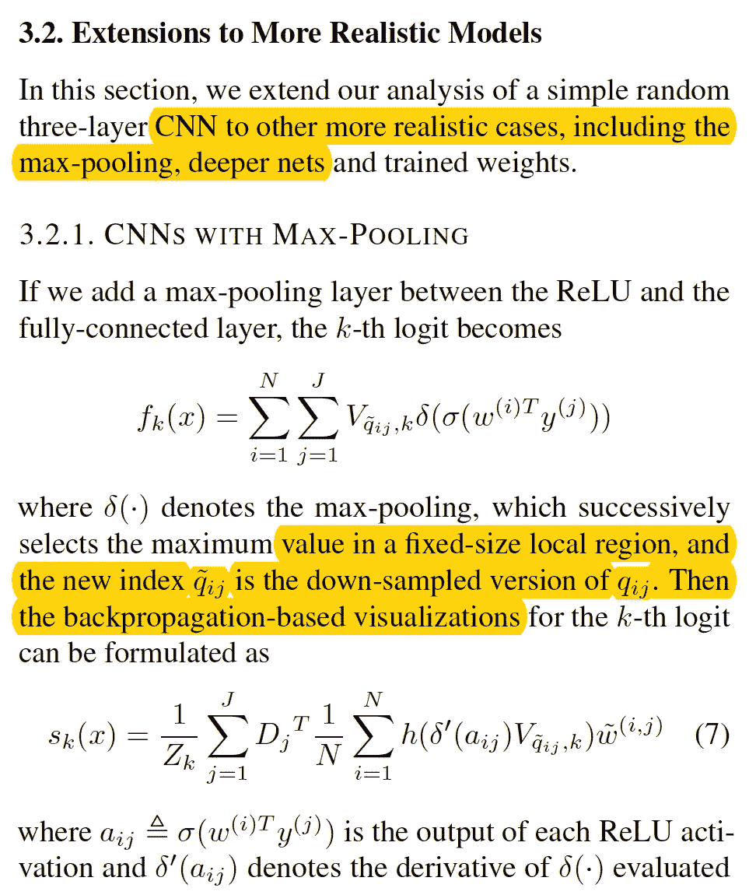

在这里，作者引入了最大池操作，并修改了原始方程，以适应更现实的 CNN 架构/预训练模型，并发现了三个重要的发现。

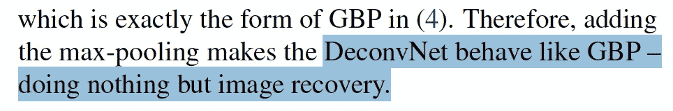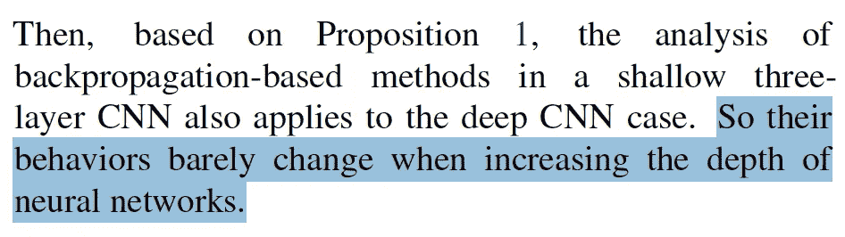

1.  在更真实的设置行为中取消配置，如英镑
2.  增加深度不会改变 GBP 和 DeconvNet 的行为。
3.  即使在预先训练的模型中，GBP 和 DeconvNet 可视化也不区分类别。

**实验**

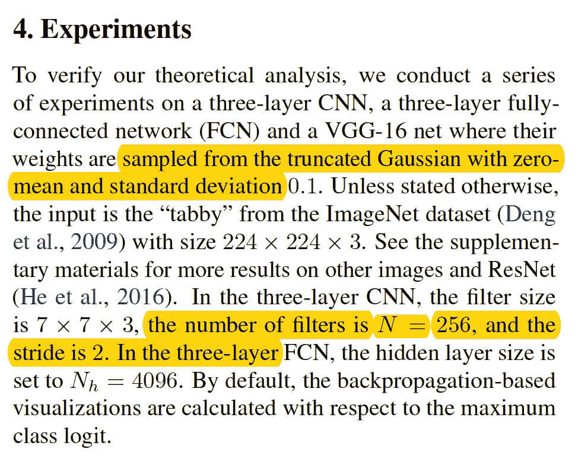

作者提供了用三种不同类型的网络进行的实验的结果:a)三个 CNN 层网络，b)三个全连接网络，c) VGG-16 网络。

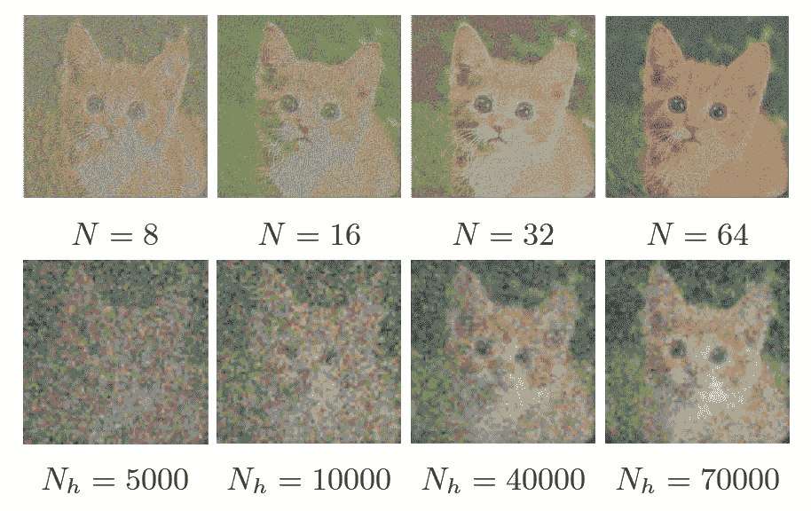

如上所述，GBP 产生的图像非常清晰，任何人都可以分辨出这是 cat。(美国有线电视新闻网和 FCN)。

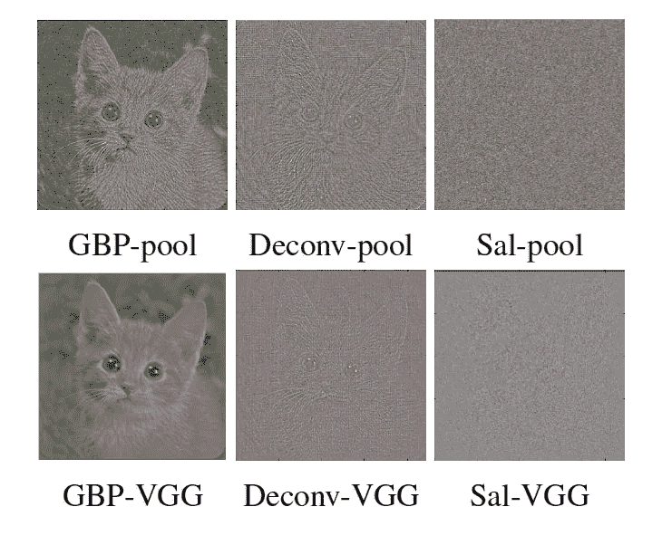

此外，在简单的 CNN 网络以及 VGG-16 网络中添加 max-pooling 层之后，我们可以观察到 DeonveNet 开始产生更易于人类理解的图像，这证实了理论分析。作者还对网络深度的变化进行了不同的实验，发现基于反向传播的方法的行为没有改变。

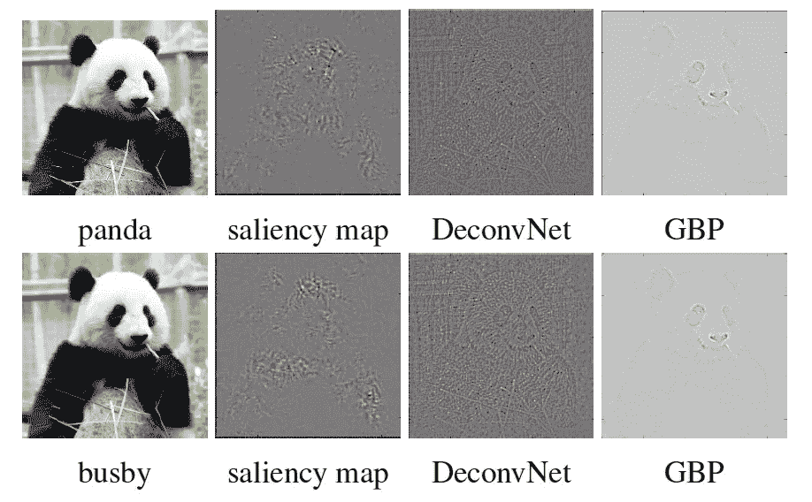

最后，作者给了网络一个对抗性的输入，看看它如何影响可视化。理论上，它应该显著地影响显著性映射，因为中间层的预测类别标签和触发状态都已经改变。然而，没有太多的图像恢复任务。如上所述，顶行是原始输入，底行是对抗输入。我们可以观察到，所得到的可视化仅针对显著性映射而改变。因此，作者得出以下结论。

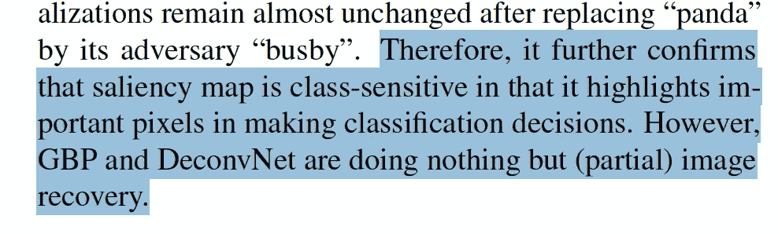

请注意，作者已经用“部分训练权重的 VGG”和“平均 l2 距离统计”进行了实验，并获得了类似的结论。

**结论**

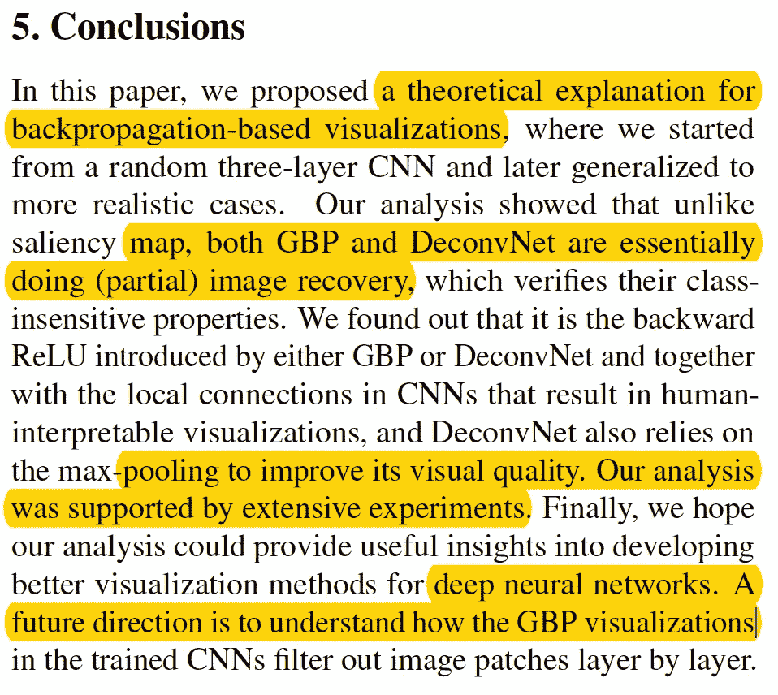

本文的作者提供了大量的实验，表明 GBP/DeconvNet 实际上正在执行图像恢复任务。通过反向 Relu()、本地连接和最大池的组合。因此证明需要开发更好的方法来可视化 CNN 的内部工作。

**最后的话**

当我们想要了解一个人时，我们需要和他有相同的看法。理解他们的观点，也许这是我们想了解 CNN 时需要做的，GBP/DeconvNet 对我们有好处，但只对我们…

如果发现任何错误，请发电子邮件到 jae.duk.seo@gmail.com 给我，如果你希望看到我所有写作的列表，请[在这里查看我的网站](https://jaedukseo.me/)。

同时，在我的 twitter [这里](https://twitter.com/JaeDukSeo)关注我，并访问[我的网站](https://jaedukseo.me/)，或我的 [Youtube 频道](https://www.youtube.com/c/JaeDukSeo)了解更多内容。我也实现了[广残网，请点击这里查看博文 pos](https://medium.com/@SeoJaeDuk/wide-residual-networks-with-interactive-code-5e190f8f25ec) t。

**参考**

1.  聂，张，杨，&帕特尔，A. (2018)。基于反向传播的可视化令人困惑的行为的理论解释。Arxiv.org。检索于 2018 年 5 月 26 日，来自[https://arxiv.org/abs/1805.07039](https://arxiv.org/abs/1805.07039)
2.  千层面/食谱。(2018).GitHub。检索于 2018 年 5 月 26 日，来自[https://github . com/Lasagne/Recipes/blob/master/examples/studentity % 20 maps % 20 和% 20 guided % 20 back propagation . ipynb](https://github.com/Lasagne/Recipes/blob/master/examples/Saliency%20Maps%20and%20Guided%20Backpropagation.ipynb)
3.  (2018).Papers.nips.cc .于 2018 年 5 月 26 日检索，来自[https://papers . nips . cc/paper/5485-deep-convolutionary-neural-network-for-image-convolution . pdf](https://papers.nips.cc/paper/5485-deep-convolutional-neural-network-for-image-deconvolution.pdf)