# [论文摘要]对抗性自动编码器

> 原文：<https://towardsdatascience.com/paper-summary-adversarial-autoencoders-f89bfa221e48?source=collection_archive---------4----------------------->

Photo by [90 jiang](https://unsplash.com/photos/eIzzzwtkBjU?utm_source=unsplash&utm_medium=referral&utm_content=creditCopyText) on [Unsplash](https://unsplash.com/?utm_source=unsplash&utm_medium=referral&utm_content=creditCopyText)

> **请注意，这篇帖子是给未来的自己看的，回顾这篇论文上的材料，而不是从头再看一遍。**

Paper from this [website](https://arxiv.org/pdf/1511.05644.pdf)

**摘要**

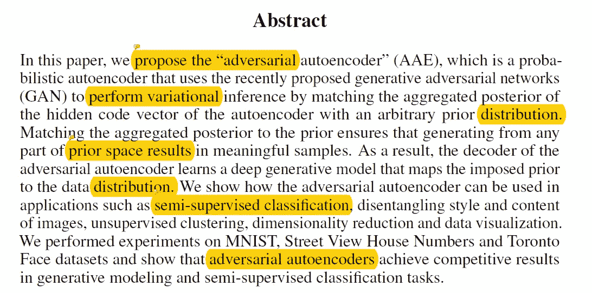

本文作者利用 GAN 提出的方法制作了一个自动编码器，它通过将自动编码器的隐码向量的聚合后验概率与任意先验分布相匹配来进行变分推理。使用这种技术，它使解码器能够从先前空间的任何部分产生有意义的样本。这种自动编码器有许多应用，如分类或降维。

**简介**

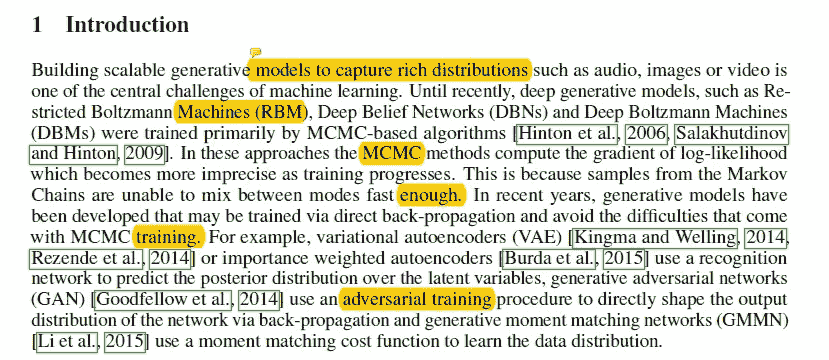

对于创成式模型，捕获丰富分布的任务是要执行的关键任务。直到最近，许多方法，如受限玻尔兹曼机器(RBM)和深度信念网络(DBNs)都是由基于 MCMC 的算法训练的。然而，最近已经发现了能够通过反向传播直接训练生成模型的方法。(例如 VAE、重要性加权自动编码器、GAN 或 GMMM)。本文提出了一种将自动编码器转化为生成模型的新方法，称为对抗性自动编码器。主要地，自动编码器具有两个目标，重建损失以及对抗训练损失，该对抗训练损失将自动编码器的潜在表示的聚集后验分布与任意先验分布相匹配。结果，编码器学习如何将给定数据编码成先验分布，而解码器学习将强加的先验分布映射到数据分布的深度生成模型。

**生成对抗网络**

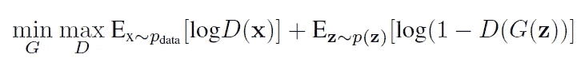

在一个非常简单的形式中，在一个 GAN 中有两个组件，发生器网络和鉴别器网络。鉴别器是一个神经网络，它计算数据空间中的点 x 是来自我们试图建模的数据分布的样本(正样本)而不是来自我们的生成模型的样本(负样本)的概率。并且生成器是将来自先前 p(z)的样本 z 映射到数据空间的网络。并且该模型的主要目标可以由上面看到的等式来表达。

**对抗性自动编码器**

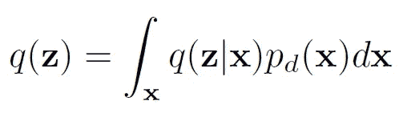

如果我们让…
**P(z)** 是我们想要强加于潜在码的先验分布
**q(z|x)** 是编码分布
**p(x|z)** 是解码分布
**pd(x)** 是数据分布
**p(x)** 是模型分布

自动编码器功能的编码可以被认为是如上所述，基于隐藏代码向量上的 **q(z)** 的聚集后验分布。AAE 是一个自动编码器，它将聚合后验 q(z)与任意先验 p(z)相匹配。如下所示，为了匹配给定函数的潜在分布，可以在常规自动编码器中添加一个对立部分。当自动编码器试图重建给定的数据时，对抗方试图在自动编码器给出的分布和我们希望强加给潜在向量的分布之间进行区分。

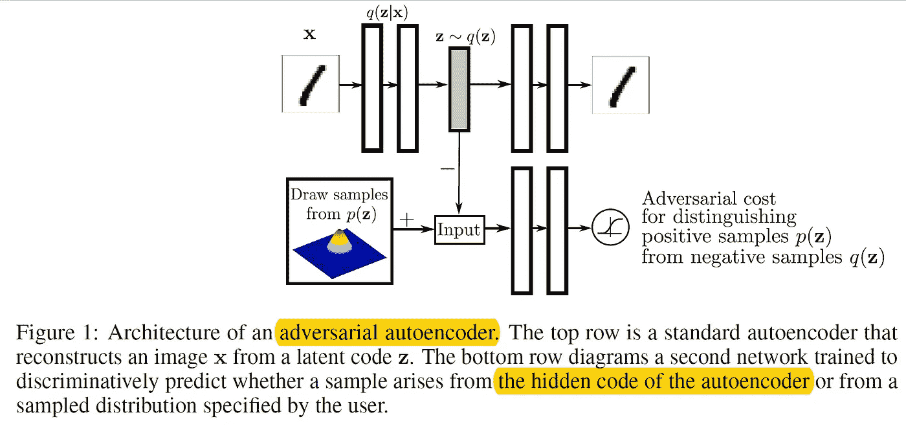

有趣的是，自动编码器的发生器部分也是自动编码器的编码器部分。随着训练的继续，自动编码器将试图欺骗鉴别器并匹配给定数据的分布。并且在训练中有两个阶段，首先是最小化重建损失，以及网络试图匹配分布的正则化阶段。一旦训练过程完成，自动编码器的解码器将定义生成模型，该模型映射 p(z)的强加先验。AAE 编码器部分的选择包括…

1) **确定性**:其中编码器与自动编码器的结构相同，其中 q(z)中唯一的随机性是数据分布 pd(x)。
2) **高斯后验**:这是类似的 VAE，其中 q(zjx)是高斯分布，其均值和方差由编码器网络预测。在这种情况下，q(z)中的随机性来自编码器输出端的数据分布和高斯分布的随机性。(使用了重新参数化技巧。)
3) **后验通用逼近器**:我们可以使用自动编码器来训练网络的编码器分布，作为后验通用逼近器。如果我们将编码器部分设置为 f(x，n)，其中 x 是输入，n 是噪声，具有固定分布，那么我们可以假设 q(z|x) = **δ** (z-f(x，n))，我们可以将编码器分布定义为。

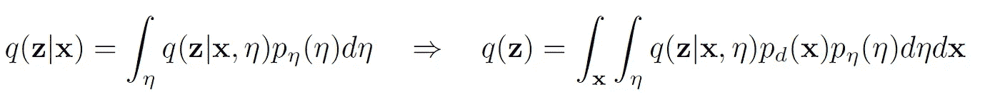

在上面的情况下，我们不再需要假设编码器的分布是高斯分布(或者我们开始时的固定分布)，我们可以学习任何任意的后验分布。(这可以通过直接传播错误来完成。)注意，在本文的其余部分，作者仅报告了确定性版本的结果。

**与可变自动编码器的关系**

虽然这项工作与 VAE 在光线匹配中的潜在向量分布相似。VAE 使用 KL 发散，AAE 使用对抗训练。

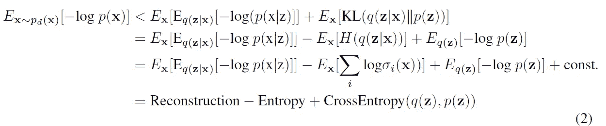

上面可以看到 VAE 的损失函数，第一项可以认为是重建项，而后两项可以认为是正则化项。然而，在 AAE，这两个正则项被对抗性训练过程所取代，该过程鼓励 q(z)匹配 p(z)的整个分布。

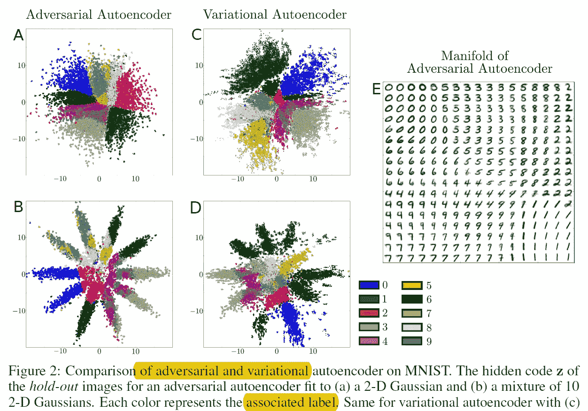

通过上面的例子，我们可以看到 AAE 的优越性，当在 MNIST 数据集上构造高斯分布时，我们可以看到 AAE 与 VAE 相比产生了明显的潜在空间。(以及当我们将分布设置为 10 个 2-D 高斯分布的混合物时。).两种架构的主要区别在于，对于 VAE，我们需要获得先验分布的精确函数形式，而在 AAE，我们只需要从先验分布中取样，以使 q(z)与 p(z)相匹配，这使得绘制高度复杂的分布成为可能。(瑞士卷)

**与 gan 和 GMMNs 的关系**

Gan 在网络输出上施加像素级的数据分布，则依靠自动编码器训练来捕捉数据分布。(这导致了更好的测试可能性)。在生成矩匹配网络(GMMN)之间，模型之间的相似之处在于它们都依赖于自动编码器来捕捉数据分布。然而，两者之间的区别在于，作者方法的对抗训练过程充当正则化器，其在从头训练自动编码器时形成代码分布；然而，GMMN/AE 模型首先训练标准的丢失自动编码器，然后拟合预训练网络的代码空间中的分布。(作者的方法能够产生更好的检验可能性。)

**将标签信息并入对抗规则化**

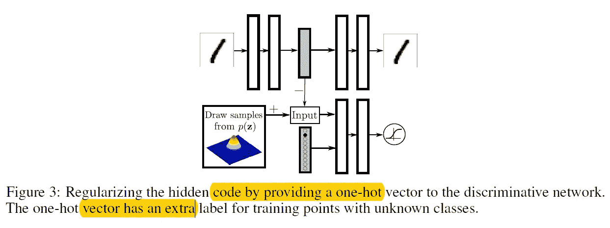

在我们知道给定数据的标签的情况下，这可以帮助我们形成 AAE 分布。(如上图。).标签的一个热编码表示连同目标分布一起被馈入鉴别器网络。这里要注意的一件有趣的事情是，在一个热编码向量中，我们保留了一个额外的空间，用于给定数据没有与之相关联的标签的情况。在正相期间，用户可以通过独热向量向鉴别器提供混合物成分的标签。并且在负相期间，用户可以通过独热向量向鉴别器提供训练点图像的标签。

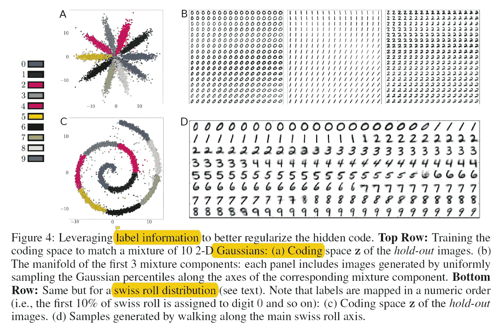

使用这种技术，我们能够更好地调整给定的网络，上面的图形看起来已经很熟悉了。但是关于图 B 有趣的一点是，样式表示在每个混合组件中是一致表示的，与它的类无关。(写作风格，如右上方等…)

**对手自动编码器的可能性分析**

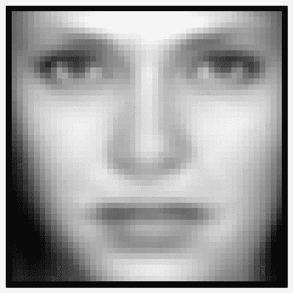

GIF from this [website](https://www.comm.utoronto.ca/~makhzani/adv_ae/tfd.gif)

在本节中，作者希望按照 GAN 论文中介绍的相同程序，测量 AAE 作为生成模型的能力。当在隐潜向量 z 中施加高维高斯分布时，作者在 MNIST 和多伦多人脸数据集上训练 AAE。(上面的 gif 显示了 TFD 的学习流形。).

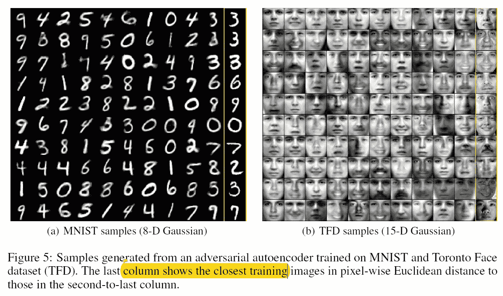

考虑到目前可用于评估生成模型(如 GANs)可能性的指标存在严重缺陷，作者 AAE 仍然能够实现优于其他先进方法的对数可能性。

受监督的对抗性自动编码器

最近，生成模型成为半监督学习中最流行的方法之一，因为它们能够以一种有原则的方式将类别标签信息从许多其他潜在的变异因素中分离出来。这里作者描述了如何从图像样式信息中分离出类别标签信息。

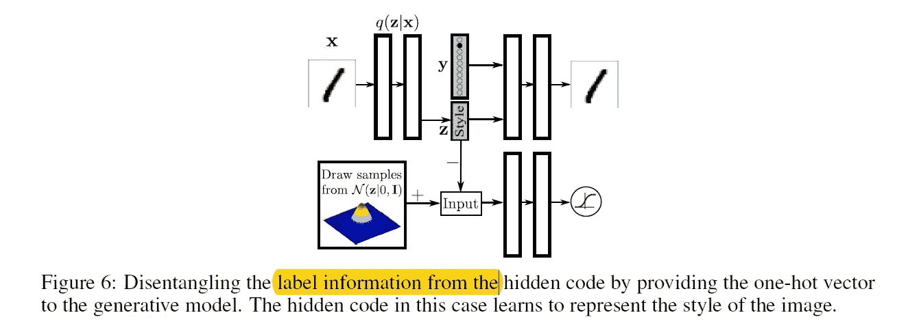

实现这一点的方法是通过类似上面的方法，其中类标签被赋予生成器网络，因此编码器主要需要学习样式。

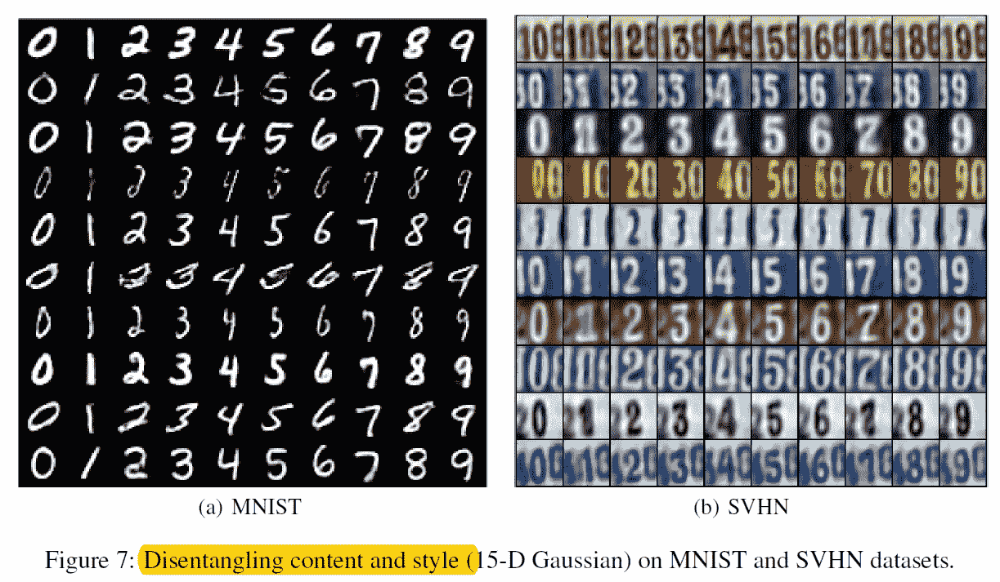

通过这样的学习，我们能够生成具有相同风格的图像，并且 SVHN 数据的学习风格流形可以在下面看到。

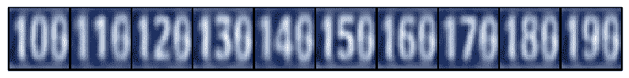

Gif from this [website](https://www.comm.utoronto.ca/~makhzani/adv_ae/svhn.gif)

**结论**

在这项工作中，作者提出了生成式自动编码器，它在许多不同的数据集上实现了竞争性测试可能性。此外，作者描述了如何将该方法扩展到半监督的情况。最后，作者讨论了如何使用这种方法来理清图像的风格和内容，无监督聚类，维数减少和数据可视化。(我暂时省略了三个部分，半监督，无监督，降维。)

**参考**

1.  (2018).Arxiv.org。检索于 2018 年 9 月 12 日，来自[https://arxiv.org/pdf/1511.05644.pdf](https://arxiv.org/pdf/1511.05644.pdf)