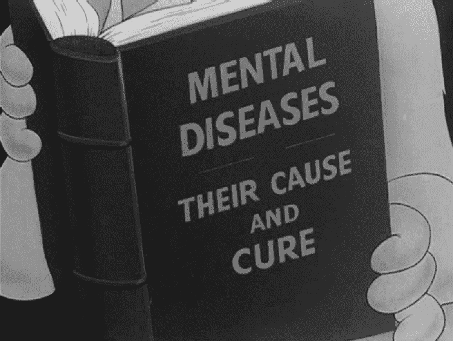
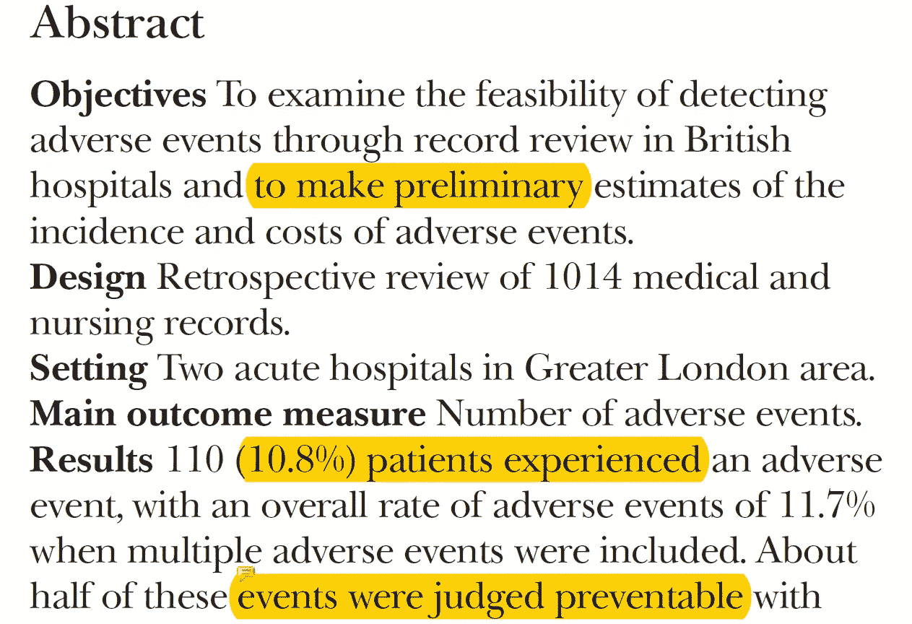
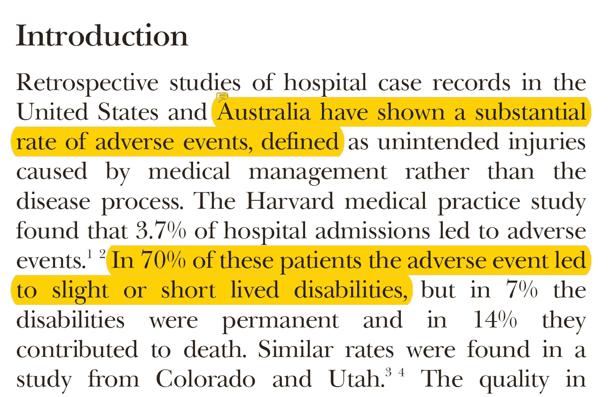
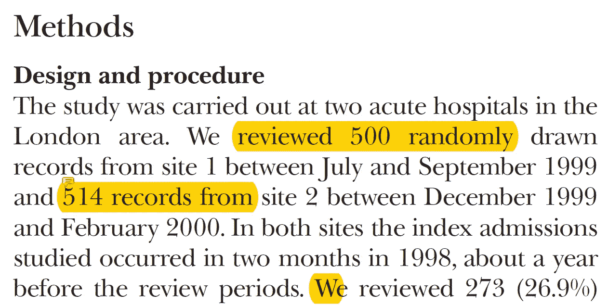
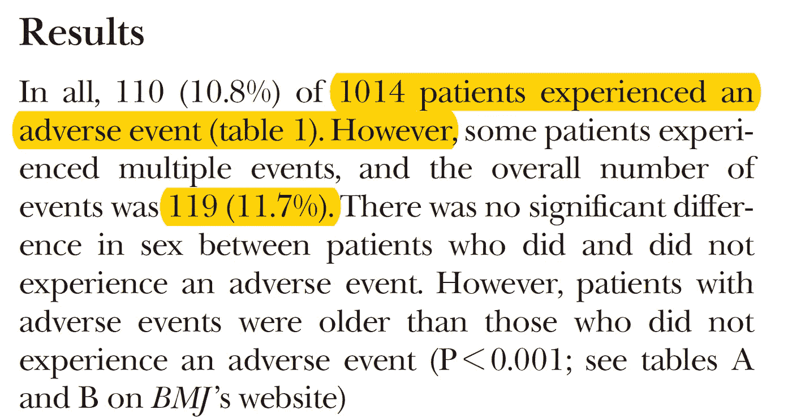
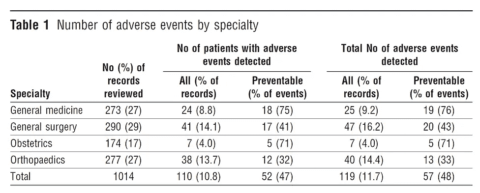
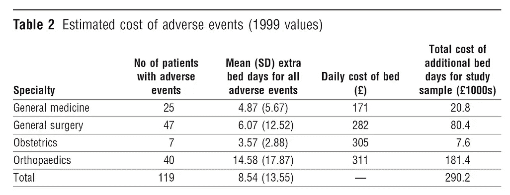
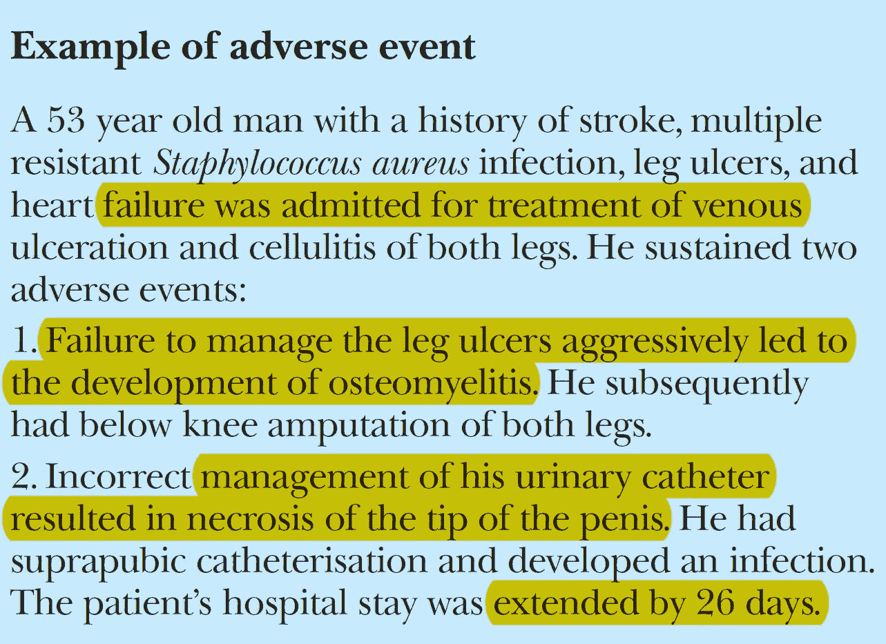
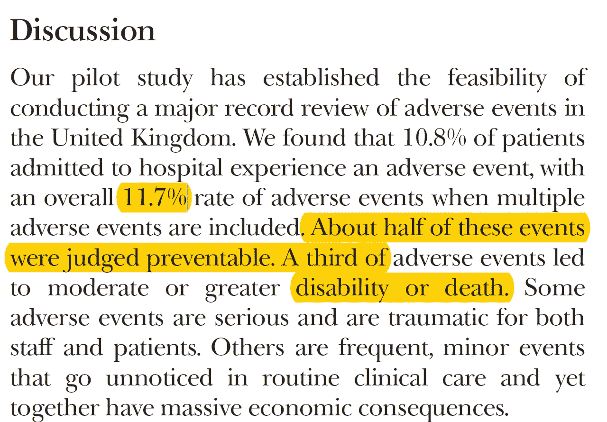

# [论文摘要]英国医院的不良事件:初步回顾性记录综述

> 原文：<https://towardsdatascience.com/paper-summary-adverse-events-in-british-hospitals-preliminary-retrospective-record-review-4fcb1f2451bc?source=collection_archive---------9----------------------->

GIF from from [website](https://giphy.com/gifs/9lL9COsAleLVm/download)

我是从 Google Deep Mind 的健康主页上找到这篇论文“ [*英国医院的不良事件:初步回顾性记录回顾*](https://www.bmj.com/content/bmj/322/7285/517.full.pdf) ”，想更深入的看一下，总结成一两句话。

请注意，这个帖子是给未来的自己回过头来看资料的。

**摘要**

本文主要研究是否有可能检测到一些[不良事件](https://en.wikipedia.org/wiki/Adverse_event)，这些事件会导致患者的症状恶化甚至导致死亡。

**简介**

简而言之，世界各地都有病人因管理不善而生病(或有时死亡)的情况，而不是某些伤害，所有这些事件都有严重的经济后果。

**方法(设计和程序)**

作者回顾了来自两家不同医院的 1014 例病例，其中 26.9%的记录来自普通内科(包括老年病学)，28.6%来自普通外科，27.3%来自矫形外科，17.2%来自产科。

**方法(审核流程)**

高度合格的护士审查病例，当记录显示阳性病例时，将其发送给分析任何不良事件并填写详细问卷的临床医生。

**结果**

在 1014 例病例中，有 110 例出现不良事件(当我们计算多个不良事件时，该数字增加到 119)，在这 110 例病例中，有 53 例声称是可预防的。所以 53/1014 的病例中大约有 5%有不良事件，并且是可以预防的。由于这些不利事件以及 290，268 加元(518，418.65 加元)的额外费用，总共延长了大约 999 天。

**不良事件示例**

由于管理不善，一名 53 岁的男子在医院多住了 26 天。

**讨论**

总之，在这项研究中，许多造成巨大经济后果的不良事件是可以预防的。然而，作者警告读者两件事…

a)本研究主要是试点性的，有一定的局限性，只研究了两家医院的数据。

b)此外，病例组合不能准确反映医院实践。医疗保健中可能还有另一个领域会产生更多的不良事件。(或更少)

**最后的话**

听到一些可预防的不良事件导致患者死亡，真的很令人难过。我想知道在韩国以及全世界有多少这些不良事件没有被发现。

如果发现任何错误(因为我仍在学习，会有很多)，请发电子邮件到 jae.duk.seo@gmail.com 给我，如果你希望看到我所有写作的列表，请[在这里查看我的网站](https://jaedukseo.me/)。

同时，在我的推特[这里](https://twitter.com/JaeDukSeo)关注我，访问[我的网站](https://jaedukseo.me/)，或者我的 [Youtube 频道](https://www.youtube.com/c/JaeDukSeo)了解更多内容。如果你感兴趣，我还在这里做了解耦神经网络[的比较。](https://becominghuman.ai/only-numpy-implementing-and-comparing-combination-of-google-brains-decoupled-neural-interfaces-6712e758c1af)

**参考**

1.  c .文森特、g .尼尔和 m .沃罗什诺维奇(2001 年)。英国医院的不良事件:初步回顾性记录回顾。英国医学杂志，322(7285)，517–519。
2.  不利事件。(2018).En.wikipedia.org。检索于 2018 年 4 月 10 日，来自[https://en.wikipedia.org/wiki/Adverse_event](https://en.wikipedia.org/wiki/Adverse_event)