# [论文摘要]通过深度表现实现更好的混合

> 原文：<https://towardsdatascience.com/paper-summary-better-mixing-via-deep-representations-d582e4bd1b8?source=collection_archive---------13----------------------->

Photo by [Free Nature Stock](https://unsplash.com/photos/OQfuugXSfH0?utm_source=unsplash&utm_medium=referral&utm_content=creditCopyText) on [Unsplash](https://unsplash.com/search/photos/matrix?utm_source=unsplash&utm_medium=referral&utm_content=creditCopyText)

> **请注意，这篇帖子是给未来的自己看的，是为了回顾和复习这篇论文中呈现的材料。**

Paper from this [website](https://arxiv.org/pdf/1207.4404.pdf)

**摘要**

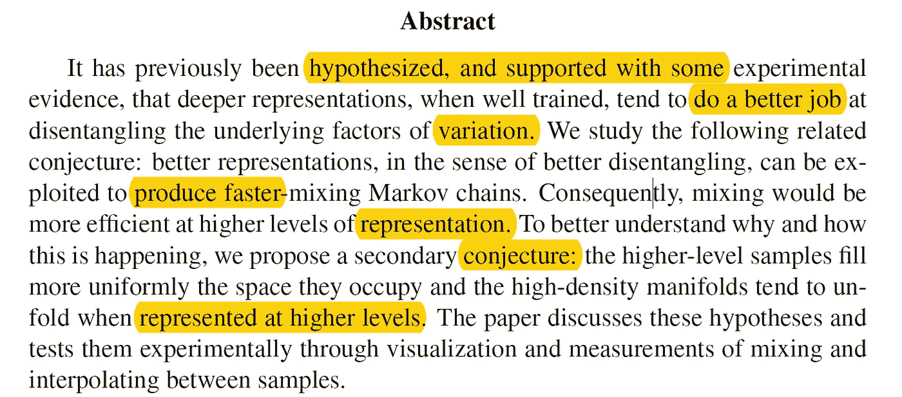

给定数据的更深层次的表示在解开变异的潜在因素方面做得更好。本文作者研究了一个相关的猜想，更好的表示，在更好的解纠缠的意义上，可以用来产生更快混合的马尔可夫链。为了更好地理解为什么会发生这种情况，作者提出了第二个猜想:更高级别的样本更均匀地填充它们占据的空间，当在更高级别上呈现时，高密度流形倾向于展开。

**简介及背景**

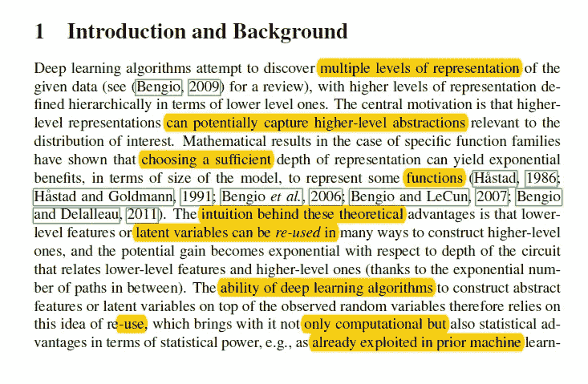

深度学习算法发现给定数据的多个级别的表示，并且通常认为更高的表示可以潜在地捕捉与兴趣分布相关的更高级别的抽象。(通过实验已经表明，增加表示的深度会有很大的好处。).较低级别的特征可以在形成较高级别的表示中被重复使用，并且随着表示的深度增加，潜在的收益变成指数级的。深度学习算法依赖于重用低级特征的想法。(这就是为什么参数共享是如此强大和有效的方法。).深度表示的另一个(很少讨论的)优点是，它可能有助于理清变异的潜在因素。(如果我们有一种算法可以轻松地分离数据，这将使进一步的处理变得容易得多。) (当我们说我们的目标是建造一台了解周围环境的机器时，这可能意味着这台机器能够理清它所涉及的因素和原因，因此在这个方向上的进展似乎很重要。)如果习得表征在解开隐藏因素方面做得很好，它甚至可以抵消维度诅咒的影响。已经进行了许多观察，深度学习算法有助于这种解开，然而，我们仍然不知道为什么或程度如何。

无监督学习算法试图捕捉给定数据分布的显著结构，而大多数深度学习算法用于学习特征，并利用它们进行分类或回归任务。由于其无监督学习的性质，一些算法可以用于生成样本，但是这可能会遇到混合的基本问题:当这些被大的低密度区域分隔时，马尔可夫链很难从一种分布模式跳到另一种模式，这是现实世界数据中的常见情况，并且是在流形假设下。(该假设指出，数据中呈现的自然类别与分布集中的输入空间中的低维区域相关联，并且不同类别的流形被密度非常低的区域很好地分开。慢速混合意味着从一种模式到另一种模式需要许多连续的采样步骤，甚至需要更多的步骤才能覆盖所有模式。).发生这种情况是因为在模式之间的低密度空隙周围跳跃是罕见的和不太可能的。

当学习算法没有给定数据的良好表示时，模型倾向于对应于更平滑和均匀的分布，将质量放在更大体积的输入空间中，特别是在模式之间。(这可以在我们生成少量图像样本时看到，它们看起来更加模糊和嘈杂。).随着模型的改进，其相应的分布在数据集中的地方变得尖锐，混合变得相当慢。由于采样对许多机器学习算法至关重要，这表明学习将会很慢或很差，甚至在某些情况下会由于学习算法的限制而停止。

为了改善混合，引入了回火。想法是使用更平滑的密度在模式之间进行快速但近似的跳跃，但使用清晰的“正确”模型在这些模式内实际生成感兴趣的样本，并允许样本在不同温度水平之间交换。

并介绍了他们的主要假设。

***在更高的代表级别采样时，混合更容易。***

作者的主要目的是调查这一假设，并研究为什么会发生这种情况，以及测试更具体的假设。深度生成模型产生更好的特征和更高质量的样本的想法并不新颖，并且已经被有前途的研究人员研究过。

**假说**

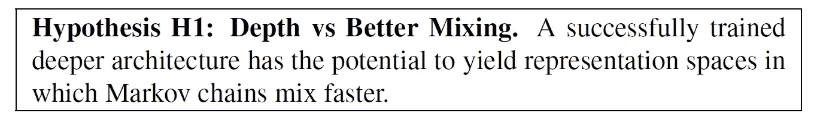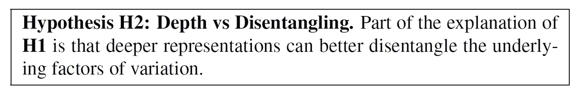

想象一个对象图像数据的抽象表示，其中一个因素是“反转视频位”，它反转黑白像素。(所以 1-x)。当默认值为 0 时，前景对象为黑色，背景为浅色。翻转比特不会改变图像的大多数其他语义特征，这些特征可以用其他高级特征来表示。然而，在每个图像级模式中，将会有一个反视频对应模式，其中该位被翻转。并且这两种模式将被输入空间中的巨大空白区域分开，使得输入空间中的任何马尔可夫链都不太可能从这两种模式中的一种跳到另一种。

相反，如果我们考虑具有“反向视频”位的更高表示，则在大多数马尔可夫链转移概率下，仅翻转该位将是非常可能的事件，因为翻转将是保持高概率的小变化。(这就是为什么 H2 会帮助解释 H1。).

在 H2 要考虑的另一个有趣的事实是解缠程度的概念。深度学习算法并不能完美地解决问题，当前的算法是分阶段进行的，在更高的级别提取更抽象的特征。(更好的理清将意味着一些习得特征与一些已知因素具有更高的互信息。).对一个因素具有高度预测性的特征对其他因素变得不变的预测性较低。(我们指的是学习解开表象的目标)。从那里我们可以考虑一个额外的假设，专门 H2。

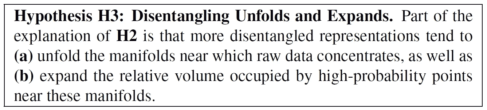

H3 指出，高层次表示空间中的高密度流形比原始输入空间中的相应高密度流形更平滑，更容易建模。

**表示-学习算法**

作者使用了两种学习算法:深度信念网络和压缩自动编码器

**实验**

MNIST 和多伦多人脸数据库使用了两个不同的数据集，使用的网络架构见下图。

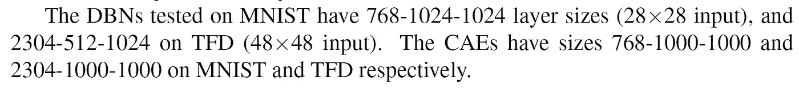

*更高级别的样品*

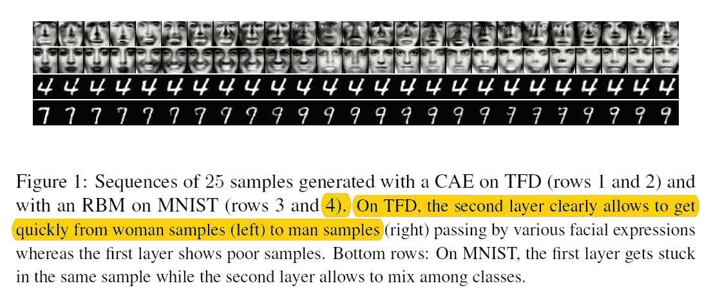

如上所述，在更深的层中生成的图像在视觉上更有可能混合得更快。此外，当作者测量生成样本的质量时，它更高。并且该观察结果与 H3(b)的观点一致，即在流形已被扩展的较高级别表示空间中移动比在原始输入空间中移动提供了更高质量的样本，在原始输入空间中移动可能很难停留在高密度区域。

*通过在邻居之间插值来可视化表示空间*

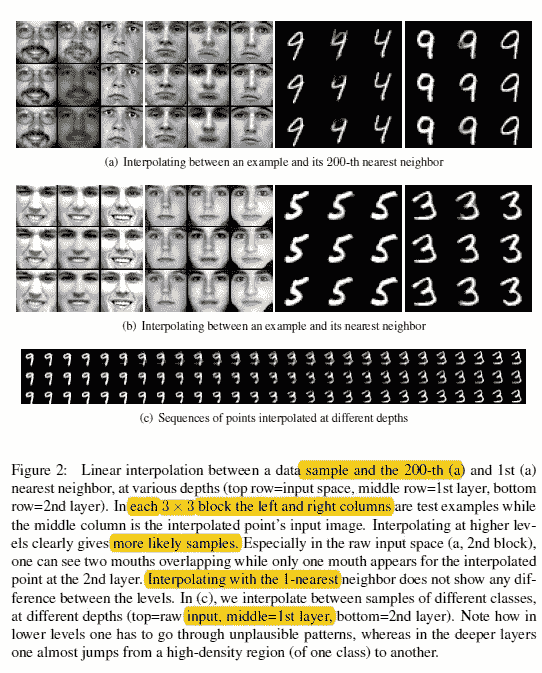

从上面的图像我们可以看到，在更深的层次插值给出了视觉上更可信的样本。

*通过计算访问班级的数量来测量混合*

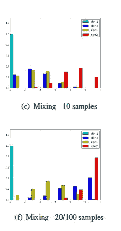

从上面的直方图我们可以看到，更深的架构访问更多的类，CAE 混合比 DBN 更快。

*在数据点周围占据更多的体积*

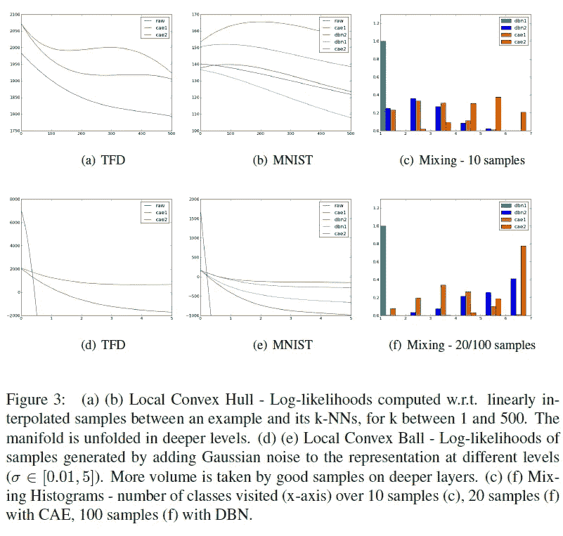

此外，作者还发现，CAE 和 DBN 的高级表示中，更大比例的局部体积被可能的配置占据，例如，更靠近输入空间流形，实际数据生成分布集中在该流形附近。

*辨别能力 vs 体积膨胀*

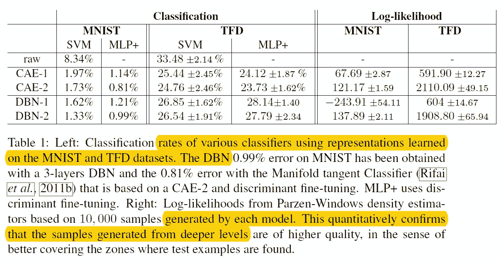

人们可以认为，由于不同类别的更高级别表示彼此“更接近”,这将混淆模型，导致更低的分类准确度。然而，从上表中我们可以看出，更深层次的特征有助于更好的分类性能，尽管它们具有更好的生成能力和更好的混合。

**结论**

总之，已经检验了三个假设

1.  更深的表示可以产生更好的样本和更好的混合。
2.  这是由于更好的解开
3.  这与数据集中的流形的展开以及良好样本在表示空间中占据的体积的扩展有关。

并且所执行的实验证实了作者的假设，在更高的水平上，获得了更好的样本和更好的混合。(即使在示例之间插值或添加各向同性噪声时)

**最后的话**

这张纸是金色的，但是极其难懂，我还是不懂。但总的来说，我认为这篇论文是在说明，随着深度的增加，数据的表现会更好。

如果发现任何错误，请发电子邮件到 jae.duk.seo@gmail.com 给我，如果你想看我所有写作的列表，请在这里查看我的网站。

同时，在我的 twitter [这里](https://twitter.com/JaeDukSeo)关注我，并访问[我的网站](https://jaedukseo.me/)，或我的 [Youtube 频道](https://www.youtube.com/c/JaeDukSeo)了解更多内容。

**参考**

1.  y .本吉奥、g .梅斯尼尔、y .多芬和 s .里法伊(2012 年)。通过深度表现进行更好的混合。Arxiv.org。检索于 2018 年 9 月 19 日，来自[https://arxiv.org/abs/1207.4404](https://arxiv.org/abs/1207.4404)