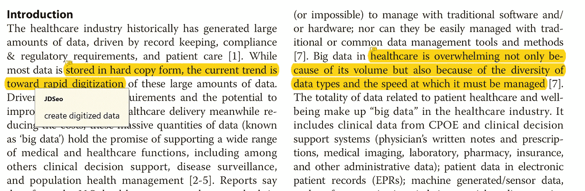
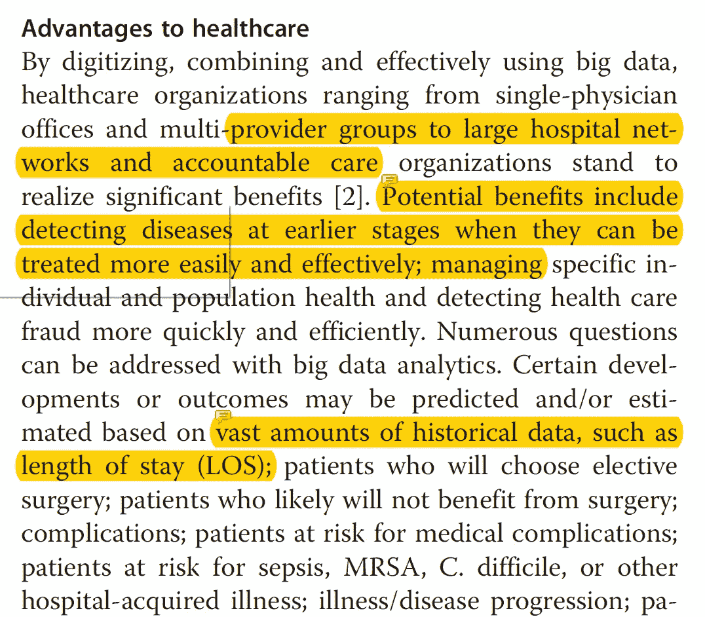
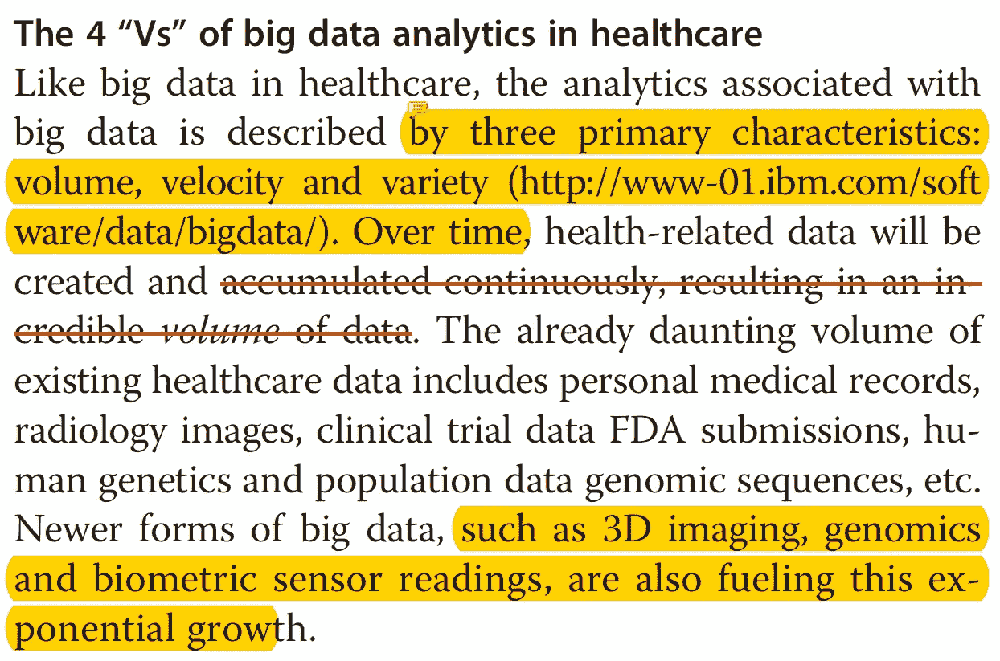
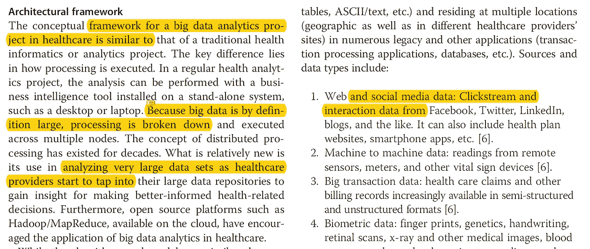
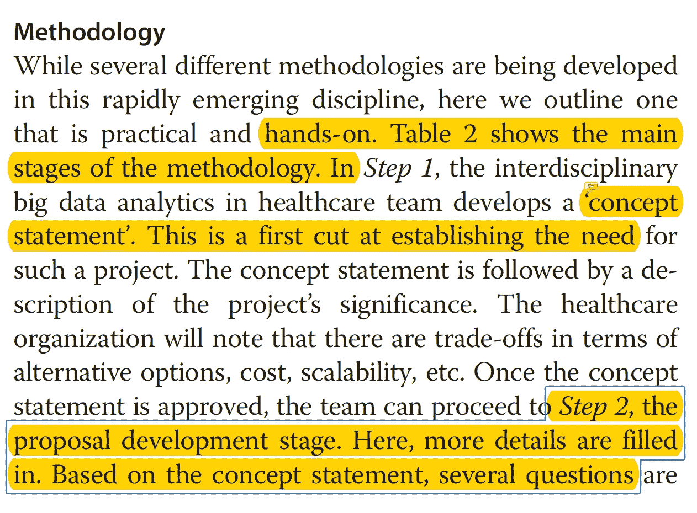
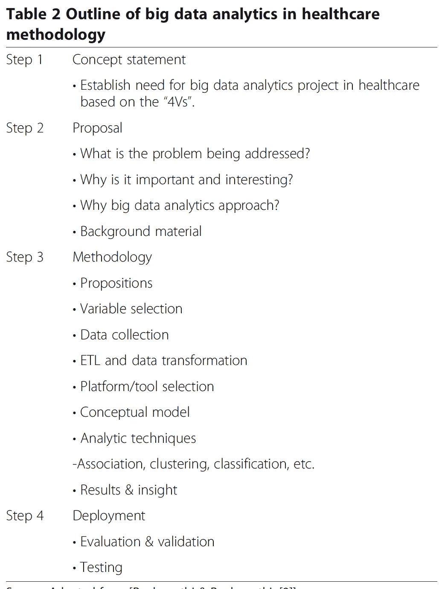
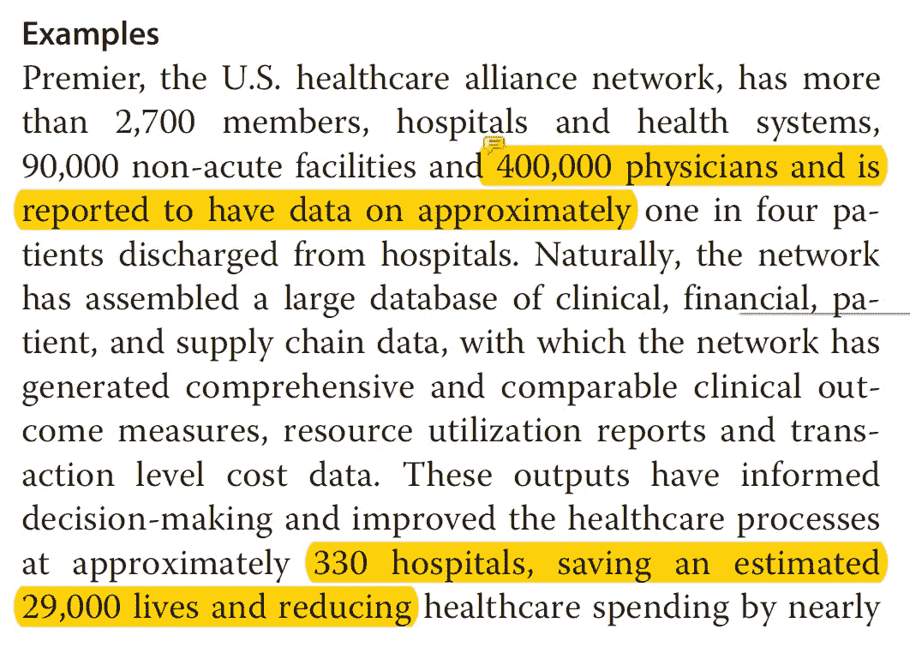
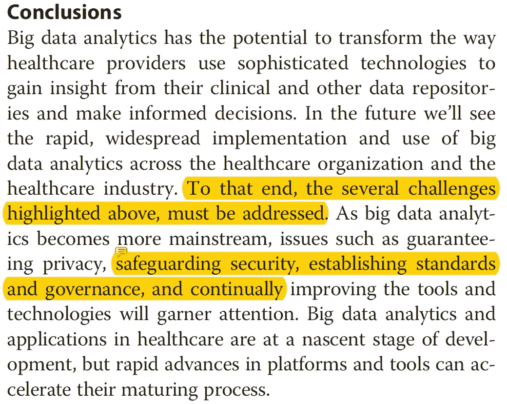

# [论文摘要]医疗保健领域的大数据分析:前景和潜力

> 原文：<https://towardsdatascience.com/paper-summary-big-data-analytics-in-healthcare-promise-and-potential-ee3fba1488ea?source=collection_archive---------7----------------------->

Gif from [here](https://giphy.com/gifs/xxuSrl9C0XUVG)

所以今天，我将总结这篇文章“ [*医疗保健中的大数据分析:前景和潜力*](https://www.ncbi.nlm.nih.gov/pmc/articles/PMC4341817/) l”，每一节都用一两句话来概括。再次，请注意这篇文章是给未来的自己看的。

Paper from this [website](https://www.ncbi.nlm.nih.gov/pmc/articles/PMC4341817/pdf/13755_2013_Article_14.pdf)

**简介**

基本上，作者说，医疗保健行业产生越来越多的数据，大数据分析有巨大的潜力。

**医疗保健的优势领域**

***一般优势的例子:***
a)更早地发现疾病，它们可以更容易地得到治疗
b)预测不同病人的住院时间
c)节省资金，避免做浪费的研究( [*麦肯锡估计 3000 亿美元*](https://www.mckinsey.com/industries/healthcare-systems-and-services/our-insights/the-big-data-revolution-in-us-health-care) )

***具体好处举例:***
***a)临床操作:*** 降低患者诊断费用。

***b)研究&开发:*** 让研究过程整体高效。

***c)公共卫生:*** 在危机事件中更有效地处理事件

***d)循证医学:*** 利用不同来源的过去结果(如 EMR，或手术数据)预测未来结果。

***e)基因组分析:*** 更高效地分析基因数据或进行基因测序

***f)审前欺诈分析:*** 分析运营数据，看是否存在欺诈

***g)设备/远程监控:*** 分析从 IOT 设备获得的数据

****医疗保健领域大数据分析的 4 个“Vs”****

****

*****卷:*** 数据量，我们将要拥有越来越多的数据。**

*****速度:*** 每个数据加起来的速度，这几天越来越多的数据进来的速度很快。**

*****种类:*** 不同特性的数据，有些数据是 DICOM 格式，其他的可以是 excel 格式。**

*****准确性:*** 我们对医疗保健数据进行分析的正确性。一些例子可以是手写诊断识别。**

****建筑框架****

****

**我们不能在一台计算机上分析大数据，我们需要某种分布式计算系统，然而，我们需要使分布式系统更加用户友好。这里可以使用的一些技术有 [Hadoop](http://hadoop.apache.org/) 。**

****方法论****

****

**下面是医疗保健组织如何部署成功的大数据分析项目的分步指南表。**

****

****例题****

****

**医疗保健组织开展大数据项目的一些成功案例。**

*****a)***[***北约克综合医院***](http://www.nygh.on.ca/Default.aspx?cid=4524&lang=1)***:***改善患者预后
***b)***[***患病儿童***](https://globalnews.ca/news/696445/research-in-big-data-analytics-working-to-save-lives-of-premature-babies/)***:***对婴儿进行分析，以防止婴儿容易发生威胁生命的“院内感染”上升**

****挑战****

****

**一些挑战包括可扩展性、用户友好性、安全性和可用性。(分布式系统面临的一般问题)**

****结论****

****

**大数据潜力巨大，但安全或政府法规等问题仍是需要解决的问题。**

****最后的话****

**很好地概述了大数据和机器学习如何使医疗保健系统普遍受益。然而，下一步是确定哪些是真正可以实施的，哪些只是炒作。**

****参考****

1.  **Raghupathi，w .，& Raghupathi，V. (2014 年)。医疗保健中的大数据分析:前景和潜力。*卫生信息科学与系统*、 *2* (1)、3。**
2.  **美国医疗保健的大数据革命:加速价值和创新。(2018).麦肯锡公司。检索于 2018 年 3 月 28 日，来自[https://www . McKinsey . com/industries/health care-systems-and-services/our-insights/the-big-data-revolution-in-us-health-care](https://www.mckinsey.com/industries/healthcare-systems-and-services/our-insights/the-big-data-revolution-in-us-health-care)**
3.  **欢迎使用 Apache Hadoop！。(2018).Hadoop.apache.org。检索于 2018 年 3 月 28 日，来自[http://hadoop.apache.org/](http://hadoop.apache.org/)**
4.  **北约克总医院——合并医院和社区数据以推进研究。(2018).Nygh.on.ca 检索 2018 年 3 月 28 日，[&郎=1](http://www.nygh.on.ca/Default.aspx?cid=4524&lang=1)**
5.  **北卡罗来纳州博加特(2013 年)。大数据分析研究致力于拯救早产儿的生命。全球新闻。检索于 2018 年 3 月 28 日，来自[https://global news . ca/news/696445/research-in-big-data-analytics-work-to-save-life-of-早产儿/](https://globalnews.ca/news/696445/research-in-big-data-analytics-working-to-save-lives-of-premature-babies/)**