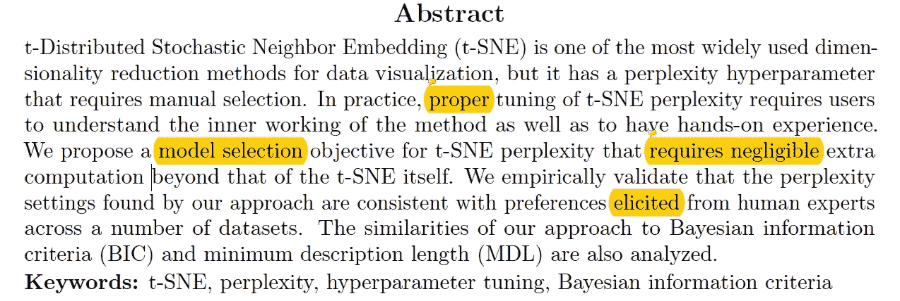
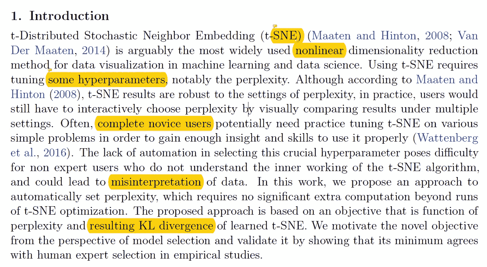
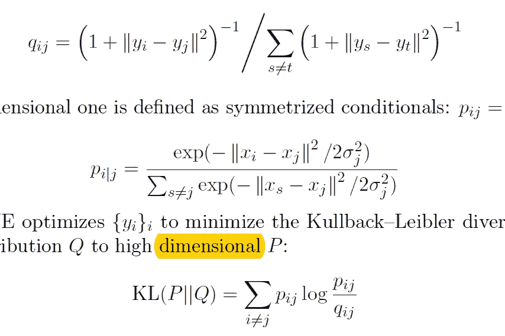
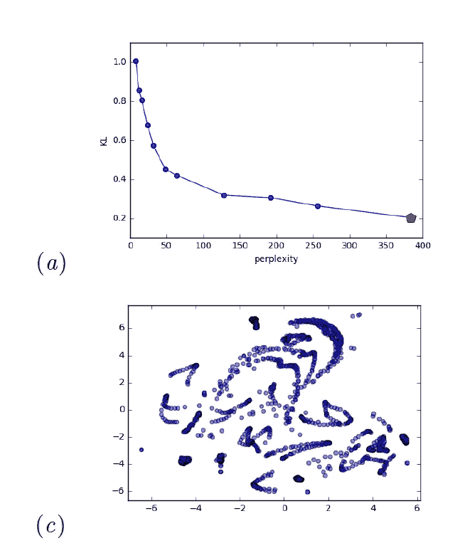
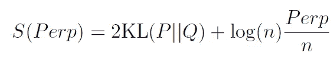
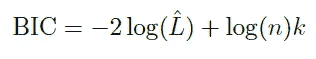
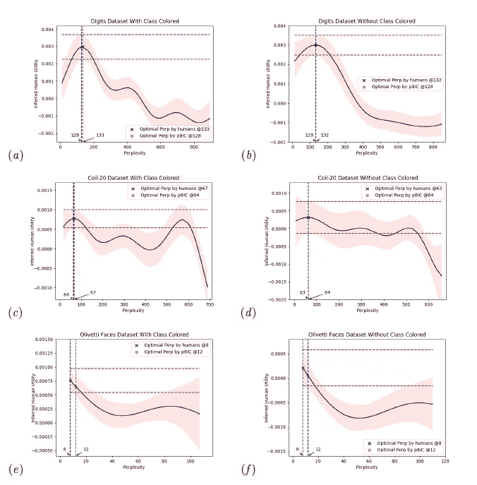
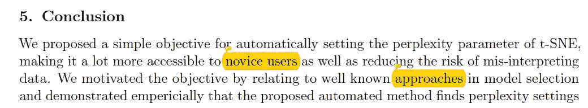

# [论文摘要/borealisai]t-SNE 困惑的自动选择

> 原文：<https://towardsdatascience.com/paper-summary-borealisai-automatic-selection-of-t-sne-perplexity-676a49cf2097?source=collection_archive---------12----------------------->

GIF from this [website](https://giphy.com/gifs/pokemon-pikachu-flower-2HEAHnj8FOmL6)

我发现了 borealisai 的这篇论文，我立刻就想阅读它。

> **请注意，这篇帖子是给未来的自己看的，回顾这篇论文上的材料，而不是从头再看一遍。**

Paper from this [website](https://arxiv.org/pdf/1708.03229.pdf)

**摘要**

T-sne 是最广泛用于高维数据的降维方法，但是它有一个超参数叫做困惑度。在这篇文章中，作者提出了一种方法，可以自动调整这个参数与忽略不计的额外计算成本。

**简介**

根据马滕和辛顿 t-SNE 的结果对困惑的设置是稳健的，然而，在应用中，用户必须比较来自不同困惑值的结果来选择最佳值。在选择该超参数时缺乏自动化可能会导致数据失真。

**t 分布随机邻居嵌入**

T-sne 通过将成对距离转换成成对联合分布，试图在低维空间中保持来自高维空间的局部邻域结构。然后使用 KL 散度来尝试匹配分布。(对于高维和低维)在等式 2 中，我们可以看到引入了困惑项，这个超参数，不严格地说，描述了每个数据点有多少个邻居。

**自动选择困惑度**

如上所述，随着困惑度的增加，KL 散度的损失减少，通过这一事实，我们知道，仅使用 KL 散度作为损失函数，我们将最有可能以高困惑度值结束。然而，这些高困惑值并不总是最佳的。当我们将困惑度设置为最大值(即数据点的数量)时，它无法捕捉数据中任何有趣的结构。考虑到困惑和 KL 散度之间的权衡，作者引入了下面的标准。

为了自动设置 prep 值，可以相对于 Perp 对 S 进行无导数优化，例如使用贝叶斯优化。

**解释为经由伪 BIC (pBIC)的反向复杂度调谐**

如上所述，在贝叶斯信息标准中，第一项测量最大似然估计模型的拟合优度，第二项通过惩罚自由参数 k 的数量来控制模型的复杂性。我们可以看到，上面的方程在形式上类似于作者的方程，并且平衡了数据拟合和复杂性。这两个方程之间的区别不是增加模型的复杂性以更好地拟合数据，而是增加困惑值，降低要建模的数据中模式的复杂性。(由于我们将越来越多的数据点视为邻居，作者还讨论了一个有趣的事实。当低估概率而不是高估概率时，KL 散度损失函数具有大的成本。换句话说，如果 p 很大，而 q 很小，KL 偏离该项就很大，但在相反的方向，小 p 和大 q，KL 不受影响。)此外，作者还将最小化某些描述长度联系起来。

**利用推断的人类专家对困惑的偏好进行验证**

为了检验作者方法的有效性，作者将从标准方程中选择的困惑值与专家选择的困惑值进行了比较。在各种各样的数据集上。如上所述，我们注意到，与专家选择值相比，作者公式选择的值没有太大差异。

**结论**

本文介绍了一种在使用 t-sne 时自动选择最佳困惑值的新方法。

**参考**

1.  曹，王，李(2017)。t-SNE 困惑的自动选择。Arxiv.org。检索于 2018 年 9 月 11 日，来自[https://arxiv.org/abs/1708.03229](https://arxiv.org/abs/1708.03229)