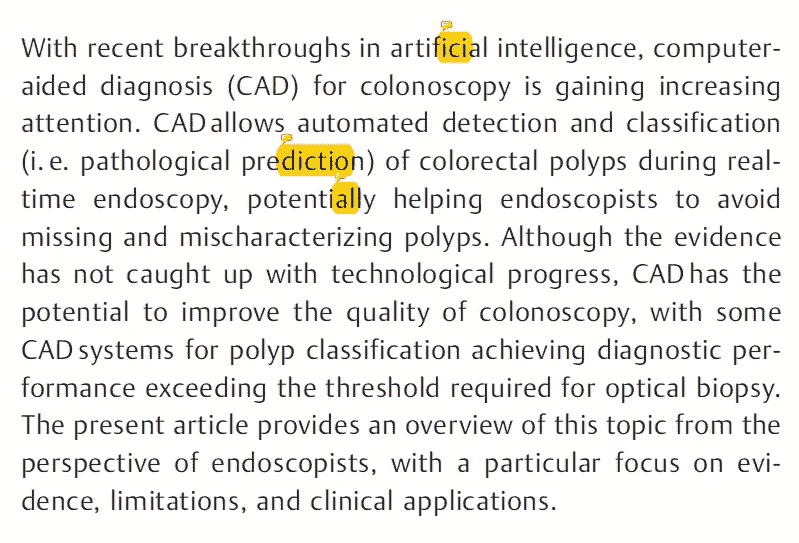
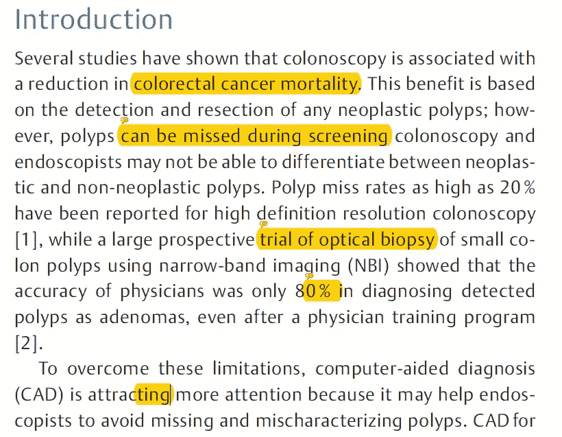
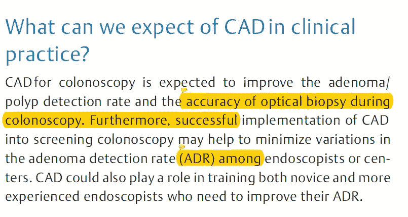
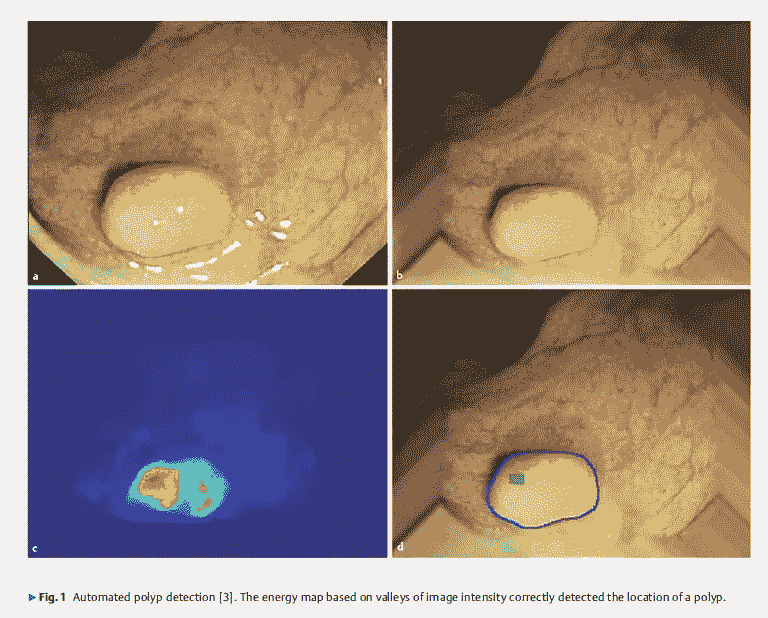
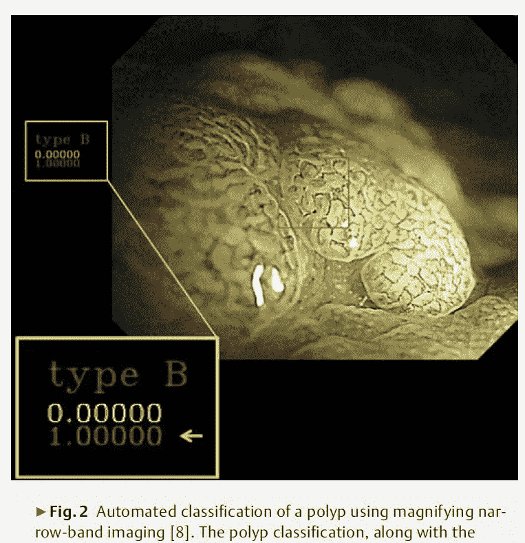
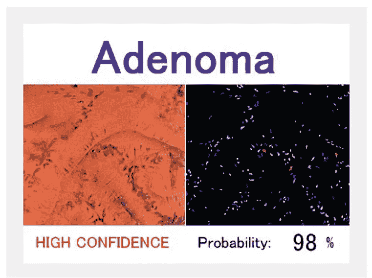
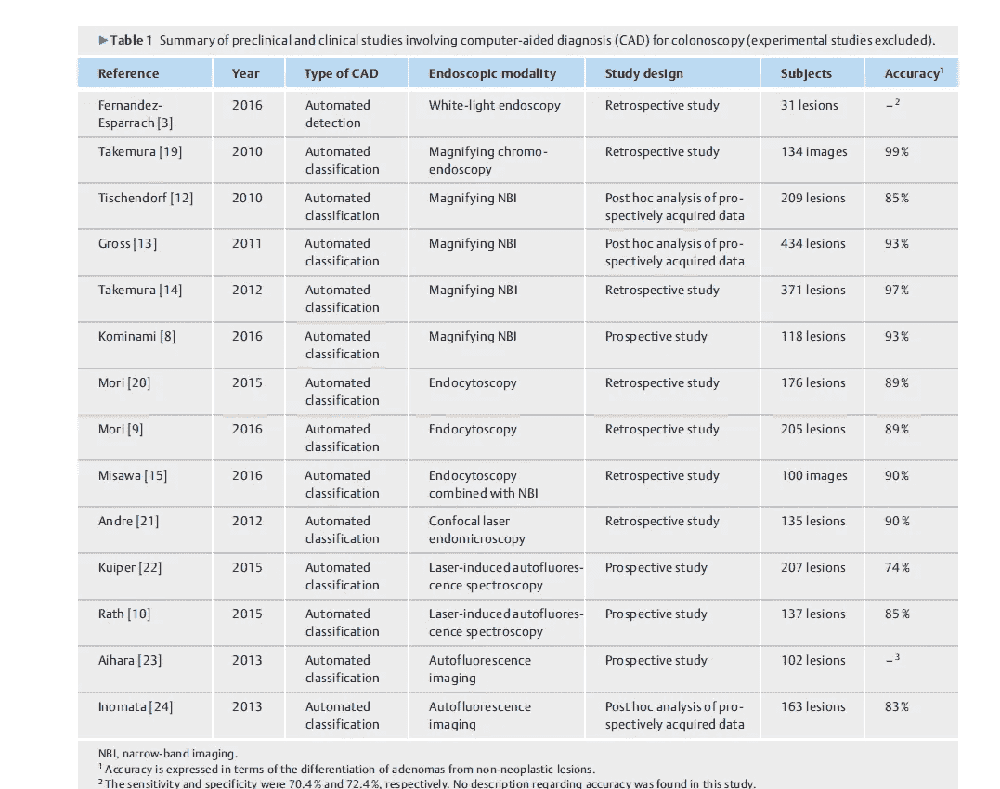
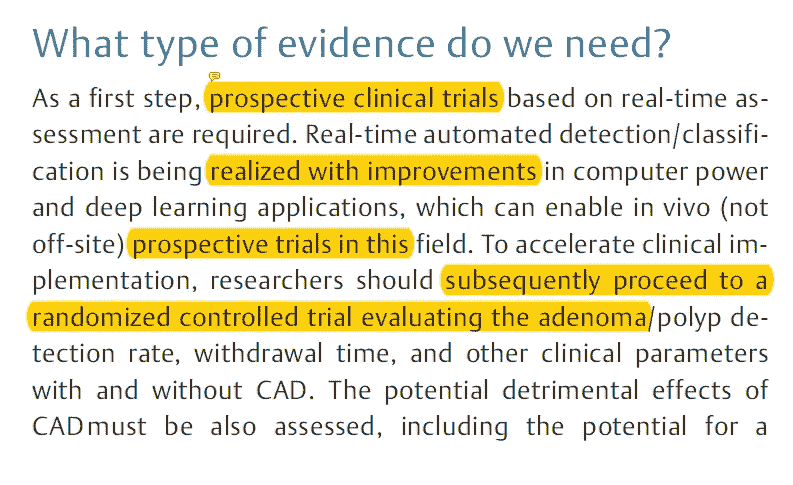
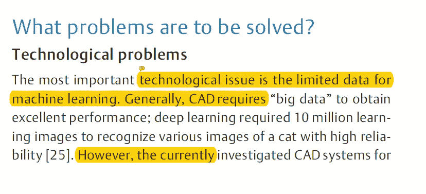
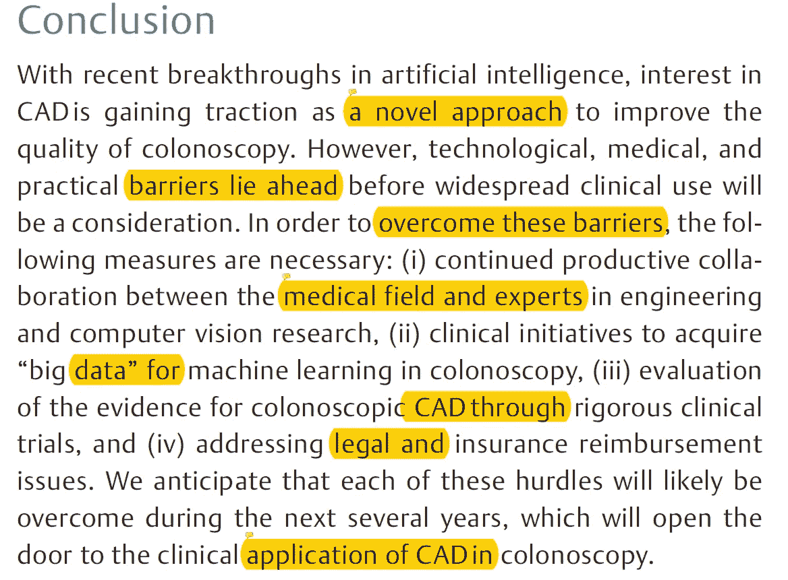

# 结肠镜检查的计算机辅助诊断

> 原文：<https://towardsdatascience.com/paper-summary-computer-aided-diagnosis-for-colonoscopy-e75485b2f283?source=collection_archive---------8----------------------->

GIF from this [website](https://media.giphy.com/media/OHChoDrCV0Yco/giphy.gif)

深度学习如何影响医疗保健行业的另一个伟大的用例。

> **请注意，这篇帖子是给未来的自己看的，回顾这篇论文上的材料，而不是从头再看一遍。此外，我没有足够的医学知识来完全理解这篇论文上的材料，然而我只是在推动自己学习。**

Paper from this [website](https://www.researchgate.net/publication/317147787_Computer-aided_diagnosis_for_colonoscopy)

**摘要**

由于深度学习的最新发展，计算机辅助诊断(CAD)系统越来越受欢迎。在这些 CAD 系统中，在实时研究期间对结肠直肠息肉的自动检测和分类正在帮助内窥镜专家。这篇文章提供了这个主题的概述，特别关注证据，局限性和临床应用。

**简介**

不幸的是，即使经过培训，医生仍有 80%的准确率将检测到的息肉诊断为腺瘤。此外，人类在结肠镜检查中有 20%的机会漏掉息肉。为了克服这些问题，CAD 系统越来越受欢迎，以帮助医生变得更加准确。

在临床实践中，我们对 CAD 有什么期望？

在结肠镜检查筛查期间安装 CAD 系统的主要好处是:1)提高息肉检测的准确性；2)帮助培训需要提高腺瘤检测率的新手和更有经验的内窥镜专家。

**技术概述**

如上所述，当检测到息肉时，CAD 系统可以通过声音或其他机制警告医生，并通过标记描绘轮廓。一个有趣的事实是 ADR 增加 1%与癌症风险降低 3%相关。为了使这些系统成功，它们需要满足两个要求，第一，CAD 系统必须具有关于息肉检测的高灵敏度，第二，它们需要足够快以在实时场景中运行。

**结肠直肠息肉的自动分类**

通过息肉的自动检测和分类，我们可以避免增生性息肉的不必要的息肉切除术，仅在美国，估计每年节省 3300 万美元。

已经进行了许多研究来对不同组的图像进行分类，例如“ [*”用于通过使用窄带成像放大结肠镜检查(具有视频)来预测结肠直肠肿瘤的组织学的计算机辅助系统。*](https://www.ncbi.nlm.nih.gov/pubmed/22196816) 。还有许多仍在进行中，甚至是细胞内镜检查，它使接触显微镜(× 500)能够进行体内细胞成像，是 CAD 系统产生积极影响的另一个伟大领域。(关于细胞内镜检查的一个优点是，它提供固定大小的聚焦的、一致的图像，使得 CAD 能够进行更容易和更鲁棒的图像分析。)最后，自体荧光光谱也是 CAD 系统应用的另一个领域。

**深度学习的出现**

检测和分类息肉的传统方法通常严重依赖于先进的医学图像，因此在实时场景中，它们很难很好地执行。然而，深度学习方法，如 CNN，对噪声和方差更加鲁棒，这使它们在现实生活应用方面具有优势。

**临床研究**

如上所述，已经有许多使用 CAD 系统来执行息肉的自动检测和分类的情况。每项研究使用不同的方法获得不同的准确性。

我们需要什么样的证据？

虽然已经有很多研究，我们仍然需要更多的证据，如实时检测和分类的前瞻性研究，随机试验，以及解决 CAD 模型的潜在有害影响。

**要解决哪些问题？**

总结一下我们仍需克服的一些技术问题。
1)需要更多数据，用于结肠镜检查的 CAD 系统中使用的最大图像量约为 6k，这在当今的标准中并不算多。
2)对于 CAD 系统，我们还需要讨论一些法律问题，但是目前这些问题还没有得到解决。
3)在将 CAD 系统应用于结肠镜检查之前，应该有用于实施 CAD 系统的更严格的路线图。

**结论**

总之，深度学习的进步显示了改进 CAD 系统的良好迹象，但是我们需要克服四个障碍。
1)医学专家和计算机科学家之间的合作
2)为成功的培训获取大量数据
3)通过严格的临床试验评估 CAD
4)法律和保险报销问题

**最后的话**

这些系统很酷，我希望有一天能实现这个系统。

如果发现任何错误，请发电子邮件到 jae.duk.seo@gmail.com 给我，如果你想看我所有写作的列表，请点击这里查看我的网站。

同时，在我的推特[这里](https://twitter.com/JaeDukSeo)关注我，访问[我的网站](https://jaedukseo.me/)，或者我的 [Youtube 频道](https://www.youtube.com/c/JaeDukSeo)了解更多内容。我还实现了[广残网，请点击这里查看博文 pos](https://medium.com/@SeoJaeDuk/wide-residual-networks-with-interactive-code-5e190f8f25ec) t。

**参考**

1.  (2018).[在线]见:[https://www . research gate . net/publication/317147787 _ Computer-aided _ diagnosis _ for _ colonels](https://www.researchgate.net/publication/317147787_Computer-aided_diagnosis_for_colonoscopy)【2018 年 7 月 5 日获取】。
2.  竹村 Y，e. (2018)。利用窄带成像放大结肠镜检查预测结肠直肠肿瘤组织学的计算机辅助系统(带视频)。公共医学——NCBI。Ncbi.nlm.nih.gov。检索于 2018 年 7 月 5 日，来自[https://www.ncbi.nlm.nih.gov/pubmed/22196816](https://www.ncbi.nlm.nih.gov/pubmed/22196816)