# 【论文摘要】具有自适应计算图的卷积网络

> 原文：<https://towardsdatascience.com/paper-summary-convolutional-networks-with-adaptive-computation-graphs-d3dcad10f565?source=collection_archive---------11----------------------->

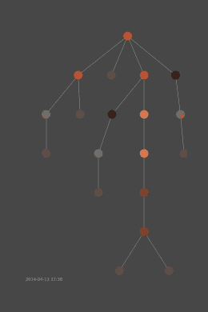

GIF from this [website](https://giphy.com/gifs/glitch-datamosh-wheredidmypostgo-HFGiruj1v3vJC)

我总是对不同类型的网络体系结构感兴趣，本文介绍了非常特殊的网络体系结构。

> **请注意，这篇帖子是为了我未来的自己回顾和复习这篇论文上的材料，而不是从头再看一遍论文。**

Paper from this [website](https://arxiv.org/pdf/1711.11503.pdf)

**摘要**

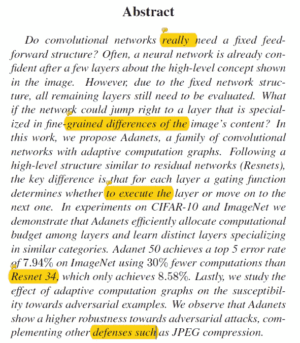

神经网络通常有一个固定的结构，但它真的必须如此吗？在某一层之后，网络可能已经非常确信它正在图像中看到一只狗或一只猫，但是由于固定的结构，它必须使用所有的层，这可能损害它的性能。本文提出了一种新的网络算法——具有自适应计算图的卷积网络。与具有较少参数的 ResNet 34 相比，它在 Imagenet 数据上实现了更好的性能，并且对对立的例子更健壮。

**简介**

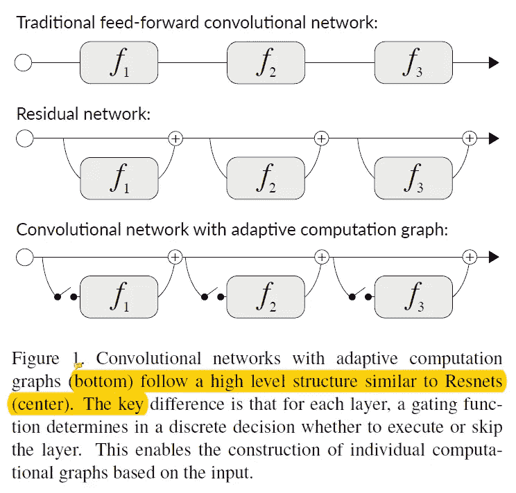

卷积神经网络不仅用于分割，还用于各种其他领域，众所周知，网络越深入，网络的性能就越好。关于这些网络的一个共同事实是，它们都是与输入图像无关的固定模型。然而，已经证明有些层对网络性能的贡献不是很大，现在要问的问题是…

我们真的需要一个固定的卷积网络结构吗？或者，我们可以根据输入动态地组装一个网络图吗？

本文提出了具有自适应计算图的卷积网络。而且大致思路可以看上面。一个挑战是，每个选通单元需要对是否使用下一层做出离散的决定，并且直接通过反向传播训练网络是困难的。因此，作者基于最近的工作，即离散随机节点的可微近似。这种架构的结果是网络的诞生，它能够为不同的高级类别生成不同的计算图。

**相关工作**

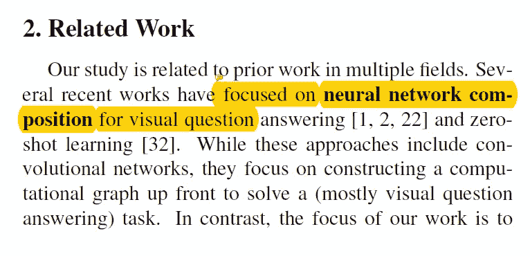

作者在这篇论文上的工作实际上涉及多个领域，如神经网络组成(通过构建计算图)、神经网络的自适应计算时间(通过动态计算时间)、带有随机噪声的正则化(通过丢弃某些层)和注意机制。(通过选择特定的重要层来组装计算图。)

**适应性** / **适应性计算图**

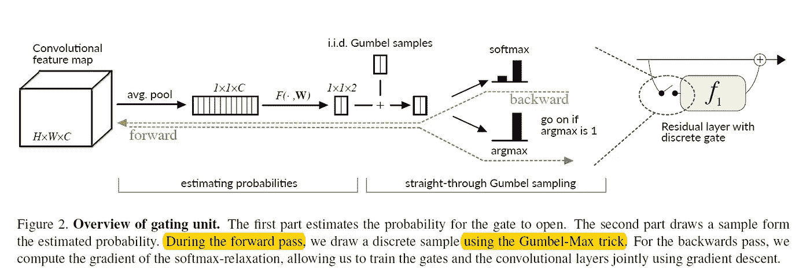

首先，每个卷积层可以用数学方法表示如下…

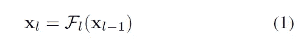

秒 resnet 可以表示如下…

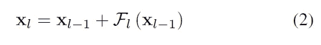

并且自适应 resnet 可以表达如下…

一个重要的注意事项是，上述公式看起来类似于高速公路网络(如下所示),但注意自适应图网络不必执行每一层。

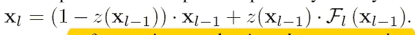

现在让我们来谈谈这个网络的核心，也就是门控单元。这个单元非常重要，因为它必须理解输入数据，进行离散决策，并且易于执行。因此，作者提出了具有两个组件的门单元，第一个组件估计下一层应该被执行的概率，第二个组件获取估计的概率并从中抽取离散样本。(大致思路见上图。)

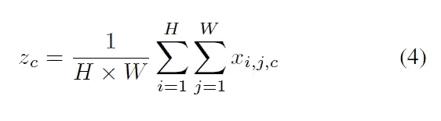

如上所述，在被传递到门单元之前，特征图通过在通道尺寸上的全局平均汇集而被缩小。(所以现在 dim 是 1*1*C)。

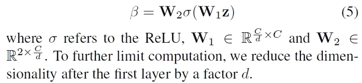

接下来，该特征图被馈送到一个小全连接网络中，以产生一个二维向量，每个向量分别代表计算和跳过下一层的对数概率。之后，他们使用 Gumbel-Max 技巧，特别是其最近的连续松弛，来执行离散操作。(是否跳层。)所以作者在这里做了一件聪明的事。(为了清楚起见，上面的 beta 项被设置为 alpha。)

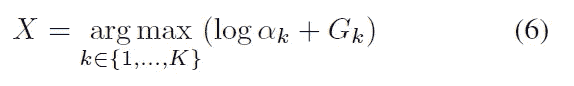

g 是一个遵循 Gumbel 分布的随机变量，在前馈操作中，它们使用上述函数。但是，在 back prop 期间，它们使用 softmax 函数。(特别是一个可微分的函数)。

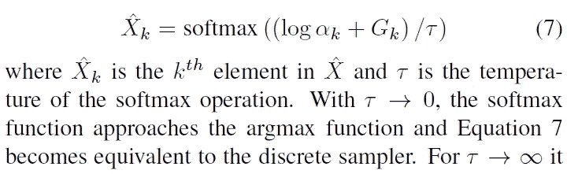

注意，如上所述，根据 T 项，softmax 函数可以被视为 argmax 函数。值得注意的是，作者只能将方程 7 用于前馈操作和反馈操作，但通过实验，他们找到了最佳配置。

**训练学员**

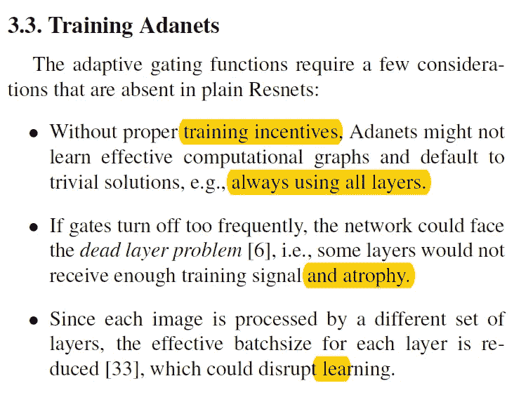

由于新颖的结构，作者不得不引入额外的损失函数。有三件事需要考虑，1)网络可能学会使用所有的层，2)一些层可能消失，3)减少批量大小。作者首先使用传统的多类逻辑损失函数，此外，他们还引入了目标率损失(见下文)函数。

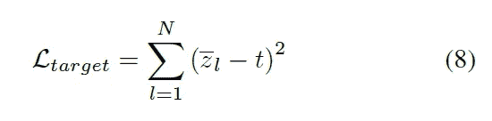

其中 z 表示层 l 在一个小批中执行的次数，t 是目标速率。因此，结合这两个损失，我们获得如下。

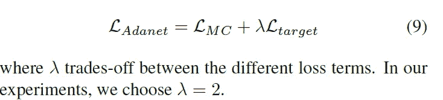

此外，为了成功训练，网络被初始化(最初)为偏向于门的打开，并且门控单元的学习速率被降低。

**实验**

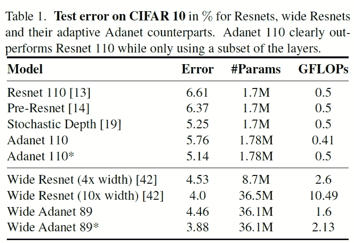

* notes Adanets in which all layers are executed and their output is scaled by the expected execution rate

作者从 Resnet 110 创建了 Adanet 以及创建了 wide Adanet，并且他们使用了权重衰减为 5e-4 的动量优化器，具有 350 个时期和 256 个小批量。如上表所示，我们可以看到，在减少计算时间的同时，改进算法能够优于不同的 Resnet 算法。

为了研究网络如何分配计算，作者绘制了不同类别图像的执行速率。从上面我们可以看到，下采样层是至关重要的，wide Adanet 显示了类之间更多的变化，这表明更多的容量可能有助于各个层专注于数据的某些子集，并且大多数类间变化来自网络的后续层。

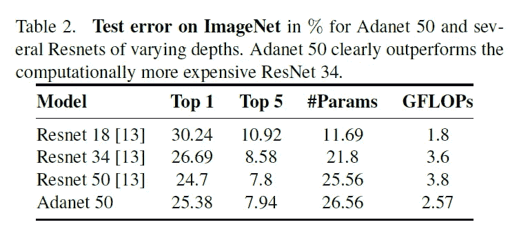

接下来，作者在 Imagenet 数据集上测试了 Adanet，如上所述，Adanet 能够降低计算成本。值得注意的是，Adanet 的性能优于 Resnet 34，Resnet 34 的参数更小，但计算代价更大。

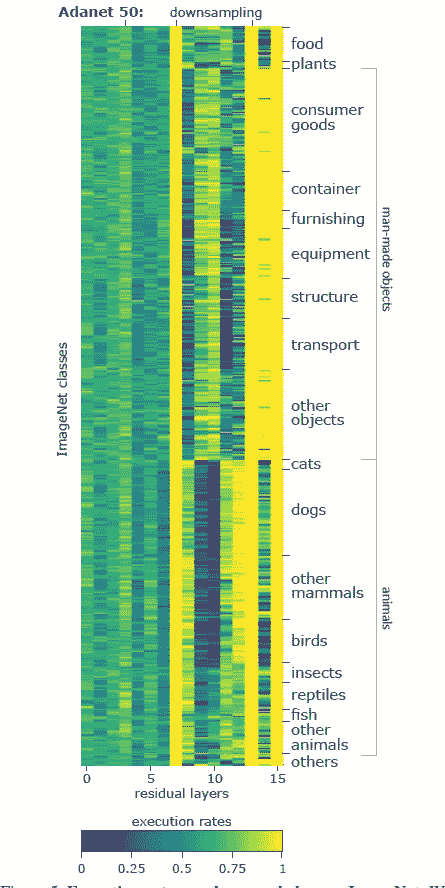

绘制执行速率图时，作者能够观察到更大范围的执行速率(第 9 层和第 10 层很少用于某些类)，下采样层/最后一层至关重要，在后面的层中，人造物体与动物的执行速率有显著差异。

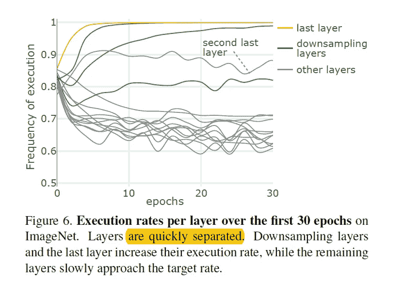

当我们绘制前 30 个时期不同层的执行率时，我们可以直接观察到这些层迅速分成关键层和不太关键的层。

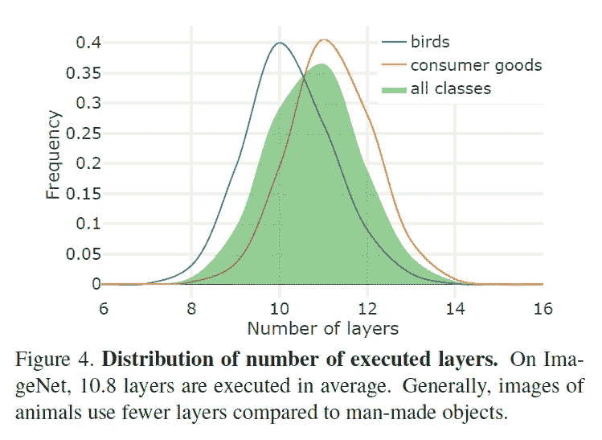

当我们绘制一个直方图，显示不同类别使用了多少层时，我们会得到类似上面的结果。平均执行 10.81 层，标准偏差为 1.11。然而，如上所述，鸟的图像比消费品的图像少用一层。(超级有趣)。

**对抗攻击的鲁棒性**

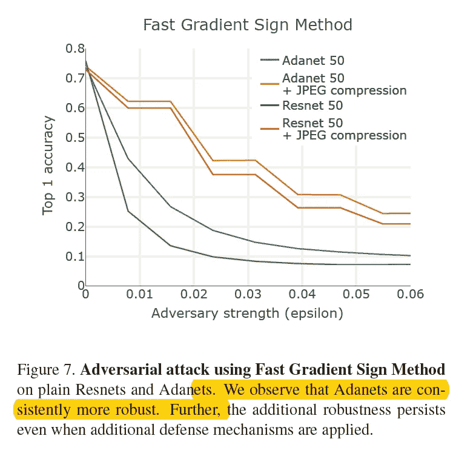

为了知道特殊化层如何执行对抗攻击的效果，作者使用快速梯度符号攻击来创建对抗示例，并将其提供给网络。(作者还对创建的对抗实例进行了 JPEG 压缩防御。).如上所述，自适应算法对常规结果更健壮。

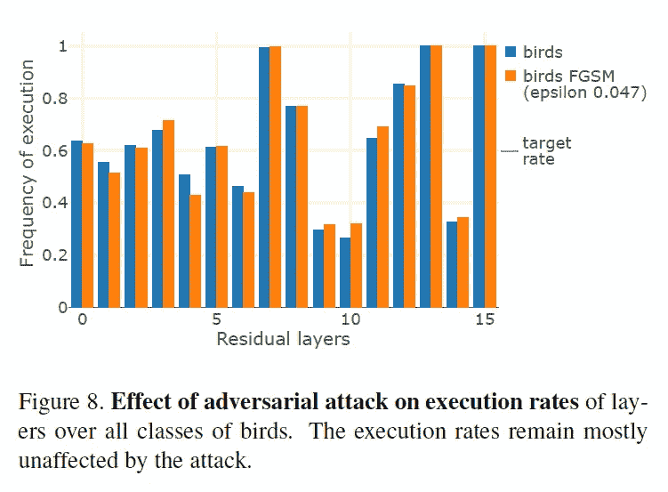

接下来，为了观察对立的例子是否影响不同层次的执行率，作者绘制了常规鸟图像和对立的鸟图像的执行率条形图。我们可以看到执行率并没有受到太大的影响。

**结论**

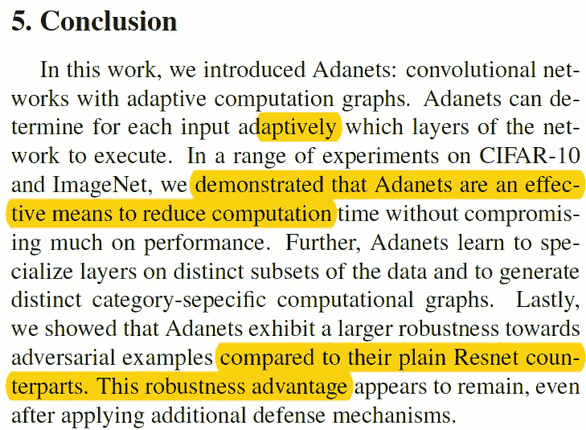

总之，本文作者介绍了一种新的网络体系结构，称为 Adanets。其具有根据输入数据学习要执行哪些层的能力。通过多次实验，作者发现这种类型的体系结构不仅性能优于常规的 resnets，而且对恶意攻击也更具鲁棒性。

**遗言**

非常聪明和新颖的建筑设计，我特别惊讶地知道网络是如何区分人造物品和动物的。

如果发现任何错误，请发电子邮件到 jae.duk.seo@gmail.com 给我，如果你想看我所有写作的列表，请[在这里查看我的网站](https://jaedukseo.me/)。

同时，在我的 twitter 上关注我[这里](https://twitter.com/JaeDukSeo)，访问[我的网站](https://jaedukseo.me/)，或者我的 [Youtube 频道](https://www.youtube.com/c/JaeDukSeo)了解更多内容。我还实现了[广残网，请点击这里查看博文](https://medium.com/@SeoJaeDuk/wide-residual-networks-with-interactive-code-5e190f8f25ec) t。

**参考**

1.  (2018).Arxiv.org。检索于 2018 年 7 月 19 日，来自[https://arxiv.org/pdf/1711.11503.pdf](https://arxiv.org/pdf/1711.11503.pdf)
2.  Veit，a .，& Belongie，S. (2017 年)具有自适应计算图的卷积网络。Arxiv.org。检索于 2018 年 7 月 19 日，来自[https://arxiv.org/abs/1711.11503](https://arxiv.org/abs/1711.11503)