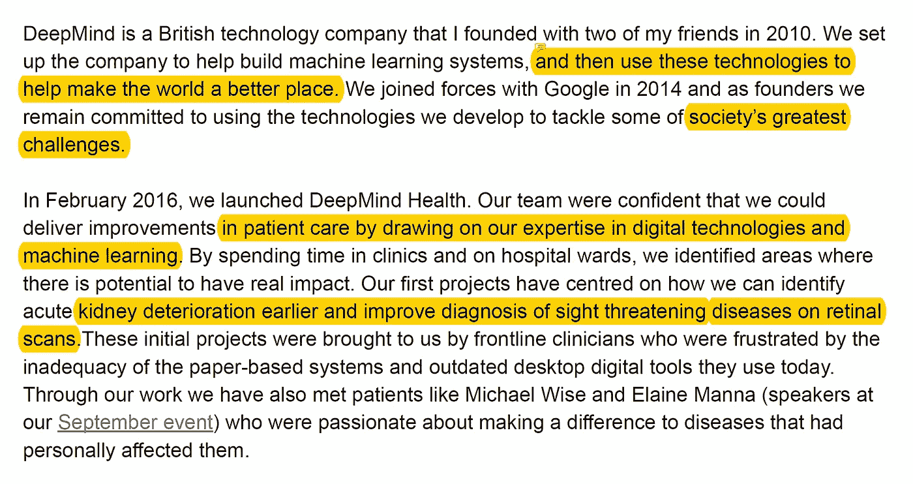
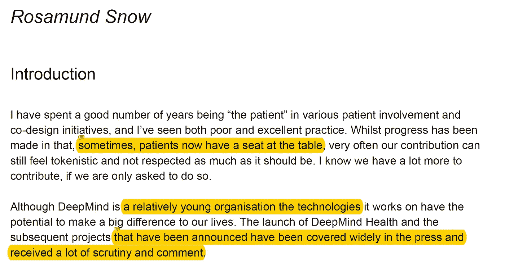
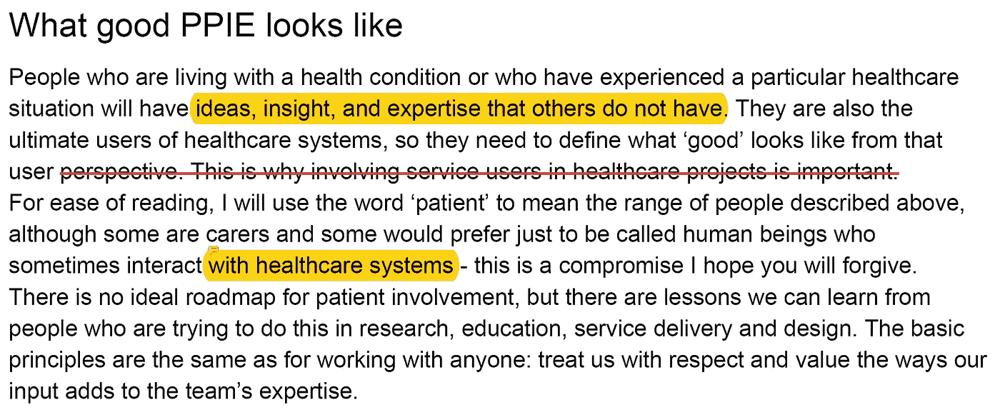
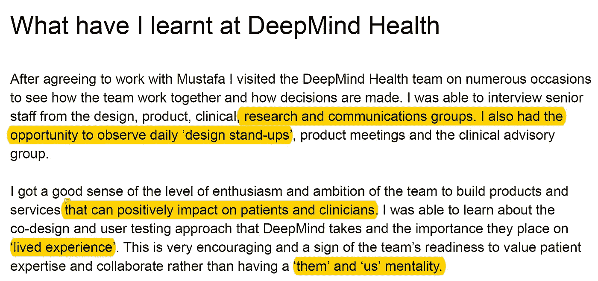
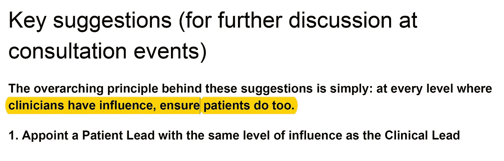

# [论文摘要]——深度思维健康:共同设计深度思维健康的患者和公众参与(PPIE)策略

> 原文：<https://towardsdatascience.com/paper-summary-deep-mind-health-co-designing-a-patient-and-public-involvement-and-engagement-75f811cb08a5?source=collection_archive---------8----------------------->

Gif from this [website](https://giphy.com/gifs/dog-kid-5UfsOgBaXNQgE/download)

我已经知道 DeepMind 的存在，任何一个人工智能迷都会知道[阿尔法围棋](https://deepmind.com/research/alphago/)，一个[阿尔法零](https://en.wikipedia.org/wiki/AlphaGo_Zero)的存在。但我想更多地了解 DeepMind 健康部门和他们的理念。所以我决定读一读它们(并总结一下)，摘自 [Mustafa Suleyman](https://twitter.com/mustafasuleymn?ref_src=twsrc%5Egoogle%7Ctwcamp%5Eserp%7Ctwgr%5Eauthor) 和 [Rosamund Snow](https://www.phc.ox.ac.uk/team/rosamund-snow) 的论文“[共同设计一个病人和公众参与 DeepMind Health](https://deepmind.com/documents/33/DMH_PPIE_recommendations.pdf) 的参与(PPIE)策略，安息吧…

请注意，这个帖子是给未来的自己看的。

**介绍信**

Deep Mind 是通过机器学习来解决社会最大的问题的，他们确实取得了一些伟大的成就。特别是[检测早期急性肾脏退化](https://deepmind.com/blog/research-department-veterans-affairs/)和提高[视网膜扫描上威胁视力疾病的诊断](https://internetofbusiness.com/deepmind-ai-eye-disease-diagnostics/)。下面是他们九月份的活动。

> **注意**这是一个两小时的视频

**简介**

许多卫生组织不接受病人的贡献。因此，当允许(并要求)患者和护理人员发表意见时，有许多领域可以改进。一个令人惊讶的事实是，即使是为了深度精神健康，当他们向世界公布他们的项目清单时，他们也受到了审查。

**PPIE 长什么样好**

就像公司试图听取客户的反馈以改进服务或产品一样，医疗保健组织也必须倾听患者(或护理人员)的意见以提高服务质量。然而，如果他们与他们的病人作为一个团队来建立它，它可能会更有效。同样，病人的意见似乎没有得到重视，确保病人得到平等对待(在许多方面)是迈向良好 PPIE 的一步。

**我在 DeepMind Health 学到了什么**

Rosamund 了解到，在 DeepMind 中，他们将患者作为一个团队来打造产品和服务。他们不是为他们而建，而是和他们一起建。然而，保持这种开放性是非常重要和具有挑战性的任务。

**主要建议(供咨询活动中进一步讨论)**

Rosamund 提出了八个可以改进的关键点，如让患者领导、创建患者小组、执行患者建议的项目以及创建患者测试小组。但是，**可以简化为一句话，“T3”在每一级临床医生都有影响力的地方，保证患者也是如此。**

**最后的话**

作为一个医生的儿子和一个经常生病的人。我真的很喜欢读这篇论文，并学到了很多东西。

如果你想看我所有作品的列表，请点击这里查看我的网站。

同时，在我的 twitter [这里](https://twitter.com/JaeDukSeo)关注我，并访问[我的网站](https://jaedukseo.me/)，或我的 [Youtube 频道](https://www.youtube.com/c/JaeDukSeo)了解更多内容。我还对医学图像进行了分割，在这里查看一下。

**参考**

1.  AlphaGo Zero。(2018).En.wikipedia.org。检索于 2018 年 4 月 6 日，来自[https://en.wikipedia.org/wiki/AlphaGo_Zero](https://en.wikipedia.org/wiki/AlphaGo_Zero)
2.  AlphaGo | DeepMind。(2017).深度思维。2018 年 4 月 6 日检索，来自[https://deepmind.com/research/alphago/](https://deepmind.com/research/alphago/)
3.  与美国退伍军人事务部一起研究病人病情恶化。(2018).深度思维。检索于 2018 年 4 月 6 日，来自[https://deep mind . com/blog/research-department-veterans-affairs/](https://deepmind.com/blog/research-department-veterans-affairs/)
4.  霍布斯，A. (2018)。一只眼睛的人工智能:DeepMind 专注于眼疾诊断|商业互联网。商业互联网。检索于 2018 年 4 月 6 日，来自[https://internetofbusiness . com/deep mind-ai-eye-disease-diagnostics/](https://internetofbusiness.com/deepmind-ai-eye-disease-diagnostics/)
5.  DeepMind Health 患者和公众参与活动。(2018).YouTube。检索于 2018 年 4 月 6 日，来自[https://www.youtube.com/watch?v=wBfBiD38x34](https://www.youtube.com/watch?v=wBfBiD38x34)