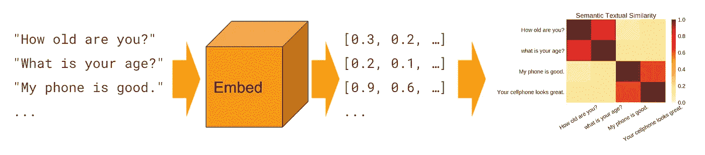
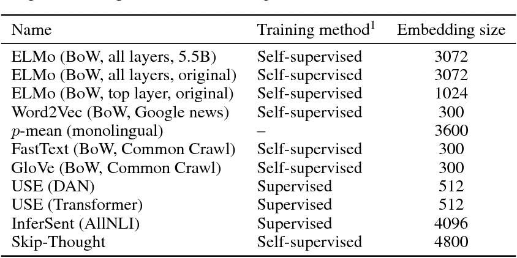
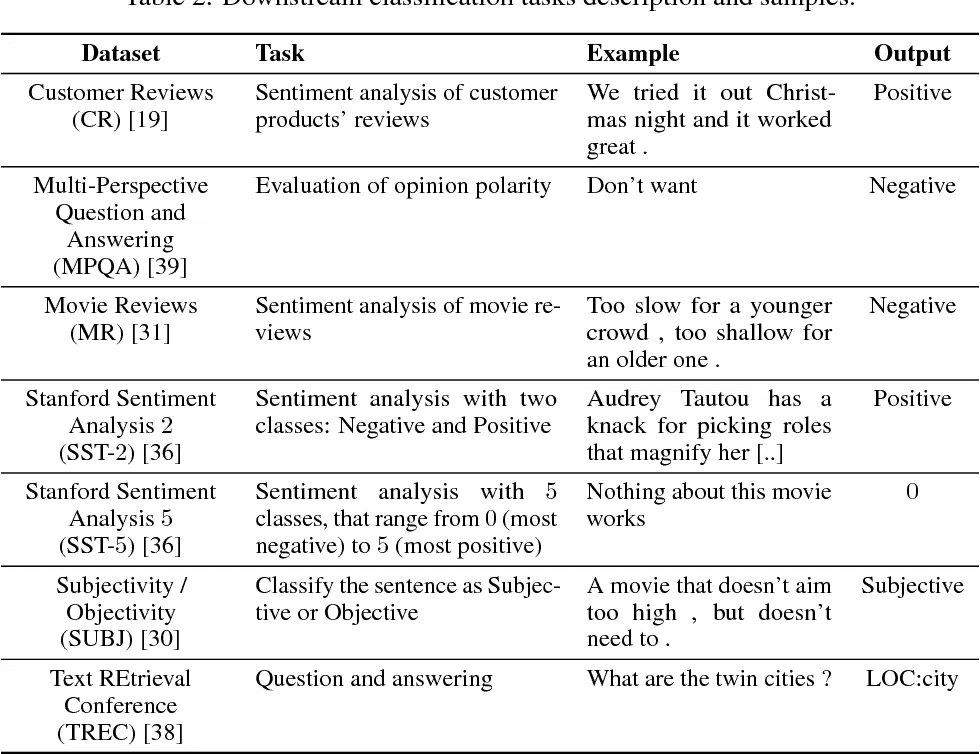
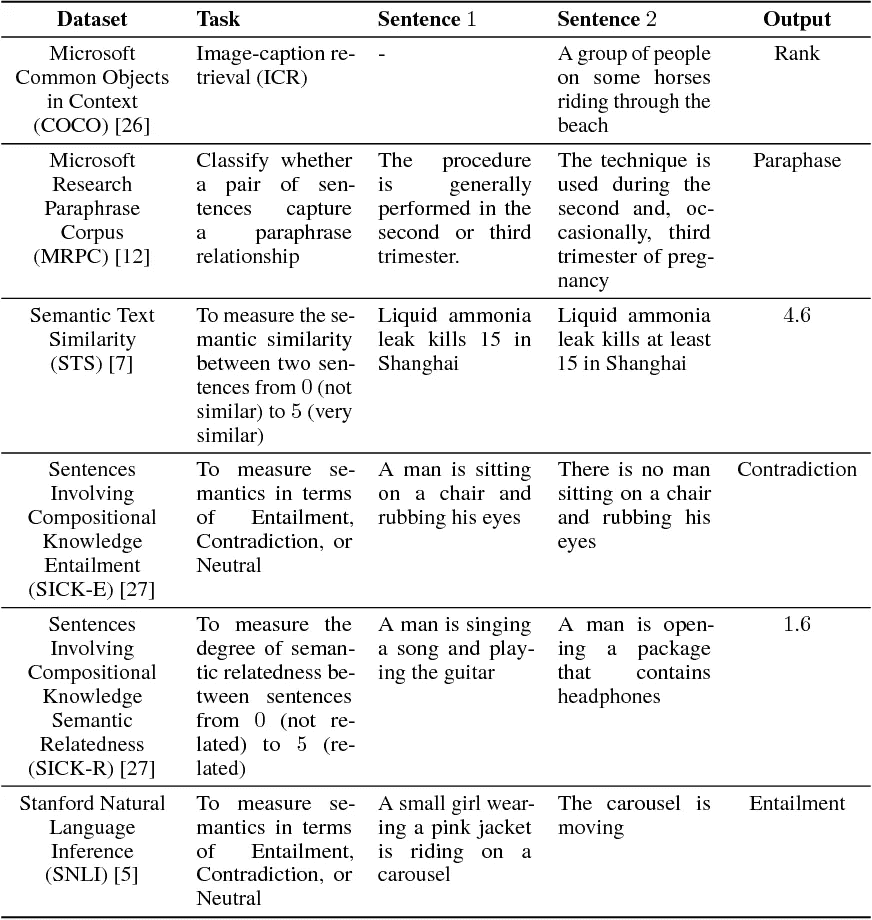
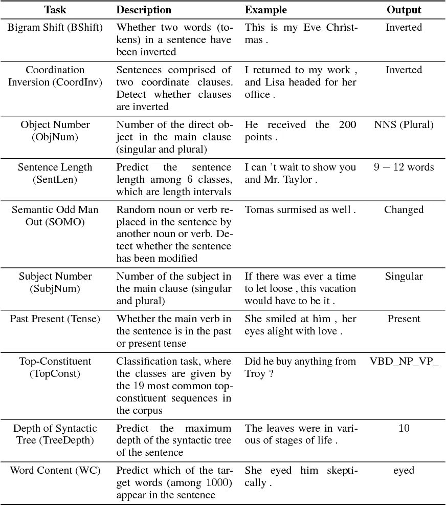
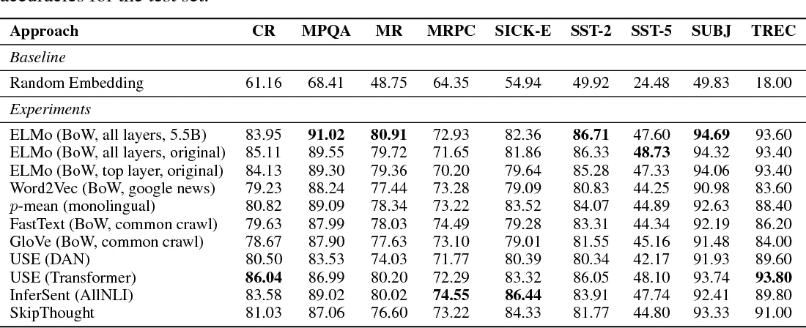
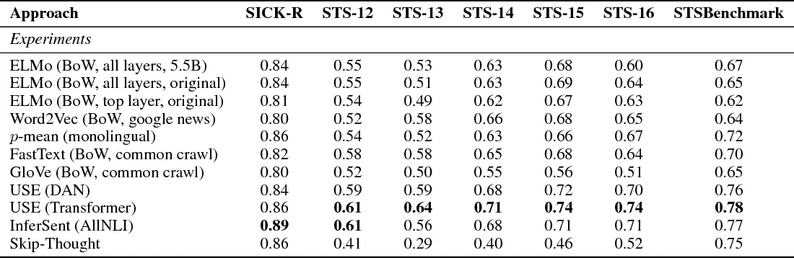
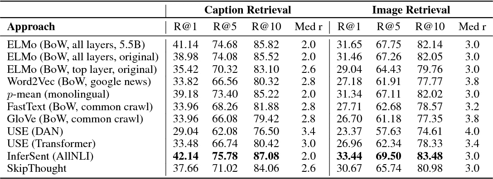
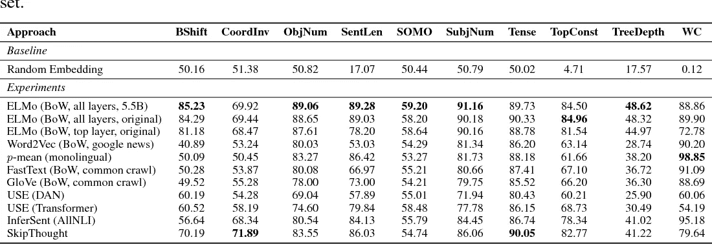

# 论文摘要:对下游和语言探测任务中句子嵌入的评估

> 原文：<https://towardsdatascience.com/paper-summary-evaluation-of-sentence-embeddings-in-downstream-and-linguistic-probing-tasks-5e6a8c63aab1?source=collection_archive---------5----------------------->

## 分解一篇论文，分解不同句子嵌入的一些利弊

# 一句话嵌入什么？

不久前，我写了一篇关于[单词嵌入](/introduction-to-word-embeddings-4cf857b12edc)的文章，介绍了我们为什么使用单词嵌入以及一些不同类型的单词嵌入。我们可以把句子嵌入看作是提取的下一个层次:句子的数字表示！

但是就像我们不想用简单的数字表示单词一样，我们也希望我们的句子表示包含丰富的含义。我们希望他们能对词序、时态和意义的变化做出反应。

这是一项艰巨的任务！有一些方法可以做到这一点，但是最近，[“下游和语言探测任务中的句子嵌入评估”](https://arxiv.org/pdf/1806.06259.pdf)决定尝试解开“句子嵌入中有什么？”这个问题在这篇文章中，他们不仅研究了差异句子表征在受益于句子表征的下游任务中的表现，还研究了在纯语言任务中的表现(根据语言特征和规则显示句子智能表征的任务)。

这篇论文就是我们在本帖中解剖的！

# 不同的句子表征

那么评估了哪些表示呢？

*   ELMo (BoW，all layers，5.5B):来自 [AllenNLP](https://allennlp.org/elmo) ，这是预先训练好的 ELMo 嵌入。这是在 5.5 亿单词语料库(维基百科和单语新闻抓取的组合)上训练的英语表示。因为 ELMo 有两层，所以这种表示是总共 3072 个维度的所有层输出。ELMo 只是一个单词嵌入，所以这种表示是通过将所有单词平均在一起为句子创建的。
*   ELMo (BoW，all layers，original):ELMo 的另一个变体，但只是在新闻抓取方面受过训练。同样，它的维度为 3072。
*   ELMo (BoW，顶层，原始):ELMo 的另一个变体，只有最终输出。这个嵌入只有 1024 维。
*   快速文本(鞠躬，普通爬行):从脸书，我们得到[快速文本](https://fasttext.cc/docs/en/english-vectors.html)。我之前的单词嵌入谈到了为什么 FastText 非常棒，但是因为它只是单词嵌入，所以通过对所有单词进行平均，这些被转换为句子嵌入。它有 300 个维度。
*   GloVe (BoW，Common Crawl): [GloVe](https://nlp.stanford.edu/projects/glove/) ，像其他单词嵌入一样平均在一起。它有 300 个维度。
*   Word2Vec (BoW，Google News): [Word2Vec](https://code.google.com/archive/p/word2vec/) ，一起平均。它有 300 个维度。
*   p-mean(单语):一种不同的单词平均方式， [p-mean](https://github.com/UKPLab/arxiv2018-xling-sentence-embeddings) 可通过 TensorFlow Hub 获得。然而维度是巨大的，达到 3600。
*   跳过思考:我们看到的第一个实际的句子嵌入。[Skip-think](https://github.com/ryankiros/skip-thoughts)使用 word2vec 方法根据当前句子预测周围的句子。这是通过编码器-解码器架构实现的。这是我们最大的代表，有 4800 个维度。
*   InferSent (AllNLI):脸书训练的另一组嵌入， [InferSent](https://github.com/facebookresearch/InferSent) 使用语言推理的任务进行训练。这是一个数据集，其中两个句子放在一起，模型需要推断它们是矛盾的，中性的配对，还是蕴涵。输出是 4096 维的嵌入。
*   USE (DAN): Google 的基本通用句子编码器(USE)，通过 TensorFlow Hub 可以获得[深度平均网络(DAN)](https://www.tensorflow.org/hub/modules/google/universal-sentence-encoder/1) 。使用 512 维的输出向量。
*   使用(变压器):最后，谷歌的重型使用，基于[变压器网络](https://www.tensorflow.org/hub/modules/google/universal-sentence-encoder-large/1)。使用 512 维的输出向量。

模型的训练和维度总结如下:

# 下游任务

本文的下游任务取自 [SentEval](https://github.com/facebookresearch/SentEval) 包。它们以五组任务为特色，这些任务被确定为对句子嵌入有帮助的关键任务。这五个组是:二元和多类分类、蕴涵和语义相关度、语义文本相似度、释义检测和字幕图像检索。

这些类别给出了我们试图使用这些嵌入的任务类型的见解(如果你好奇，你应该检查一下这个包)，然而，它们包含了所有经典的任务，如情感分析、问题类型分析、句子推理等等。

分类任务的完整列表及示例可在此处查看:

和语义相关的任务可以在这里看到:

为了评估这些嵌入的好处，使用了简单的模型。这意味着具有 50 个神经元的简单多层感知器、逻辑回归或其他非常基本的模型。这里没有花哨的 CNN。没有 RNNs。只是一些基本的模型来看看这些表现如何公平。

# 语言任务

同样取自 SentEval，有 10 个探测任务被用来评估句子嵌入的不同语言特性。这些很酷。他们是:

*   二元移位:两个词是否颠倒
*   坐标倒置:给定两个坐标从句，它们是否倒置？
*   宾语号:宾语是单数还是复数？
*   句子长度
*   语义奇数人出:随机名词/动词可能被替换。检测它是否已经。
*   主语号:主语是单数还是复数？
*   过去时:主要动词是过去时还是现在时？
*   顶层成分:顶层语法模式的类别是什么？
*   语法树的深度:被解析的语法树有多深？
*   单词内容:句子中编码了一千个单词中的哪一个？

这里的想法是，句子嵌入不仅应该在下游任务中表现良好，它还应该编码这些关键的语言属性，因为它们将有助于产生智能和可解释的嵌入！

下表总结了这一切:

# 结果呢？？？

嗯…没有明显的赢家！

ELMo 在 5/9 的任务中表现最好。USE 在产品审查和问题分类任务中表现出色。InferSent 在释义检测和推断任务上表现出色。

虽然 p-mean 没有超过顶级表现者，但它确实超过了所有基线单词嵌入，如 word2vec、GloVe 和 FastText。

以下是分类的下游结果:

和语义相关度:

信息检索是另一个大测试(根据前 n 名中检索到多少正确结果来评分，其中 n 是一个整数)。InferSent 实际上表现最好，尽管 ELMo 和 p-mean 是其他势均力敌的竞争者:

至于语言探索，ELMo 又一次表现得很好，尽管其他表现也没有落后太多。所有语言探索任务的结果可以在这里看到:

那么这意味着什么呢？正如作者所说，这意味着我们还没有真正拥有一个坚实的通用句子编码器。没有一个句子嵌入在每项任务中都表现最佳，我们仍然可以通过语言探索和测试学到很多东西。

对我来说，这意味着这个领域仍然是成熟的探索！我们还没有实现一个奇妙的句子嵌入，尽管这些都是可靠的模型。现在轮到我们走出去，尝试我们自己的嵌入想法的句子了！

如果你喜欢这篇文章或者觉得它有任何帮助，为什么不发给我一两美元来资助我的机器学习教育和研究呢！每一美元都让我离成功更近一步，我永远心存感激。

*原载于*[T5【hunterheidenreich.com】](http://hunterheidenreich.com/blog/comparing-sentence-embeddings/)*。*