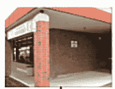
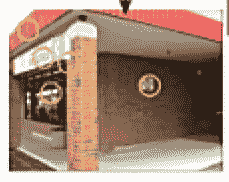
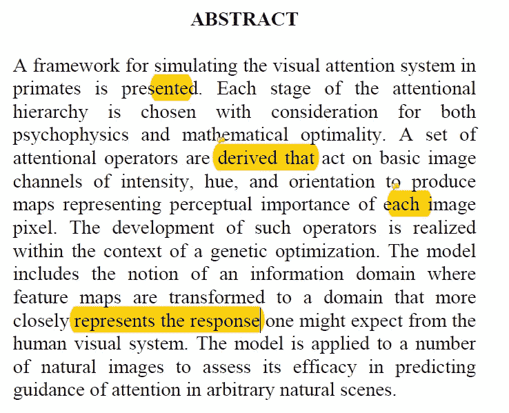
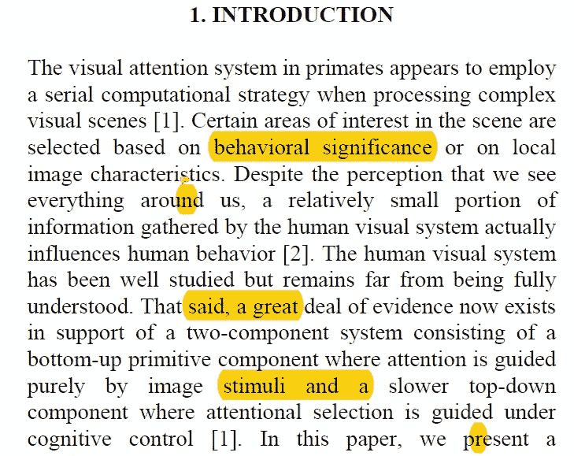
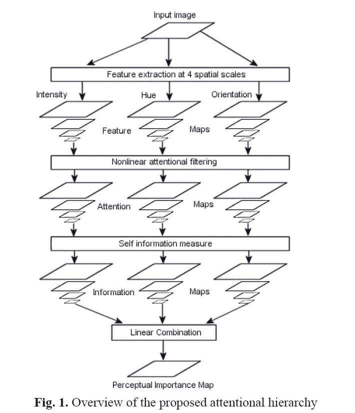
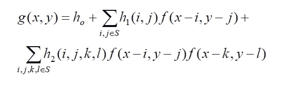
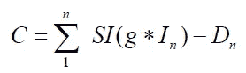
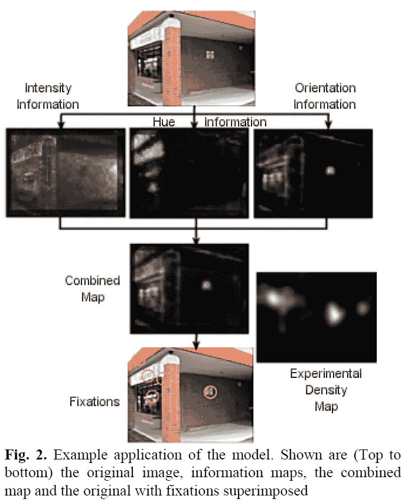
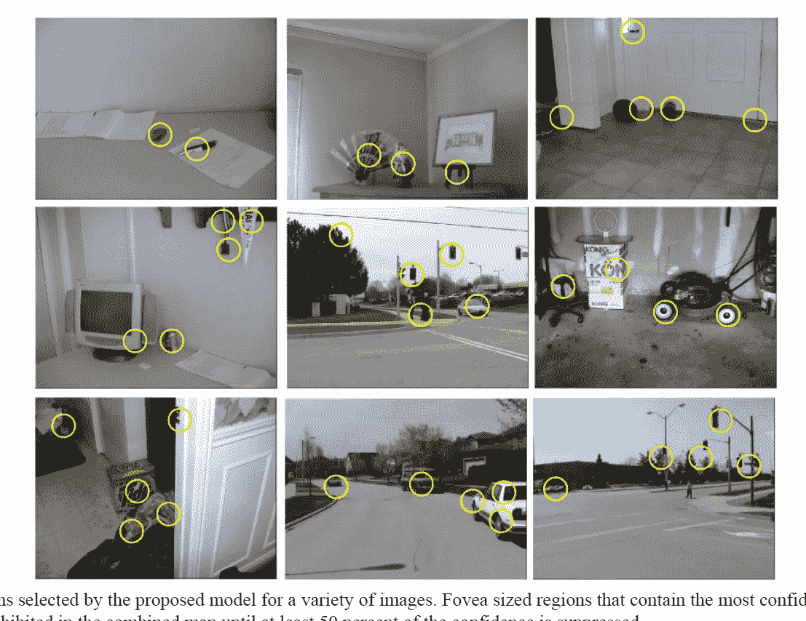
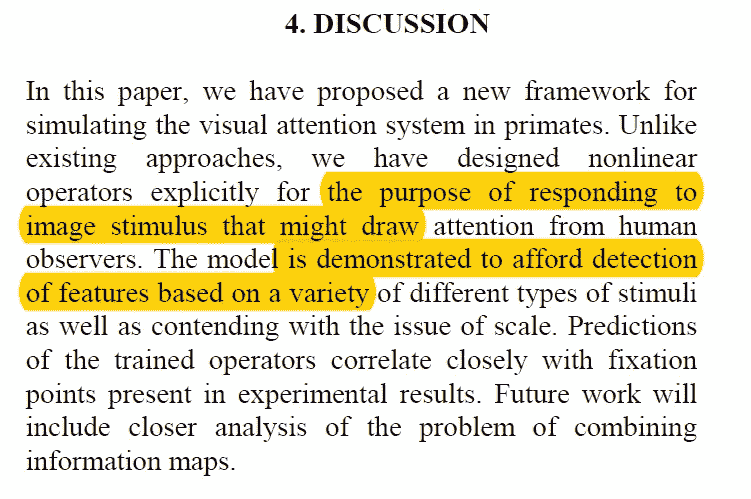

# [论文摘要]上下文无关注意算子的进化设计

> 原文：<https://towardsdatascience.com/paper-summary-evolutionary-design-of-context-free-attentional-operators-85b0cc2df9cd?source=collection_archive---------11----------------------->

GIF from this [website](https://giphy.com/gifs/cat-lasers-laser-pointer-3oEjIacPJYAJubIDLO)

让我们做一个简单的实验，见下图。

你的眼睛最关注哪个区域？蓝色的商店标志还是电话亭？甚至棕色的墙壁。向下滚动一点，我给你看另一张图片……

更多

更多

更多

更多

更多

是你眼睛最关注的圆圈区域吗？对我来说肯定是。我们关注这些地区有什么原因吗？我们能预测人类会最关注哪个区域吗？甚至围绕它开发一个框架？本文提出了一个示例框架。

Paper from this [website](http://www-sop.inria.fr/members/Neil.Bruce/ICIPnbruce.pdf)

**摘要**

在这篇论文中，作者介绍了一个模仿灵长类动物视觉注意系统的框架。这个框架不仅考虑了心理物理学方面的原因，也考虑了数学方面的原因。通过应用一组注意力算子，每个图像被转换成表示该图像的感知重要性的图。

**简介**

当我们看一幅图像，(或一个场景)时，我们认为我们在看一切，但我们真的不是。我们周围的信息中只有很少一部分能真正解释我们的行为。目前，我们有大量的证据支持引导我们视觉注意系统的双组分系统。

**1。自下而上的图元组件** →纯图像刺激
**2。自上而下组件** →认知控制

在本文中，作者将模拟一个自下而上的注意系统。在这个主题上已经有了先前的工作，例如选择性视觉注意力的' [*'转移:朝向潜在的神经回路*](https://cseweb.ucsd.edu/classes/fa09/cse258a/papers/koch-ullman-1985.pdf) '或用于定义视觉感兴趣区域的' [*算法:与眼睛注视*](https://ieeexplore.ieee.org/document/877520/) 的比较。一个有趣的发现是，图像局部中特定特征的强度本身并不能保证人们的注意力会被吸引到该图像区域。例如，如果一幅图像有很大的变化，那么我们将主要关注同质区域，即变化较少的区域。所以换句话说，彼此不同的区域会获得人类更多的关注。最后，虽然有不同的方法来模仿人类的视觉注意机制，但似乎有一个重叠的区域，在那里他们开始从给定的图像中提取较低层次的特征。

**型号**

在本节中，作者描述了该模型的 4 个关键组成部分。

1.  RGB 图像被分为强度/色调/方向通道(这是通过应用[方向的 Gabor 滤波器](https://en.wikipedia.org/wiki/Gabor_filter)完成的)。)
2.  非线性滤波运算符，用于响应引起更多关注的信号。(这些滤波器是通过随机搜索由局部范围的[二次](https://www.researchgate.net/post/how_are_volterra_filters_applied_to_images)沃尔泰拉滤波器组成的函数空间找到的。)和过滤器的结构可以在下面看到。

其中 S 代表滤波器起作用的区域。h 的参数通过遗传算法优化确定。看到成本函数

SI → [香农自我信息测度](https://en.wikipedia.org/wiki/Self-information)
D →图像 I 对应的实验密度图

3.信息操作者接受高级特征，并将其放入更准确地反映人类视觉系统可能预期的响应的域中。

4.将每个通道的平均运算转换为一个单一输出。

这种架构不同于其他架构的原因是 1)定制过滤器的训练和 2)包含信息操作符。

**结果**

如上所述，我们可以看到该模型运行良好，并对人类可能最关注的地方做出了很好的预测。黄色圆圈代表置信度最高的地方，下面是不同图像的结果。

**讨论**

这篇论文的作者能够成功地创建一个模仿人类视觉注意系统的模型。

**最后的话**

这篇论文令人印象深刻的一点是，这篇论文发表于 2003 年，当时深度学习甚至还不存在。但是如果你观察这个模型，你会发现它非常像一个卷积神经网络。

如果发现任何错误，请发电子邮件到 jae.duk.seo@gmail.com 给我，如果你想看我所有写作的列表，请在这里查看我的网站。

同时，在我的 twitter 上关注我[这里](https://twitter.com/JaeDukSeo)，访问[我的网站](https://jaedukseo.me/)，或者我的 [Youtube 频道](https://www.youtube.com/c/JaeDukSeo)了解更多内容。我还实现了[广残网，请点击这里查看博文](https://medium.com/@SeoJaeDuk/wide-residual-networks-with-interactive-code-5e190f8f25ec) t。

**参考**

1.  (2018).Www-sop.inria.fr .于 2018 年 6 月 26 日检索，来自[http://www-sop.inria.fr/members/Neil.Bruce/ICIPnbruce.pdf](http://www-sop.inria.fr/members/Neil.Bruce/ICIPnbruce.pdf)
2.  (2018).Cseweb.ucsd.edu。检索于 2018 年 6 月 27 日，来自[https://CSE web . ucsd . edu/classes/fa09/CSE 258 a/papers/Koch-ull man-1985 . pdf](https://cseweb.ucsd.edu/classes/fa09/cse258a/papers/koch-ullman-1985.pdf)
3.  Gabor 滤波器。(2018).En.wikipedia.org。检索于 2018 年 6 月 27 日，来自[https://en.wikipedia.org/wiki/Gabor_filter](https://en.wikipedia.org/wiki/Gabor_filter)
4.  5 个非线性滤波器。(2018).Dspalgorithms.com。检索于 2018 年 6 月 27 日，来自[https://www.dspalgorithms.com/aspt/asptnode24.html](https://www.dspalgorithms.com/aspt/asptnode24.html)
5.  (2018).[在线]见:[https://www . research gate . net/post/how _ are _ Volterra _ filters _ applied _ to _ images](https://www.researchgate.net/post/how_are_volterra_filters_applied_to_images)【2018 年 6 月 27 日访问】。
6.  自我信息。(2018).En.wikipedia.org。检索于 2018 年 6 月 27 日，来自[https://en.wikipedia.org/wiki/Self-information](https://en.wikipedia.org/wiki/Self-information)