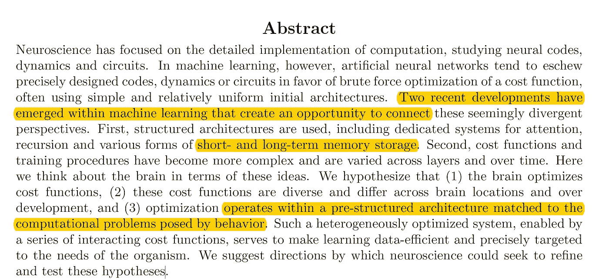
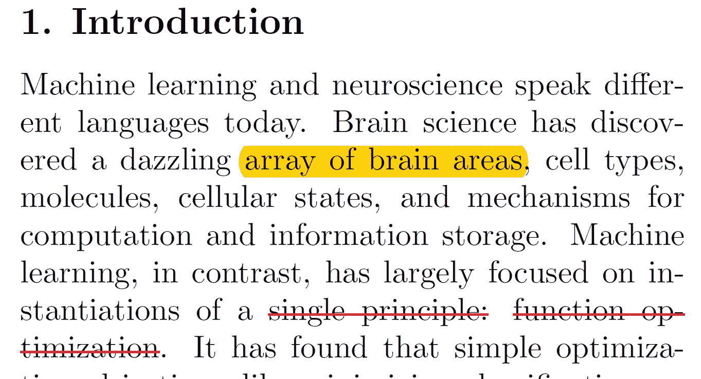
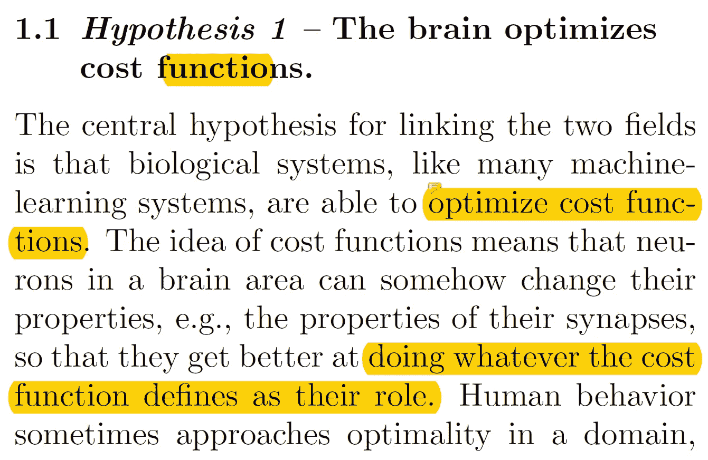
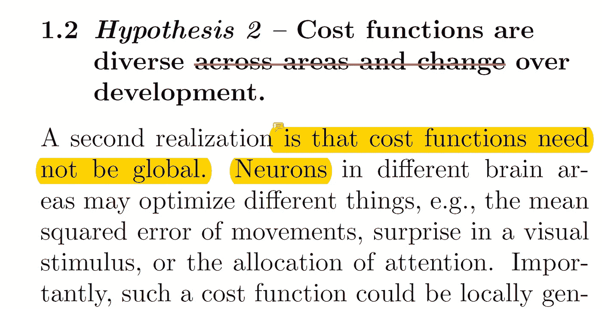
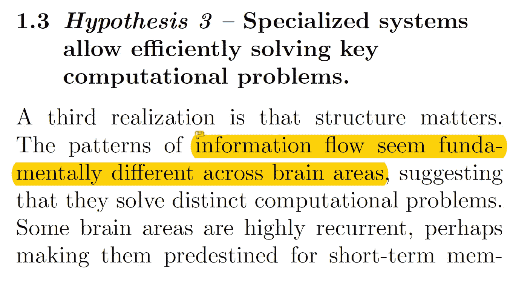
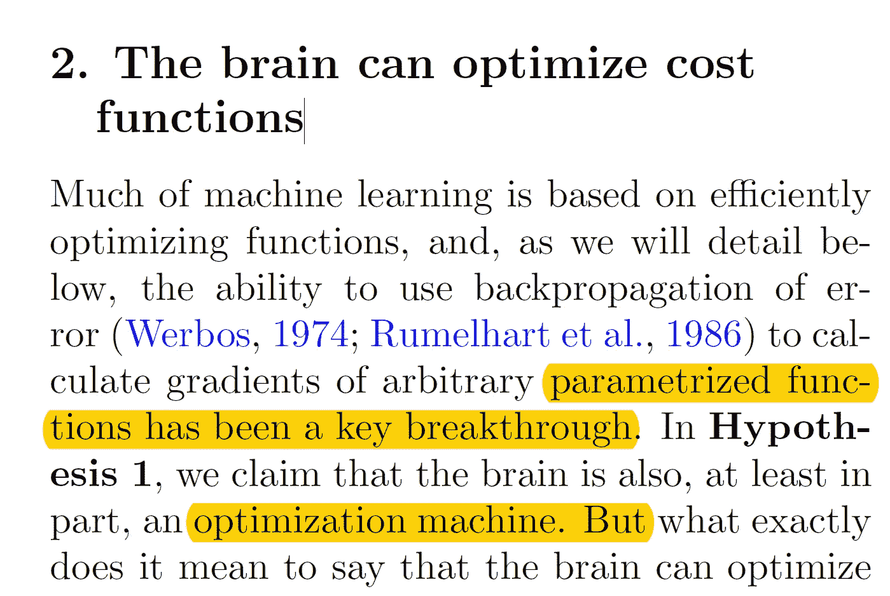

# [论文摘要]Google Deep Mind——走向深度学习和神经科学的整合——第 1 部分

> 原文：<https://towardsdatascience.com/paper-summary-google-deep-mind-towards-an-integration-of-deep-learning-and-neuroscience-240b7624c57f?source=collection_archive---------8----------------------->

Gif from [here](https://giphy.com/gifs/space-stars-xUA7aW1ddSxtVT5zzi/download)

谷歌，深度思维，精英中的精英。我们这一代最具创新性的人工智能研究实验室之一。他们有惊人的出版物。今天，我将尝试对他们的论文“ [*走向深度学习和神经科学的融合*](https://www.biorxiv.org/content/early/2016/06/13/058545) e”做一个一到两句话的总结。另外，请注意这篇论文有 60 页，所以我需要把这篇总结分成几篇文章。

请注意这篇文章是给未来的我看的。

**摘要**

由于更复杂的机器学习模型以及复杂的成本函数的发展，现在有可能弥合机器学习和神经科学之间的差距。

**简介**

作者再次声明神经科学和计算机科学之间存在脱节。且继续陈述机器学习中三个发展 1)成本函数优化 2)更复杂的成本函数的发展 3)更复杂的网络架构的发展现在可以帮助弥合该差距，并且引入三个假设。

**1.1 假设 1——大脑优化成本函数。**

人类之间优化的一个例子可以是简单的移动，作者认为，人类已经进化到优化能源消耗，同时最大化财务和移动收益。这种机制也适用于机器。

**1.2 假设 2-成本函数因地区而异，并随着发展而变化。**

这里的主要思想是成本函数不必是全局的。我们的大脑可能会使用均方差来优化运动时的能量消耗。但是同一个大脑可能使用类似于 softmax 的具有交叉熵损失的成本函数来进行分类。这种专业化成本函数的混合可以使学习更有效率。

**1.3 假设 3-专用系统允许有效解决关键计算问题。**

这部分挺长的，但是本质上…
1。大脑的不同部分做不同的事情(例如[丘脑](https://www.news-medical.net/health/What-is-the-Thalamus.aspx)大脑的一部分可能充当信息路由门，而像[基底神经节](https://en.wikipedia.org/wiki/Basal_ganglia)这样的区域帮助做出离散的决策)因此，开发不同结构的机器学习模型对于效率来说是至关重要的(LSTM、RNN、CNN 等)。

2.然而，人类的大脑是非常特殊的，因为即使世界给了我们有限的标记数据，我们也能够学习差异并正确地区分彼此。现有的无监督学习算法没有一个能做我们人类做的事情。(截至今日)

3.因此，找到正确的成本函数序列是非常重要的，可以根据该序列训练无监督模型以提供正确的行为。

**2。大脑可以优化成本函数**

作者声称，我们可以将大脑视为一台优化机器，它可以为不同的任务提供不同的成本函数。同时优化学习过程中的每个成本函数。这些复杂成本函数中的一些可以是反向传播、[尖峰时序相关可塑性](https://en.wikipedia.org/wiki/Spike-timing-dependent_plasticity)、[树枝状计算](https://neurophysics.ucsd.edu/courses/physics_171/annurev.neuro.28.061604.135703.pdf)和[局部兴奋-抑制网络](https://ocw.mit.edu/courses/brain-and-cognitive-sciences/9-641j-introduction-to-neural-networks-spring-2005/lecture-notes/lec14_excinh.pdf)，或者可以导致比任何优化算法更强大的学习过程的任何其他优化函数。

**遗言**

现在，我就讲到这里，因为我还有一些作业要交，但是我很快会回到这篇论文上来。抱歉，帖子写得很短。

**参考**

1.  马布尔斯通，A. H .，韦恩，g .，&科丁，K. P. (2016)。走向深度学习和神经科学的融合。*计算神经科学前沿*， *10* ，94。
2.  基底神经节。(2018).En.wikipedia.org。于 2018 年 4 月 3 日检索，来自[https://en.wikipedia.org/wiki/Basal_ganglia](https://en.wikipedia.org/wiki/Basal_ganglia)
3.  安纳亚·曼达尔博士，硕士(2010 年)。丘脑是什么？。News-Medical.net。检索于 2018 年 4 月 3 日，来自[https://www . news-medical . net/health/What-is-the-cathamus . aspx](https://www.news-medical.net/health/What-is-the-Thalamus.aspx)
4.  锋电位时间依赖性可塑性。(2018).En.wikipedia.org。检索于 2018 年 4 月 3 日，来自[https://en . Wikipedia . org/wiki/Spike-timing-dependent _ plasticity](https://en.wikipedia.org/wiki/Spike-timing-dependent_plasticity)
5.  (2018).Neurophysics.ucsd.edu。检索于 2018 年 4 月 3 日，来自[https://neuro physics . ucsd . edu/courses/physics _ 171/annurev . neuro . 28.061604 . 135703 . pdf](https://neurophysics.ucsd.edu/courses/physics_171/annurev.neuro.28.061604.135703.pdf)
6.  (2018).Ocw.mit.edu。检索于 2018 年 4 月 3 日，来自[https://OCW . MIT . edu/courses/brain-and-cognitive-sciences/9-641j-introduction-to-neural-networks-spring-2005/lecture-notes/le C14 _ ex cinh . pdf](https://ocw.mit.edu/courses/brain-and-cognitive-sciences/9-641j-introduction-to-neural-networks-spring-2005/lecture-notes/lec14_excinh.pdf)