# 【论文摘要】Google deep mind——使用机器学习技术对计算机视觉的视网膜成像进行自动分析

> 原文：<https://towardsdatascience.com/paper-summary-google-deepmind-automated-analysis-of-retinal-imaging-using-machine-learning-17e61b2adc70?source=collection_archive---------6----------------------->

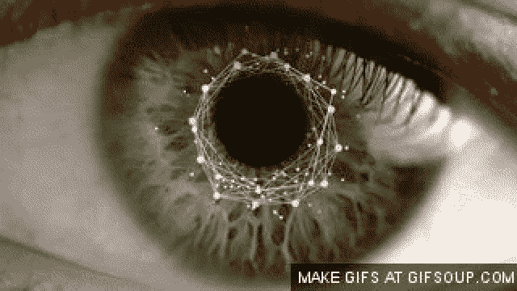

Gif form this [website](https://giphy.com/gifs/scan-Leowp0GClCIH6/download)

我发现了另一篇很棒的论文，来自《深度精神健康》,我想更深入地研究这篇论文，同时将每一部分总结成一两句话。这也被媒体以“ [*谷歌 DeepMind 正在资助 Moorfields 眼科医院* l](http://uk.businessinsider.com/deepmind-is-funding-nhs-research-2017-7) 的 NHS 研究”的标题报道。

请注意，这个帖子是为了我未来的自己回顾和审查材料。

**摘要**

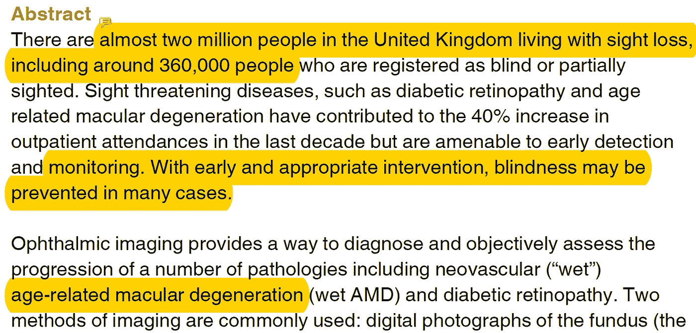

有成千上万的英国人正在失明，而患有糖尿病等疾病会使患者失明的几率增加 40%。医生要么使用[眼底](https://en.wikipedia.org/wiki/Fundus_photography)的数码照片，要么使用[光学相干断层扫描](https://en.wikipedia.org/wiki/Optical_coherence_tomography)获取视网膜图像并做出诊断。

**背景**

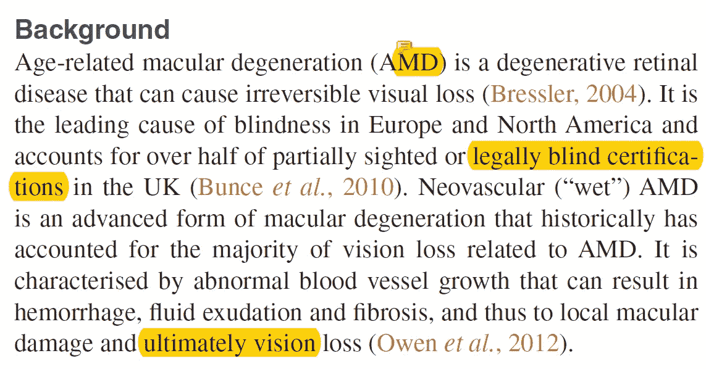

作者再次指出，由于[年龄相关性黄斑变性](https://en.wikipedia.org/wiki/Macular_degeneration)，有许多人失明。在那里，作者描述了机器学习取得的进展，并举例说明了这些算法如何积极地有益于医疗保健(例如，“ [*”大脑表达的外显子在纯化选择下富集了自闭症谱系障碍中的从头突变)。*](https://www.ncbi.nlm.nih.gov/pubmed/24859339) ”)。最后讨论了历史和在 [Moorfields 眼科医院的治疗质量。](https://www.moorfields.nhs.uk/)

**目的和目标**

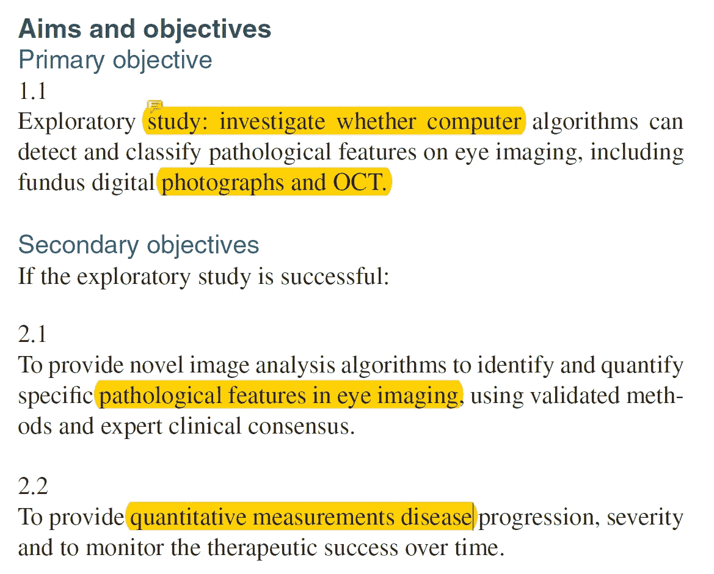

这项研究的目标再清楚不过了。
1。研究计算机算法是否可以检测/分类病理特征

如果达到了上述目标并取得了成功的结果…
2。提供识别和分析某些病理特征的新算法
3。提供监测和分析，直到疾病得到治疗。

**研究设计(纳入/排除标准)**

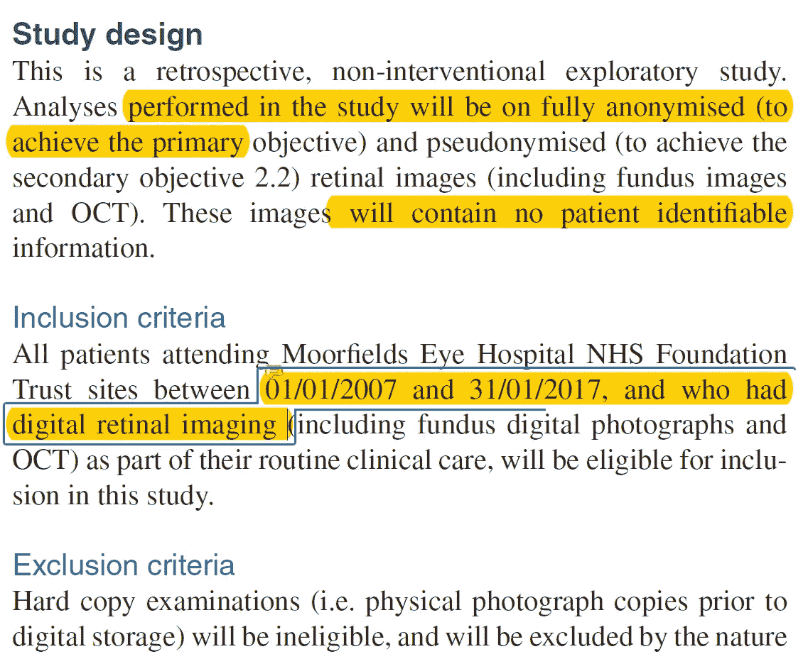

作者多次指出，所有将在这项研究中使用的数据都将在一切之前去人格化。(因此无法识别病人。)作者还指出，除非患者明确说明，否则在 2007 年 1 月 1 日至 2017 年 1 月 31 日期间访问 Moorfields 眼科医院并进行眼部检查的患者的所有数据都将包含在本研究中。

**研究设计(样本量/数据)**

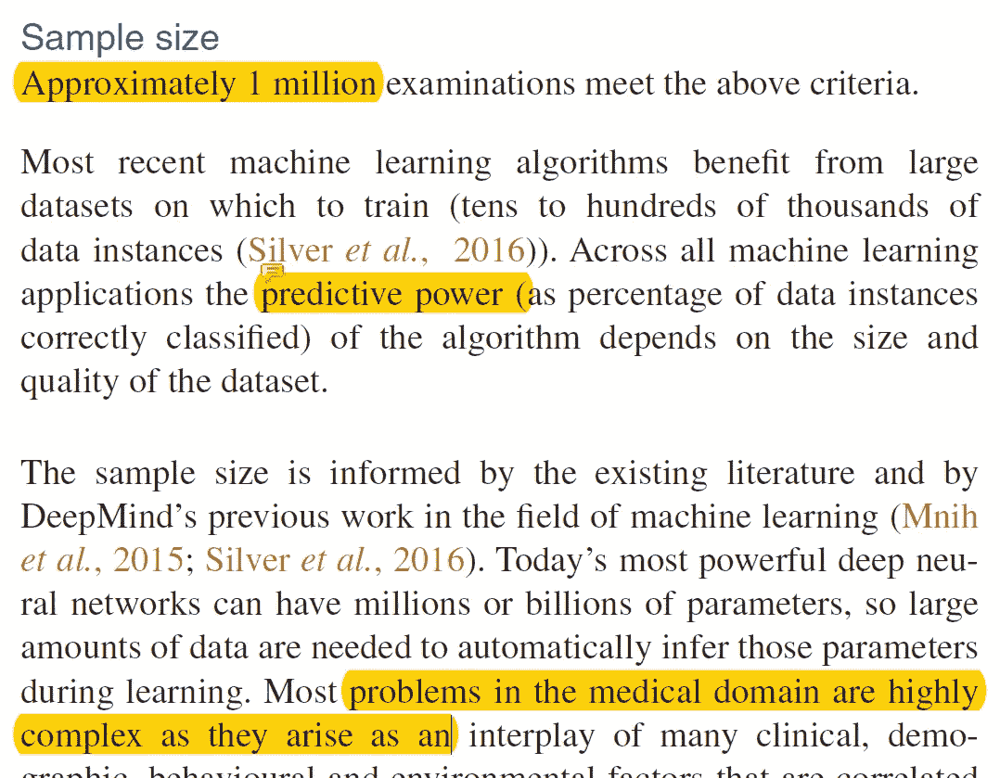

大约 100 万审计将被包括在数据集中，这些数据主要是数字眼底照片/ OCT 图像的图像。此外，图像中还会包含一些元数据(如年龄)，但是这些数据都不能用于识别特定的患者。所有的数据在使用前都会被摩尔菲尔德医院的工作人员仔细检查。

**研究设计(算法开发/统计分析)**

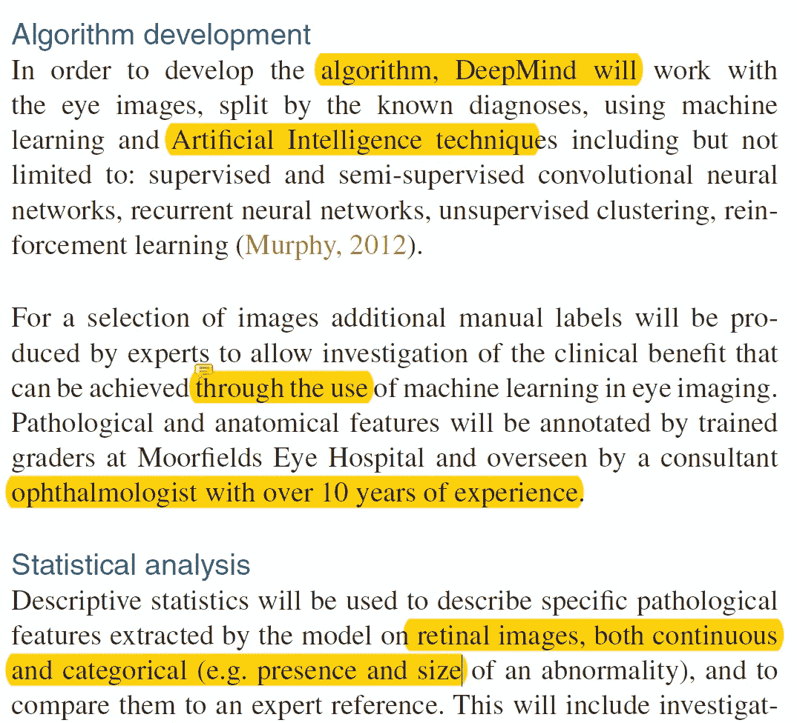

这里作者讨论的是可以用来开发这种情况的算法类型，对于 AI 来说，基本上都是。(有监督的、无监督的、强化的等等)此外，作者认为性能测量(准确性等等..)将由专家确认。

**数据保护**

这整个部分可以总结为一句话:DeepMind 将在 5 年内拥有来自 Moorfields 眼科医院的无法识别的数据，在此期间，所有数据都将被销毁，在此期间，数据将被保存在最先进的安全数据库中。

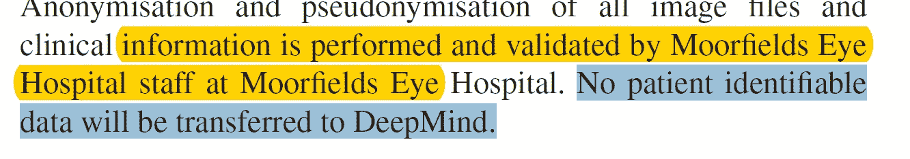

同样，没有进入 DeepMind 的数据可用于识别患者。

**道德考量**

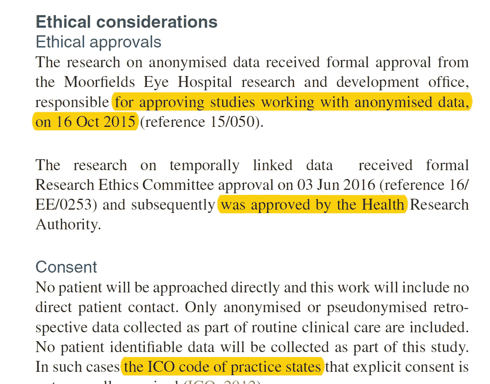

在这里，作者回顾了 DeepMind 获准使用医疗数据的时间和日期，以及一些负责监测的人员的姓名(缩写),包括临床人员和 DeepMind 人员。

**传播**

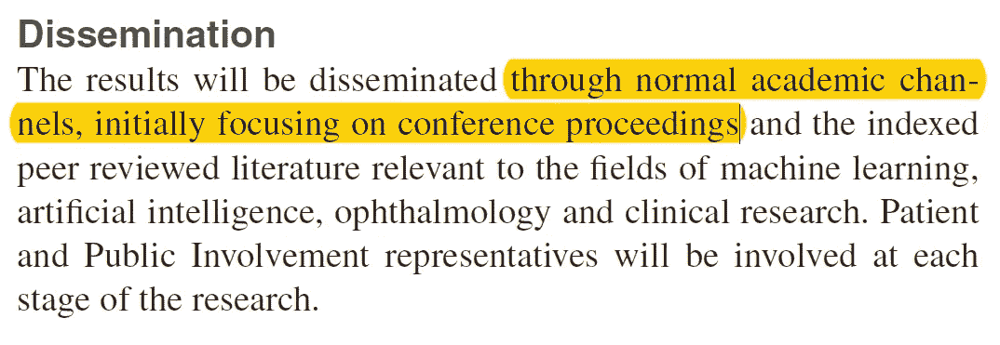

作者在此明确声明，这项研究的所有结果都将发表在学术论文中。(等不及看那篇论文了！)

**结论**

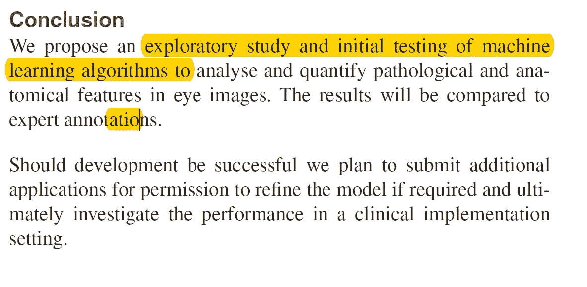

作者讨论了在这个项目成功的情况下，他们将提交真实世界用例的附加应用程序。

**遗言**

读完这篇论文后，我想我对这类研究在行业中实际上是如何进行的有了更具体的理解。

如果发现任何错误，请发电子邮件到 jae.duk.seo@gmail.com 给我，如果你想看我所有写作的列表，请在这里查看我的网站。

同时，在我的推特[这里](https://twitter.com/JaeDukSeo)关注我，访问[我的网站](https://jaedukseo.me/)，或者我的 [Youtube 频道](https://www.youtube.com/c/JaeDukSeo)了解更多内容。如果你感兴趣的话，我还做了解耦神经网络[的比较。](https://becominghuman.ai/only-numpy-implementing-and-comparing-combination-of-google-brains-decoupled-neural-interfaces-6712e758c1af)

**参考**

1.  j .德法乌、p .基恩、n .托马舍夫、d .维森廷、g .范登德里斯切、m .约翰逊、…& t .佩托(2016)。使用用于计算机视觉的机器学习技术自动分析视网膜成像。f 1000 研究，5。
2.  Shead，S. (2018 年)。谷歌 DeepMind 正在资助 Moorfields 眼科医院的 NHS 研究。商业内幕。检索于 2018 年 4 月 12 日，来自[http://uk . business insider . com/deep mind-is-funding-NHS-research-2017-7](http://uk.businessinsider.com/deepmind-is-funding-nhs-research-2017-7)
3.  眼底照相。(2018).En.wikipedia.org。检索于 2018 年 4 月 12 日，来自 https://en.wikipedia.org/wiki/Fundus_photography
4.  光学相干断层扫描。(2018).En.wikipedia.org。检索于 2018 年 4 月 12 日，来自 https://en.wikipedia.org/wiki/Optical_coherence_tomography
5.  黄斑变性。(2018).En.wikipedia.org。检索于 2018 年 4 月 12 日，发自[https://en.wikipedia.org/wiki/Macular_degeneration](https://en.wikipedia.org/wiki/Macular_degeneration)
6.  Uddin M，e. (2018)。在自闭症谱系障碍中，纯化选择下的脑表达外显子富集了新突变。公共医学——NCBI。Ncbi.nlm.nih.gov。检索于 2018 年 4 月 12 日，来自[https://www.ncbi.nlm.nih.gov/pubmed/24859339](https://www.ncbi.nlm.nih.gov/pubmed/24859339)
7.  穆尔菲尔德眼科医院国民健康保险基金信托。(2018).Moorfields.nhs.uk 于 2018 年 4 月 12 日检索，来自[https://www.moorfields.nhs.uk/](https://www.moorfields.nhs.uk/)