# H-DenseUNet:用于从 CT 体积中分割肝脏和肿瘤的混合密集连接 UNet

> 原文：<https://towardsdatascience.com/paper-summary-h-denseunet-hybrid-densely-connected-unet-for-liver-and-tumor-segmentation-from-a47597845d37?source=collection_archive---------8----------------------->

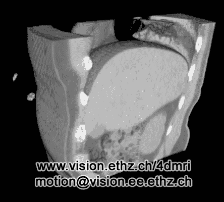

GIF from this [website](https://giphy.com/search/CT-Volumes)

最近我在玩 3D 卷积运算，我想知道更多关于。

> ****

Paper from this [website](https://arxiv.org/pdf/1709.07330.pdf)

**摘要**

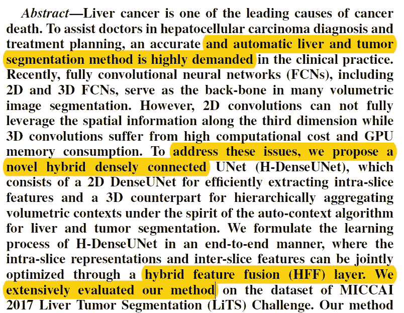

分割肝脏和其他器官是一项具有挑战性的任务，2D 卷积运算没有充分利用第三维，而 3D 卷积运算具有高计算成本。为了克服这些问题，作者提出了一种新的混合密集连接 UNet 架构，其中他们使用 2D DenseUNet 来提取切片内特征，并使用 3D 计数器部分来分层聚集体积上下文。所有这些网络都是通过端到端的学习来训练的。

**简介**

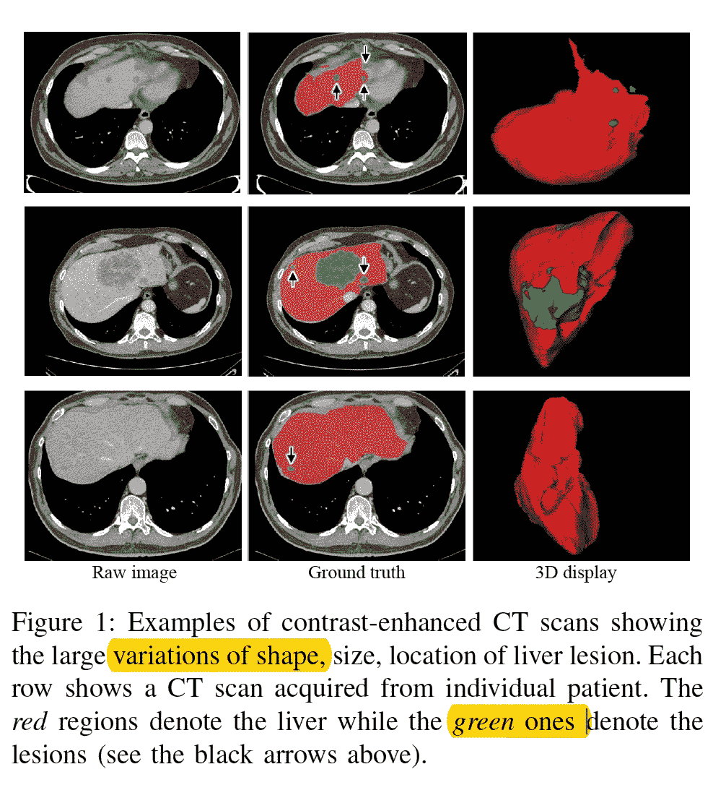

肝癌是最常见的癌症之一，因此准确的诊断非常重要。这就是为什么分割正确的肝脏区域是重要的。但是肝脏和肝脏病变是由放射科医师在逐切片的基础上描绘的，这可能导致错误并消耗大量时间。在 CT 中分割肝脏区域是困难的，因为它缺乏其他器官之间的对比度。(见上图，这就是为什么许多放射科医生使用注射协议来增强对比度。)此外，分割肿瘤更具挑战性，因为形状不规则，没有清晰的边界线，并且许多 CT 扫描包括沿 z 轴方向变化很大的各向异性维度。已经提出了许多不同方法来自动化这个过程，例如使用手工制作的特征或完全卷积的神经网络。

通常，放射科医师根据沿 z 轴的许多相邻切片来观察和分割肿瘤，然而 2D 基卷积方法没有考虑 z 轴。(一些研究人员已经应用了对于每个 xy、yz 和 xz 平面具有 3 个 2D 卷积神经网络并对它们进行平均的方法，然而，这些方法有其自身的局限性。)3D 卷积神经网络占用更多的 GPU 内存和训练时间。此外，现有的预训练 3D 卷积模型并不多。为了克服这些问题，作者提出了混合密集连接的 UNet。关键因素是增加网络深度和混合特征探索。

**相关工作**

开发了许多其他分割方法，例如使用手工制作的特征，如水平集方法(如纹理特征向量)，结合传统的机器学习算法，如支持向量机。但是在深度学习的热潮之后，卷积神经网络成为执行分割的主要方法。(使用 3D 条件随机场等方法)

**方法**

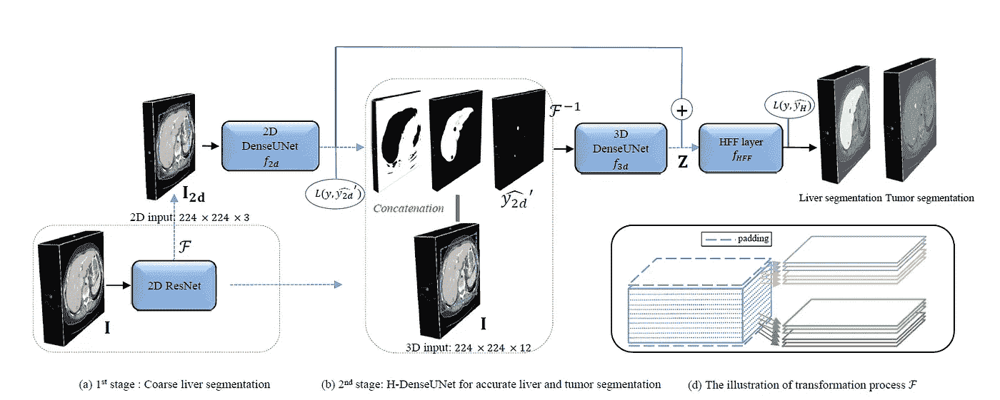

上图显示了作者方法的总体轮廓，一个有趣的事实是，实际上有 4 个网络，2D Res Net，2D Dense-UNet，3D Dense-UNet 和 HFF 层。

*用于切片内特征提取的深层 2D dense unet*

2D 密集 UNet 是由密集连接的块组成的 UNet 架构。(而大致的框架框架见下图。).这个网络的两大优点是:第一，它通过密集连接最大化了层间的信息流；第二，它通过 UNet 型连接利用了高级功能和低级功能。(此外，2D 密集 UNet 的深度为 167，另外请注意，我不会详细说明输入数据或输出数据的确切维度。)上采样是通过双线性插值完成的，使用线性单位(ReLU)作为激活函数。

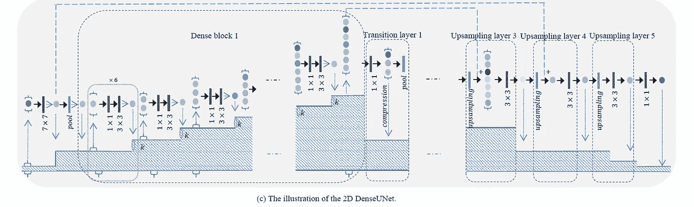

*用于混合特性探索的 H-dense unet*

2D 密集 UNet 能够从给定的 ct 扫描中提取高级特征，但是，它仍然没有充分利用 z 轴中存在的数据。为了克服这一点，作者提出了一种 H-DenseUNet 来联合融合和优化所学习的切片内和切片间特征，以便更好地分割肝脏肿瘤。在 2D 密集 UNet 的最后一层之后，输出的特征地图被转换成如下所示的体数据。

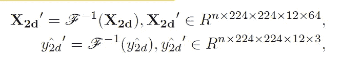

此特征地图是 3D Dense UNet 的输入数据，当用数学等式表示时，可以认为如下所示。

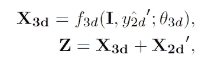

最后，从两个网络输出的数据相加并传递到 HFF 层。

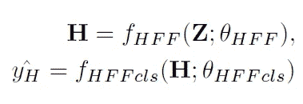

完整的网络架构如下所示。

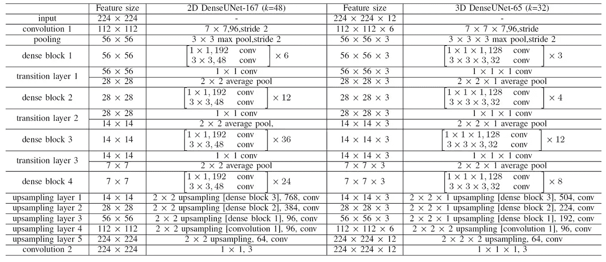

*损失函数、训练和推理方案*

作者使用加权交叉熵损失函数通过端到端的方式训练网络。

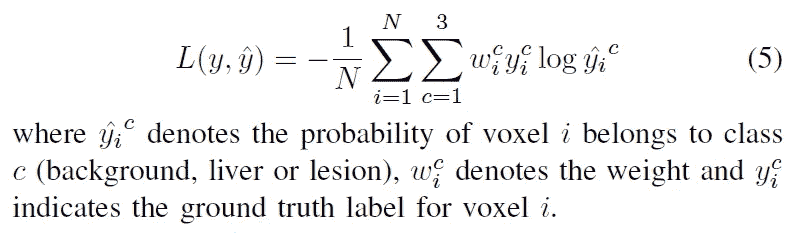

并且每个网络训练的顺序可以列举如下
1。Resnet →得到粗肝分割
2。2D DenseUNet →用 DenseNet 的权重(编码器)初始化权重，同时随机初始化解码器
3。在没有 UNet 连接的情况下开始 2D 密集 UNet 的训练，并且在一定时期之后进行 UNet 连接。
4。使用上述方案训练 2D 密集 UNet
5。在训练 2D UNet 之后，训练 3D 密集 UNet，同时固定 2D 密集 UNet 的参数。
6。在 3D 密集 UNet 被训练后，使用损失函数微调整个网络，如下所示。

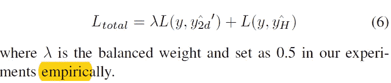

**实验和结果**

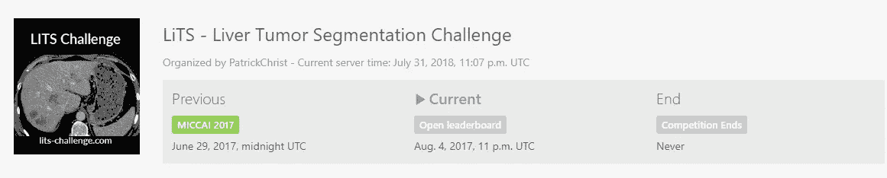

Image from this [website](https://competitions.codalab.org/competitions/17094)

使用来自 MICCAI 2017 LiTS challenge 的数据，该数据包含分别用于训练和测试的 131 次和 70 次对比度增强的 3D 腹部 CT 扫描，作者在-200 和 250 之间截断了图像强度值。(删除了所有不相关的细节。).所有模型都通过 Dice per case 评分、Dice global 评分和均方根误差进行评估。工作使用的框架是 Keras，学习率为 0.01，学习率衰减。

*预训练模型的有效性/2D 和 3D DenseUNet 的比较*

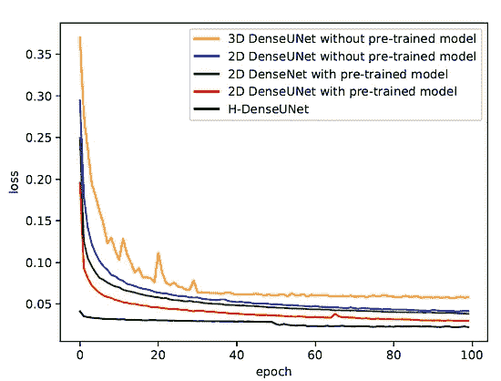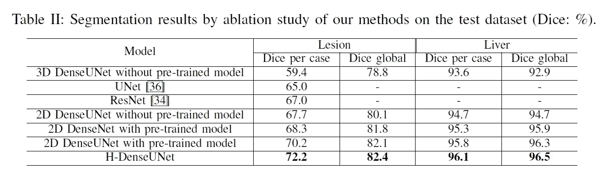

如上所述，当作者比较有和没有预训练权重的模型的训练损失以及骰子得分时，很明显需要预训练权重以获得更好的性能。此外，当比较 2D 密集 UNet 和 3D 密集 UNet 的性能时，很明显 2D 密集 UNet 的性能更好。最后，UNet connected 也为实现更好的性能发挥了作用。

*混合特征融合的有效性*

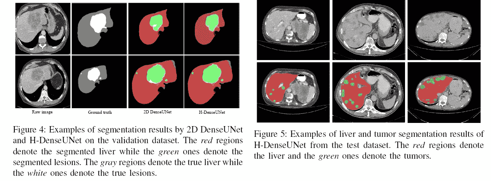

如上所述，作者比较了具有和不具有混合连接的网络，发现具有混合连接的网络产生更清晰的分段掩码。

*与其他方法的比较*

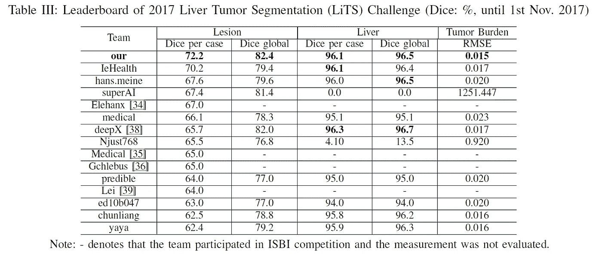

甚至当与其他现有技术的网络相比时，我们可以观察到作者提出的方法在所有不同的测量中具有最高的性能分数。

**讨论**

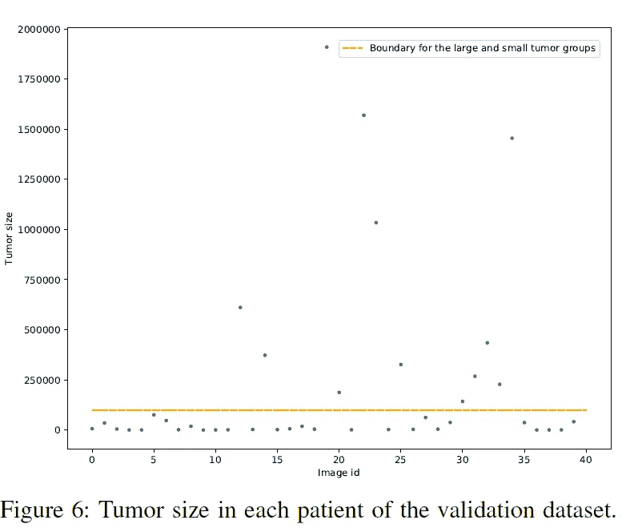

作者提出的方法能够在不同的测量标准下获得最佳性能。为了更好地理解性能增益，作者分析了每个患者肿瘤大小的有效性。当作者绘制肿瘤大小的散点图时，我们可以注意到一个很大的变化。如下所示，作者的方法提高了大肿瘤组和小肿瘤组的 dice 评分准确性。

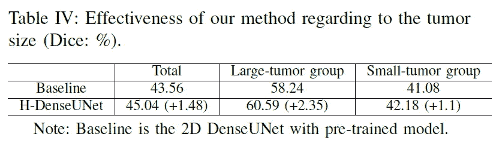

**结论**

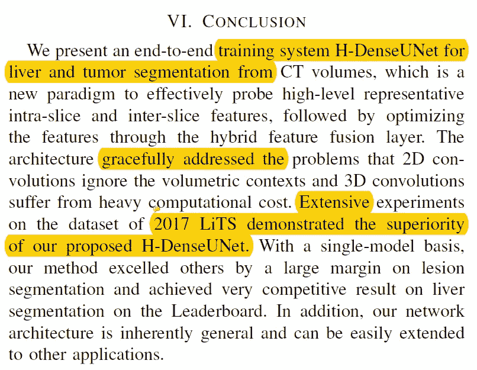

总之，本文的作者提出了一种新的混合架构，该架构可以有效地探测高级别代表性片内和片间特征，随后通过混合特征融合层优化这些特征。并且克服了 2D/3D 卷积神经网络的问题。

**最后的话**

网络的训练方式给我留下了特别深刻的印象。事实上，该网络没有从头到尾进行训练是一个败笔，但是作者提出了一个非常聪明的方法来训练一个复杂的网络。

如果发现任何错误，请发电子邮件到 jae.duk.seo@gmail.com 给我，如果你想看我所有写作的列表，请[在这里查看我的网站](https://jaedukseo.me/)。

与此同时，请在我的 twitter [这里](https://twitter.com/JaeDukSeo)关注我，并访问[我的网站](https://jaedukseo.me/)，或我的 [Youtube 频道](https://www.youtube.com/c/JaeDukSeo)了解更多内容。我也实现了[广残网，请点击这里查看博文 pos](https://medium.com/@SeoJaeDuk/wide-residual-networks-with-interactive-code-5e190f8f25ec) t

**参考**

1.  (2018).Arxiv.org。检索于 2018 年 7 月 31 日，来自 https://arxiv.org/pdf/1709.07330.pdf
2.  李，谢，陈，洪，齐，谢，窦，秦，傅，陈，恒，彭(2017)。H-DenseUNet:用于从 CT 体积中分割肝脏和肿瘤的混合密集连接 UNet。Arxiv.org。检索于 2018 年 7 月 31 日，来自 https://arxiv.org/abs/1709.07330
3.  CodaLab —竞争。(2017).Competitions.codalab.org。检索于 2018 年 7 月 31 日，来自[https://competitions.codalab.org/competitions/17094](https://competitions.codalab.org/competitions/17094)