# 【论文摘要】horo VOD:tensor flow 中快速简单的分布式深度学习

> 原文：<https://towardsdatascience.com/paper-summary-horovod-fast-and-easy-distributed-deep-learning-in-tensorflow-5be535c748d1?source=collection_archive---------14----------------------->

GIF from this [website](https://giphy.com/gifs/channel-7Ub36ixBfRcsw)

我想知道更多关于 Tensorflow 中的分布式学习，它是如何完成的以及背后的细节。

> **请注意，这篇帖子是给未来的自己看的，回顾这篇论文上的材料，而不是从头再看一遍。**

Paper from this [website](https://arxiv.org/pdf/1802.05799.pdf)

**摘要**

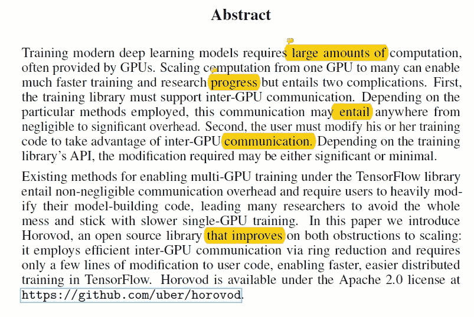

训练深度神经网络是一个占用大量计算内存的过程。如果我们可以使用多个图形处理器，那么训练速度会更快。然而，有两个问题，GPU 的内部通信和用户必须修改他们的代码，以兼容分布式训练。本文的作者介绍了 Horovod，它可以自动处理这些问题。

**简介**

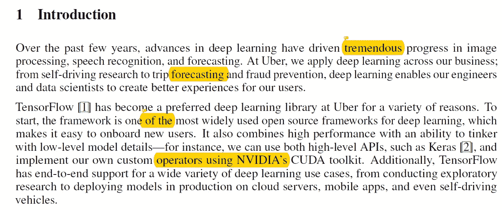

近年来，深度学习已经在各地应用，以创造有意义的体验。优步在他们的许多产品中使用张量流。

**走向分布式**

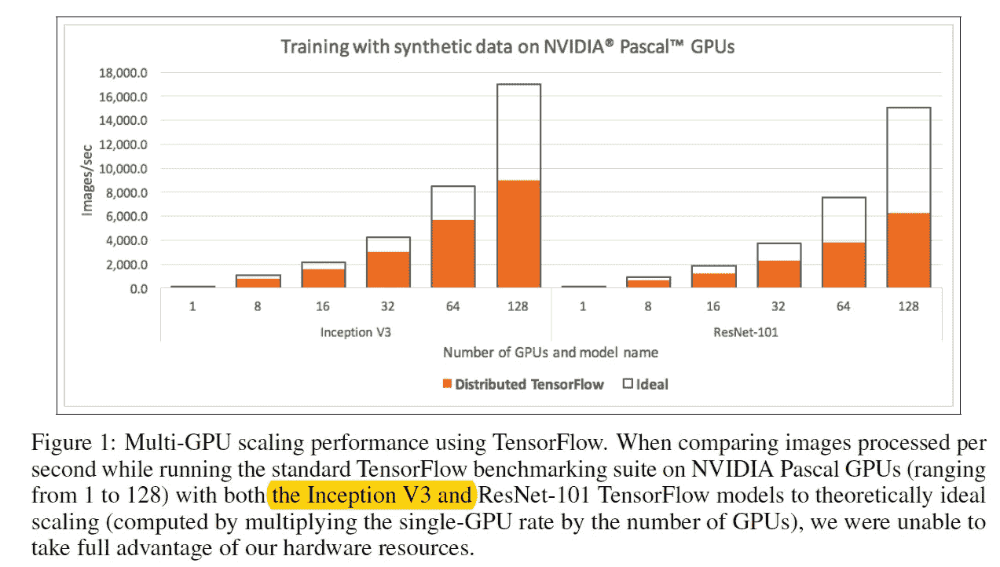

随着模型规模的增加，所需的计算成本也在增加。为了解决这个问题，优步转向了分布式培训，在尝试了标准的 tensorflow 分布式软件包后，他们显然需要做出一些调整。tensorflow 中的标准分布式库很难调试，扩展性也不好。(如上图所示)

**利用不同类型的算法**

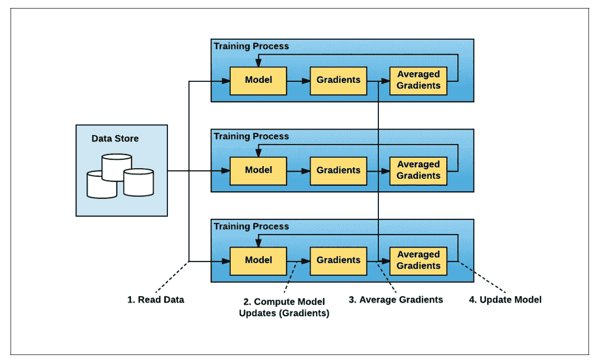

首先，他们尝试了脸书的方法，其中结合了数据并行的原则和创新的学习率调整技术。(如上图。)这种方法的一般方法如下所示。

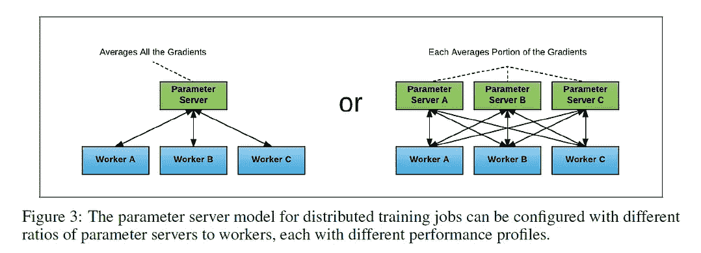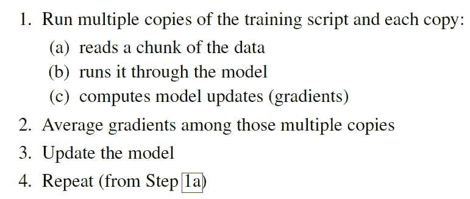

在这种方法中，每个进程都有两个潜在的角色，要么成为工作节点(读取数据，并计算梯度)，要么成为参数服务器(平均梯度)。这种方法是可行的，但是它有两个潜在的问题，1)确定工人与参数服务器的正确比例，以及 2)处理增加的 TensorFlow 程序复杂性。在 2017 年初，一种称为 ring-allreduce 的算法对梯度进行平均，并将这些梯度传递给所有节点，(该方法如何运行的视觉效果可以在下面看到，详细信息请阅读论文。)已被提出。

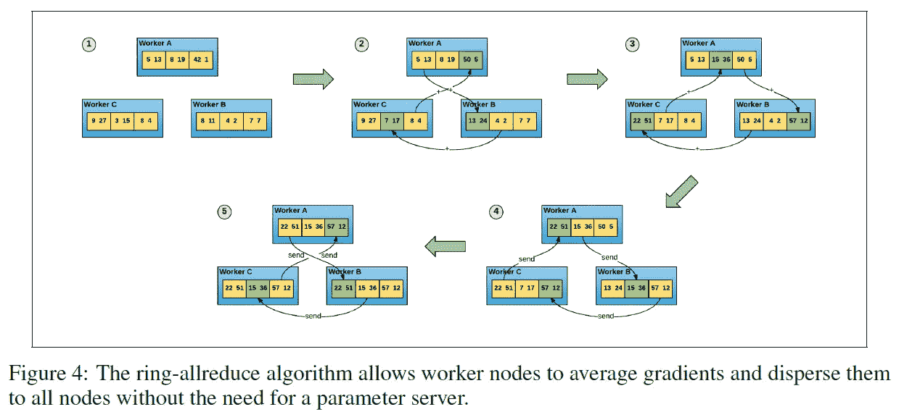

**介绍 Horovod /通过 Horovod 分配您的培训工作**

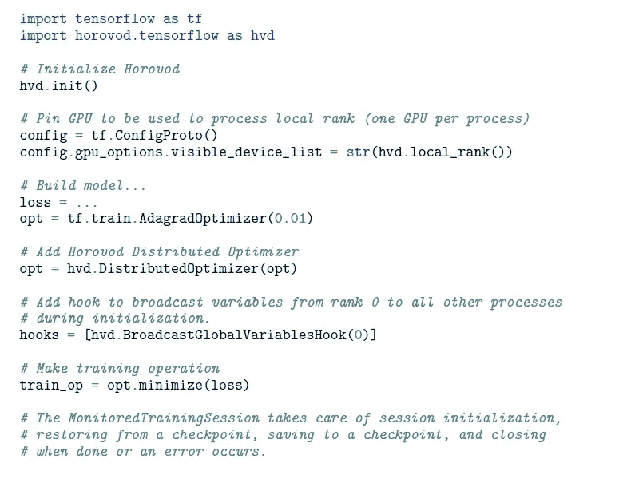

Horovod 这个名字来自传统的俄罗斯民间舞蹈，表演者手挽手围成一圈跳舞，类似于分布式训练的工作方式。并且本文作者已经实现了 tensorflow 版本的 ring-allreduce 算法，具体可以看下面。

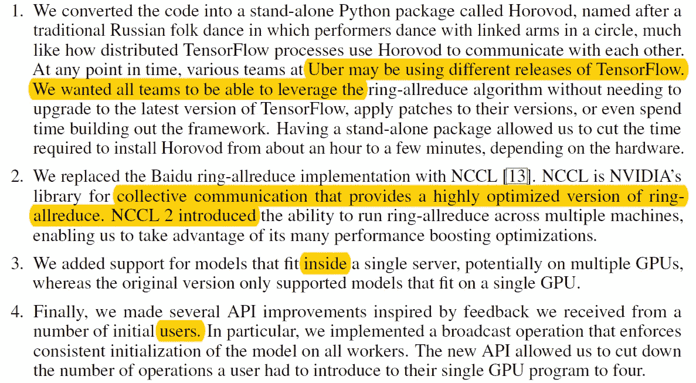

正如上图所示，使用 Horovod 非常简单，只需要几行额外的代码。

**Horovod 时间轴/张量融合**

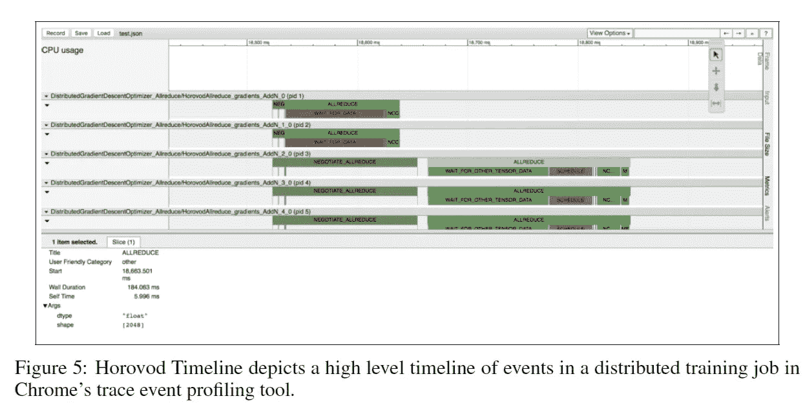

在谷歌 chrome 的帮助下，每个用户都可以轻松地跟踪培训的进度，这可以准确地显示每个节点在整个培训工作的每个时间点都做了什么。

此外，作者注意到在训练时，有许多微小的缩减操作。如果张量足够大，ring-allreduce 可以以最佳方式利用网络，但如果张量非常小，则不能有效或快速地工作，因此作者提出了张量融合，一种将张量融合在一起的算法。通过这种方法，作者能够观察到 65%的改善。

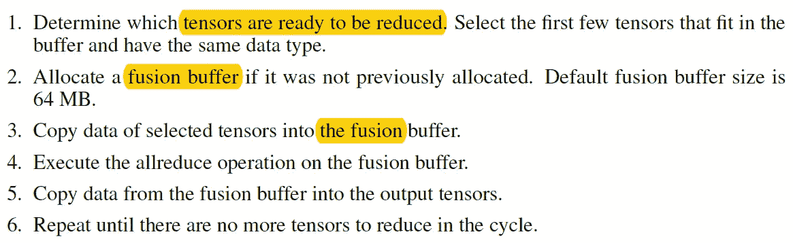

Step by Step of Tensor Fusion.

**Horovod 基准/后续步骤**

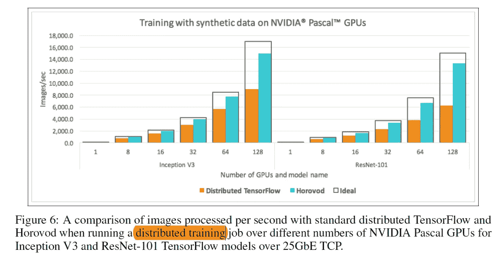

当作者比较标准库和 Horovod 之间的情况时，他们能够观察到性能的异常提高，如上所示。

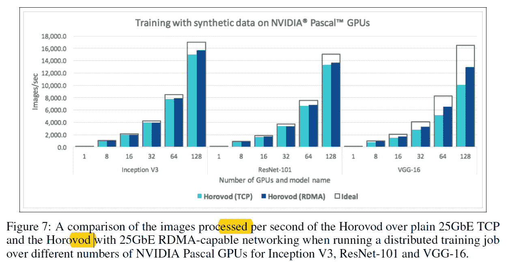

使用远程直接内存访问(RDMA)而不是 TCP，作者还注意到性能的巨大提高。如果随着模型中参数数量的增加，它变得更加有效。最后，作者注意到了改进的空间，例如 1)使安装 MPI 变得更容易，2)收集和分享关于调整分布式深度学习的模型参数的学习，以及 3)添加非常大的模型的示例。

**最后的话**

这是一个令人兴奋的消息，我希望有一天能够使用这个框架。

如果发现任何错误，请发电子邮件到 jae.duk.seo@gmail.com 给我，如果你希望看到我所有写作的列表，请[在这里查看我的网站](https://jaedukseo.me/)。

同时，在我的 twitter [这里](https://twitter.com/JaeDukSeo)关注我，并访问[我的网站](https://jaedukseo.me/)，或我的 [Youtube 频道](https://www.youtube.com/c/JaeDukSeo)了解更多内容。我也实现了[广残网，请点击这里查看博文 pos](https://medium.com/@SeoJaeDuk/wide-residual-networks-with-interactive-code-5e190f8f25ec) t。

**参考**

1.  阿·谢尔盖耶夫和米·德尔·巴尔索(2018 年)。horo VOD:tensor flow 中快速简单的分布式深度学习。Arxiv.org。检索于 2018 年 8 月 13 日，来自[https://arxiv.org/abs/1802.05799](https://arxiv.org/abs/1802.05799)