# [论文摘要/ICLR 2014]k-稀疏自动编码器

> 原文：<https://towardsdatascience.com/paper-summary-iclr-2014-k-sparse-autoencoders-72078c6f1117?source=collection_archive---------12----------------------->

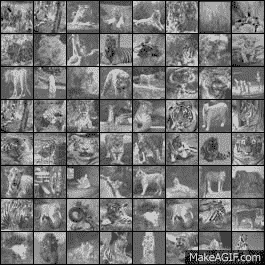

GIF from this [website](https://giphy.com/gifs/coding-fKsSCtWQ6MR7q)

自动编码器的变体之一，旨在学习给定数据的稀疏表示。

> ****

Paper from this [website](https://arxiv.org/pdf/1312.5663.pdf)

**摘要**

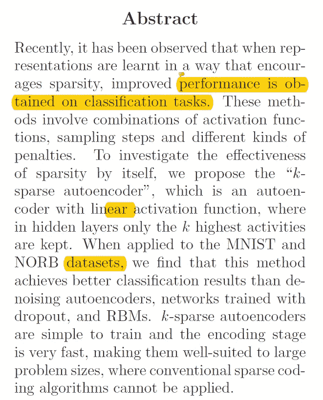

最近已经注意到，学习给定数据的稀疏表示提高了用于分类任务的网络的性能。这里，作者提出了一种新的架构，其中在编码部分，仅选择 k 个最大的隐藏层元素来重构原始数据。

**简介**

有多种实现稀疏编码的方法，我们可以直接学习字典，或者我们可以使用在成本函数中添加了稀疏惩罚的神经网络。

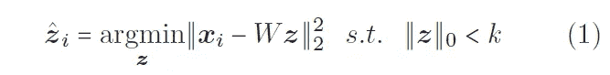

在忽略所有细节(例如所需的计算成本)的情况下，大多数稀疏编码方法的基本思想是学习最小化上述成本函数的字典 W 和稀疏表示 z。另一种方法是使用自动编码器，但是它们也有自己的问题，比如不能保证每个输入的稀疏表示。在本文中，作者提出了 k 个稀疏自动编码器，其中在重构给定输入时仅使用某些最高隐藏层。

**算法描述**

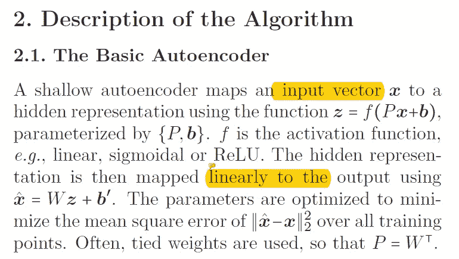

基本自动编码器背后的想法是简单地重构给定的输入，同时通过某个权重 W 和偏差值 b 来参数化。在 k 个稀疏自动编码器的情况下，在隐藏层(如下所示)之后，仅使用选定的 k 个值来重构给定的输入。

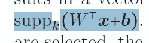

suppk()表示仅选择给定输入值中最高的 k 值，这是唯一的非线性。并且这些学习的权重 W 可以用于分类任务。

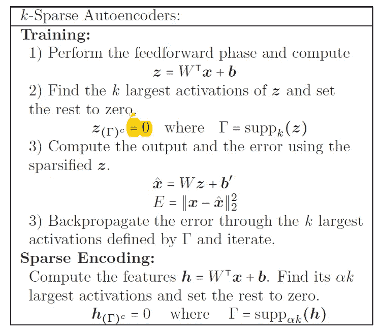

使用稀疏自动编码器的整个训练和编码阶段可以在上面看到。

**k 稀疏自动编码器的分析**

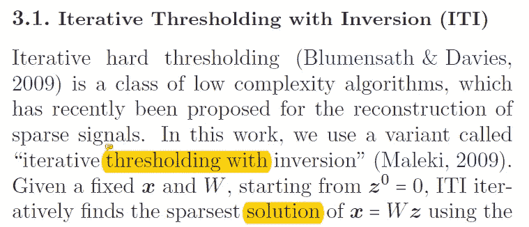

最初，迭代硬阈值处理是一种重建稀疏信号的方法，然而在这项工作中，作者使用了上述方法的一种变体，称为“具有反演的迭代阈值处理”，其中变得与 k-稀疏自动编码器相同。并且在非常简短的总结中，具有反转的迭代阈值处理具有如下所示的两个步骤。(在没有所有数学细节的情况下，下面两个等式可以被认为是最小化原始数据和稀疏重构数据之间的平方差。)

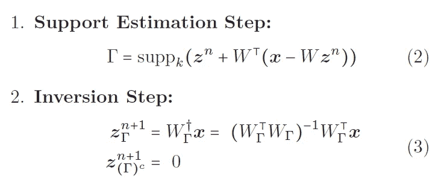

简而言之，我们可以将 k-稀疏自动编码器视为在稀疏恢复阶段使用 ITI 的稀疏编码算法的近似。最后，作者介绍了最后一个概念，即不连贯的重要性。这基本上意味着给定字典中原子之间的差异。如果字典是不完整的，我们不能将字典的每一列表示为其他列的线性组合。当字典过于完备时，情况正好相反。并且当 k-稀疏自动编码器收敛时，它成功地找到了给定数据的稀疏表示，这意味着所学习的字典必须是充分不相干的。

**实验**

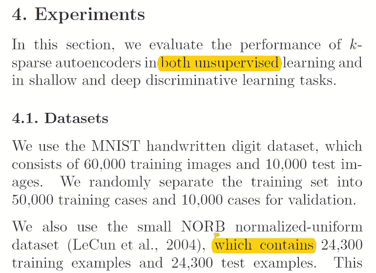

本节作者在三组不同的数据集上进行了实验，分别是 [MNIST](http://yann.lecun.com/exdb/mnist/) 、 [NORB](https://cs.nyu.edu/~yann/research/norb/) 和 [CIFAR-10](https://www.cs.toronto.edu/~kriz/cifar.html) 。作者没有纯粹地训练自动编码器，而是，他们首先将 k 值设置为 100，然后慢慢降低到目标稀疏度，如 15。这样做的原因是为了防止隐藏层内死亡神经元的形成。如果稀疏性从一开始就很低，它可能会阻止梯度流动。对于无监督和有监督的学习任务，作者使用了带动量的随机梯度下降。

***稀疏程度的影响***

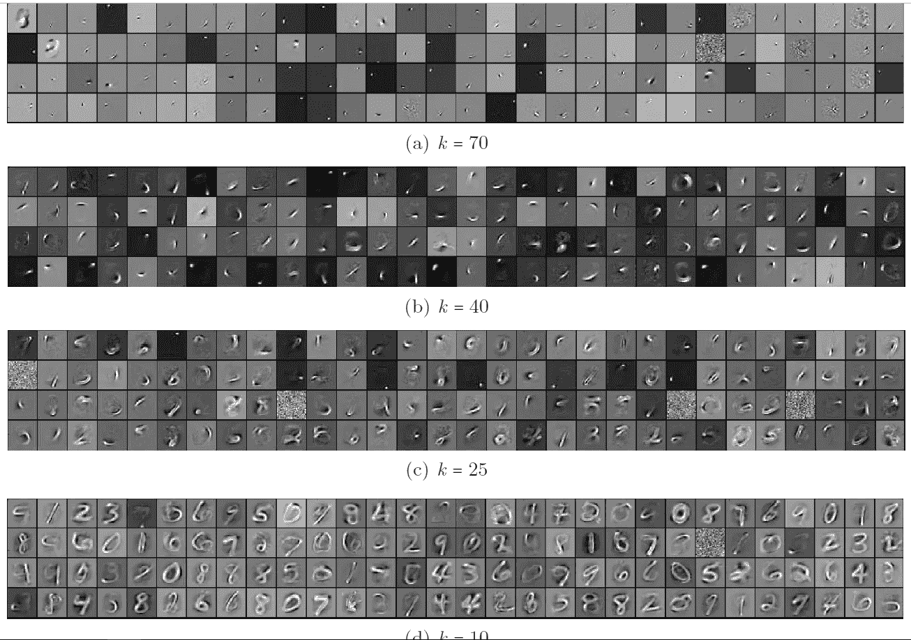

从上图中我们可以看到，随着稀疏度的增加(意味着我们使用越来越多的原子来表示原始数据)，字典倾向于学习更多的局部特征，但是随着稀疏度的降低，网络被迫只使用更少的原子来表示给定的数据，因此创建的特征变得更加全局。(比如数字的笔画。)但是强制太多的稀疏性会导致数据的过度拟合，并且没有学习到有用的特征。

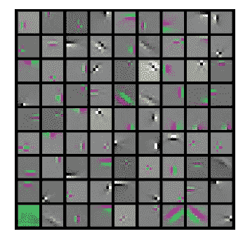

以上是从 CIFAR 10 数据集学习到的滤波器，我们可以观察到学习到的滤波器类似于本地化的 Gabor 滤波器。

***无监督特征学习结果***

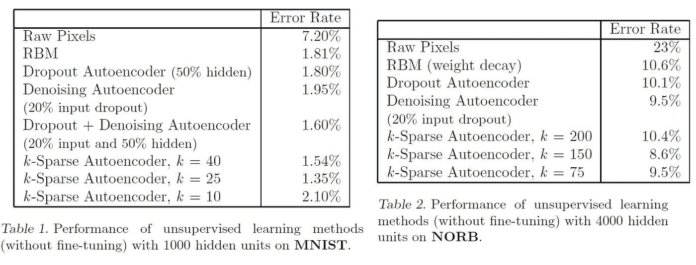

为了比较无监督学习任务的结果，作者从不同的方法中提取了学习过的过滤器，并使用简单的逻辑分类器来执行分类。我们可以观察到 k 稀疏自动编码器能够实现最低的错误率。

***浅层监督学习结果/深层监督学习结果***

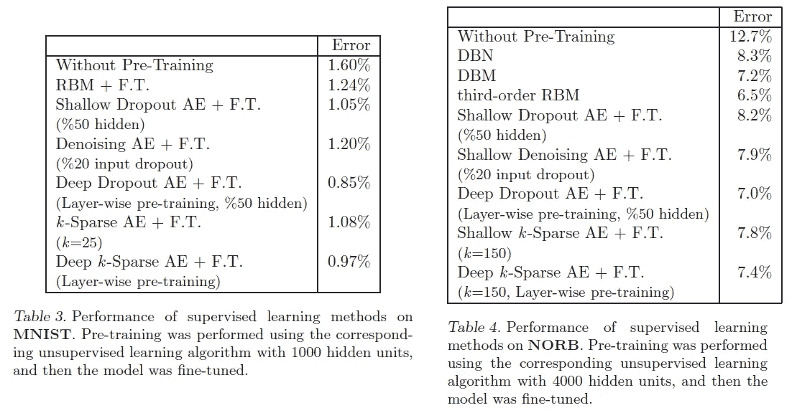

此外，作者在较浅的网络的初始层上使用通过无监督学习获得的网络权重，同时使用反向传播来调整添加的层以及微调先前的层。(这个过程有时被称为区别性微调。).从上表中我们可以看到 k 稀疏自动编码器取得了有竞争力的结果。

**结论**

本文介绍了一种新的稀疏编码方法，称为 k 稀疏自动编码器。该方法的新颖性主要在于如何在重建原始数据时仅使用选定的少数神经元。

**最后的话**

本文提出了一种非常简单的方法来实现给定数据的稀疏表示。

如果发现任何错误，请发电子邮件到 jae.duk.seo@gmail.com 给我，如果你希望看到我所有写作的列表，请[在这里查看我的网站](https://jaedukseo.me/)。

同时，在我的 twitter [这里](https://twitter.com/JaeDukSeo)关注我，并访问[我的网站](https://jaedukseo.me/)，或我的 [Youtube 频道](https://www.youtube.com/c/JaeDukSeo)了解更多内容。我也实现了[广残网，请点击这里查看博文 pos](https://medium.com/@SeoJaeDuk/wide-residual-networks-with-interactive-code-5e190f8f25ec) t。

**参考**

1.  (2018).Arxiv.org。检索于 2018 年 8 月 12 日，来自[https://arxiv.org/pdf/1312.5663.pdf](https://arxiv.org/pdf/1312.5663.pdf)
2.  MNIST 手写数字数据库，Yann LeCun，Corinna Cortes 和 Chris Burges。(2018).Yann.lecun.com。检索于 2018 年 8 月 12 日，来自[http://yann.lecun.com/exdb/mnist/](http://yann.lecun.com/exdb/mnist/)
3.  CBLL，研究项目，计算和生物学习实验室，库兰特研究所，NYU。(2018).Cs.nyu.edu。检索于 2018 年 8 月 12 日，来自[https://cs.nyu.edu/~yann/research/norb/](https://cs.nyu.edu/~yann/research/norb/)
4.  CIFAR-10 和 CIFAR-100 数据集。(2018).Cs.toronto.edu。检索于 2018 年 8 月 12 日，来自[https://www.cs.toronto.edu/~kriz/cifar.html](https://www.cs.toronto.edu/~kriz/cifar.html)