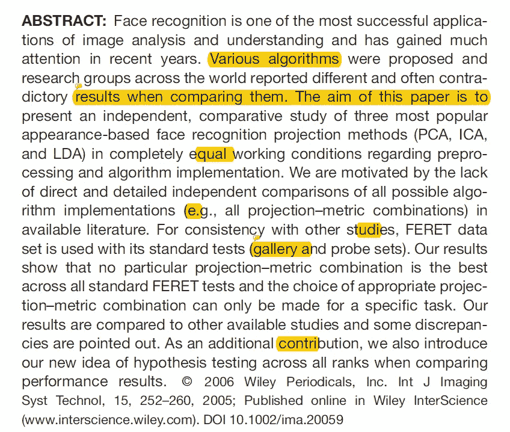
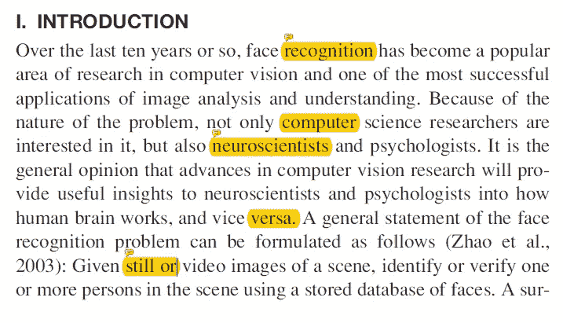
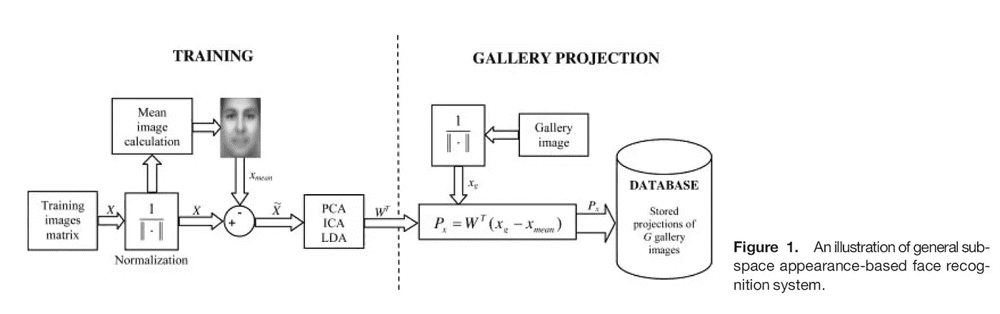
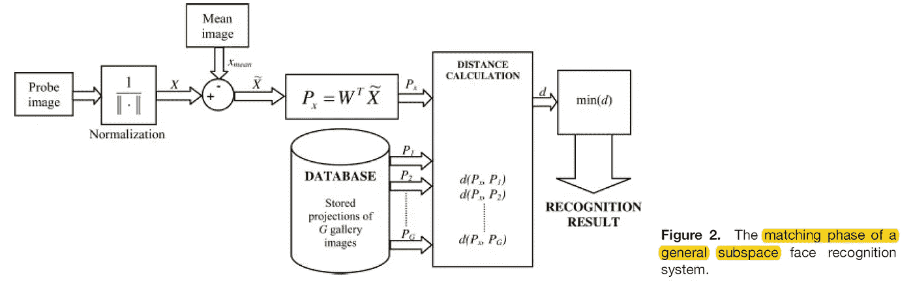
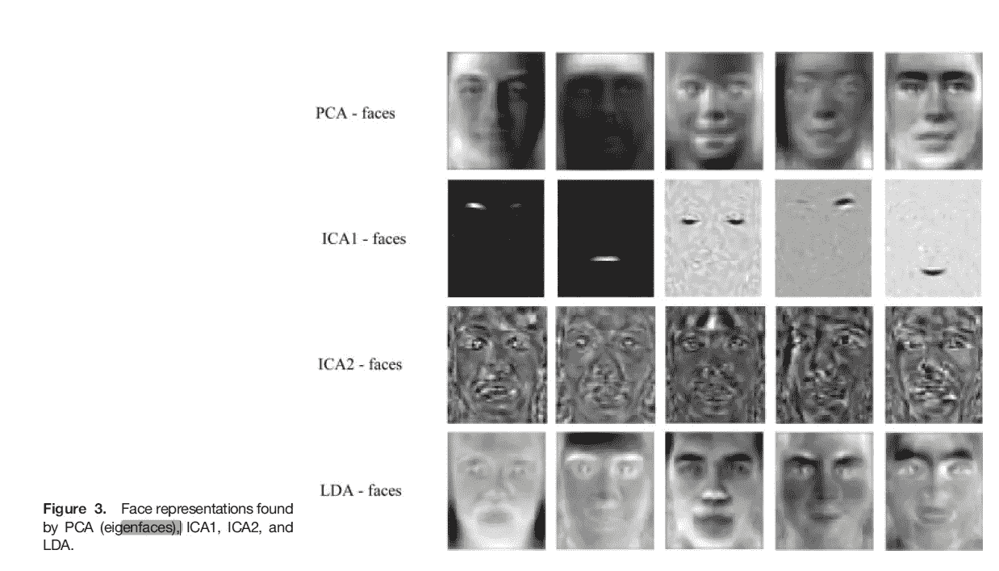
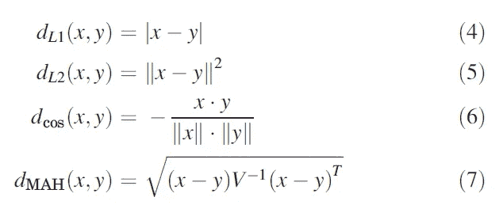
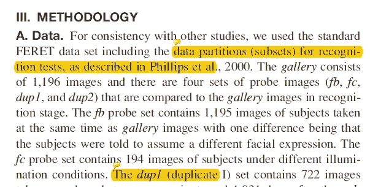
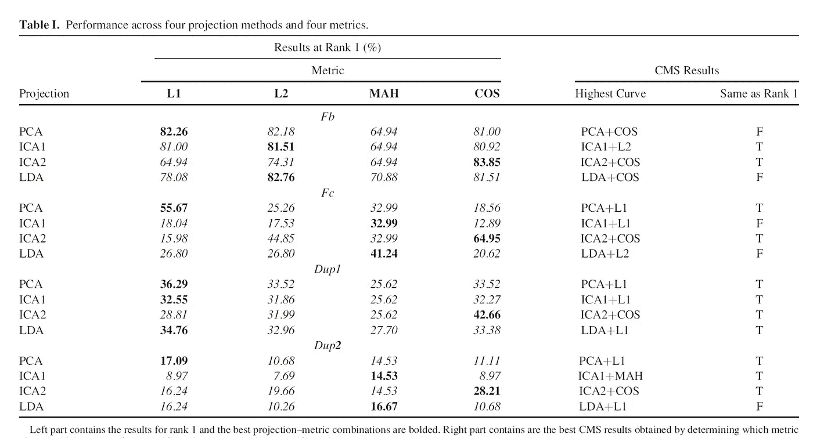
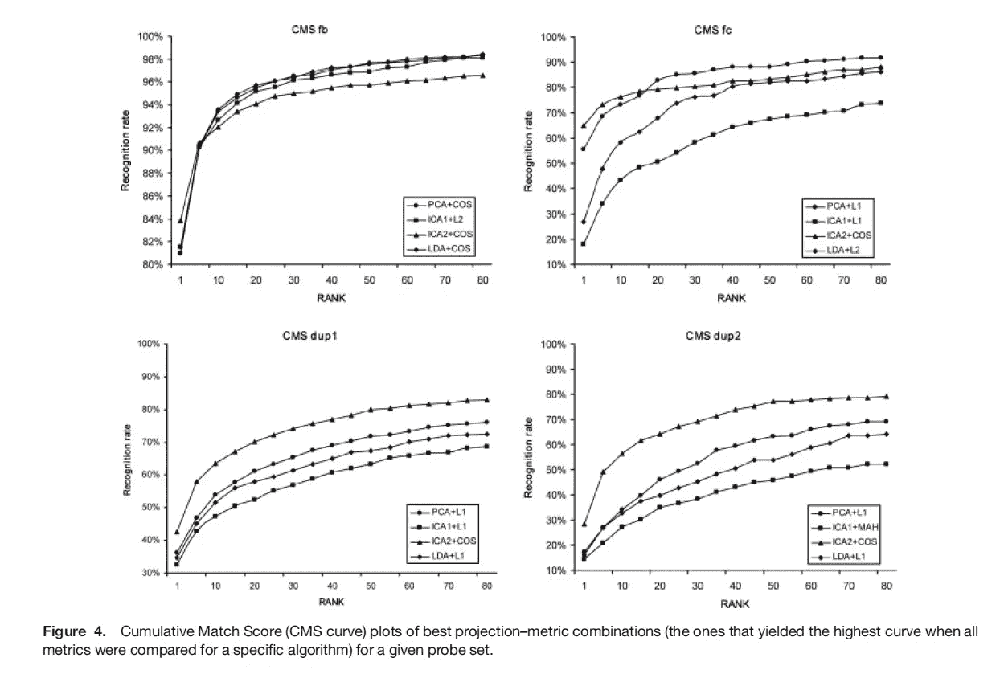

# [论文摘要 FERET 数据集上 PCA、ICA 和 LDA 的独立比较研究

> 原文：<https://towardsdatascience.com/paper-summary-independent-comparative-study-of-pca-ica-and-lda-on-the-feret-data-set-6fc30d4eaa76?source=collection_archive---------10----------------------->

GIF from this [website](https://giphy.com/gifs/chrome-image-search-duckduckgo-3ornjPby6F2oHVkJQA)

> **请注意，这篇帖子是给未来的自己看的，回顾这篇论文上的材料，而不是从头再看一遍。**

Paper from this [website](http://face-rec.org/algorithms/comparisons/delac_03.pdf)

**摘要**

本文作者希望比较三种最流行的基于外观的人脸识别投影方法(PCA、ICA 和 LDA)。他们使用了 FERET 数据集，没有发现任何特定的投影——公制组合是所有标准 FERET 测试中最好的。(因此，研究人员需要为特定的任务选择特定的方法。)

**简介**

涉及人脸识别问题的研究越来越受欢迎，人们普遍认为，计算机视觉研究的进展将为神经科学家和心理学家提供关于人类大脑如何工作的有用见解，反之亦然。有两种方法来实现这个任务，基于外观的方法使用应用于全脸的整体纹理特征，或者基于特征的方法使用几何面部特征(例如嘴)及其关系。

基于外观的子空间分析是最古老和最有前途的人脸识别方法。(然而，挑战在于找到一个好的子空间来比较图像。).本文比较了主成分分析、独立分量分析和线性判别分析三种投影方法。为了公平的比较，在 FERET 数据集上所有方法都使用了相同的预处理图像。

**算法**

Training Phase of Face recognition system

Testing/Matching Phase of Face recognition system

PCA、ICA 和 LDA 是子空间分析方法，它们将原始(高维)数据投影到较低的维上(同时尽可能多地保留信息)，然后进行比较。(这里，作者从 3000 的向量维度开始，并投影到 270 的子空间维度上——对于 LDA 224。).上面可以看到人脸识别系统示例的架构，在训练阶段，从归一化和居中的训练图像中学习投影矩阵 W，并将已知人脸的图库图像投影到较低的维度上(同时减去由训练图像获得的平均图像)。在存储投影向量之后，在匹配阶段，即将匹配的图像被归一化和居中(使用训练平均图像),然后被投影到较低的维度上，并与已知人脸进行比较。使用各种距离测量，分配最接近的身份。

上图显示了当原始人脸图像被投影到一个低维子空间时，由不同方法产生的结果图像。在对给定图像执行 ICA 之前，先执行 PCA 以降低维数(LDA 也是如此)，作者使用 INFOMAX 算法来实现 ICA。(ICA1 —统计独立基础图像，ICA2 —阶乘代码表示。).我们可以观察到 PCA、ICA2 和 LDA 捕获全局特征，而 ICA1 捕获局部特征。

最后，使用了四种不同的距离测量方法，L1、L2、余弦角(COS)和马氏距离(MAH)。(V 是协方差矩阵)。

**方法论**

为了与其他论文公平比较，其他人使用 FERET 数据集。对于预处理，他们对所有图像进行空间变换，使眼睛位于图像中心，裁剪掉背景，将图像大小调整为 50*60，并执行直方图均衡化。使用 675 幅图像(225 个类别的 3 幅图像)来获得投影矩阵 W，并且除了 LDA 之外，原始图像被缩减到 270 维子空间。(224 为 LDA。).

**结果**

Rank Table

CMS curve

如上所述，作者报告了两种不同类型的可视化，一个表格显示了等级 1 的算法性能(前一个匹配中的识别率),一个 CMS 显示了等级 1 和更高等级的累积结果。有趣的是注意到表(等级 1)结果和 CMS 曲线(更高等级)之间的差异。对于 fb(不同表达任务)，ICA2 + COS 在等级 1 产生最好的结果，LDA + COS 在等级 6 之后表现更好。并且在较高等级时，ICA2 + COS 的表现比任何其他方法都差。作者们也无法直接得出结论，哪种方法最适合这项任务。在不同的光照条件下，ICA1 的表现最差。最后，对于 dup1 和 dup2，时间变化任务，ICA2 + COS 是最好的方法。对于度量，L1 与 PCA 配对时是最好的，COS 与 ICA2 配对时是最好的，但是对于 ICA1 和 LDA，无法得出哪个测量是最佳的结论。(我不打算总结假设检验的细节。)作者将获得的结果与其他出版物进行了比较，他们能够发现大量相同的结论以及矛盾之处。

**结论**

总之，本文的作者比较了不同的最流行的基于外观的人脸识别投影方法。(PCA、ICA 和 LDA)，使用四种不同的距离度量。(L1、L2、余弦和马哈拉诺比斯)。他们得出了几个结论…

(1)不能断言哪一个是不同表达任务的最佳组合，因为差异似乎没有统计学意义

(2)PCA L1 在所有等级上都优于 ICA1 和 LDA，并且从等级 27 开始优于 ICA2

(3) COS 似乎是 ICA2 的最佳指标选择

(4) ICA2 + COS 组合是时间变化的最佳选择

(5) L2 产生的结果低于 L1 或 COS

(6)总体而言，L1 和 COS 是最佳指标

**最后的话**

如果发现任何错误，请发电子邮件到 jae.duk.seo@gmail.com 给我，如果你想看我所有写作的列表，请在这里查看我的网站。

同时，在我的 twitter 上关注我[这里](https://twitter.com/JaeDukSeo)，访问[我的网站](https://jaedukseo.me/)，或者我的 [Youtube 频道](https://www.youtube.com/c/JaeDukSeo)了解更多内容。我还实现了[广残网，请点击这里查看博文](https://medium.com/@SeoJaeDuk/wide-residual-networks-with-interactive-code-5e190f8f25ec) t。

**参考**

1.  (2018).Face-rec.org。检索于 2018 年 9 月 2 日，来自[http://face-rec.org/algorithms/comparisons/delac_03.pdf](http://face-rec.org/algorithms/comparisons/delac_03.pdf)