# [论文摘要]通过互信息估计和最大化学习深度表示

> 原文：<https://towardsdatascience.com/paper-summary-learning-deep-representations-by-mutual-information-estimation-and-maximization-efbe41a9f2c3?source=collection_archive---------6----------------------->

Photo by [Lucrezia Carnelos](https://unsplash.com/photos/RaywecwCtMo?utm_source=unsplash&utm_medium=referral&utm_content=creditCopyText) on [Unsplash](https://unsplash.com/?utm_source=unsplash&utm_medium=referral&utm_content=creditCopyText)

我想彻底了解的论文之一。

***请注意，这个姿势是我自己学习用的。***

Paper from this [website](https://arxiv.org/pdf/1808.06670.pdf)

**摘要**

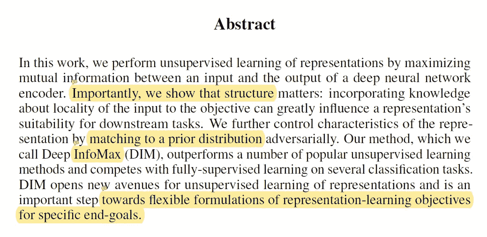

作者的网络的目标是最大化编码器的输入和输出之间的互信息。(无监督特征学习)。对于某些下游任务来说，对表示的有用性有很大影响的一个因素是关于目标输入的位置的知识。此外，作者使用一种对立的自动编码器方法来将编码表示与一些先验分布相匹配。

**简介**

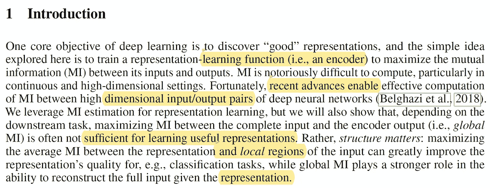

在连续和高维空间中计算互信息是非常困难的任务，然而由于最近的进展，现在可以在连续域中高效地计算互信息。因为这个问题已经(部分)解决了，所以本文的作者需要一个函数(神经网络)来最大化给定输入和编码输出之间的互信息。作者还指出，对于特定任务(如分类)，最大化表示(编码特征)和局部区域之间的平均 MI 可能更有用。同时最大化编码特征和全局输入之间的互信息有利于重构原始输入。

当谈到编码特征时，内容和独立性都很重要，作者以类似于 AAE 的方式训练他们的函数，以匹配他们想要强加给编码特征的统计属性。(由于这种方法与 infomax 优化原则密切相关，因此他们将其命名为 DeepInfo Max)。

**相关工作**

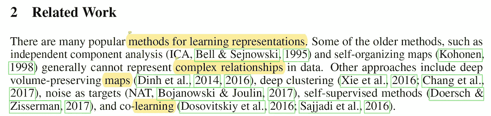

有许多方法旨在学习良好的表示，如独立成分分析、自组织映射、自监督方法和深度聚类。生成模型也用于学习有用的表示，并且在任务是重构原始输入的情况下，负重构误差可以与编码器中的 MI 相关，如下所示。

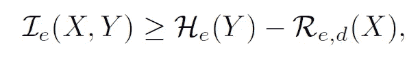

x 是给定数据，Y 是编码特征，R 是重构误差，H 是编码器输出的边际熵。这意味着重建目标对它们的中间表示中编码的信息量提供了一些保证。

*互信息估计*

互信息方法有着悠久的传统，通常许多互信息方法旨在最大化给定变量之间的互信息。(有些方法可以是非线性的)。互信息神经估计(MINE)学习连续变量的 MI 的神经估计，并且它是强一致的。这篇论文的作者受我的影响，但是他们发现没有必要使用精确的基于 KL 的配方以及具有发生器部分。基于 Jensen-Shannon 散度的简单分类器工作得和 KL 一样好，并且更稳定。此外，作者的方法可以利用输入的局部结构。

**深度信息最大值**

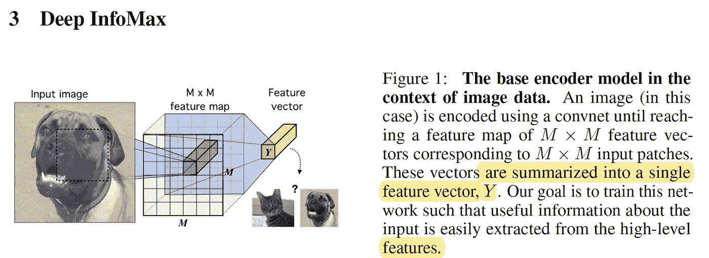

训练编码器的一般方法如下所示。给定 X 和 Y 连续且(几乎处处)可微的参数函数的域和范围，作者将 E 定义为神经网络，X 定义为训练数据，P 定义为经验概率分布(数据分布), U 定义为通过神经网络推送样本诱导的边际分布。作者编码器是根据两个标准训练的。

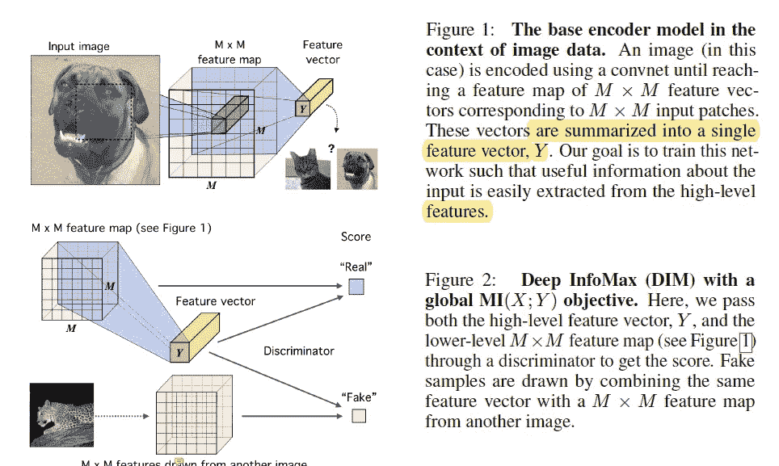

1.  最大化数据 x 及其编码特征(局部或全局)之间的交互信息
2.  让编码的特征匹配一些先验分布(AAE 风格)。

***a)互信息估计和最大化***

互信息神经估计(MINE)通过训练分类器来区分来自联合 J 和随机变量 X 和 Y 的边缘乘积 M 的样本来估计 MI，并且它使用基于 KL 散度的 Donsker-Varadhan 表示的 MI 的下限。

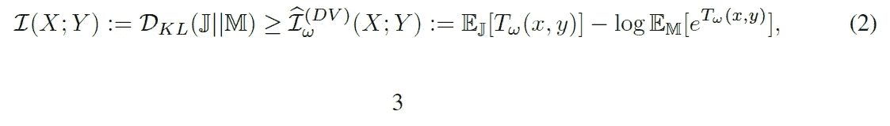

t 是鉴别器网络，其参数由 w 建模并与编码器配对，它既估计又最大化互信息。

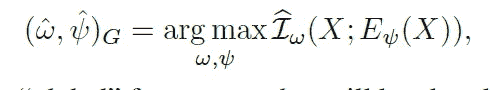

我的网络和作者的网络之间的区别在于，首先，作者的编码器和互信息估计器共享层，因为它们优化相同的目标，其次，作者的目标是最大化 MI(不关心它的精确值),因此使用不同的估计器函数以具有有利的折衷。(注意，也可以使用噪声对比估计。)

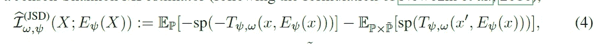

基于 DV、JSD 和 nce 的公式之间存在一些差异，例如 P/Phat 的期望值是出现在对数项内部还是外部。每种测量都有自己的优点和缺点，一般来说，nce 需要更多的负样本，但表现良好，而 JSD 损失相对稳健，但表现不如 NCE。

***b)局部互信息最大化***

根据您希望承担的任务，从原始数据中最大化本地区域之间的互信息可能是一个更好的主意。(这也可以应用于语言数据，而不是最大化特征和整个文档之间的 MI，我们可以最大化特征和句子之间的 MI。).例如，最大化给定特征和局部面片之间的平均 MI 可能是个好主意。

当编码器不支持无限输出配置并且特征向量具有有限容量时，编码器必须选择将传递何种信息。但是如果编码器只传递特定于输入的本地部分的信息，这将不会增加不包含该信息的任何其他补片的 MI。因此，编码器将传递通常在输入端共享的信息。

局部方法首先对输入数据进行编码，这反映了有用的结构，然后将该编码总结为全局特征，然后最大化估计的 MI 可以用如下公式表示。

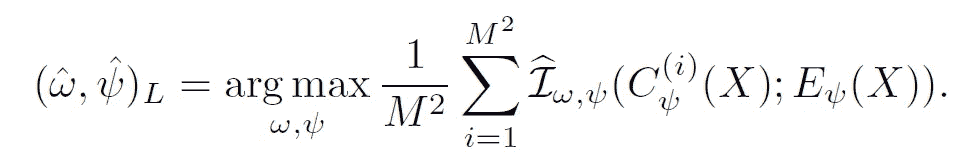

***c)将表征匹配到一个先验分布***

当我们将数据编码成某种特征向量时，信息量只是我们优化的标准之一，轴的另一个度量是统计约束。这可以通过 AAE 方法实现，目标函数如下所示。

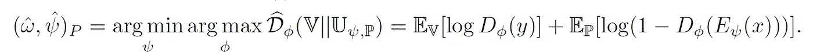

AAE 之间的一个区别是，我们没有上述目标函数的生成器。

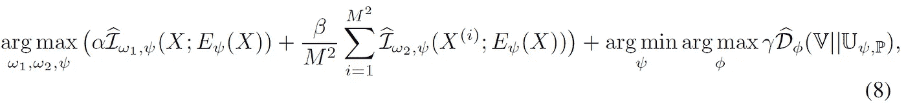

当我们从上面组合所有的测量轴时，我们得到最终的目标函数，如上所示。

**实验**

作者在 CIFAR10/100、Tiny ImageNet、STL-10 和 CelebA 四个不同的图像数据集上对算法进行了测试。并以一些方法与作者的方法进行了比较，分别以 VAE、AAE、甘比和噪声为目标。

*a)我们如何评估代表的质量？*

尽管测量一个表示是好还是不好是棘手的，但是存在一些测量，例如，线性可分性通常被用作表示和类别标签之间的解纠缠和互信息(MI)或者迁移学习分类任务的代理。

使用类标签并不理想，因为当标签未知时，我们可能对表示感兴趣。(类别标签)。因此，我们可以使用 MINE 来直接测量输入和特征之间的关系。或者，我们可以使用一个鉴别器来测量表示的独立性。鉴别器被训练来估计 KL 散度，并且 KL 散度越高，因子越相关。

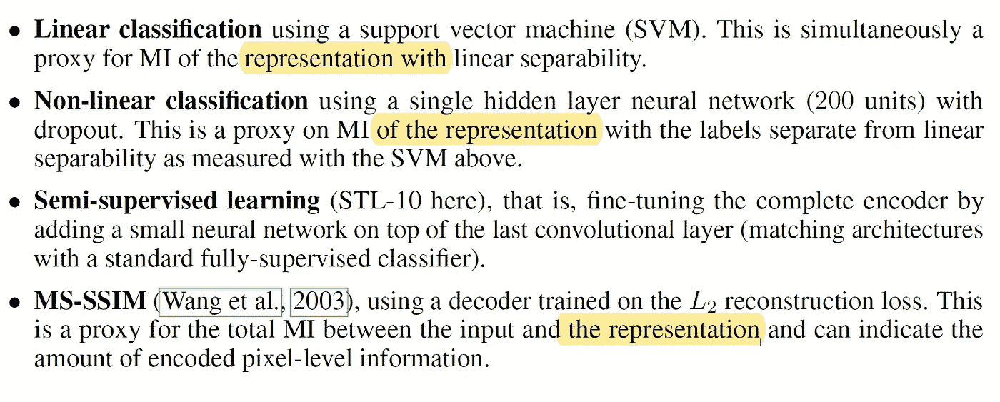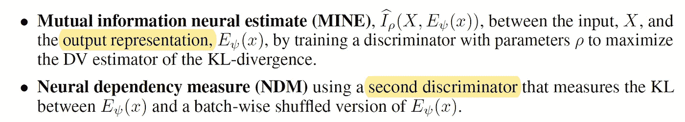

以上是作者使用的指标的总结。

*b)跨模型的表征学习比较*

作者有两个模型 DIM(G)用于全局唯一目标，DIM(L)用于局部目标，对于先验，他们选择了均匀分布。

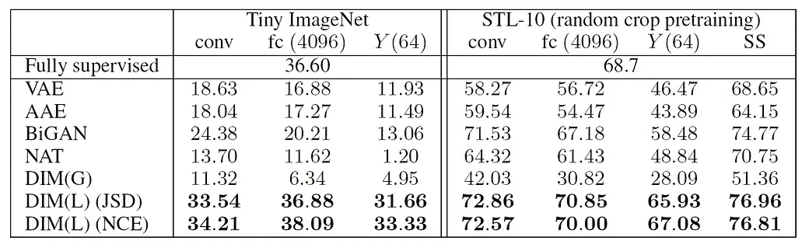

上表显示了不同数据集的分类精度，很明显 DIM(L)优于所有其他方法。(总之，局部模糊目标适合于提取类别信息。).

上表显示了 CIFAR10 数据集的线性可分性、重构(MS-SSIM)、互信息和独立性(NDM)的结果。需要注意的一点是，MS-SSIM 与 MINE 提供的 MI 估计值有很好的相关性，表明编码特征与像素信息有关。一般来说，基于像 VAE 和 AAE 的方法的重建对于 MS-SSIM 具有较高的分数，并且结合局部和全局的 DIM 目标对于 DIM 具有最好的结果。

*c)添加坐标信息和遮挡*

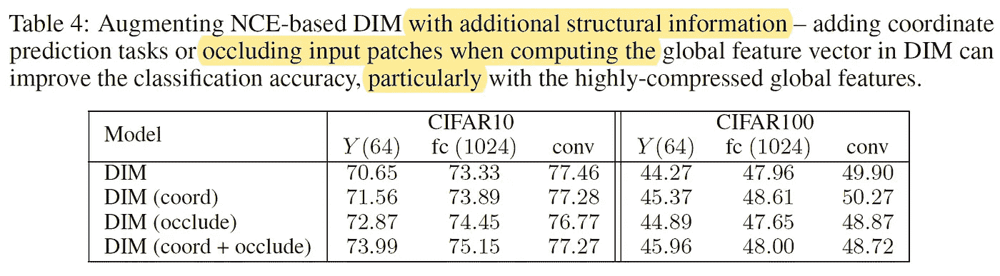

最后，作者在计算全局特征时随机遮挡输入的一部分，但是使用全部输入来计算局部特征。通过这样做，我们鼓励模型对整个图像共享的信息进行编码。这有助于提高分类的准确性。

**结论**

本文的作者介绍了 Deep InfoMax，这是一种最大化互信息的学习表示方法。作者的模型可以学习在原始数据的全局或局部结构之间具有最大互信息的特征。

**遗言**

测量相互信息似乎是非常棘手的任务。

**参考**

1.  Hjelm，r .，费多罗夫，a .，Lavoie-Marchildon，s .，Grewal，k .，Bachman，p .，Trischler，a .，& Bengio，Y. (2018)。通过互信息估计和最大化学习深度表示。Arxiv.org。检索于 2018 年 10 月 30 日，来自[https://arxiv.org/abs/1808.06670](https://arxiv.org/abs/1808.06670)