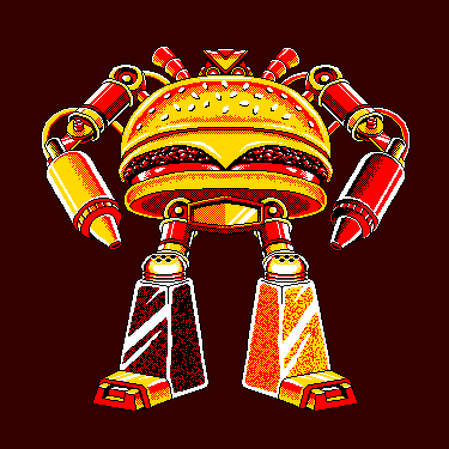
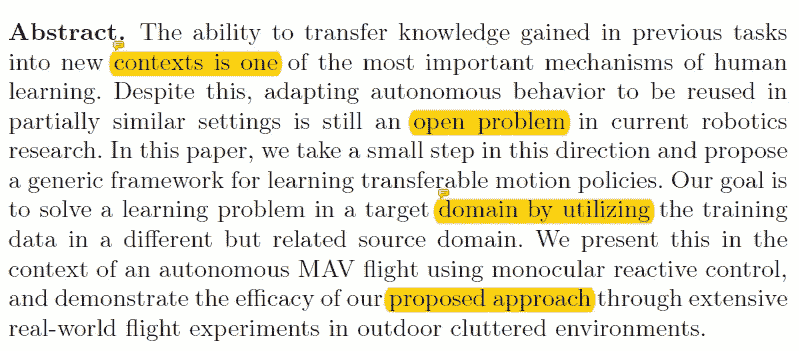
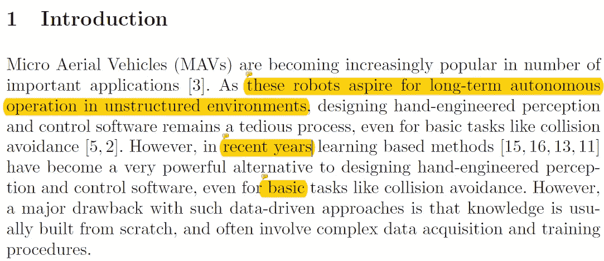
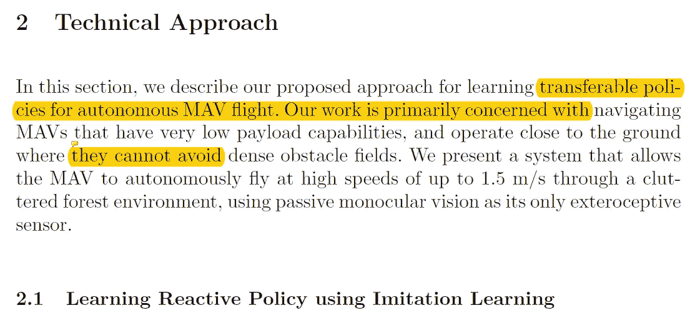
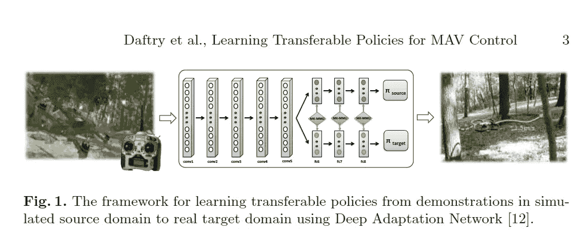
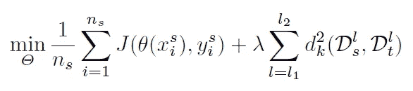
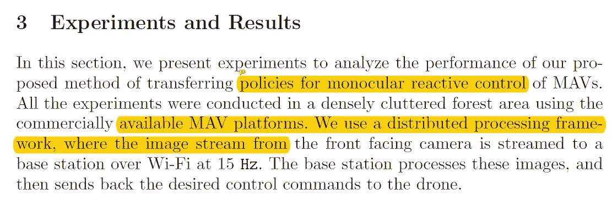
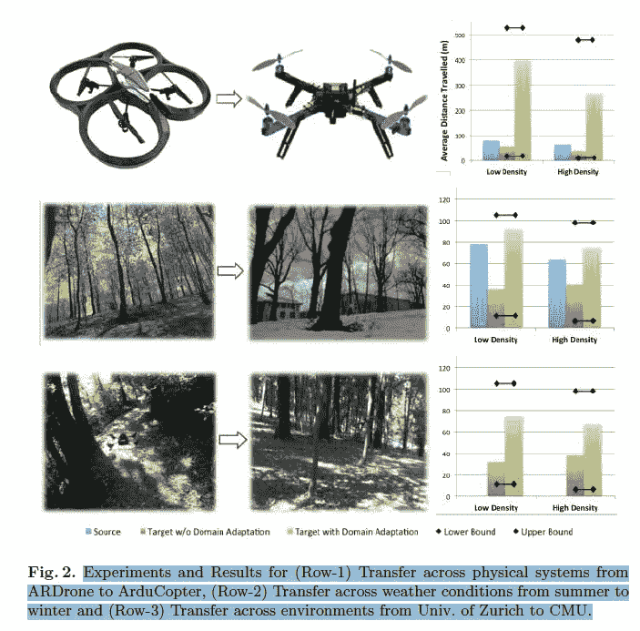
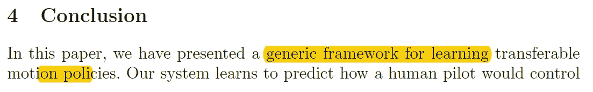

# 单眼反应式微型飞行器控制的学习转移策略

> 原文：<https://towardsdatascience.com/paper-summary-learning-transferable-policies-for-monocular-reactive-mav-control-e879fbe3a014?source=collection_archive---------11----------------------->

GIF from this [website](https://giphy.com/gifs/lol-wtf-xUA7b0eVRL7rs06iK4)

> **请注意，这篇文章是让未来的我回顾和回顾这篇论文上的材料，而不是从头再看一遍。**

**摘要**

人类学习最吸引人的一个方面是迁移学习。(将以前任务中的某些/相关知识应用到新任务中的能力。).然而，在机器人学中解决这个问题仍然是一个挑战。在本文中，作者将数据集聚合( [DAGGER](https://www.cs.cmu.edu/~sross1/publications/Ross-AIStats11-NoRegret.pdf) )算法用于自主无人机飞行问题。他们提出的解决目标领域问题的方法是巧妙地利用从不同但相关的领域收集的训练数据。

**简介**

微型飞行器(MAV)目前非常流行，然而，为它们设计一个自主的系统仍然是一个极端的挑战。这项任务如此具有挑战性的原因之一可能是因为训练数据的收集。为了成功地训练防碰撞系统，我们需要收集连续的和不连续的数据。(这意味着我们需要记录一些涉及危险碰撞的数据。)这不仅是灾难性的，而且代价高昂。替代方法包括在模拟环境中训练机器人。然而，虚拟环境并不能百分之百地代表真实世界的动态。(分布可能不同。在本文中，作者研究了自主 MAV 飞行环境中知识转移的有效性。在那里，他们在源领域中训练系统，并将所学的知识应用到新的领域中。

**技术方法**

在这一节中，作者描述了如何设置实验的技术细节。一种可能教授控制者如何驾驶无人驾驶飞机的方法是给他们一组人类飞行员演示。通过足够的迭代，控制器将学习一个最优策略(π),至少可以像控制人一样控制无人机。然而，这种方法的一个问题是它不能很好地推广。(即域名迁移很困难)。因此，作者将该问题公式化为给定来自源域 D 和目标域 D’的数据，学习策略 pi (π)，其中它减少了跨域差异。两个或更多事实之间缺乏兼容性或相似性。)。还训练了一个能控制无人机的 CNN。

为了克服目标数据没有分配标签的事实，作者使用附加损失函数来最小化域差异。下面可以看到完整的成本函数。

左侧是具有交叉熵损失的传统损失函数，右侧是附加损失函数，其中他们使用最大平均差异(MK-MMD)的多个核变量作为度量的平均值来测量每个域之间的差异。

**实验和结果**

在这一节中，作者描述了如何判断实验和算法。总之，在源域中收集了 1 km 的有人驾驶飞行的训练数据。和测试在目标域(相同的 1 km)中进行，通过使用随机策略来控制无人机或使用完整的训练数据来设置下限和上限。

如上所述，本文作者测试了三种不同类型的域名迁移。1)不同系统(不同无人驾驶飞机)之间转移；2)不同天气(夏季/冬季)之间的转移；以及 3)不同环境(不同森林)之间的转移。对于案例 1 和 2，他们能够获得系统性能显著提升。(作者假设这主要是由于更好的传感器和冬天没有障碍。)然而，在第三种情况下，它们只能获得轻微的性能提升。最后，作者指出要提高运动策略在物理系统上的可移植性。需要注意的是…..

(1)由动力学差异引起的域转移，
(2)目标域中的预期失败案例。
(3)不仅是领域，还有任务诱发的差异。

**结论**

总之，作者能够成功地证明将领域知识从源转移到目标的有效性。他们的系统学习人类如何在源领域控制无人机，并将学到的知识应用到新的目标领域。

**最后的话**

模仿学习是令人着迷的东西，也是很好的问题形成方式。

如果发现任何错误，请发电子邮件到 jae.duk.seo@gmail.com 给我，如果你想看我所有写作的列表，请在这里查看我的网站。

同时，在我的 twitter 上关注我[这里](https://twitter.com/JaeDukSeo)，访问[我的网站](https://jaedukseo.me/)，或者我的 [Youtube 频道](https://www.youtube.com/c/JaeDukSeo)了解更多内容。我还实现了[广残网，请点击这里查看博文](https://medium.com/@SeoJaeDuk/wide-residual-networks-with-interactive-code-5e190f8f25ec) t。

**参考**

1.  Daftry，s .，Bagnell，j .，& Hebert，M. (2016 年)。单目反应式微型飞行器控制的学习转移策略。Arxiv.org。检索于 2018 年 6 月 25 日，来自[https://arxiv.org/abs/1608.00627](https://arxiv.org/abs/1608.00627)
2.  (2018).Cs.cmu.edu。检索于 2018 年 6 月 25 日，来自[https://www . cs . CMU . edu/~ s Ross 1/publications/Ross-aistats 11-no reget . pdf](https://www.cs.cmu.edu/~sross1/publications/Ross-AIStats11-NoRegret.pdf)
3.  差异，意思——谷歌搜索。(2018).Google.ca 于 2018 年 6 月 25 日检索，来自[https://www.google.ca/search?q=discrepancy%2C+meaning&rlz = 1c 1 chbf _ enca 771 ca 771&OQ = disci&aqs = chrome . 0.69 I 59j 69 I 65j 69 I 57j 0 l 3.2225j 0j 7&sourceid = chrome&ie = UTF-8](https://www.google.ca/search?q=discrepancy%2C+meaning&rlz=1C1CHBF_enCA771CA771&oq=discre&aqs=chrome.0.69i59j69i65j69i57j0l3.2225j0j7&sourceid=chrome&ie=UTF-8)