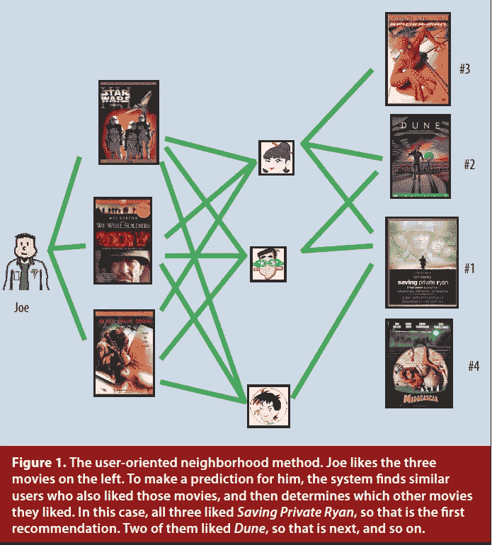
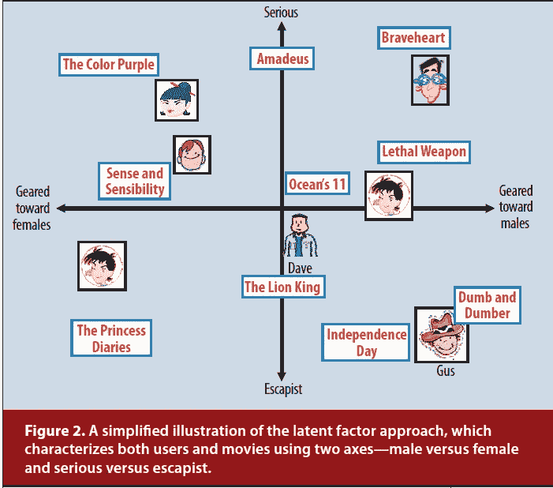
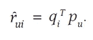
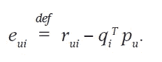
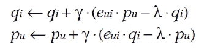
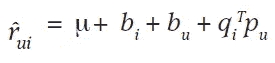
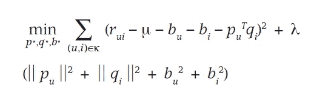
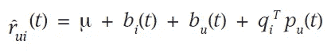

# 推荐系统的矩阵分解技术

> 原文：<https://towardsdatascience.com/paper-summary-matrix-factorization-techniques-for-recommender-systems-82d1a7ace74?source=collection_archive---------7----------------------->

Photo by [Andrew Neel](https://unsplash.com/photos/TTPMpLl_2lc?utm_source=unsplash&utm_medium=referral&utm_content=creditCopyText) on [Unsplash](https://unsplash.com/search/photos/recommend?utm_source=unsplash&utm_medium=referral&utm_content=creditCopyText)

****

Paper from this [website](https://datajobs.com/data-science-repo/Recommender-Systems-[Netflix].pdf)

**摘要**

这些天来，我们不断被各种来源推荐，比如读什么博客，听什么音乐等等…..这些推荐系统变得比以往更加个性化。本文作者利用矩阵分解技术建立了一个复杂的推荐系统，其性能优于最近邻技术。(在电影推荐系统的设置中)。

**推荐系统策略**

**内容过滤** →为每个用户或产品创建一个档案，以描述其性质(成功案例:[音乐基因组项目](https://en.wikipedia.org/wiki/Music_Genome_Project))

**协作过滤** →分析用户之间的关系和产品之间的相互依赖关系，以识别新的用户-项目关联(成功案例:Tapestry)

协同过滤通常比内容过滤更准确，但是它存在冷启动问题。(如果新用户存在，且与其他用户之间没有任何相互依赖关系，我们无法推荐任何内容)。通常有两种方法来实现协同过滤。

**邻近方法** →计算项目之间的关系，或者用户之间的关系(用户群)

**潜在因素** →创建一个潜在特征，将一个用户与另一个用户进行比较(特征库)

**矩阵分解方法**

当用户对他们看过的某部电影进行反馈时(比如他们可以从一到五打分)，这些反馈可以用矩阵的形式来表示。其中每行代表每个用户，而每列代表不同的电影。显然，矩阵将是稀疏的，因为不是每个人都会看每部电影，(当谈到电影时，我们都有不同的品味)。

矩阵分解的一个优点是它可以包含隐含的反馈信息，这些信息不是直接给出的，而是可以通过分析用户行为得到的。使用这个强度，我们可以估计用户是否会喜欢一部(他/她)从未看过的电影。如果估计的收视率很高，我们可以向用户推荐这部电影。

Image from this [website](https://medium.com/@connectwithghosh/simple-matrix-factorization-example-on-the-movielens-dataset-using-pyspark-9b7e3f567536)

上图很好地总结了矩阵分解背后的核心思想。设矩阵 A 的维数为(m，n ),这个矩阵可以看作两个矩阵之间的点积，每个矩阵的维数分别为(m，k)和(k，n)。

> 顺便说一下，上述概念与奇异值分解(SVD)密切相关。SVD 的一个缺点是，当原始矩阵稀疏(不完整)时，左右奇异向量是未定义的。

矩阵分解的概念可以用数学方法写成如下形式。

然后我们可以创建一个关于 q 和 p 的目标函数(我们希望最小化)，这是(m，k)和(k，n)矩阵。

右边的项是正则项，这是添加的，因为我们不希望我们的分解矩阵 q 和 p 过拟合原始矩阵。因为我们的目标是以一种预测未来未知评级的方式来概括以前的评级，所以我们不应该过度拟合我们的模型。

**学习方法**

求矩阵 q 和 p 的一个明显的方法是梯度下降法。因为我们已经定义了损失函数，所以对 q 和 p 取偏导数来优化这些值。

通过偏导数，更新规则看起来会像上面这样。但是误差表面不是凸的，我们也可以采用另一种方法，其中我们交替地固定 q 和 p，同时优化另一个。

**添加偏置**

一些电影有偏见，因为它被广泛认为比其他电影更好(或更差)，一些用户有偏见，因为他们超级咸，从不给电影评分超过 2 分。这些被称为偏差或截距，它们独立于任何相互作用，使用我们的两个分解矩阵 q 和 p 来解释这些偏差项是不明智的，因此我们将偏差项包含在原始方程中。

新的目标函数如下所示。

就像我们如何在原始函数中添加额外的偏置项一样，我们可以添加额外的项来解决冷启动问题。以及结合用户和项目的时间动态。(甚至自信分数)

**遗言**

我认为我们可以使用矩阵分解来构建推荐系统是非常酷的。

**参考**

1.  (2018).Datajobs.com。检索于 2018 年 11 月 22 日，来自[https://data jobs . com/data-science-repo/Recommender-Systems-[网飞]。pdf](https://datajobs.com/data-science-repo/Recommender-Systems-[Netflix].pdf)
2.  音乐基因组计划。(2018).En.wikipedia.org。检索于 2018 年 11 月 22 日，来自[https://en.wikipedia.org/wiki/Music_Genome_Project](https://en.wikipedia.org/wiki/Music_Genome_Project)
3.  使用 Pyspark 对 Movielens 数据集进行简单的矩阵分解示例。(2018).中等。检索于 2018 年 11 月 22 日，来自[https://medium . com/@ connectwithgosh/simple-matrix-factorization-example-on-the-movie lens-dataset-using-py spark-9b 7 E3 f 567536](https://medium.com/@connectwithghosh/simple-matrix-factorization-example-on-the-movielens-dataset-using-pyspark-9b7e3f567536)