# [论文摘要/ NIPS 2017 ]显著性方法的(不)可靠性

> 原文：<https://towardsdatascience.com/paper-summary-nips-2017-the-un-reliability-of-saliency-methods-8ed7774a69aa?source=collection_archive---------8----------------------->

GIF from this [website](https://giphy.com/gifs/art-design-blue-3o7TKoYwWhxyeh8kvu)

另一篇伟大的论文解释了如何解释神经网络

> **请注意，这篇帖子是给未来的自己看的，回顾这篇论文上的材料，而不是从头再看一遍。**

Paper from this [website](https://arxiv.org/pdf/1711.00867.pdf)

**摘要**

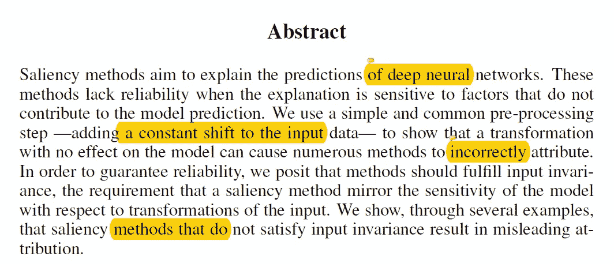

许多研究人员正在寻找方法来解释神经网络内部到底发生了什么，显著性方法就是其中之一。然而，事实证明，当解释对无助于模型预测的因素敏感时，这些方法就不那么可靠了。(如简单的常数加法到输入数据中。)并且作者已经发现，不满足输入方差属性的显著性方法会导致误导属性。

**简介**

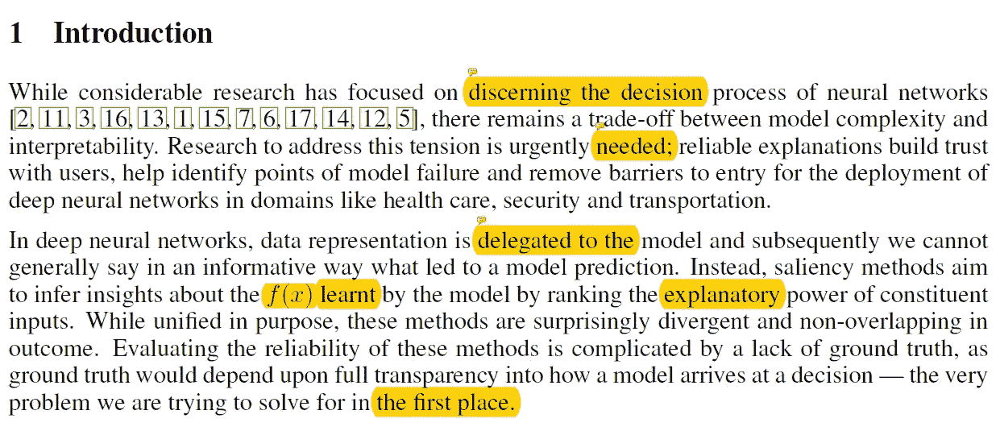

多重显著性方法旨在做同样的事情，解释神经网络内部发生了什么。(或推断对所学函数 f(x)的见解)。但是在实践中，它们是以各种不同的方式实现的，并且彼此不重叠。因为没有基本的真实数据，所以很难评估不同的方法，但是许多研究人员开发了一些属性来设置指导线，这些属性包括实现方差和输入方差。

**该模型对于输入的恒定偏移是不变的**

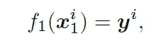

首先让我们有一个函数 f1()，它执行分类任务，输入值为 x1。

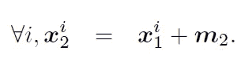

接下来让我们有输入值 x2，其中我们添加一些常数到 x1。

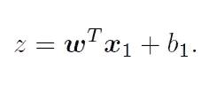

我们可以像上面这样定义 f1()函数。

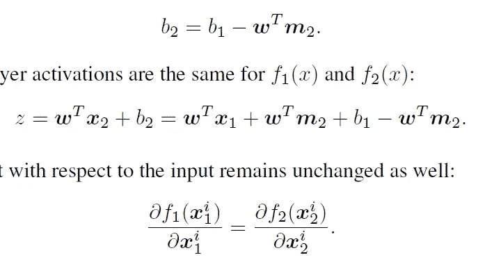

然后，可以容易地示出函数 f2()接受 x2 的输入值，如果偏移值被相应地设置，则两个函数计算相同的东西，导致每个输入的导数值也相同。(w)。换句话说，f2()的偏置值抵消了变换。作者将使用 CNN 对输入价公理做一些实验。

**显著性方法对均值漂移的(不)敏感性**

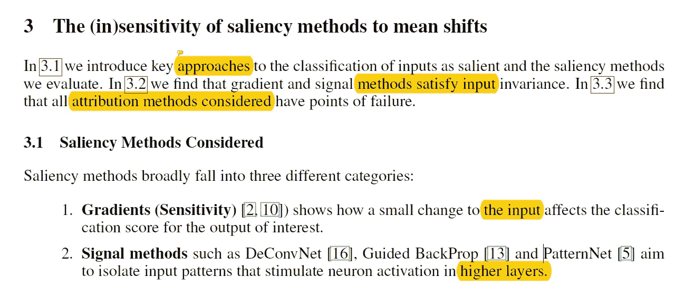

作者考虑了三种显著性方法，并考虑了每种方法的输入方差。(满足方差内移位特性的方法将导致相同的热图。)

1.  **梯度** →输入的微小变化如何影响输出
2.  **信号** →哪些输入模式刺激神经元激活
3.  **归因** →将许多不同的归因观点及其梯度相加

*梯度和信号方法满足输入方差*

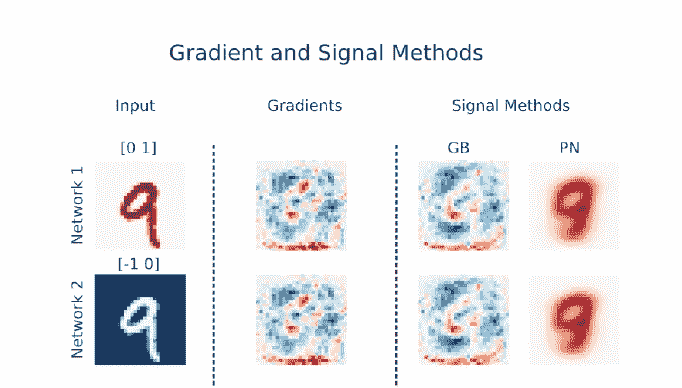

如上所述，当我们考虑基于梯度的方法以及模式网时，我们可以观察到生成的显著性热图彼此相同。(因为我们在技术上考虑的是同一个功能)。

*归因方法的敏感性*

对于归因方法，作者考虑了三种方法梯度输入(IG)，综合梯度(IG)和深度泰勒分解(DTD)。

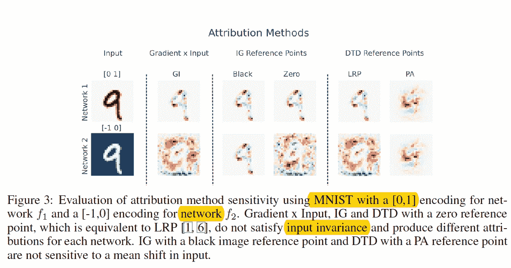

从上图中，我们可以看到 GI 对均值漂移很敏感，因此不满足输入方差特性，而其他两个方法参考点非常重要。(结果是 GI 失败的原因是由于输入值 x 的乘法，均值漂移继续存在。)

*参考点方法的可靠性取决于参考点的选择*

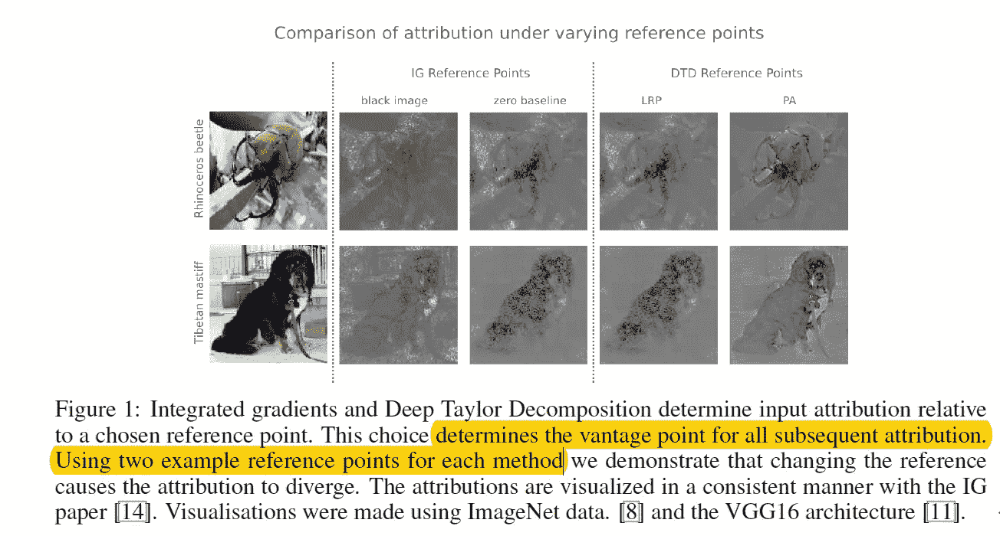

如上所述，根据 IG 和 DTD 的参考点，它会产生不同的显著性映射。对于 IG，当我们将参考点设置为由来自输入数据 x 的最小值组成的图像时，我们得到相同的显著热图，因为输入数据和参考点之间的关系很重要。但是，当我们设置一个恒定的基线参考点(如值为零的图像)时，生成的热图会有所不同。与 DTD 类似，当选择零矢量图像时，产生的热图不同，然而，当通过模式属性选择参考点时，输入方差成立。并且模式属性具有约束，因为它考虑了数据内变化的自然方向。

**选择合适参考点的重要性**

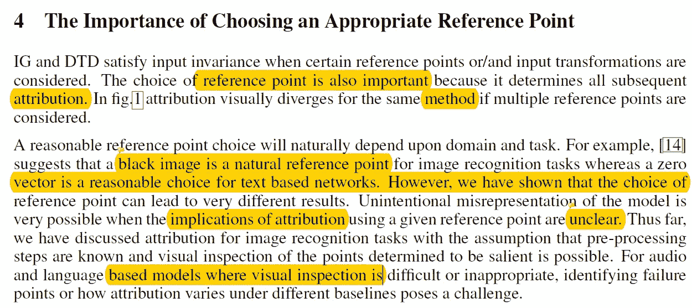

到目前为止，我们已经看到，选择正确的参考点是非常重要的，因为与处理音频或文本数据相比，视觉数据选择合适的参考点更容易。如果我们不能确定参考点选择的含义，我们就不能对这种方法的可靠性做出任何评价。

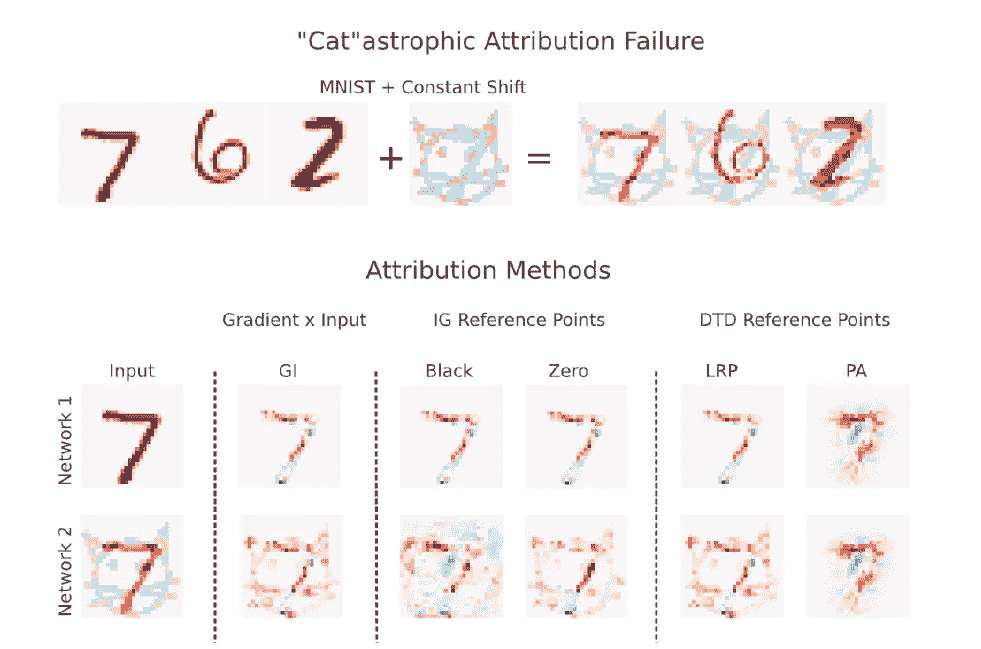

如上所述，这再次表明，选择正确的参考点可以帮助更好地理解模型正在做什么。

**结论**

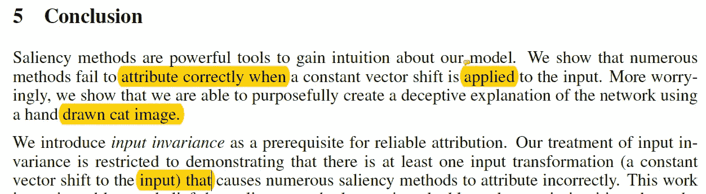

总之，本文作者提出了另一个称为输入方差的公理，其中显著性方法应反映模型对输入变换的敏感性。并且已经表明一些方法不能满足这一特性。

**最后的话**

非常酷的研究…

如果发现任何错误，请发电子邮件到 jae.duk.seo@gmail.com 给我，如果你想看我所有写作的列表，请在这里查看我的网站。

同时，在我的 twitter 上关注我[这里](https://twitter.com/JaeDukSeo)，访问[我的网站](https://jaedukseo.me/)，或者我的 [Youtube 频道](https://www.youtube.com/c/JaeDukSeo)了解更多内容。我还实现了[广残网，请点击这里查看博文](https://medium.com/@SeoJaeDuk/wide-residual-networks-with-interactive-code-5e190f8f25ec) t。

**参考**

1.  (2018).Arxiv.org。检索于 2018 年 8 月 1 日，来自[https://arxiv.org/pdf/1711.00867.pdf](https://arxiv.org/pdf/1711.00867.pdf)
2.  Kindermans，p .，Hooker，s .，Adebayo，j .，Alber，m .，Sch：tt，k . & Dé；hne，s .等人(2017 年)。显著方法的(不)可靠性。Arxiv.org。检索于 2018 年 8 月 1 日，来自[https://arxiv.org/abs/1711.00867](https://arxiv.org/abs/1711.00867)