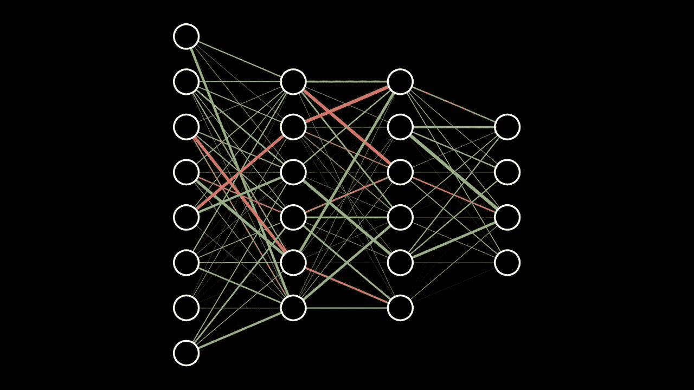
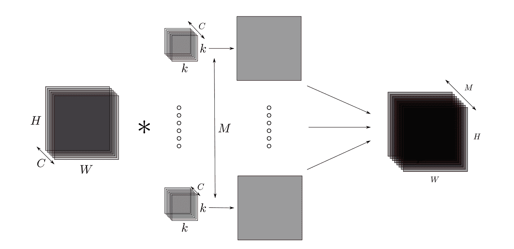
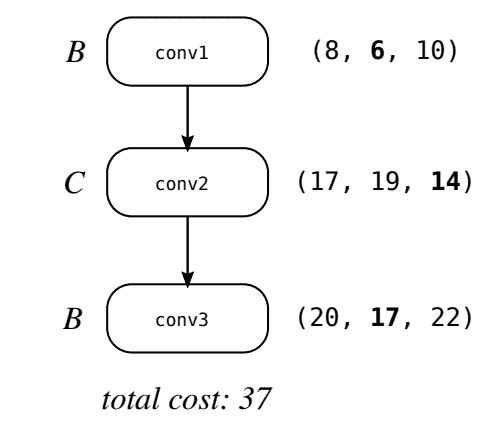
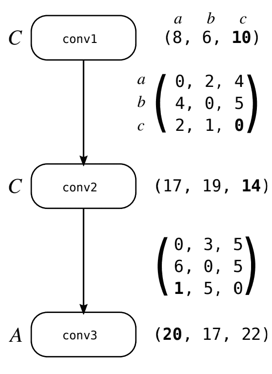
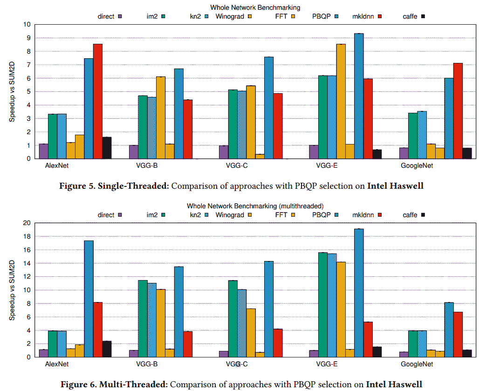
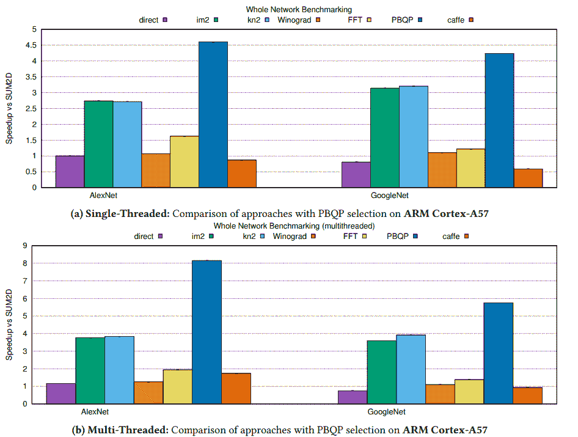

# 更快的深度学习:最优 DNN 原语

> 原文：<https://towardsdatascience.com/paper-summary-optimal-dnn-primitive-selection-with-partitioned-boolean-quadratic-programming-84d8ca4cdbfc?source=collection_archive---------5----------------------->

> 这是麻省理工学院机器智能社区(MIC)的“ML 开创性论文”系列中的一篇论文。麻省理工学院 MIC 旨在教育整个社区关于机器学习的知识，并降低进入门槛。如需了解更多信息，请访问 [https://mitmic.io](https://mitmic.io) 或发送电子邮件至【mic-exec@mit.edu】T2。

深度神经网络(DNNs)在越来越广泛的工业应用中提供了无与伦比的准确性和性能，例如图像识别、自然语言处理和自动驾驶汽车控制等其他复杂问题。尽管与旧的机器学习算法相比，dnn 的结果有了很大的改善，但在计算方面要求非常高，并且需要在大规模数据集上进行训练，需要花费大量时间。因此，为加快 DNNs 的训练时间和推理时间(在给定训练模型的情况下，实际进行预测所需的时间)做出了许多努力，这是有意义的。这使我们能够在更短的时间内对更多的数据进行训练，并在功能不太强大的设备(如手机或嵌入式系统)上进行更快的推理。在他们的论文[“使用分区布尔二次规划(PBQP)的最优 DNN 图元选择”](https://arxiv.org/pdf/1710.01079.pdf)中，Andrew Anderson 和 David Gregg 采用了一种混合方法来优化 DNN 计算。他们专注于寻找解决 *DNN 图元选择*问题的解决方案，这可以描述为决定使用哪些算法和库来运行 DNN 的每一层——该问题将在下面详细解释。他们还将问题简化为一个已知的 NP-hard 图问题， [PBQP](http://www.complang.tuwien.ac.at/scholz/pbqp.html) ，并使用现成的 PBQP-solver 来解决它。

在评估结果时，特别强调了卷积运算，这是一种计算极其密集的运算，几乎在所有图像处理 dnn 中都使用，这种网络称为[卷积神经网络(CNNs)](https://en.wikipedia.org/wiki/Convolutional_neural_network) 。

# **DNN 原语及其重要性**

DNNs 由层的有向图组成，并且数据流发生在这些层之间的有向边上。每一层都处理数据，并由标准的数学运算符组成，如[卷积](https://en.wikipedia.org/wiki/Convolution)、[激活](https://en.wikipedia.org/wiki/Activation_function)、[汇集](https://computersciencewiki.org/index.php/Max-pooling_/_Pooling)或[全连接层](https://leonardoaraujosantos.gitbooks.io/artificial-inteligence/content/fc_layer.html)。一层的输出馈入下一层，这对应于数据流。这些层被实现为一组*原语*例程，其中每个原语都是这些数学运算的优化实现。一个层有许多可能的算法和实现，这就等于说有许多可供使用的原语例程可供选择，包括开源实现和专有库。例如 [*Winograd*](https://arxiv.org/pdf/1509.09308.pdf) 和 [*FFT*](http://www.dspguide.com/ch18/2.htm) 是可以用来实现卷积的两种算法。重要的是要注意，这些原语在不同的场景中有不同的表现，这取决于层的规范。目标是为每一层选择最佳的原语例程，使得整个网络的总运行时间最小化——这个问题被称为最优 DNN 原语选择。

# **什么是卷积层？**

虽然使用的方法是通用的，并且可以很容易地对任何类型的图层进行实施和测试，但评估重点仅放在卷积图层上。这些通常支配运行时间，也用于许多重要的 CNN 图像处理。卷积层的输入通常是一个 [*张量*](https://en.wikipedia.org/wiki/Tensor) ，通常是二维图像的三维或四维表示。例如，对于典型的彩色 2-D 图像的三维表示，前二维通常编码像素的水平和垂直位置，第三维通常存储像素中红色、绿色和蓝色的量。卷积层通过在图像上滑动一系列小的“过滤器”或“内核”来处理这个张量，以执行数学卷积运算。下图显示了一个轮廓，其中大小为 H×W×C 的图像与大小为 k×k×C 的核进行卷积，以获得大小为 H×W 的输出图像(称为“特征图”)，因为有 M 个这样的核，所以输出表示为大小为 H×W×M 的张量。多个核在这里非常重要，因为它们可以使网络“学习”不同的特征和模式。例如，一个内核可能试图检测图像中猫的存在，而另一个内核可能学习检测狗。由此产生的张量——带有来自所有内核的输出——然后可以被馈送到 [*max-pooling 层*](https://www.coursera.org/lecture/convolutional-neural-networks/pooling-layers-hELHk) 中，该层将检测这 M 个模式中的哪一个最重要，例如猫内核是否找到了比狗内核更好的匹配——这实现了高精度的图像分类。

Figure 1: A convolution layer showing an image of size H×W with *C channels undergoing convolution with M kernels of size k*×*k*×*C.*

# **卷积层中的图元选择和数据格式协议**

存在大量不同的卷积原语。直接循环法、 [im2、kn2](https://arxiv.org/pdf/1709.03395.pdf) 、 [Winograd](https://arxiv.org/pdf/1509.09308.pdf) 和 [FFT](http://www.dspguide.com/ch18/2.htm) (使用快速傅立叶变换算法)，都是可以用来实现卷积的算法家族。如前所述，每种算法的性能取决于卷积层的参数和规格。例如，直接循环方法在 [*步进*卷积](https://www.coursera.org/lecture/convolutional-neural-networks/strided-convolutions-wfUhx)上表现良好，其中内核跳过一些输入像素以给出较小的输出图像，im2 家族在这种情况下也表现良好。然而，直接循环方法通常较慢，im2 算法非常占用内存。Winograd 速度非常快，但不可预测。FFT 也是一个平衡性能的选择，但是对于小内核来说是不好的；尽管具有较低的渐近复杂度，但它具有较大的开销，因此导致较低的复杂度仅在输入较大时有益。其他参数，如通道数量(即上图中的 C 值)也会影响图元的最佳选择。

因为在典型的 CNN 中，每一层的参数变化很大，所以为每一层选择不同的原语是有意义的，以便最小化整个网络上计算的总运行时间。乍一看，这似乎是一个非常容易解决的问题:在实际运行整个网络之前，我们可以简单地尝试每一层上的每个原语，并在一个列表中记录运行时间(让我们将这个列表称为“成本向量”)。对于这个试运行，我们可以只使用随机输入值，因为运行时间并不真正取决于值本身，而只是它们的总数。这实际上是作者们开始做的。

在对运行时间进行采样后，我们可以通过查看哪种算法在试验中表现最佳来为每一层选择最佳算法——问题解决了！该过程如下所示:

Figure 2: A graph showing a 3-layered CNN. The “cost vectors” shown beside each layer represent the costs of primitives A, B, and C for each layer. For example, on layer conv1, primitive A runs with a cost of 8, primitive B with a cost of 6, and C costs 10 — similarly for the other layers.

这里卷积层表示为节点: *conv1* 、 *conv2* 和 *conv3* 。这三个原语是 A、B 和 c。图中显示了每一层的原语成本向量(由试运行确定),我们可以看到，优化整个网络就是选择最低成本原语。在这种情况下，它对应于为 *conv1* 选择算法 B，为 *conv2* 选择算法 C，并再次为 *conv3* 选择算法 B。网络的总成本是每层成本的总和。

然而，这种天真的解决方案遗漏了一个关键的方面。它没有考虑每个原语操作不同*数据格式的数据的事实。*例如，一些原语接受并产生 16 位浮点格式的输出值，而其他原语使用 32 位浮点。有些图元还需要输入图像尺寸的特定排列，CHW(通道×高度×宽度)和 HWC(高度×宽度×通道)是两种不同的数据格式，特定图元可能只能操作其中一种格式。另一个例子是，如果对信号进行操作，数据可以用[*频域*](https://en.wikipedia.org/wiki/Frequency_domain) 表示，或者用 [*时域*](https://en.wikipedia.org/wiki/Time_domain) 表示(这两者只是表示同一信号的不同方式)，不同的原语可能只支持其中一种格式。如上图所示，必须考虑到这一点，可能 *conv1* 使用的数据格式与 *conv2* 不同，数据需要从 *conv1* 格式转换为 *conv2* 格式，然后才能在它们之间传递— *这种转换需要时间*。因此，我们需要在优化中考虑数据格式转换的成本。

# **PBQP**

由此产生的优化问题现在不仅考虑了原语的运行时间，还考虑了连续层中使用的原语之间的*数据格式转换时间*。作者表明，这等价于一个已知的 NP-hard 问题， [*【分块布尔二次规划】*](http://www.complang.tuwien.ac.at/scholz/pbqp.html) 。在 PBQP 中，给我们一个图，每个节点必须被分配一个标签，这个标签来自一组给定的代表成本的标签。因此，每个节点都有一个针对所有标签的“成本向量”，这与上图中的问题类似。为节点选择标签的成本会将相应的成本添加到我们目标的总成本中，这是我们希望最小化的成本。但是除了节点的成本之外，每个边也有成本。边的成本既取决于源节点标签的选择，也取决于目标节点标签的选择。因为它依赖于两个连接节点的标签，所以它可以被认为是一个矩阵(因为它由两个标签索引)。下图对此进行了说明:

Figure 3: A graph showing a 3-layered CNN. The cost vectors are also shown for primitives *a*, *b*, and *c* similar to Figure 1*.* The edge cost matrices are also shown, where the row represents the label of the source node, and the columnrepresents the label of the target node. For example, selecting primitive *c* for conv1 costs 10, and selecting primitive *b* for conv2 costs 19\. But an additional edge cost of 5 also occurs as given by the edge cost matrix.

在上图中我们可以看到， *conv1* 的最低成本原语是成本为 6 的原语 *b* ，而 *conv2* 的最低成本原语是成本为 14 的原语 *c* 。但是现在我们还必须考虑边成本，并且使用这种分配给出了额外的边成本 5，这是通过适当地索引到边成本矩阵中给出的。因此，实际上为 *conv1* 选择原语 *c* 更好，因为它给出的边成本为零。总成本就是所有节点和边成本的总和，这是我们现在想要最小化的目标。

# **实施和测试**

既然我们有了要解决的正确问题，我们就可以实现并测试它了。为此，我们首先需要运行原语的成本，以及数据格式之间转换的成本。通过针对实际大小的随机输入运行每一层的图元来预先计算运行图元的成本，并且这应该是相当准确的，因为层的运行时间取决于输入大小而不是实际值。

数据格式转换成本也可以通过运行转换和采样时间来预先计算，如果无法直接转换，则使用成本最低的转换路径。这意味着，例如，如果数据格式 A 不能转换为数据格式 B。但是 A 可以转换为数据格式 C，而数据格式 C 又可以转换为 B，则使用转换成本的总和(这被建模为[所有对最短路径](https://en.wikipedia.org/wiki/Shortest_path_problem)问题，并且容易解决)。

一旦成本向量和矩阵准备就绪，就可以使用现成的 PBQP 求解器来获得要进行基准测试的 DNN 的最佳图元选择。在三个流行的神经网络上测试了性能: [AlexNet](https://en.wikipedia.org/wiki/AlexNet) 、 [VGG Model E](http://www.robots.ox.ac.uk/~vgg/research/very_deep/) 和 [GoogleNet](https://ai.google/research/pubs/pub43022) 。运行时间与只使用单个原语时的性能进行了比较，也与 [Caffe](http://caffe.berkeleyvision.org/) (一个流行的深度学习框架)进行了比较。英特尔的 [MKL-DNN 库](https://software.intel.com/en-us/mkl?cid=sem43700011947833356&intel_term=%2Bdnn%20%2Blibrary&gclid=CjwKCAjwp7baBRBIEiwAPtjwxMgTLfUWKwcyinBO5XHDhSFIUlGssEAmbINBZ6D8LuUonbYy_HA5XhoCvx8QAvD_BwE&gclsrc=aw.ds)的基准也包括在内，它是一个针对 DNN 原语优化的 [JIT 编译器](https://en.wikipedia.org/wiki/Just-in-time_compilation)。实验在不同的硬件架构上进行，英特尔 Haswell 的速度结果如下所示(越高越好):

Figure 4\. Speedups on Intel Haswell of different algorithms for running various popular DNNs.

我们可以看到，在英特尔 Haswell 上，PBQP 原语赋值在多线程的情况下优于所有其他方法，甚至是英特尔自己的 MKL-DNN 神经网络编译器。在单线程运行的情况下，MKL-DNN 在 AlexNet 和 GoogleNet 网络中的性能稍好，但 PBQP 方法非常接近，仍然优于其他方法。对 VGG 来说，PBQP 方法也优于 MKL-DNN 法。

ARM Cortex 的性能结果如下所示(越高越好):

Figure 5\. Speedups on ARM Cortex of different algorithms for running various popular DNNs

这里我们还可以看到，PBQP 分配优于 ARM Cortex-A57 架构上的所有其他网络实现。

# **讨论和结论**

从实验结果可以清楚地看出，PBQP 公式在选择最佳基元来实现 DNN 方面极其有效。存在其他 DNN 优化框架，其中一些使用类似的技术来实现更快的 DNN 计算。也许最快的例子是 NVIDIA 的 cuDNN，它也使用了对于给定的层来说最快的实现/原语。这与 PBQP 求解器形成对比，因为它不考虑边成本，即数据格式转换的时间。 [Tensorflow XLA](https://www.tensorflow.org/performance/xla/) 是另一个框架，它基本上是 DNNs 的提前编译器。它计算跨层转换和数据格式转换的成本，并尝试合并层以避免这些成本，这在某种程度上类似于 PBQP 方法。结果表明，PBQP 方法改进了 DNN 运行时间，因此它可能非常适合于被 DNN 优化框架采用以进行改进。作者在 2018 年代码生成和优化国际研讨会(CGO)上提交了这篇论文，论文中采用的方法使我们能够更快地训练 DNNs，并在越来越多的廉价移动和嵌入式处理器上执行深度学习和推理。

## 关于作者

> 阿里·扎塔什(Ali Zartash)是麻省理工学院(MIT)的一名大四学生，也是麻省理工学院机器智能社区(MIC)的成员，该社区是本科生人工智能俱乐部。今年夏天，他在[谷歌](https://www.google.org/)实习，从事社交排名/推荐系统的数据管道和图形工作，此前他曾在 [SpaceX](http://www.spacex.com/) 实习，从事 GPU 负载分配工作。他把空闲时间花在和朋友踢足球上。欲了解更多关于 MIC 的信息，请访问