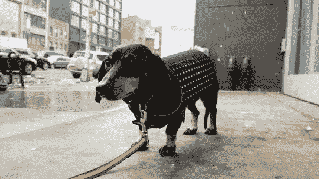
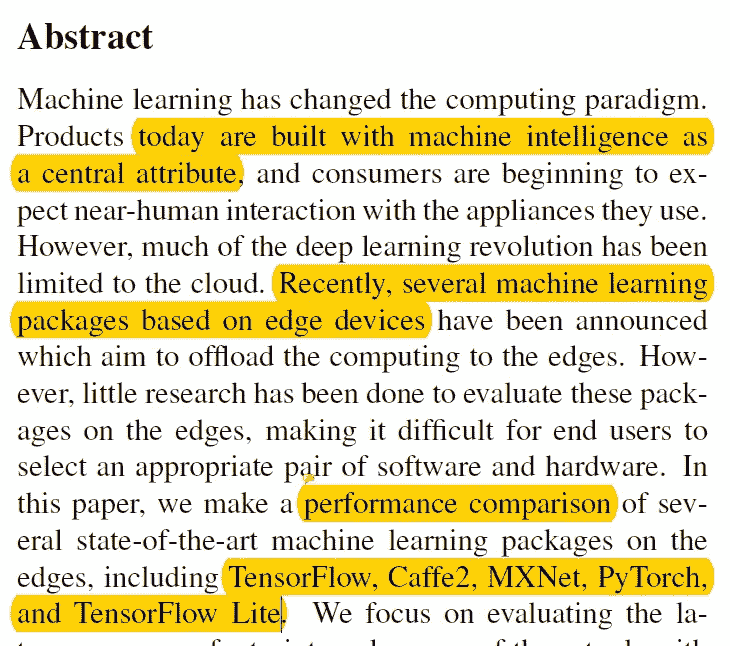
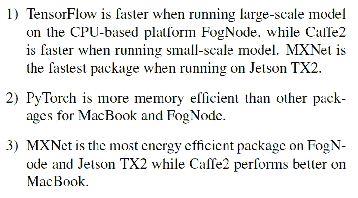
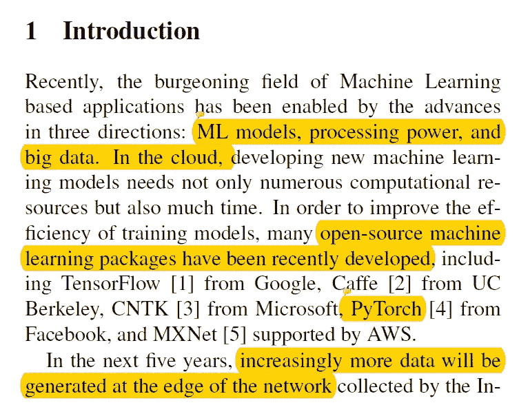
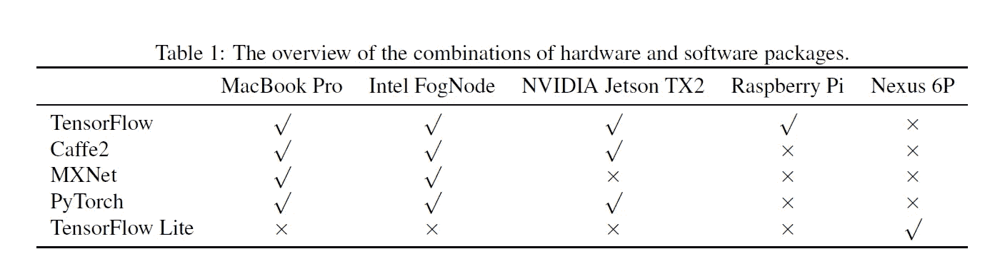
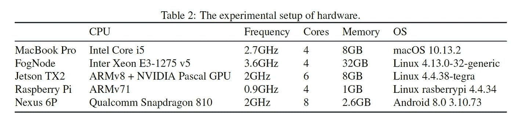
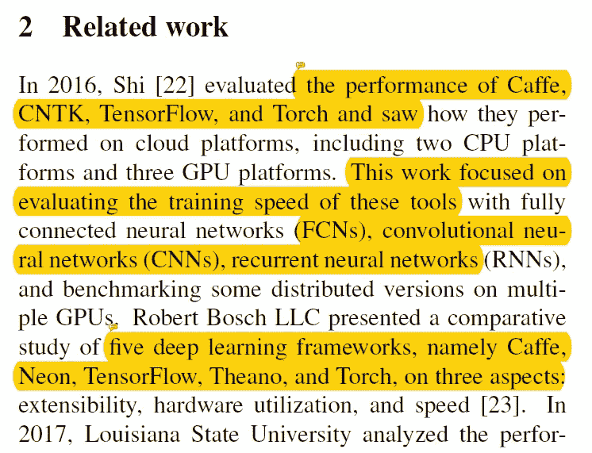
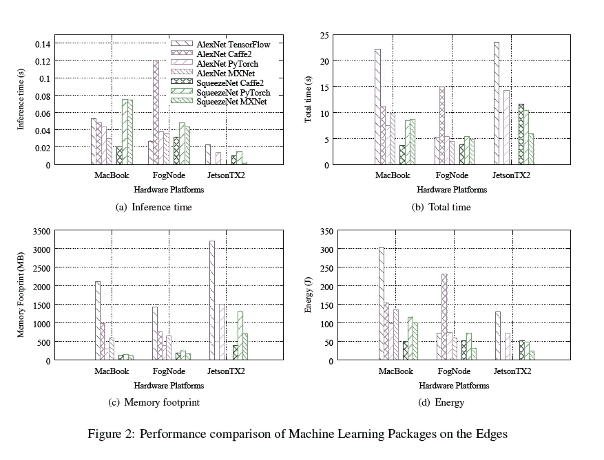
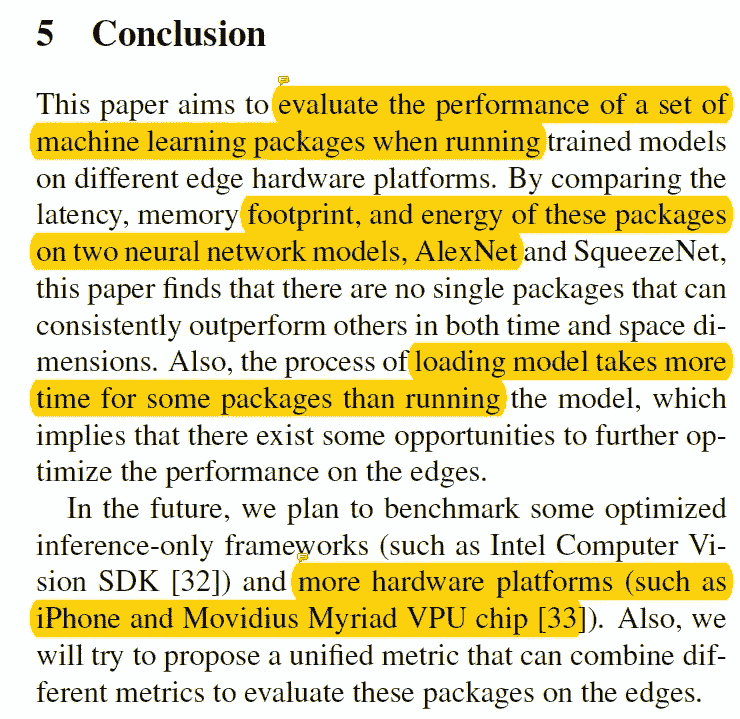

# [论文摘要] pCAMP:机器学习包在边缘上的性能比较

> 原文：<https://towardsdatascience.com/paper-summary-pcamp-performance-comparison-of-machine-learning-packages-on-the-edges-3cec1b5cad4c?source=collection_archive---------11----------------------->

GIF from this [website](https://giphy.com/gifs/design-tech-dogs-ieEvFix4tlcEU)

我个人喜欢 Tensorflow，但是我想知道它与不同框架相比表现如何，特别是在像 [Raspberry Pi 3](https://www.raspberrypi.org/products/raspberry-pi-3-model-b/) 这样的物联网设备上。

> **请注意，这篇文章是让我未来的自己回顾和回顾这篇论文上的材料，而不是从头再看一遍。**

**摘要**

本文的主要重点是比较运行在物联网设备上的不同机器学习包的性能。我们要比较的库包括…

***1*** [***。tensor flow***](https://www.tensorflow.org/)*→tensor flow 是一个用于高性能数值计算的开源软件库。来自谷歌。*

**②*。***[***Caffe 2***](https://caffe2.ai/)*→***一种全新的轻量级、模块化、可扩展的深度学习框架。来自 FaceBook**

****3。***[***MXNet***](https://mxnet.apache.org/)**→灵活高效的深度学习库。来自阿帕奇***

*****4。***[***py torch***](https://pytorch.org/)**→快速、灵活实验的深度学习框架。来自 FaceBook****

*****5。***[***Tensorflow Lite***](https://www.tensorflow.org/mobile/tflite/)**→一款面向移动和嵌入式设备的 tensor flow 轻量级解决方案。来自谷歌****

****太久没看了(TL；博士)****

****

1.  ****每个指标都没有明显的赢家，每个包都有自己的优势。****
2.  ****加载模型所需的时间很长，因此可能有机会优化加载时间。****
3.  **牺牲空间来提高执行效率可能是优化这些包的好方法。**

****Tensorflow** →适用于基于 CPU 的物联网大网络
**Caffe 2** →适用于小网络
**MXNet** →适用于杰特森 TX 2
**PyTorch** →内存高效
**Tensorflow Lite** →？？？**

****简介****

****

**由于更复杂的机器学习模型、更高的处理能力和大数据，基于机器学习的应用程序呈指数级增长。然而，越来越多的计算是在边缘(雾)而不是云中进行的，但是有少量的研究可以比较不同框架的性能。因此，在本文中，作者将使用 Alex Net(大型网络)和 Squeeze Net(小型网络)来查看 MacBook Pro (MacBook)、英特尔的 Fog node(Fog node)、NVIDIA Jetson TX2 (Jetson TX2)、Raspberry Pi 3 Model b+(Raspberry Pi)和华为 Nexus 6P 的性能。完整的硬件和软件表如下所示。**

********

****相关工作****

****

**其他研究人员早在 2016 年就已经在衡量不同图书馆的表现。然而，他们测量的是云平台而不是物联网设备的性能。**

****实验方法****

****

**在这一部分，作者给出了每个框架的简要总结和历史。以及 Alex 网和 Squeeze 网的简单总结和历史。总之，Alex Net 有 61，100，840 个参数和 240MB 大小，而 Squeeze Net 有 1，248，424 个参数和 4.8MB 大小。**

**此外，作者指出，对于 Tensorflow Lite，他们无法获得官方的 Alex Net 或 Squeeze Net，因此他们使用了可用的 [MobileNet](https://arxiv.org/abs/1704.04861) 。最后，作者给出了他们如何测量每个指标的细节，他们是。**

**1.延迟→运行/加载模型的时间。
2。内存足迹→模型占用多少内存。
3。能量→模型需要多少能量。**

****结果和讨论****

****

**除了 Raspberry Pi 和 Nexus 6P，所有指标都在上图中进行了总结。**

****树莓 PI (Sqeeuze Net/Caffe 2)** →总时间 218.67s .
**Nexus 6P(Mobile Net/tensor flow Lite)**→推理时间(加载时间)0.26s**

**最后，每个指标的所有结果都可以很好地总结如下。**

**1.**延迟** →对于某些包，加载模型然后运行它需要更长的时间。**

**2.**内存** → MXNet，特别是，似乎牺牲空间来提高效率，其他框架可以遵循类似的优化方法。**

**3.**能量** →潜伏期和能量之间似乎存在正相关关系。这意味着模型运行的时间越长，需要的能量就越多。**

****结论****

****

**总之，没有一个框架能够在每个指标上胜过其他框架。然而，似乎每个框架都有改进的空间，例如减少加载模型的时间。**

****遗言****

**很想知道 Tensorflow Lite 在 Iphone 上运行如何[😂](https://emojipedia.org/face-with-tears-of-joy/)。我预计 Tensorflow 会占用大量内存/电源和所有东西。但我不知道要花这么多钱。**

**如果发现任何错误，请发电子邮件到 jae.duk.seo@gmail.com 给我，如果你想看我所有写作的列表，请在这里查看我的网站。**

**同时，在我的 twitter [这里](https://twitter.com/JaeDukSeo)关注我，并访问[我的网站](https://jaedukseo.me/)，或我的 [Youtube 频道](https://www.youtube.com/c/JaeDukSeo)了解更多内容。我还实现了[广残网，请点击这里查看博文 pos](https://medium.com/@SeoJaeDuk/wide-residual-networks-with-interactive-code-5e190f8f25ec) t。**

****参考****

1.  **(2018).Cs.wayne.edu。检索于 2018 年 6 月 12 日，来自[http://www.cs.wayne.edu/~weisong/papers/zhang18-pCAMP.pdf](http://www.cs.wayne.edu/~weisong/papers/zhang18-pCAMP.pdf)**
2.  **树莓 Pi 3 型—树莓 Pi。(2018).树莓派。检索于 2018 年 6 月 13 日，来自[https://www . raspberry . org/products/raspberry-pi-3-model-b/](https://www.raspberrypi.org/products/raspberry-pi-3-model-b/)**
3.  **张量流。(2018).张量流。检索于 2018 年 6 月 13 日，来自[https://www.tensorflow.org/](https://www.tensorflow.org/)**
4.  **咖啡 2。(2018).咖啡 2。检索于 2018 年 6 月 13 日，来自[https://caffe2.ai/](https://caffe2.ai/)**
5.  **MXNet:一个可扩展的深度学习框架。(2018).Mxnet.apache.org。检索于 2018 年 6 月 13 日，来自[https://mxnet.apache.org/](https://mxnet.apache.org/)**
6.  **PyTorch。(2018).Pytorch.org。检索于 2018 年 6 月 13 日，来自[https://pytorch.org/](https://pytorch.org/)**
7.  **TensorFlow Lite 介绍| TensorFlow。(2018).张量流。检索于 2018 年 6 月 13 日，来自[https://www.tensorflow.org/mobile/tflite/](https://www.tensorflow.org/mobile/tflite/)**
8.  **Howard，a .，Zhu，m .，Chen，b .，Kalenichenko，d .，Wang，w .，& Weyand，t .等人(2017 年)。MobileNets:用于移动视觉应用的高效卷积神经网络。Arxiv.org。检索于 2018 年 6 月 13 日，来自 https://arxiv.org/abs/1704.04861**