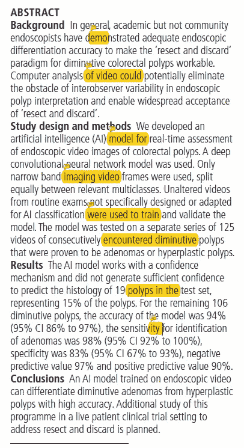
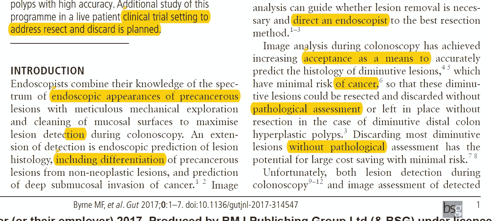
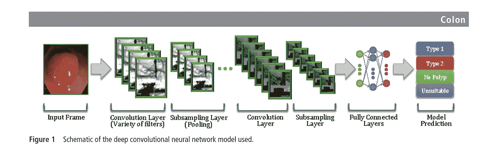
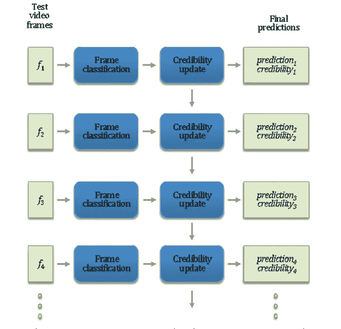
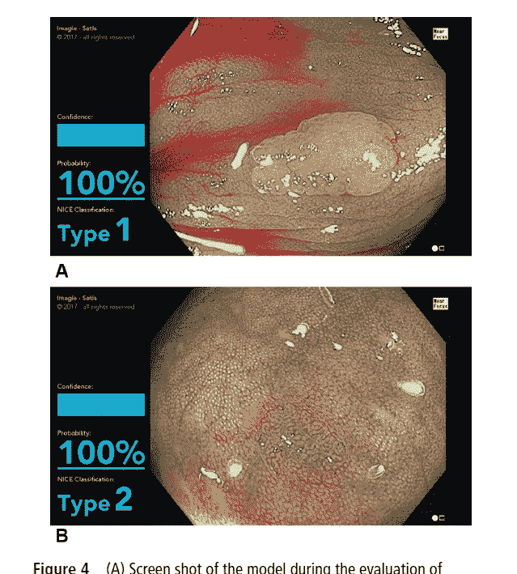
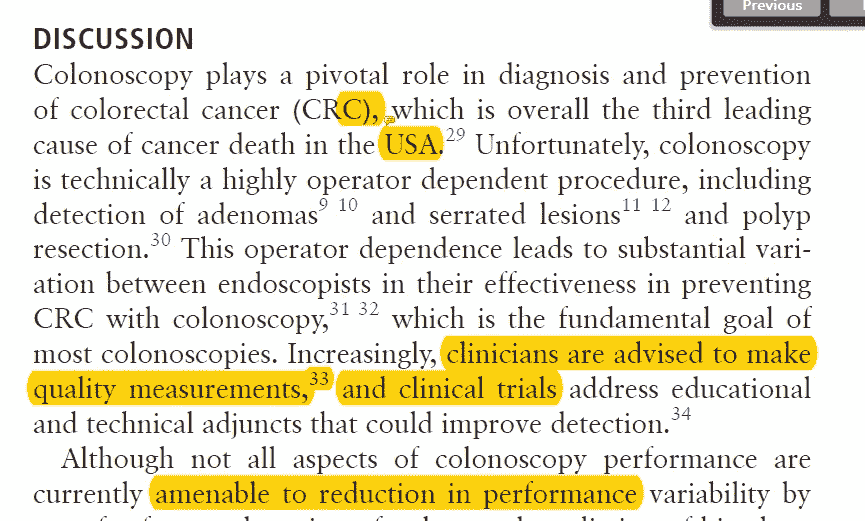

# [论文摘要]在使用深度学习模型分析标准结肠镜检查的未改变视频期间，实时区分腺瘤性和增生性小结肠直肠息肉

> 原文：<https://towardsdatascience.com/paper-summary-real-time-differentiation-of-adenomatous-and-hyperplastic-diminutive-colorectal-b1f726d97edd?source=collection_archive---------13----------------------->

GIF from this [website](https://giphy.com/gifs/ghr-lMFfNhNxsveCI)

同样，越来越多的这些论文显示了深度学习可以为医疗保健行业提供什么。

> ****

Paper from this [website](https://www.ncbi.nlm.nih.gov/pubmed/29066576)

**摘要**

计算机辅助系统有助于以高精度区分小腺瘤和增生性息肉。在本文中，作者展示了一个使用卷积神经网络对息肉进行分类的示例。

***关于这个问题已经知道了什么？/有什么新发现？***

总的来说，专家取得了良好的结果，但是社区内镜专家未能保持一些有价值的内镜创新(PIVI)指南的保存和整合。人工智能可能会对这些领域有所帮助。本文的作者展示了一个使用案例，其中使用深度学习可以实现实时分类。

**简介**

在结肠镜检查期间，内窥镜专家做出不同的决定，例如癌症类型的分类和切除或保留的区域。在手术过程中，图像分析可以帮助内窥镜专家。目前，图像分析在精确确定具有最小癌症风险的微小病变的组织学方面取得了成功。(反过来，这也有经济上的好处。).然而，这些方法通常依赖于操作员，因此在某些情况下，社区医生的准确性低于可接受的性能阈值。

为了克服这些问题，已经研究了不同的成本有效的方法。其中一个成果是 NBI 国际结肠直肠内窥镜(NICE)分类系统。这个系统是为了帮助没有丰富经验的内窥镜专家而开发的。但是这种方法不能解决诸如无柄锯齿状息肉(SSPs)的问题。

自动图像分析更近的发展被开发以改进肿瘤检测。传统的图像分析技术依赖于手工制作的特征，并且它们在某些情况下并不健壮。但是深度学习的发展有可能克服这些问题。本文作者利用深度卷积神经网络对不同类型的多边形进行分类。

**方法**

使用奥林巴斯结肠镜上捕获的 NBI 视频，本文的作者成功地训练了一个深度卷积神经网络。并且所有使用的数据在用于本研究之前都被去识别。

DCNN 的一个优点是，人类不必为模型的成功表现制作手工特征。并且大致的网络架构可以在上面看到。(他们使用 SGD，mini batch 128，以及执行翻转的数据扩充。)最后，息肉分为两类:常规腺瘤或锯齿状病变。

如上所述，关于框架的一个有趣的事实是可信度的概念。其中它表示模型的置信水平。如果可信度低于 50 %,这些预测将被排除在准确性计算之外。所有使用的视频都是 10-20 秒，中间值为 16 秒。

**结果**

125 个息肉视频被用作测试集，然而在这些数据中，只有 106 个被用于计算模型的准确性，因为它们具有足够高的可信度。

对于 106 个息肉，准确率为 94%，识别腺瘤的灵敏度为 98%，特异性为 83%，阴性预测值为 97%，阳性预测值为 90%。

**讨论**

结肠直肠癌是美国癌症死亡的第三大原因，结肠镜检查不仅在该疾病的识别中而且在该疾病的治疗中起着关键作用。虽然不是结肠镜检查的所有方面都可以被软件取代，但是息肉的检测和组织学的预测是软件可以发挥作用的两个方面。这篇论文的作者已经表明，使用人工智能来高精度地执行这些任务是可能的。(甚至足以说，该模型比一些社区内窥镜专家表现得更好。).

**遗言**

尽管本文作者在测量精度时丢弃了一些测试数据，但本文提供了有希望的结果。写得非常好。

**参考**

1.  Byrne MF，e. (2018)。在分析标准结肠镜检查的未改变视频期间，腺瘤性和增生性小结肠直肠息肉的实时鉴别… — PubMed — NCBI。Ncbi.nlm.nih.gov。检索于 2018 年 7 月 9 日，来自[https://www.ncbi.nlm.nih.gov/pubmed/29066576](https://www.ncbi.nlm.nih.gov/pubmed/29066576)