# 【论文摘要】语义图像分割的最新进展

> 原文：<https://towardsdatascience.com/paper-summary-recent-progress-in-semantic-image-segmentation-d7b93ee1b705?source=collection_archive---------8----------------------->

GIF from this [website](https://giphy.com/gifs/brain-T2uDEsxSm7NiU/links)

我想知道更多关于不同的语义分割方法，这篇文章给出了一个很好的概述。

> **请注意，这篇帖子是给未来的自己看的，回顾这篇论文上的材料，而不是从头再看一遍。**

**摘要**

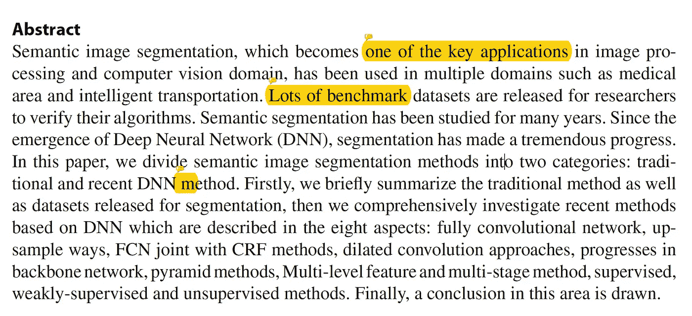

语义分割已经被研究了很长时间，它给医学图像领域以及其他领域带来了巨大的好处。此外，由于深度学习的最新发展，机器学习方法也能够得到应用。本文阐述了传统方法和深度学习方法。

**简介**

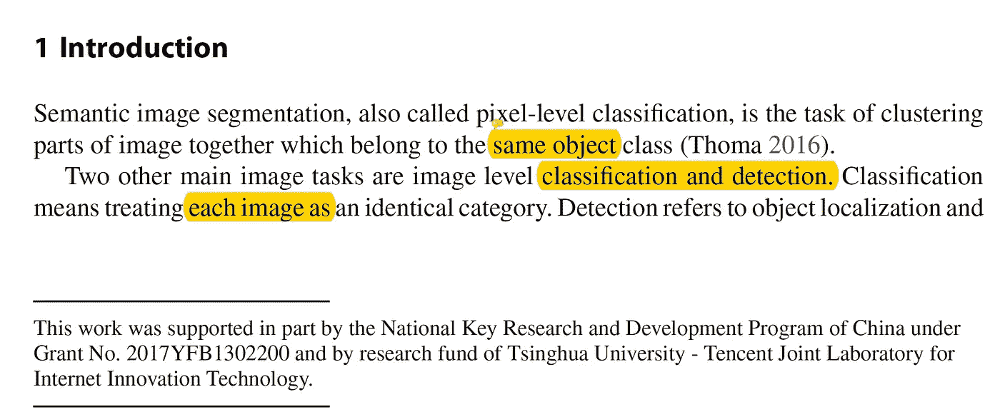

通常分割可以被认为是像素级分类，而不是把整个图像作为一个类来对待，我们要预测每个像素属于哪个类。(即物体检测或定位。).这一过程有很多应用，例如自动驾驶汽车的道路分割，或者该算法可以分割 MRI 扫描的癌症区域的医疗设置。一般来说，这种方法可以分为传统方法和深度学习方法。(由于深度学习，分割精度大大提高了。).

**数据集/评估指标**

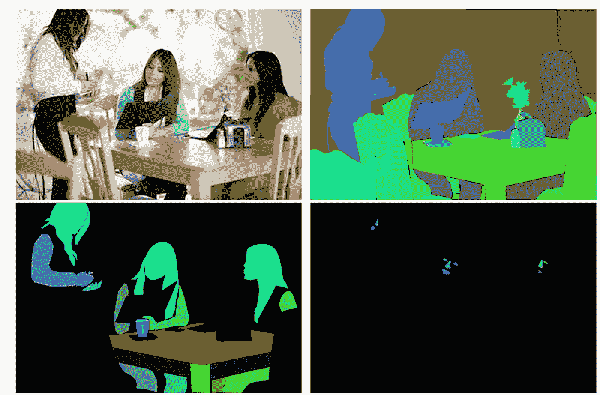

已经有许多数据集用于语义分割和评估。，比如 PASCAL VOC，或者微软 COCO 数据集。(甚至还有城市景观数据集等…..).这些数据集主要目标是道路分割、光流估计和 3D 跟踪。图像分割和场景解析的评估包括像素精度、平均精度、[并集上的区域交集](https://www.pyimagesearch.com/2016/11/07/intersection-over-union-iou-for-object-detection/)和频率加权 IU。

**传统方法**

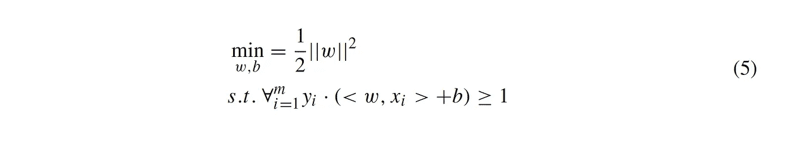

在深度学习之前，很多方法都包括特征提取。用于执行语义分割的一些特征研究包括，梯度方向直方图(HOG)、尺度不变特征变换(SIFT)和 Harris 角点，仅举几个例子。(还有很多，下面是文章的截屏。)

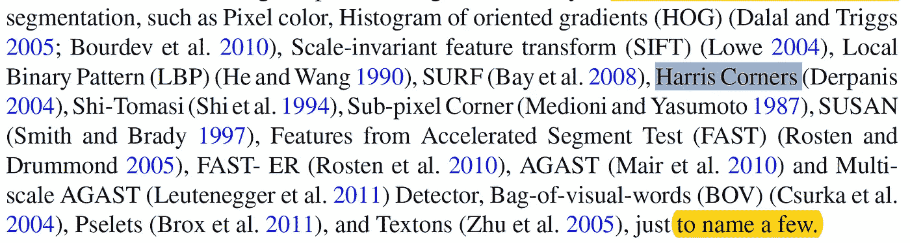

并且执行分割的方法包括简单的阈值处理。(基本上都有一些截止频率/像素强度。)这种方法在医学图像领域非常有效，其中图像通常是灰度级的。一些非监督方法包括 K 均值聚类，以聚类相似的像素，并且在监督学习的情况下，使用支持向量机。最后，马尔可夫随机网络和条件随机场及其变体也广泛用于分割。

**最近 DNN 在分段**

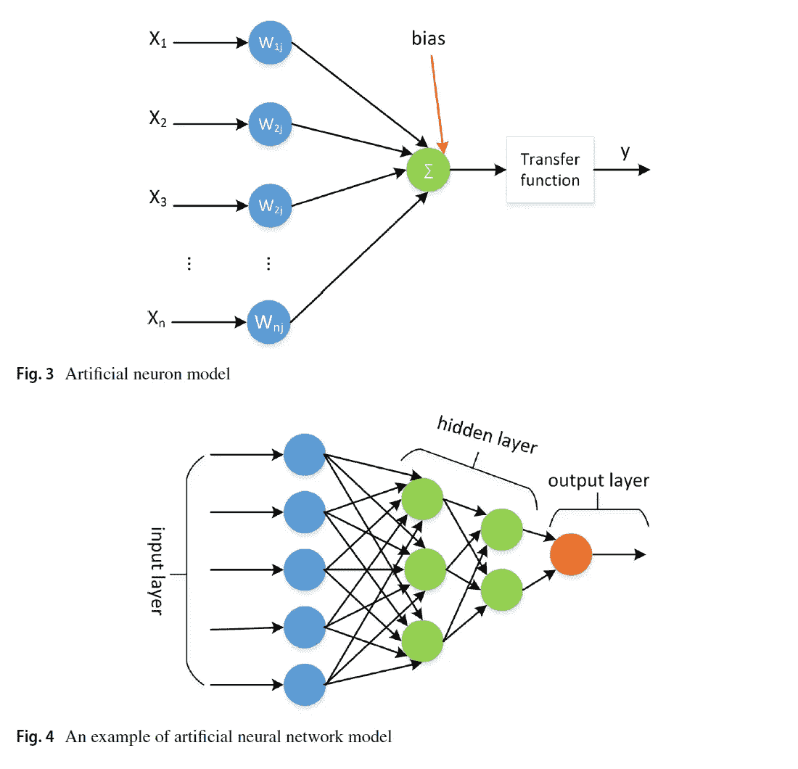

不同类型的神经网络，例如 ANN、RNN、CNN、LSTM 或 RBM 都可以用于执行分割。尽管有各种各样的 CNN，但它通常用于涉及图像的任务。此外，全卷积神经网络是分割中最流行的网络结构之一。

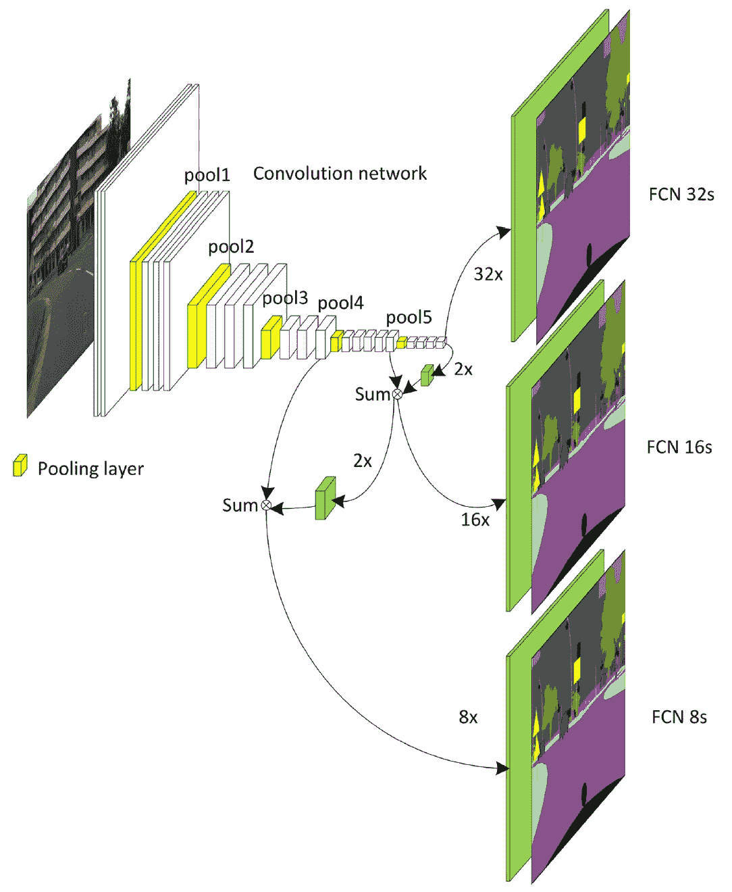

另一种流行的网络架构是上/下采样网络，类似于自动编码器。存在跟随有上采样网络的下采样网络。(这个地区最著名的网络之一是 U-Net)。

**FCN 联合 CRF 及其他传统方法/扩张卷积**

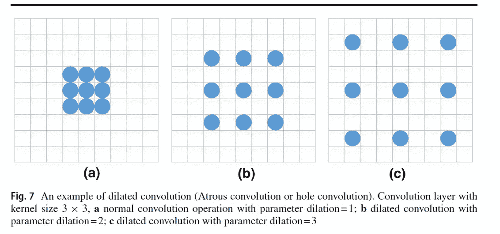

除了全卷积网络之外，还使用了不同的网络架构，包括具有 CRF 的 FCNN 或具有域转移的 RCNN，甚至马尔可夫随机场(MRF)。扩张卷积是在内核中插入 0 以增加感受野的卷积运算。(如上所示)第一种，这种网络被称为扩张残差网络(DRN ),以消除由常规扩张卷积运算产生的伪影。

**骨干网/金字塔法细分进展**

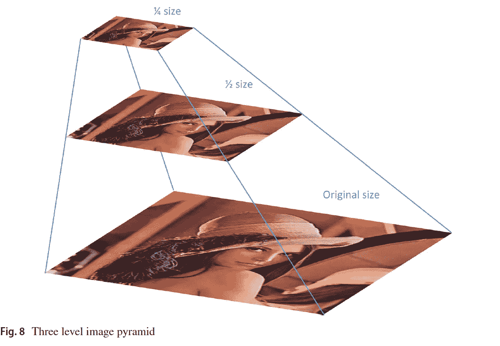

一般来说，骨干网是指网络的主体部分。在深度学习的初期，许多研究使用 VGG 网络作为它们的基础网络。然而，网络体系结构发展导致了残差网络，这种类型的网络甚至以完全卷积残差网络的形式被应用于语义分割。

除了主干网络的发展，研究人员还研究了不同的策略，其中一种策略包括金字塔网络。其中图像被下采样，直到达到一些期望的停止标准。有两种常见的图像金字塔:高斯金字塔，用于对图像进行下采样；拉普拉斯金字塔，用于从金字塔中较低位置的图像重建上采样图像。在语义分割的背景下，图像及其缩小版本可以用作网络的输入。(如下图)。

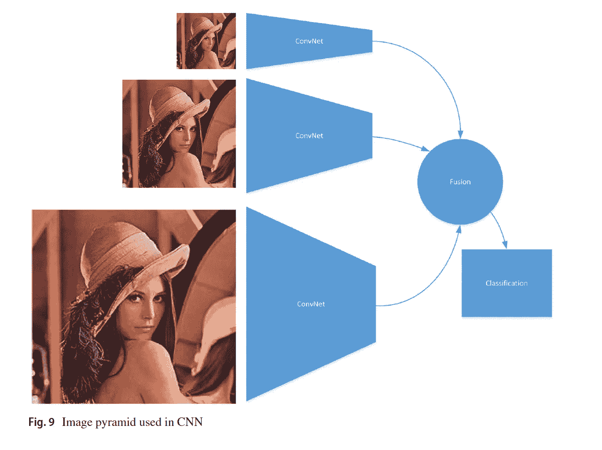

另一种金字塔方案是阿特鲁空间金字塔池(扩张卷积金字塔池)，其中网络使用扩张卷积运算来缩小给定图像。

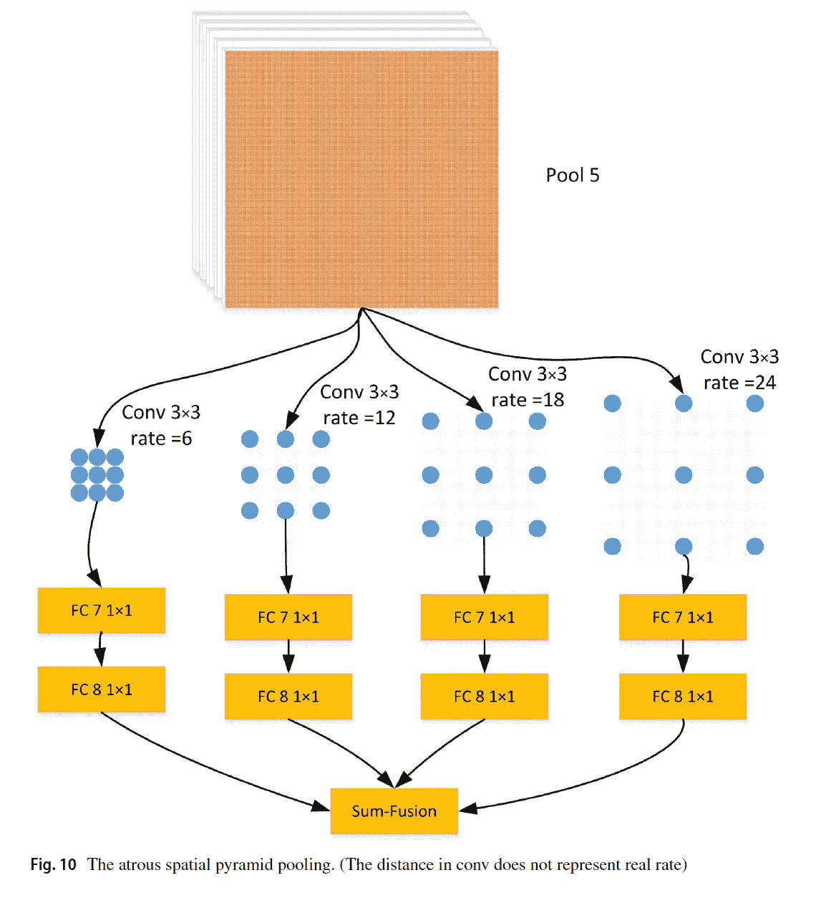

**结论**

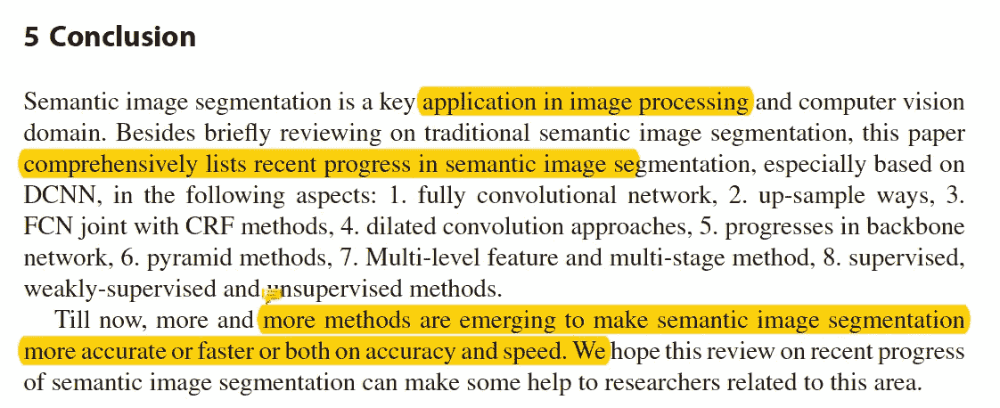

总之，本文作者回顾了一些传统的语义分割方法。以及深度学习方法，其中包括…

1.  全卷积神经网络
2.  向上/向下采样方法
3.  FCN 加入了通用报告格式
4.  扩张卷积
5.  脊柱网络的研究进展
6.  金字塔网络
7.  多级特征和多阶段方法(未涉及)
8.  监督/弱监督方法和非监督方法。(未覆盖)

**最后的话**

这篇论文是对与深度学习相关的不同类型的细分的一个很好的概述。最后，由于我要赶飞机，我没有介绍多级特征和多阶段方法以及监督、弱监督和非监督方法。

如果发现任何错误，请发电子邮件到 jae.duk.seo@gmail.com 给我，如果你想看我所有写作的列表，请点击这里查看我的网站。

同时，在我的推特[这里](https://twitter.com/JaeDukSeo)关注我，并访问[我的网站](https://jaedukseo.me/)，或我的 [Youtube 频道](https://www.youtube.com/c/JaeDukSeo)了解更多内容。我还实现了[广残网，请点击这里查看博文 pos](https://medium.com/@SeoJaeDuk/wide-residual-networks-with-interactive-code-5e190f8f25ec) t。

**参考**

1.  刘，徐，邓，杨，杨(2018)。语义图像分割的最新进展。人工智能评论。doi:10.1007/s 10462–018–9641–3
2.  罗斯布洛克(2016 年)。用于对象检测的交集(IoU)——PyImageSearch。PyImageSearch。检索于 2018 年 7 月 2 日，来自[https://www . pyimagesearch . com/2016/11/07/intersection-over-union-iou-for-object-detection/](https://www.pyimagesearch.com/2016/11/07/intersection-over-union-iou-for-object-detection/)
3.  托视觉集团，U. (2018)。CRF 作为 RNN 语义图像分割。Robots.ox.ac.uk 于 2018 年 7 月 2 日检索，来自[http://www.robots.ox.ac.uk/~szheng/crfasrnndemo](http://www.robots.ox.ac.uk/~szheng/crfasrnndemo)
4.  帕潘德里欧、陈、墨菲和尤耶(2015 年)。用于语义图像分割的 DCNN 弱监督和半监督学习。Arxiv.org。检索于 2018 年 7 月 2 日，来自[https://arxiv.org/abs/1502.02734](https://arxiv.org/abs/1502.02734)