# [论文摘要] TandemNet:使用诊断报告作为可选语义参考从医学图像中提取知识

> 原文：<https://towardsdatascience.com/paper-summary-tandemnet-distilling-knowledge-from-medical-images-using-diagnostic-reports-as-4643911a2aa0?source=collection_archive---------14----------------------->

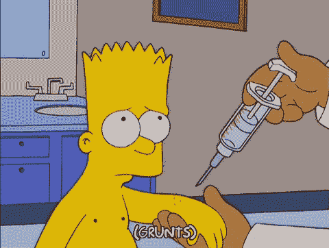

GIF from this [website](https://giphy.com/gifs/season-16-the-simpsons-16x11-xT5LMGfQrJPpmXKUEM)

我不知道我从哪里得到这篇论文，但我想读它。

> **请注意，这篇帖子是给未来的自己看的，回顾这篇论文上的材料，而不是从头再看一遍。**

**摘要**

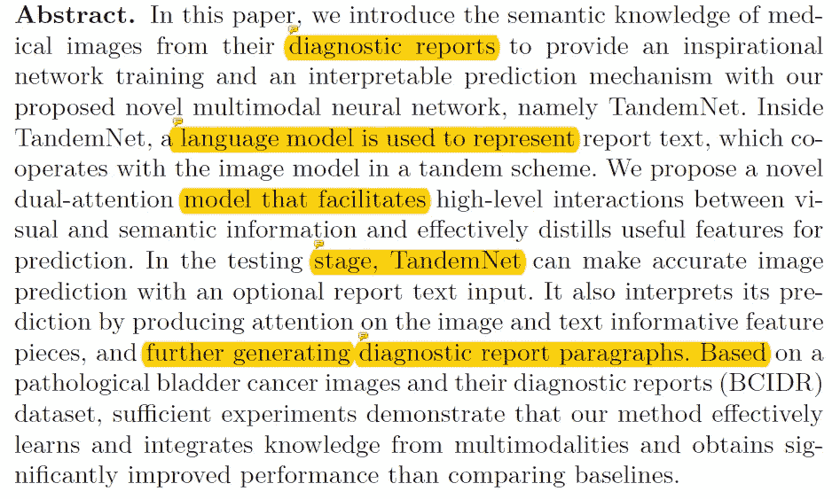

这篇论文太酷了，所以作者决定将诊断报告作为网络的输入，而不是仅仅依赖图像的特征。此外，作者还引入了一个双重注意力模型，最后，他们能够创建一个模型，其中有效地整合了来自多模态的知识，并产生了高性能。

**简介**

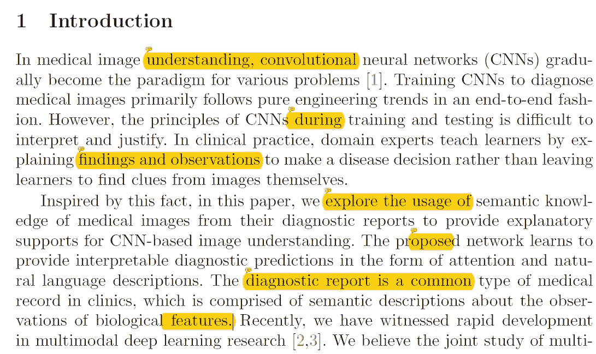

当我们想到一个人如何成为一名成功的医生时，不仅他们从 CT 或 MRI 扫描中学习，而且其他资深医生也解释了每个图像中发生的事情。受这种想法的启发，作者决定用不同形式的输入制作一个分类模型。网络架构如下所示。

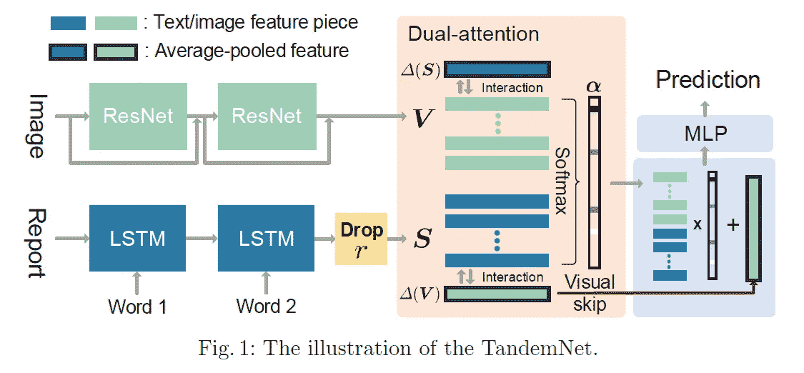

这个网络要么只接受图像作为输入，要么接受一对图像和文本。它还可以生成医疗报告。然而，我有一个问题，如果医疗记录已经告诉网络诊断是什么，想要有一个 CNN 的点？

**方法**

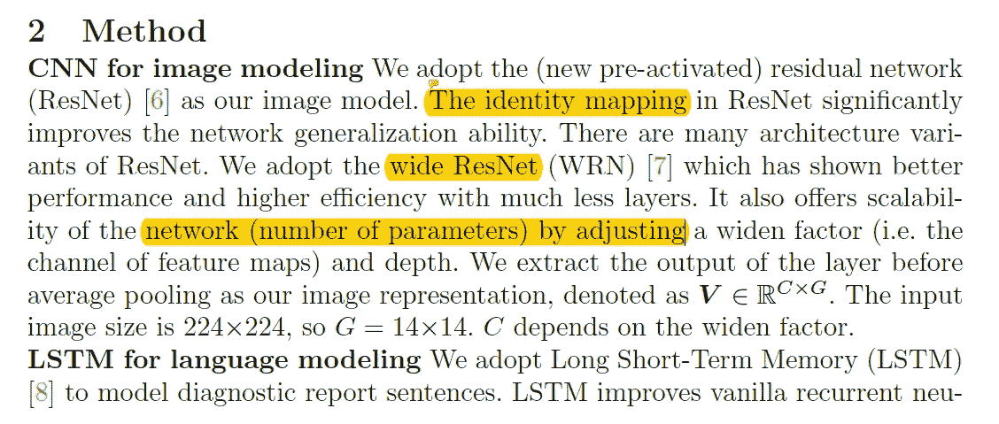

在本节中，作者首先描述了网络架构。对于 CNN，他们决定用 Res Wide architecture，对于语言模型，他们决定用 LSTM。此外，他们制作了一个新颖的双注意模型，其中他们不仅接收图像数据(用 V 表示)，还接收文本数据(用 S 表示)

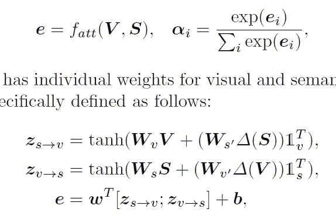

此外，作者还介绍了两种推广网络的方法。
**1)视觉跳过连接** →其中图像特征像 res net 架构一样跳过连接以增加梯度流
**2)随机模态自适应** →其中文本数据被丢弃，使得网络不必依赖于文本数据。

**实验**

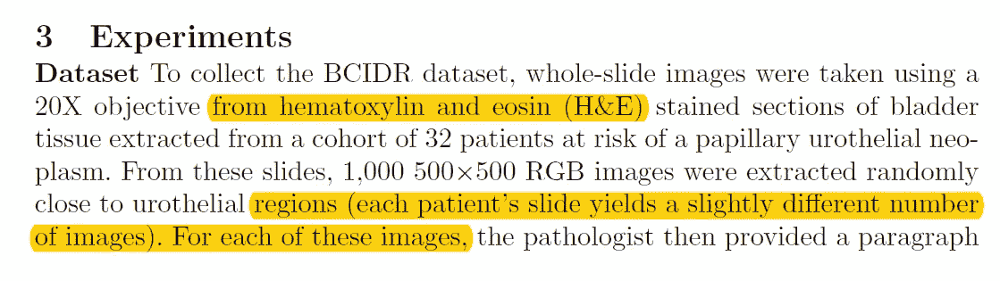

在这里，作者描述了他们如何获得数据，他们总共能够获得 1000，500*500*3 张图像，病理学家为每张图像提供了一段关于核多形性、细胞拥挤、细胞极性、有丝分裂和核仁突出的内容。接下来，他们描述了如何使用 [Torch7](https://github.com/torch/torch7) 来实现串联网络。(使用 SGD)。

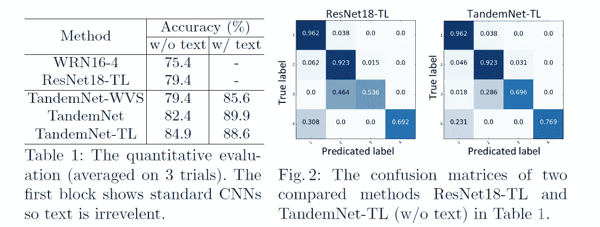

如上所述，我们可以观察到串联网络比其他比较网络具有更高的准确性。(以相当大的幅度。)

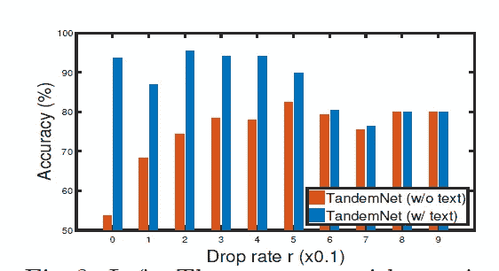

上面没有提到的事实是，他们有一个 LSTM 的辍学层，他们发现了一个与辍学率和使用文本数据相反的模式。随着辍学率的增加，模型使用的文本数据越来越少，反之亦然。

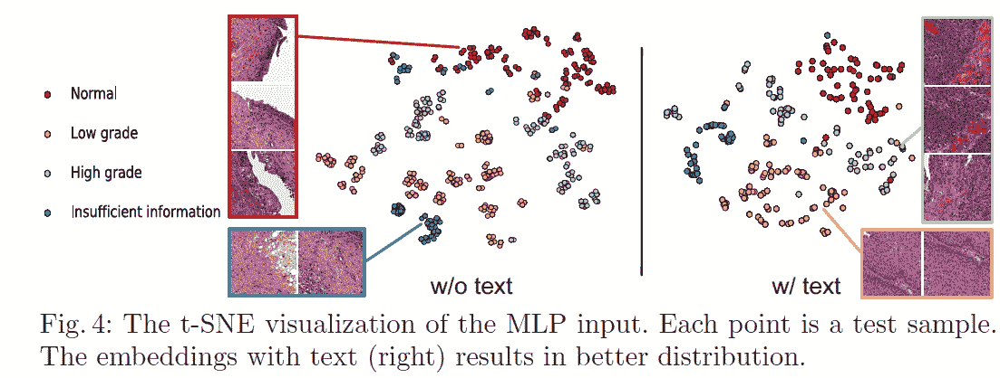

此外，当他们可视化每个数据点的隐藏表示时，他们发现使用文本数据可以更好地分布聚类。(t-SNE)

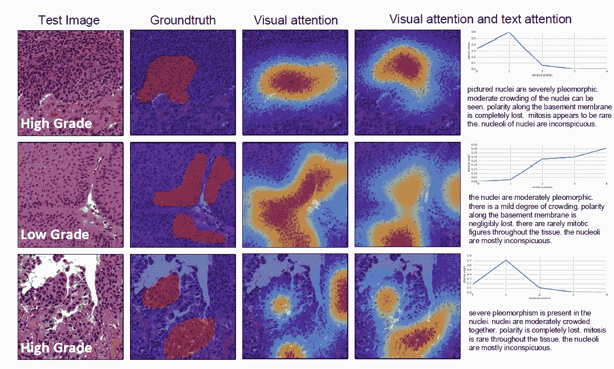

他们将视觉注意力掩模放大到与原始图像相同的尺寸，并将其重叠。之后，他们与病理学家认为最重要的位置进行了比较，并能够发现两个区域之间的高度相关性。当模型同时使用文本和图像时，相关性增加。

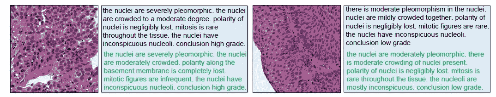

最后，使用来自“用于生成图像描述的深度视觉语义排列”的知识，他们也能够生成医疗报告，并且看起来做得很好。

**结论**

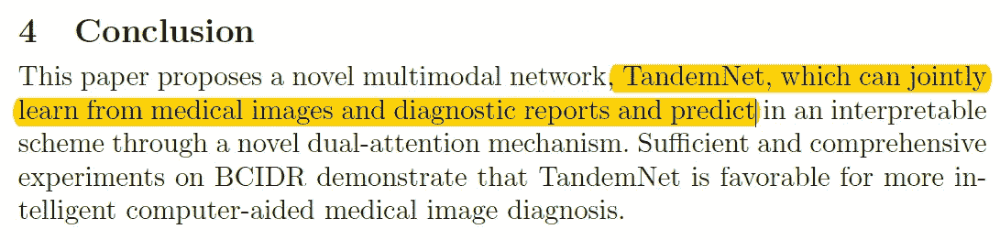

总之，本文作者介绍了一种新颖的网络，称为 TandemNet，它以文本和图像作为输入来执行分类，并获得了较好的结果。

**遗言**

我在医疗领域看到的最有趣的网络架构之一。

如果发现任何错误，请发电子邮件到 jae.duk.seo@gmail.com 给我，如果你想看我所有写作的列表，请[在这里查看我的网站](https://jaedukseo.me/)。

同时，在我的 twitter [这里](https://twitter.com/JaeDukSeo)关注我，并访问[我的网站](https://jaedukseo.me/)，或我的 [Youtube 频道](https://www.youtube.com/c/JaeDukSeo)了解更多内容。我也实现了[广残网，请点击这里查看博文 pos](https://medium.com/@SeoJaeDuk/wide-residual-networks-with-interactive-code-5e190f8f25ec) t。

**参考**

1.  张，张，杨(2017)。TandemNet:使用诊断报告作为可选的语义参考从医学图像中提取知识。Arxiv.org。检索于 2018 年 6 月 24 日，来自[https://arxiv.org/abs/1708.03070](https://arxiv.org/abs/1708.03070)
2.  火炬/火炬 7。(2018).GitHub。检索于 2018 年 6 月 24 日，来自[https://github.com/torch/torch7](https://github.com/torch/torch7)
3.  (2018).Cs.stanford.edu。检索于 2018 年 6 月 24 日，来自[https://cs.stanford.edu/people/karpathy/cvpr2015.pdf](https://cs.stanford.edu/people/karpathy/cvpr2015.pdf)