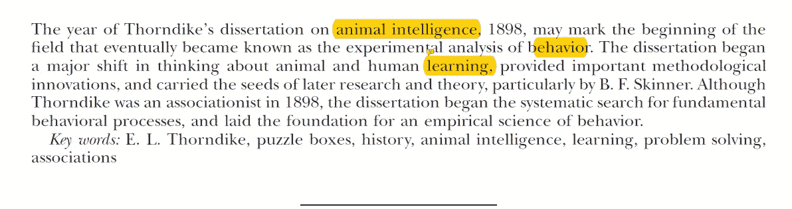
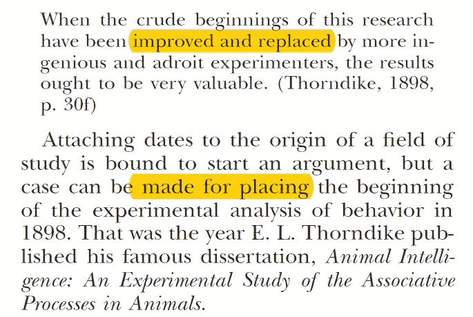
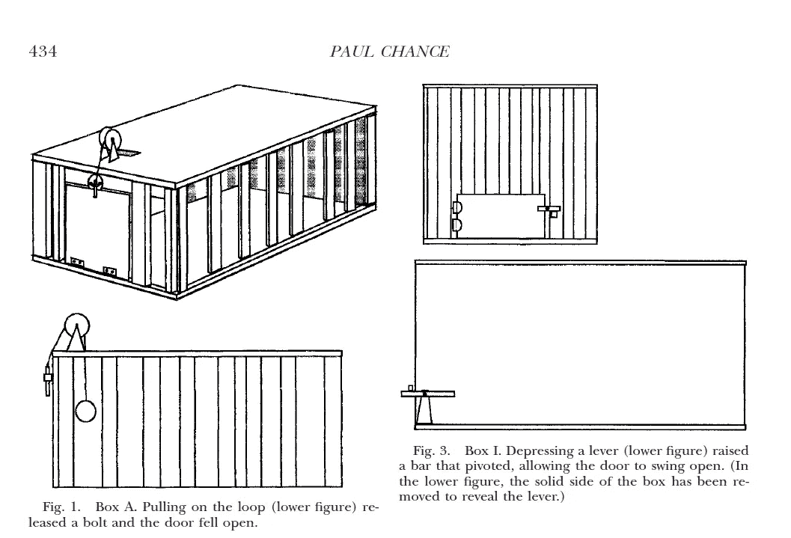
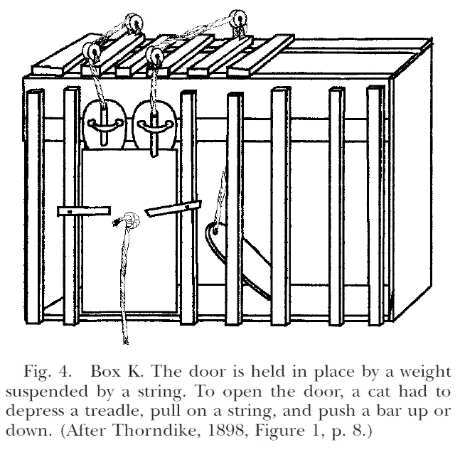
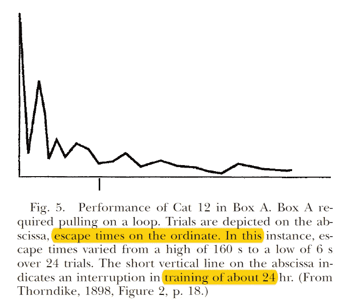
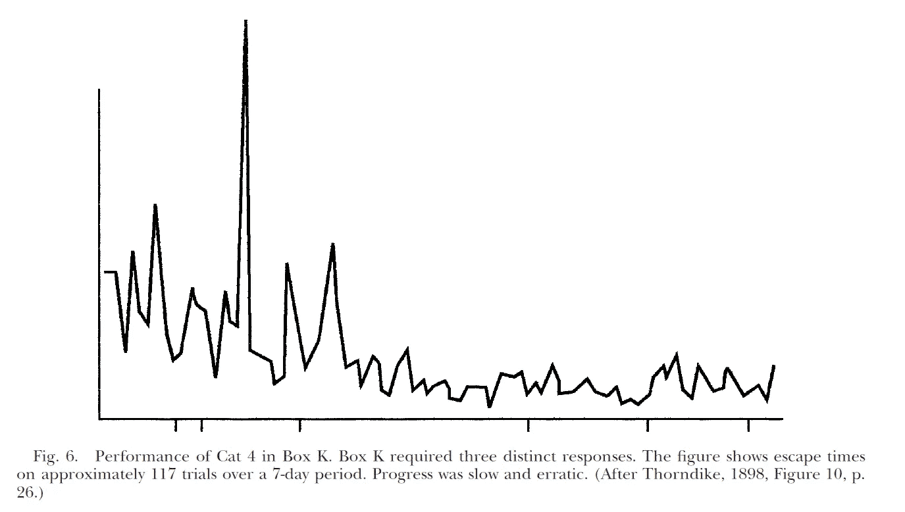
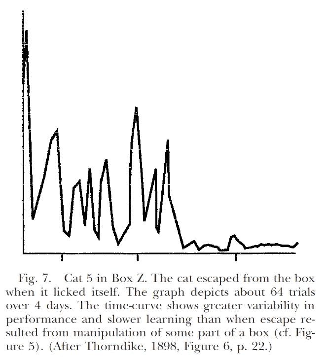
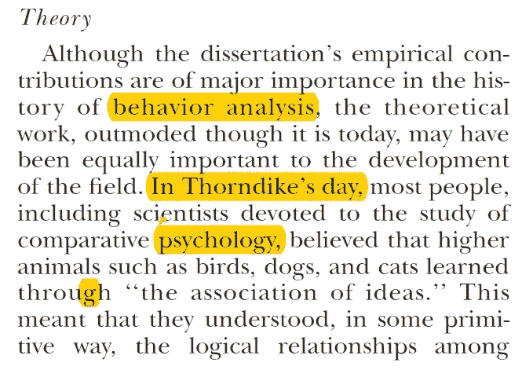
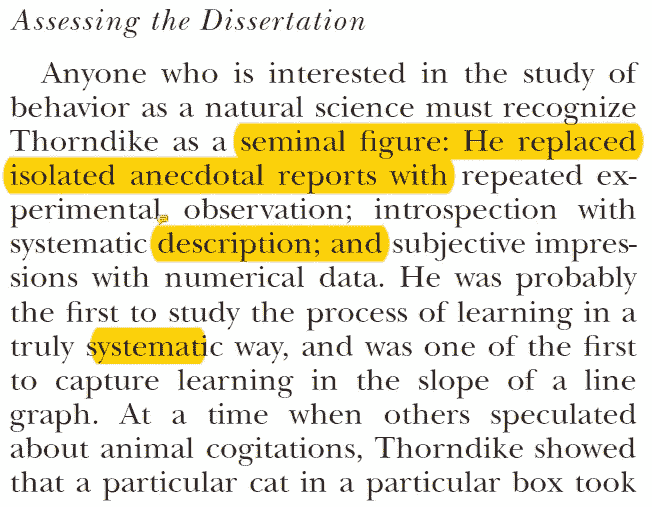

# [论文摘要]桑代克的困惑盒和起源行为的实验分析

> 原文：<https://towardsdatascience.com/paper-summary-thorndikes-puzzle-boxes-and-the-origins-of-the-experimental-analysis-of-behavior-122143221ee9?source=collection_archive---------1----------------------->

GIF from this [website](https://giphy.com/gifs/chemistry-1IwjlYpIbvhGo)

我记不清我是怎么拿到这份文件的，但我想读它。

> **请注意，这篇帖子是为了我未来的自己复习这篇论文上的材料，而不是从头再看一遍。还要注意，我可能没有足够的领域经验来完全理解这篇文章。**

Paper from this [website](https://www.ncbi.nlm.nih.gov/pmc/articles/PMC1284753/)

**摘要**

当桑代克在 1898 年提交他的论文时，它标志着行为实验分析领域的开始。那篇论文似乎对行为的实证科学产生了巨大的影响。

**简介**

1898 年" [*动物智力:动物联想过程的实验研究*](http://psycnet.apa.org/record/2011-13303-001) "由桑代克出版。(他只有 23 岁。).尽管当时很少有可信的研究人员对这些经历提出批评，但这篇论文在心理学领域产生了巨大的影响。(我感觉到它在整个科学领域产生了巨大的影响，因为它改变了我们对动物和人类学习的看法。)

**实验**

桑代克经验的一般方法是把饥饿的动物放在围栏里，它们可以通过一些简单的行为逃离。总之，桑代克把食物放在关动物的笼子外面，并记录下动物逃出笼子的时间。他反复重复了这个实验，并记录了动物逃跑所需的变化。(最著名的实验是拼图盒中的猫实验。).有 15 个盒子，都是木头做的，每个盒子都有一个门，猫可以通过触发某种机制打开门。(例如，拉动悬挂在箱底上方六英寸处的线圈(见图 1)。).

在每个盒子中，盒子 k 出现在桑代克的论文中，它需要三种不同的反应。(踩下踏板，拉动绳子，推开酒吧门。)关于放在这些盒子里的猫，有一点需要注意，那就是它们通常更专注于逃离盒子，而不是把注意力放在笼子外面的食物上。起初，猫的行为似乎是随机的，它无论如何都要挣扎着从笼子里出来，然而，如果猫一次又一次地被关在笼子里。慢慢地，猫的行为改变了，它变得更有意识，表现出更有效的行为。

如上所述，桑代克记录了猫在多次重复的实验中逃脱所需的时间。我们可以观察到所需时间稳步减少。(这是针对简单的盒子情况)。但是当我们绘制盒子 K 所需的时间时，它看起来像下面这样。

我们可以观察到它更慢，并显示出更不稳定的进展迹象。桑代克不仅对逃跑的时间感兴趣，还对猫学习进步的速度感兴趣。(我觉得这可以是曲线的导数。).当在狗/小鸡身上进行同样的实验时，桑代克能够得到类似的结果。

在其他实验中，桑代克直接把动物从笼子里拿出来，例如，当小鸡梳理自己的羽毛时，或者当猫抓痒时。然而，这些实验通常产生更大的性能可变性和更浅的时间曲线，而不是当逃生手段涉及操纵外壳的某个部分时。他还做了泛化实验，从不同的盒子里学到的知识可以应用到另一个盒子里。

**理论**

在桑代克的时代，大多数人认为动物通过想法的联想来学习，这意味着它们以某种原始的方式理解事件之间的逻辑关系，并使用这些想法来推理解决问题。然而，桑代克对这一观点提出了质疑，因为没有确凿的证据表明动物通过推理理解或学习。首先，他说被关在笼子里的猫的行为是随机的，而不是系统的；第二，动物的行为是渐进的，而不是突然的；第三，动物没有表现出理解行为和结果之间关系的迹象；第四，动物只有在自己执行行为时才学会。

总之，桑代克证明了动物的一般学习行为是尝试和成功，而不是逻辑推理。

**评估论文**

桑代克的工作是例外的，因为他用重复的实验观察代替了孤立的轶事报道；内省与系统描述；和数字数据的主观印象。(与强化学习领域相关的是，桑代克认识到了灭绝、泛化、辨别和反应链。)

**相关视频**

Video from [Geert Stienissen](https://www.youtube.com/channel/UC9N3210QbLWZzhFwwDkyEqw)

**最后的话**

非常奇怪，在强化学习中，一个智能体学习的行为与实验中的猫相似…

**参考**

1.  吉斯，P. (1999 年)。桑代克的难题箱和行为实验分析的起源。行为实验分析杂志，72(3)，433–440 页。doi:1901 年 10 月 10 日
2.  吉尔特·斯蒂恩森。(2018).YouTube。检索于 2018 年 7 月 13 日，来自[https://www.youtube.com/channel/UC9N3210QbLWZzhFwwDkyEqw](https://www.youtube.com/channel/UC9N3210QbLWZzhFwwDkyEqw)