# 【论文摘要】用于聚类分析的无监督深度嵌入

> 原文：<https://towardsdatascience.com/paper-summary-unsupervised-deep-embedding-for-clustering-analysis-e269aed77c6b?source=collection_archive---------5----------------------->

Photo by [Alexandru Acea](https://unsplash.com/photos/_M24lBh4H58?utm_source=unsplash&utm_medium=referral&utm_content=creditCopyText) on [Unsplash](https://unsplash.com/?utm_source=unsplash&utm_medium=referral&utm_content=creditCopyText)

> **请注意，这篇帖子是为了我未来的自己复习这篇论文上的材料。**

Paper from this [website](https://arxiv.org/pdf/1511.06335.pdf)

**摘要**

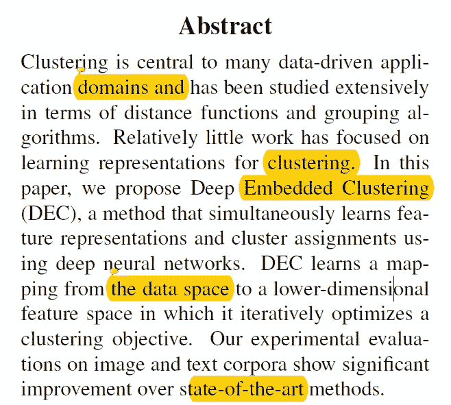

聚类是一种广泛应用于许多数据相关领域的技术，然而关于聚类的学习表示的研究却很有限。本文的作者提出了一种神经网络，其中同时学习特征表示和执行聚类。

**简介**

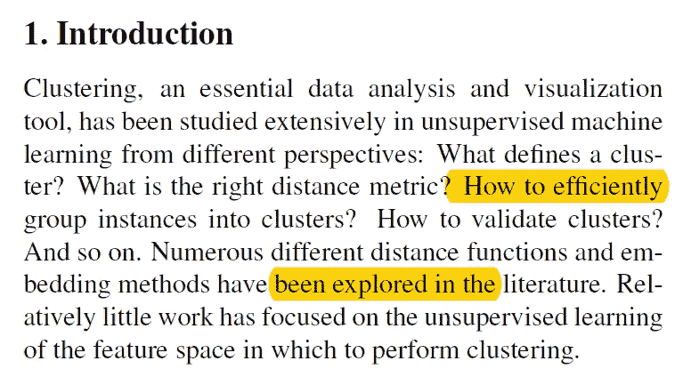

聚类中最重要的一个方面是测量距离的方法。(或相异)。对于 k-means，我们使用点之间的欧几里德距离。然而，另一个重要的方面是执行这些测量的特征空间。原始像素空间中的 K-means 聚类是无效的，因此作者想要回答这个问题:我们可以使用数据驱动的方法来联合求解特征空间和聚类成员吗？

**相关工作**

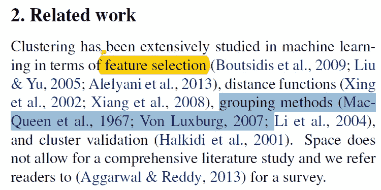

聚类已经在许多不同的名称下被研究，例如特征选择、距离函数、分组方法等……并且存在流行的方法，例如 k 均值聚类。最近谱聚类和它的方差得到了普及，因为它们不仅更灵活，而且通常比 k 均值表现得更好。然而，他们的方法有一个缺点，即用户需要大量的内存和计算能力。受 t-sne 方法的启发，作者提出了一种方法，其中他们定义了基于质心的概率分布，并最小化其与辅助目标分布的 KL 散度，以同时改善聚类分配和特征表示。

**深度嵌入聚类**

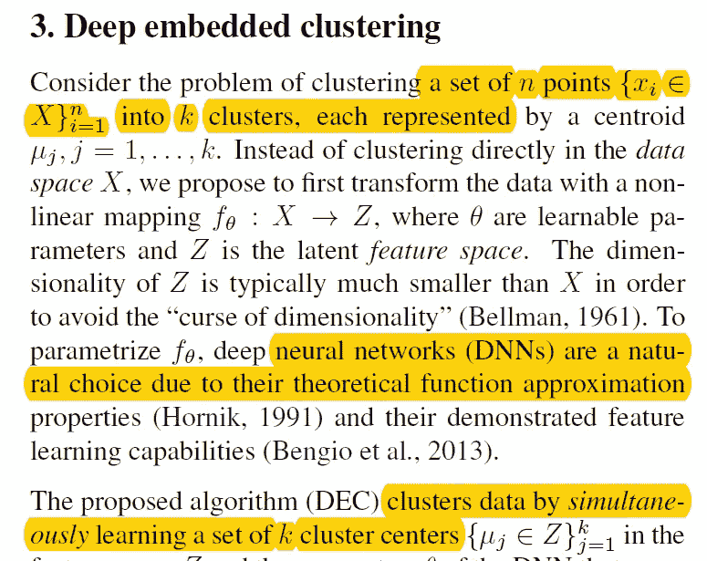

作者不是直接在数据空间 X 上执行聚类，而是首先执行到不同空间 Z 的非线性映射(并且大多数情况下 Z 小于原始空间 X)。非线性函数由θ参数化。并且作者的方法具有两个阶段，1)利用深度自动编码器的初始化阶段，2)参数优化(即，聚类)，其中他们在计算辅助目标分布和最小化对其的 KL 发散之间迭代。

*KL 散度聚类*

给定非线性映射的初始估计，所提出的算法做两件事，1)计算嵌入点和聚类质心之间的软分配，2)更新深度映射 f(θ)并通过使用辅助目标分布从当前高置信度分配中学习来改进聚类质心。

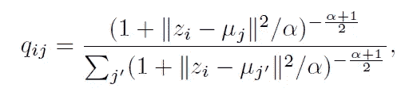

按照 t-sne 方法，嵌入点 z 和质心 *μ* 之间的相似性如上所示计算。并且参数α被设置为 1。

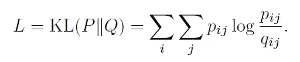

然后使用 KL 散度损失函数，他们试图匹配分布。

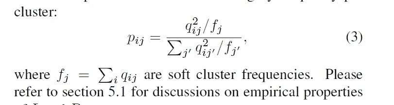

p 分布用上面的等式表示。最后，反向传播的数学可以在下面看到。

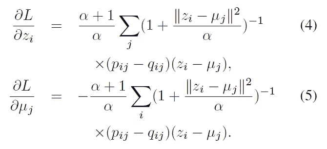

*参数初始化*

作者初始化来自预训练去噪自动编码器的权重，(逐层预训练)并且网络架构可以在下面看到。(ReLu 激活功能)。

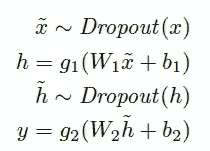

整个过程的视觉可以在下面看到。

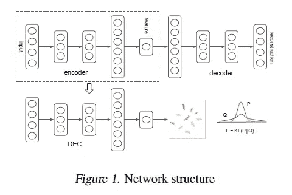

**实验**

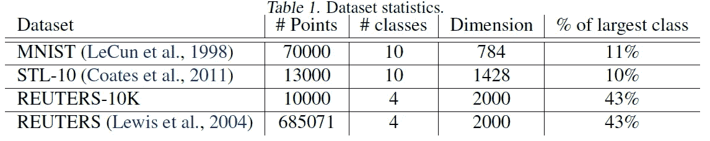

如上所述，作者在两个图像数据集和一个文本数据集上测试了他们的算法。

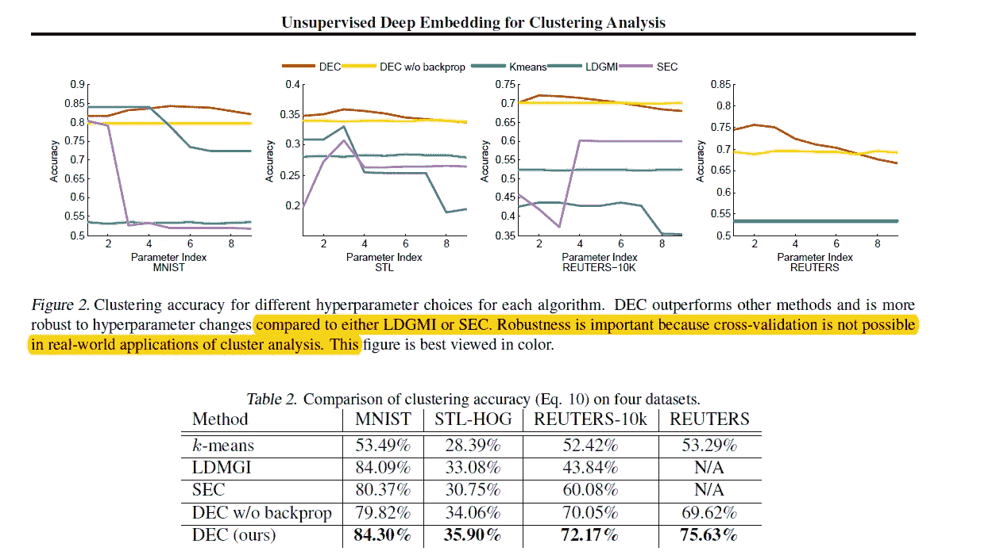

如上所述，当使用无监督聚类准确度(ACC)时，我们可以观察到作者的方法优于许多其他现有技术方法。

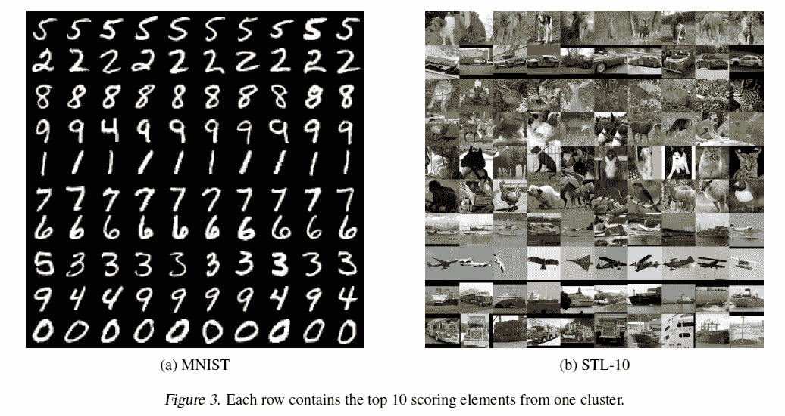

如上所述，作者显示了来自 MNIST 和 STL 中每个聚类的 10 个得分最高的图像，每行对应一个聚类，图像根据它们到聚类中心的距离从左到右排序。我们可以看到，对于 MNIST 数字 9 和 4 被聚类在一起，而对于 STL 数据集，聚类结果对于飞机、汽车和卡车是最好的。

**讨论**

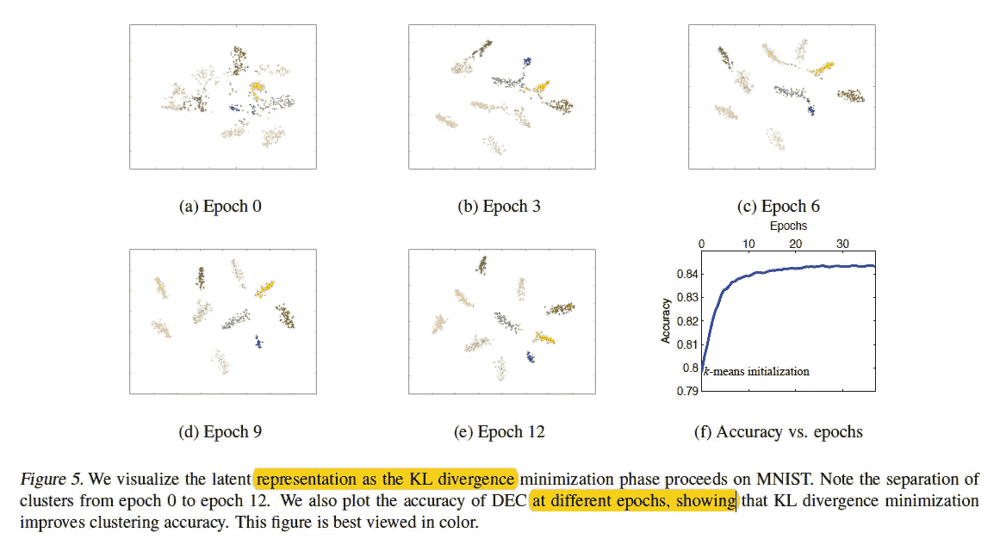

使用 t-sne，作者可视化了潜在向量 z 的聚类如何随时间变化，如上所述，随着历元的增加，我们可以看到聚类之间的边界线变得更加清晰。

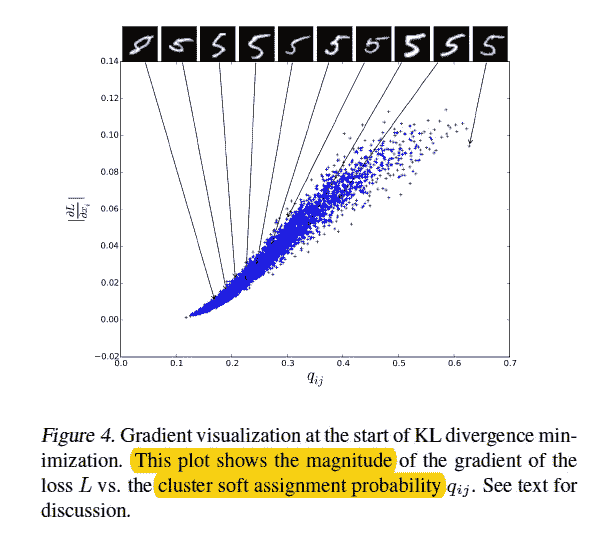

此外，当作者绘制梯度幅度与软赋值 q 的关系图时，他们发现越靠近质心(大 q)的数据点对梯度的贡献越大。

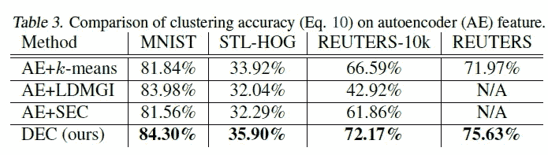

为了查看自动编码器初始化策略的效果，作者还将自动编码器用于其他方法。然而，如上所述，作者的方法仍然能够胜过其他方法。(作者又做了两个关于不平衡数据和聚类数的实验。)

**结论**

本文提出了一种算法，在该算法中，通过利用自训练目标分布迭代地优化基于 KL 散度的聚类目标来执行对一组数据点的聚类。作者的方法不仅优于许多其他现有技术的方法，而且对超参数设置更加鲁棒。

**遗言**

如果发现任何错误，请发电子邮件到 jae.duk.seo@gmail.com 给我，如果你想看我所有写作的列表，请在这里查看我的网站。

同时，在我的 twitter 上关注我[这里](https://twitter.com/JaeDukSeo)，访问[我的网站](https://jaedukseo.me/)，或者我的 [Youtube 频道](https://www.youtube.com/c/JaeDukSeo)了解更多内容。我还实现了[广残网，请点击这里查看博文](https://medium.com/@SeoJaeDuk/wide-residual-networks-with-interactive-code-5e190f8f25ec) t。

**参考**

1.  谢，吉希克，，(2015)。用于聚类分析的无监督深度嵌入。Arxiv.org。检索于 2018 年 9 月 12 日，来自[https://arxiv.org/abs/1511.06335](https://arxiv.org/abs/1511.06335)