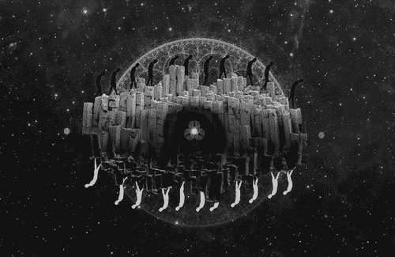
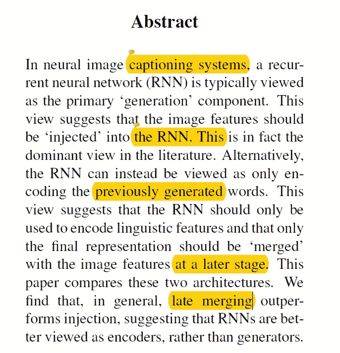
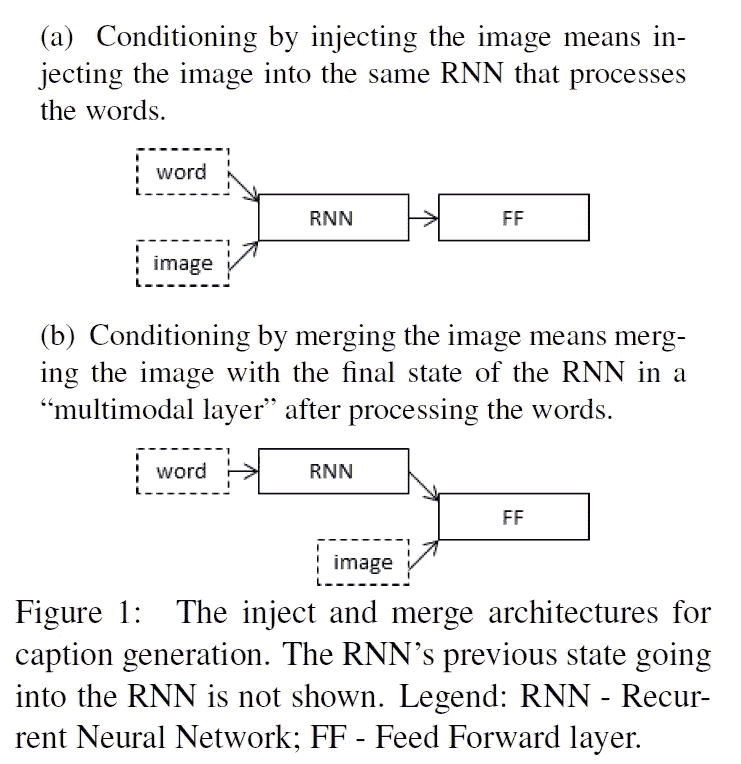
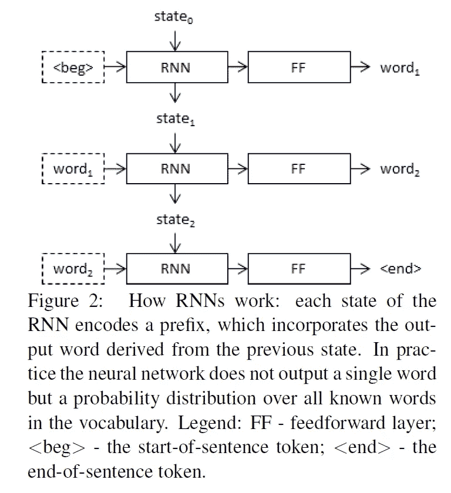
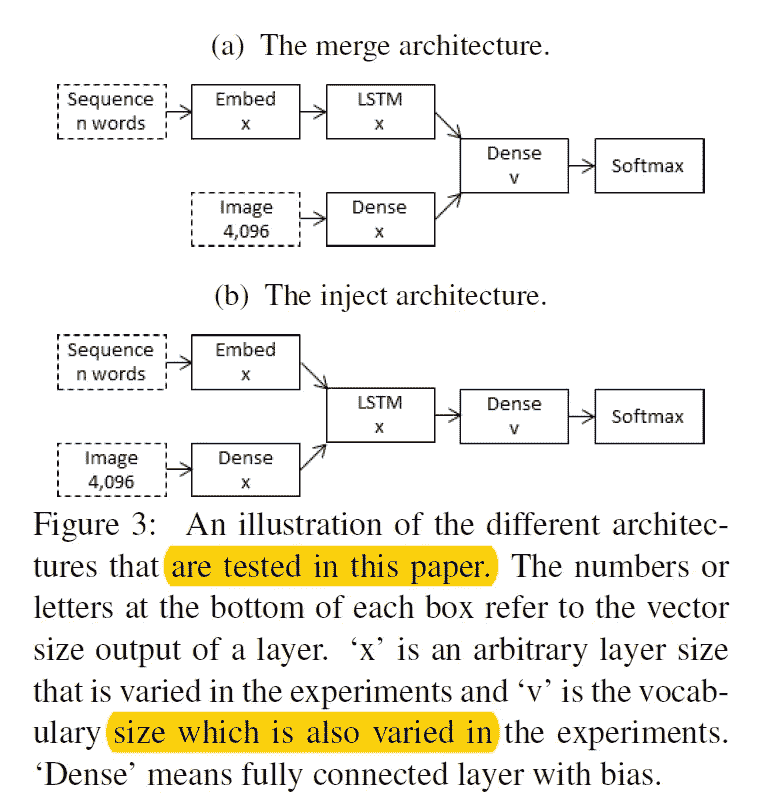
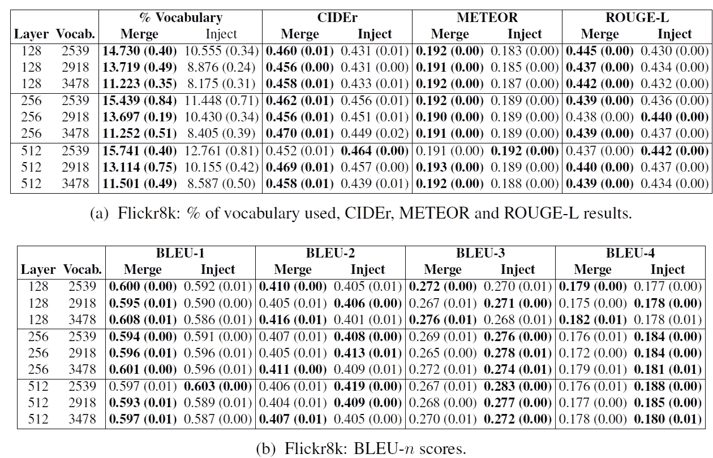
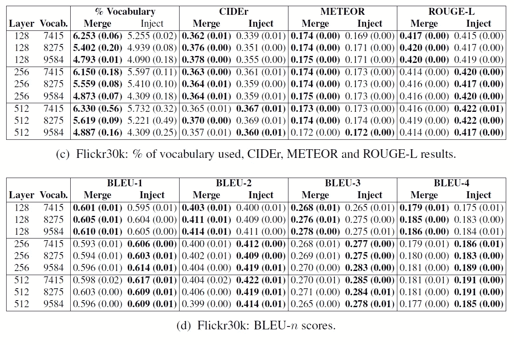
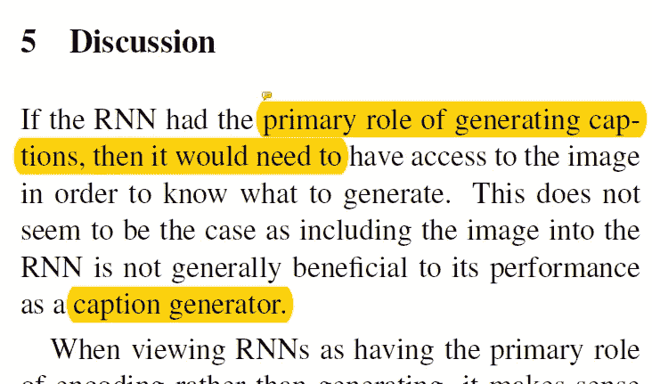
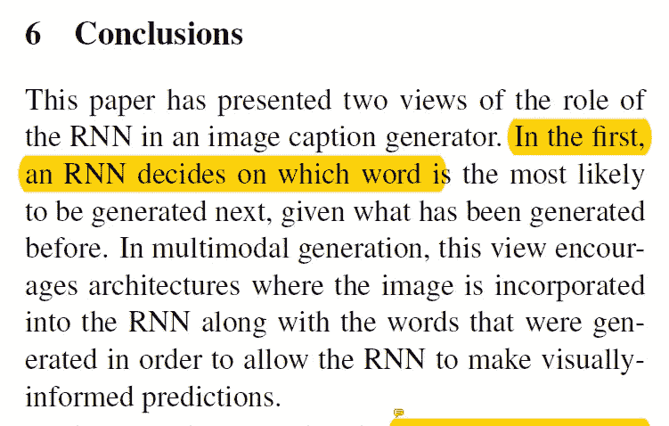
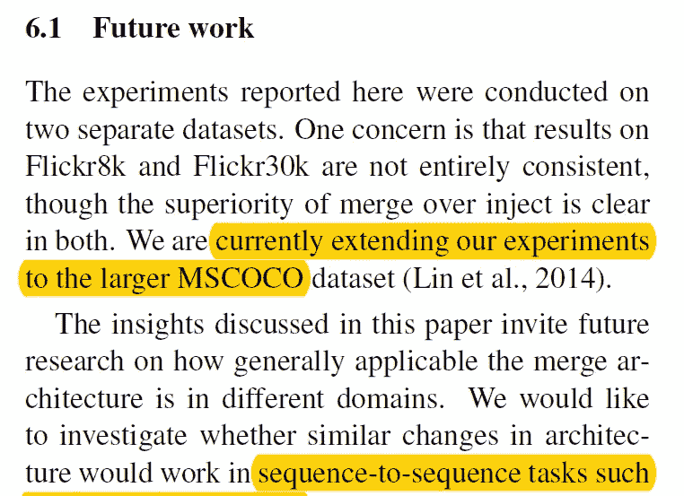

# 【论文摘要】递归神经网络(RNNs)在图像字幕生成器中的作用是什么？

> 原文：<https://towardsdatascience.com/paper-summary-what-is-the-role-of-recurrent-neural-networks-rnns-in-an-image-caption-e9475056e3cd?source=collection_archive---------6----------------------->

GIF from this [website](https://giphy.com/gifs/black-and-white-flux-machine-cFbmj5Kd4eylO)

我发现了一篇关于图像标题生成任务的有趣论文。

> **请注意，这篇帖子是给未来的自己看的，回顾这篇论文上的材料，而不是从头再看一遍。**

**摘要**

在大多数图像字幕生成的文献中，许多研究者将 RNN 视为系统的生成器部分。然而，在整个系统中使用 RNN 还有其他方法。一种方法是使用 RNN 作为先前生成的单词的编码器，并在模型的最后阶段将编码的表示与图像合并。这篇论文的作者发现，使用 RNN 作为编码器实际上会给出更好的结果。

**简介**

大多数字幕生成任务集中于具体的概念描述生成，即严格描述图像中内容的字幕。(然而，目前正在进行一些研究以超越这一点，例如叙事生成和视觉问答。).自然语言生成主要有三种方法。

1.  首先依赖计算机视觉任务的系统，例如物体检测或图像分类。以及使用编码的图像特征作为 NLG 阶段的输入。
2.  将字幕生成任务视为检索问题的系统，其中许多系统依赖于神经模型来处理图像数据和文本数据。
3.  系统，由神经网络组成，(我猜这个系统和第一个系统的主要区别是使用了多少神经网络。)，并且这些系统通常具有 CNN 来编码图像和 RNN 来生成与该图像相关的字幕。

本文主要讨论第三种方法，大多数研究人员将 RNN 视为生成部分，但事实并非总是如此。如上所述，在 a)中，RNN 看到图像和单词，因此它充当生成器，然而在 b)中，RNN 只看到单词而不是图像，因此仅充当语言特征的编码器。本文调查了这两种体系结构之间的性能，看看哪一种更好，通过作者的实验，他们发现体系结构 b)提供了更好的性能。

**背景:神经字幕生成架构**

如上所述，典型地，RNN 接收开始符号，并将语言特征传递给 FNN，该开始一个字一个字地生成，直到遇到结束符号。实现这一点的一种方法是给 RNN 提供图像和语言数据，本文作者称之为注入法。另一种方法是仅将 RNN 视为语言模型，如图 1 中的 b)所示。这两种架构都在研究社区中使用。(另一件要注意的事情是，这两个模型都与注意机制兼容。)

注入模型和合并模型之间区别在于，在注入模型中，RNN 负责图像条件语言生成，而在合并模型中，负责编码语言表示。这两种型号在 RNN 还有一些额外的差异，例如重量的数量。

**实验**

对于数据集，作者选择使用[闪烁数据集](http://nlp.cs.illinois.edu/HockenmaierGroup/8k-pictures.html)，并且在这个实验中测试了如上所示的两种不同的网络架构。为了保持公平和简单，作者只对两个网络使用了基本架构。Adam 用作优化器，他们使用 50 的小批量、Xavier 初始化，同时使用交叉熵和作为成本函数。最后他们用 BLEU，METEOR，CIDEr 和 ROUGE-L 来衡量网络的性能。

**结果**

如上所示，作者对每个模型进行了三次训练，并记录了平均分数。除了 ROUGEL 和 BLEU 分数，我们可以观察到合并架构通常比注入架构表现更好的事实。作者在这次实验后发现了一个有趣的事实，即该模型对 Flicker8K 数据集给出了非常好的结果，这可能意味着数据集本身包含更少的变化，使任务变得更容易。还发现合并模型具有更高的性能与模型大小的比率，并且更有效地利用有限的资源。

**讨论**

当 RNN 的作用是为给定的图像生成标题时，很自然地认为将图像作为输入是非常有益的，然而，实验结果显示了其他方式。这可能发生的一个原因是由于注入架构的任务的复杂性增加。在该体系结构中，单词和图像都被提供给网络，使得编码任务更加复杂，而在合并体系结构中，RNN 只需要对先前给定的单词进行编码。

**结论**

总之，本文提出了两种不同的网络架构来执行图像字幕任务。在那两个不同的网络中，RNN 扮演着不同的角色，在第一个网络中，RNN 被赋予了既有先前生成的词又有完整的形象。而在第二种情况下，RNN 充当语言特征编码器，只能访问前面的单词。令人惊讶的是，一般来说，对于图像字幕任务，最好有一个只执行单词编码的 RNN。简而言之，生成任务，涉及序列它是一个更好的想法，有一个单独的网络来编码每个输入数据，而不是把一切交给 RNN。

**未来工作**

尽管很明显，合并模型的性能比注入模型好得多，但结果并不完全一致。作者正在将这个实验扩展到更大的 MSCOCO 数据集。要问的其他问题是，这种方法对机器翻译任务是否也有类似的影响。合并模式的另一个优点是迁移学习更容易。

**最后的话**

这是一个有趣领域的非常有趣的工作。

如果发现任何错误，请发电子邮件到 jae.duk.seo@gmail.com 给我，如果你希望看到我所有写作的列表，请[在这里查看我的网站](https://jaedukseo.me/)。

同时，在我的 twitter [这里](https://twitter.com/JaeDukSeo)关注我，并访问[我的网站](https://jaedukseo.me/)，或我的 [Youtube 频道](https://www.youtube.com/c/JaeDukSeo)了解更多内容。我也实现了[广残网，请点击这里查看博文 pos](https://medium.com/@SeoJaeDuk/wide-residual-networks-with-interactive-code-5e190f8f25ec) t。

**参考**

1.  (2018).Aclweb.org。检索于 2018 年 7 月 7 日，来自[http://www.aclweb.org/anthology/W17-3506](http://www.aclweb.org/anthology/W17-3506)
2.  (2018).Nlp.cs.illinois.edu。检索于 2018 年 7 月 7 日，来自[http://NLP . cs . Illinois . edu/HockenmaierGroup/8k-pictures . html](http://nlp.cs.illinois.edu/HockenmaierGroup/8k-pictures.html)