# 论文 101——人工智能如何学会在黑暗中看东西？

> 原文：<https://towardsdatascience.com/papers-101-how-an-ai-learned-to-see-in-the-dark-d15f97a2ecdd?source=collection_archive---------4----------------------->

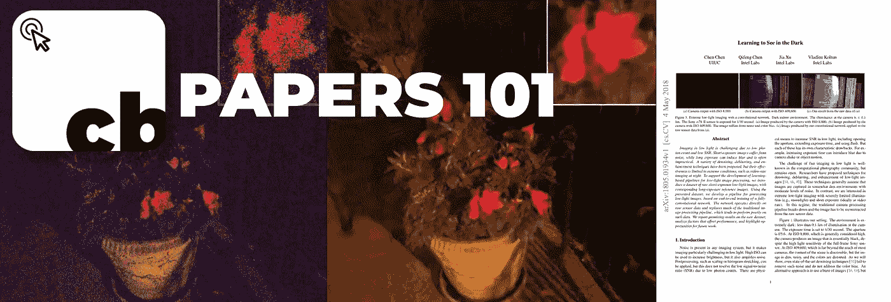

大家好，我是[尼尚克](http://gitshanks.github.io/)，欢迎来到**论文 101** ，在这个系列中，我们将讨论机器学习和人工智能领域正在进行的令人兴奋的新研究！

我要感谢 [**两分钟论文**](https://www.youtube.com/user/keeroyz) 和 **Károly Zsolnai-Fehér** 通过他们的 [YouTube 频道](https://www.youtube.com/user/keeroyz)向我介绍了这篇论文。

# 什么鬼东西？

在智能手机相机时代，弱光摄影是必备的。所有旗舰手机都支持低光摄影，但正如你一定注意到的那样，结果并不那么好。

这是因为他们大多使用传统的去噪和去模糊技术，这些技术可以有效地去除一些噪声，但在黑暗等极端条件下却失败了，这是一个很大的挑战。

本文是应对这一挑战的解决方案。

计算机视觉是人工智能中的一个领域，它围绕着获取视觉输入，或者理解接收到的输入，或者以某种方式操纵给定的输入以获得期望的输出。我们在这里关注的论文是关于第二个用例的。

在他们的论文**[**学习在黑暗中看东西**](https://arxiv.org/abs/1805.01934)**中，研究人员**陈晨**(UIUC)**陈奇峰**(英特尔实验室)**贾旭**(英特尔实验室)和**弗拉德伦·科尔顿**(英特尔实验室)提出了一种模型，它可以在几乎相当于黑暗的极低光照条件下使用一种新的图像处理管道使用****

****结果令人震惊！****

****如果你用没有低光摄影(低 ISO)的相机拍照，它看起来会像这样-****

****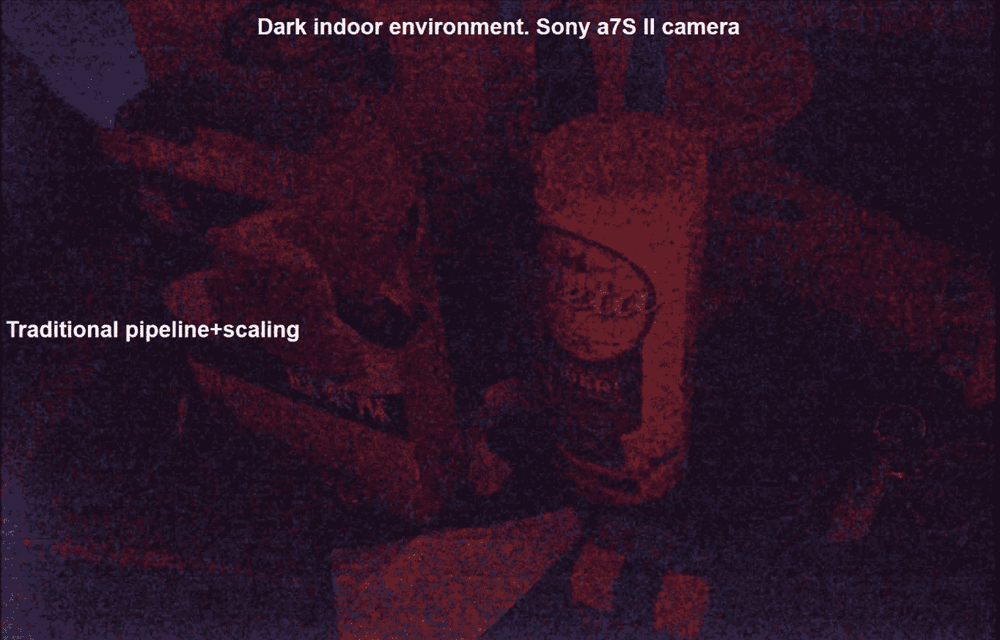****

****如果你用旗舰智能手机中的低光相机点击同一张照片，结果会如下所示。请注意，由于 BM3D 和较低的 ISO 等缩放滤镜，图片有多粗糙。****

****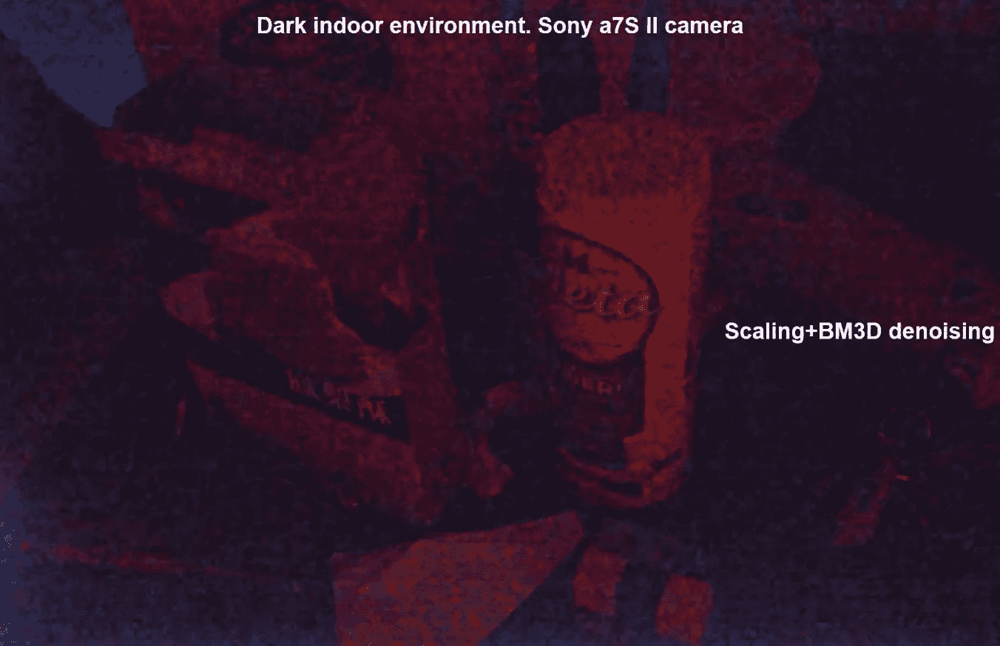****

****Scaling + BM3D Denoising****

****现在，全卷积网络所做的是获取第一幅图像，并对其进行处理，以获得下图(是的！我没开玩笑。)****

****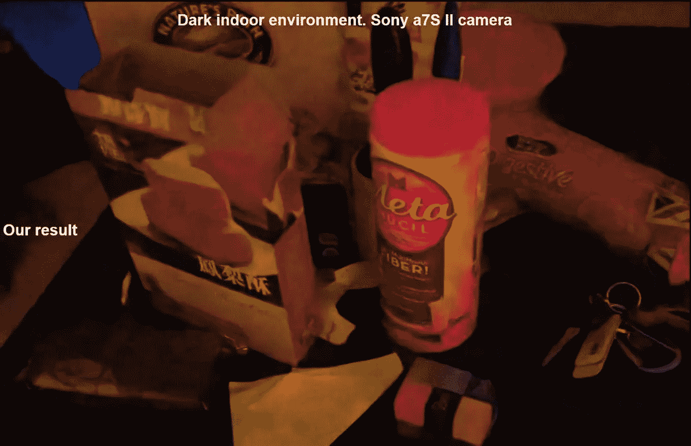****

****Image After Processing Through CNN****

# ****等等，什么！****

****这里的模型使用端到端训练的全卷积网络，该网络利用原始短曝光夜间图像的数据集，以及相应的长曝光参考图像。与传统的去噪和去模糊技术相比，这使得从像夜间摄影这样的极端场景中获得结果非常容易和有效。****

## ****CNN 是怎么训练出来的？****

****CNN 在两组图像上进行训练。****

1.  ****作为输入的昏暗(几乎黑暗)场景或短曝光图片。****
2.  ****对应的正常照明场景或与目标相同场景的长曝光图片。****

****在包含 5094 个原始短曝光图像及其对应的长曝光图像的数据集上训练神经网络。****

****因此，如果你想训练网络，你必须首先点击正常照明条件下的照片，该照片将被用作目标变量，以获得网络的误差。****

****接下来，你将不得不点击同一场景的低曝光照片，使它看起来很暗。这将作为训练时网络的输入。****

****这两张照片的对将为网络产生(输入、输出)对，在此基础上它将被训练用于弱光测试图像。****

****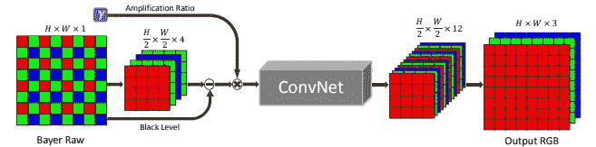****

****FCN Pipeline****

****训练是使用 L1 损失和一个 [Adam 优化器](https://medium.com/click-bait/a-deep-neural-network-in-tensorflow-9184c3c21ff1)进行的，它给出了非常高质量的结果，使模型迄今为止最有效！****

# ****有多好？****

****该模型使传统的去模糊和去噪方法相形见绌。下面是与传统 [BM3D 去噪](https://en.wikipedia.org/wiki/Block-matching_and_3D_filtering)的对比****

****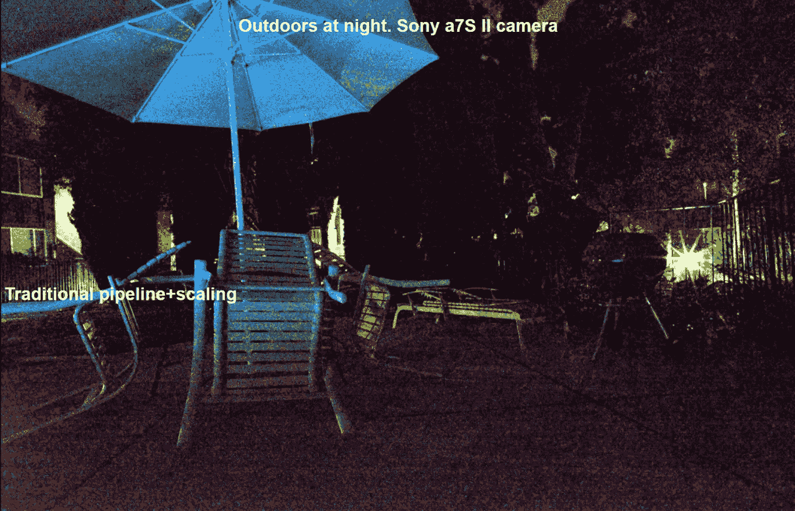****

****Image Using Traditional Scaling****

****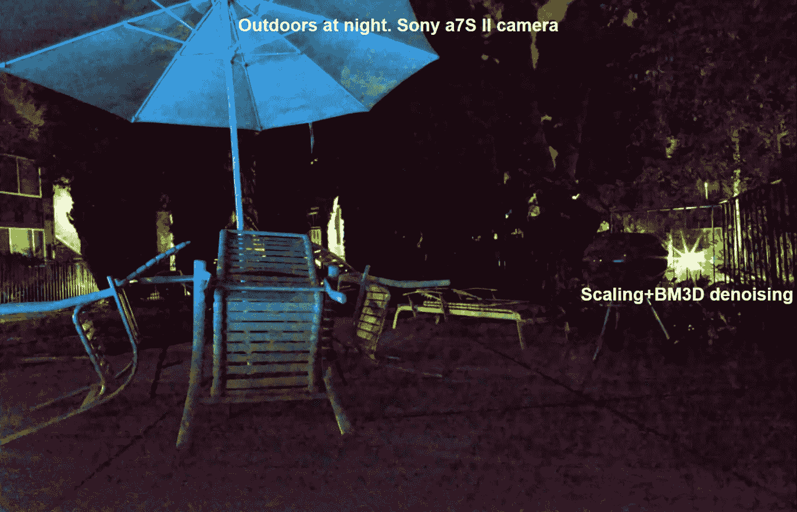****

****Image Using Scaling + BM3D Denoising****

****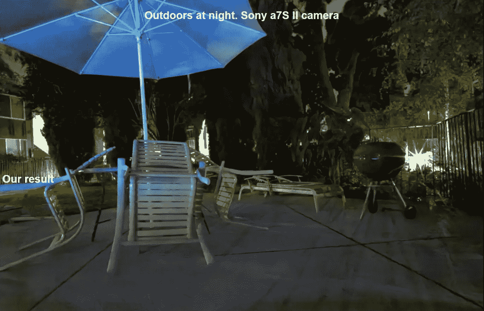****

****Image After Processing Through CNN****

****你可以立即注意到不同之处。****

****如果我们使用不同的参数(如曝光和照明)将 CNN 的性能与旗舰手机相机进行比较，结果可能会让你大吃一惊！****

****让我们考虑一个场景，在一个黑暗的房间里点燃 8 支蜡烛，通过不同的相机观察人体模型照片的变化，因为蜡烛的数量每次减半。****

****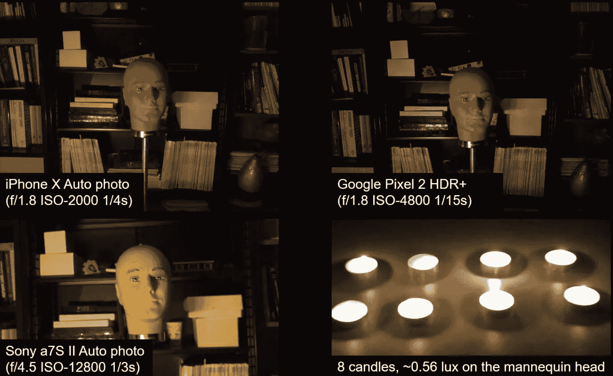****

****8 Candles****

****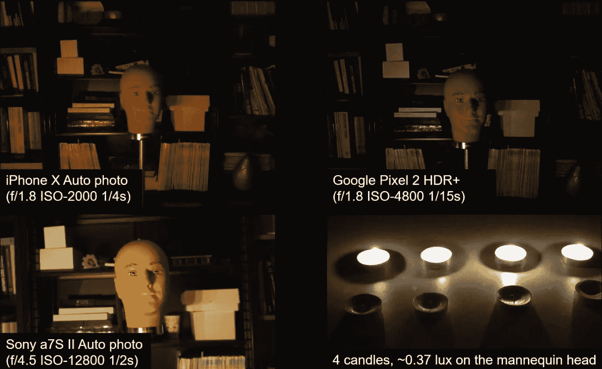****

****4 Candles****

****请注意，与索尼 a7S 相比，iPhone X 和谷歌 Pixel 2 的照片质量有所下降。这是因为一方面，索尼相机比两种移动相机具有更好的 ISO，移动相机使用传统的去模糊和去噪技术来从原始数据中获得低光照片。****

****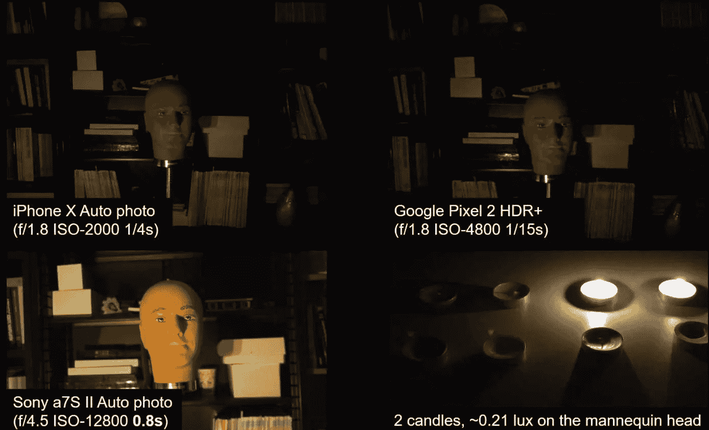****

****2 Candles****

****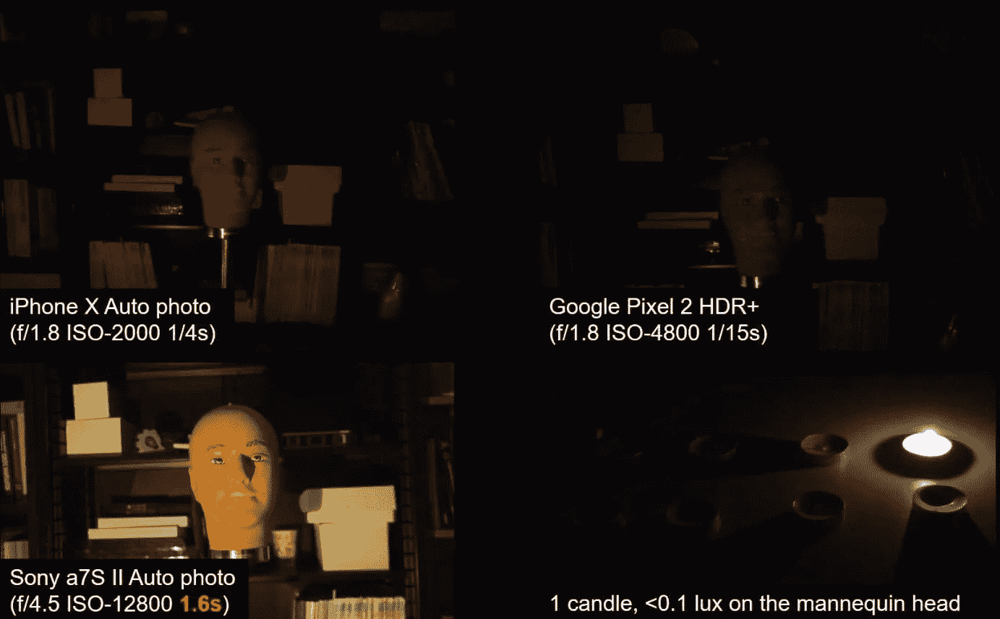****

****1 Candle****

****现在，照片在两个智能手机相机中都几乎是黑暗的，这是他们在黑暗等极端条件下失败的结论。****

****然而，索尼相机上的照片仍然很清晰，因为正如你可能已经注意到的那样，它巧妙地将曝光时间从 0.8 秒改为 1.6 秒，允许更多的光线进入，从而提供更好的照片。****

****这对于智能手机相机来说是不切实际的，因为它会产生模糊的图像，所以只能在昂贵的高端相机上实现，这些相机具有更好的反射镜头和高效的传感器。****

****但是，让我们看看如果我们将曝光时间减少到 1/30 秒会发生什么，也就是说，相机在极低的光线和低曝光时间下表现如何。****

****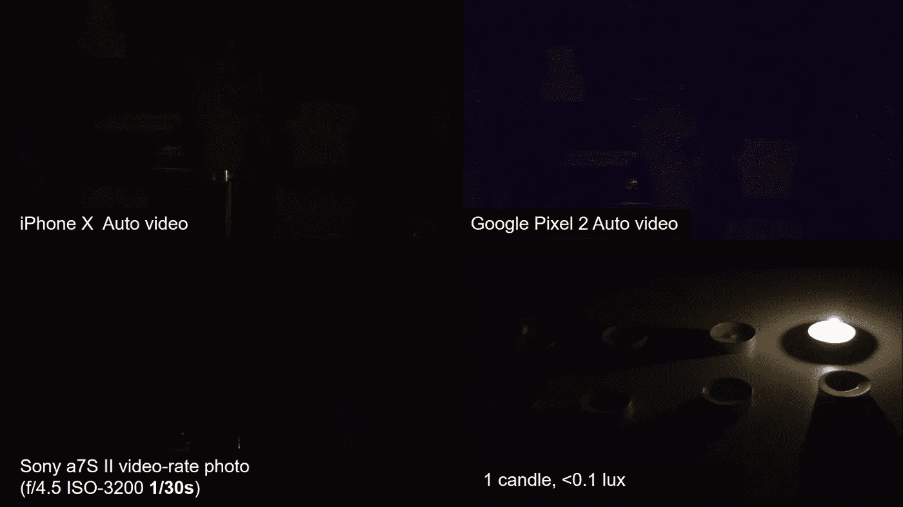****

****1 Candle — Low Exposure****

****如你所见，在这个阶段，所有的摄像机都失灵了，我们看到的是一片漆黑。这是因为两个不同的原因-****

1.  ****在移动相机中，这种情况已经发生，因为他们使用传统的去模糊和去噪技术，如 [BM3D 去噪](https://en.wikipedia.org/wiki/Block-matching_and_3D_filtering)，当光线量非常少并且没有任何作用时，这些技术就会失败。****
2.  ****在索尼相机中，这是因为曝光时间更短，所以允许进入相机的光量更少，因此图像更暗。****

****但是坚持住。我们能做些什么，在 1/30 秒的曝光时间和极低光线的条件下获得更好的图像(<0.1 lux)?****

****Be ready to get amazed as [本文](https://arxiv.org/abs/1805.01934)已经做到了我们想要的！****

****如果将上面 1 支蜡烛、低曝光的图像(照片最暗的图像)中的原始传感器数据输入全卷积网络，我们将得到如下所示的输出！****

****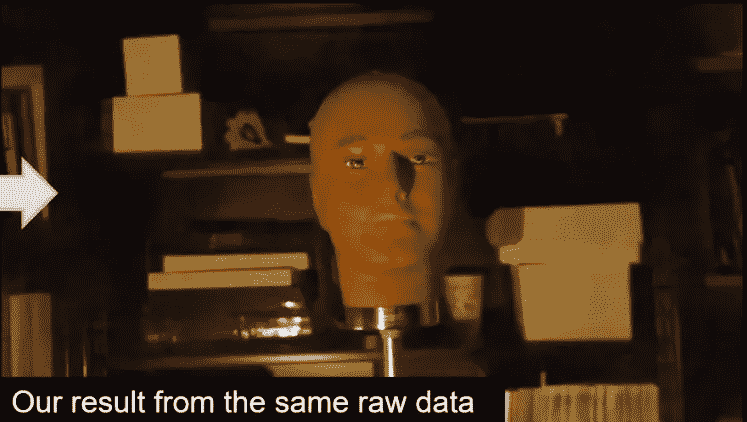****

****What! Are You Kidding Me!****

****惊讶吗？我也是。****

****我希望这项技术将很快在智能手机相机中实现，你将开始享受机器学习所提供的极弱光摄影！****

****这就是机器学习和神经网络的力量。****

****正是这些应用激励越来越多的人研究机器学习和神经网络。这就是**论文 101** 产生的确切原因！****

****欢迎在评论中发表你对[这篇论文](https://arxiv.org/abs/1805.01934)的看法。要了解更多关于这个过程的信息，你可以访问[报纸的网站](http://web.engr.illinois.edu/~cchen156/SID.html?utm_campaign=News&utm_medium=Community&utm_source=DataCamp.com)。****

****另外，欢迎在评论中对**论文 101** 提出建议和赞赏。****

****好了，这星期就这样，下次再见！****

****再见！****

********