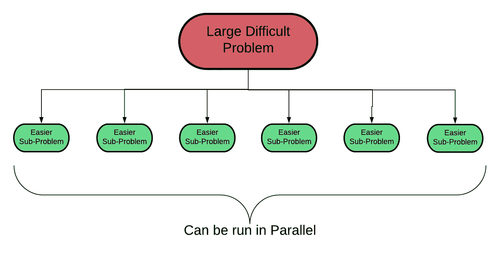
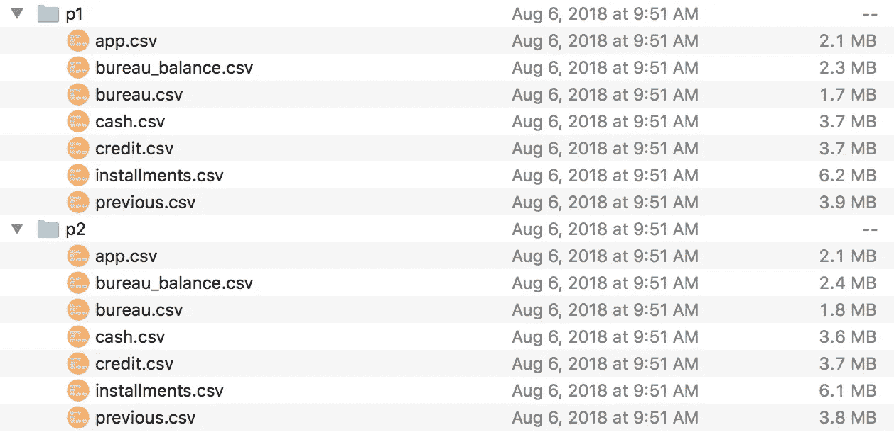
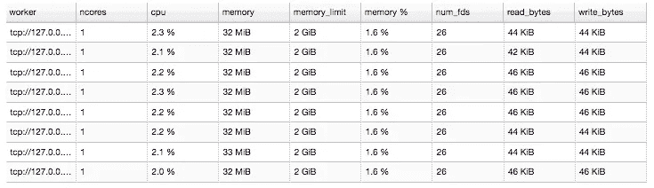
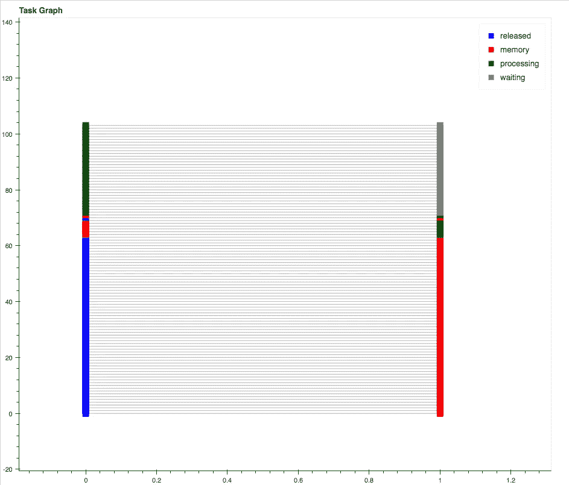
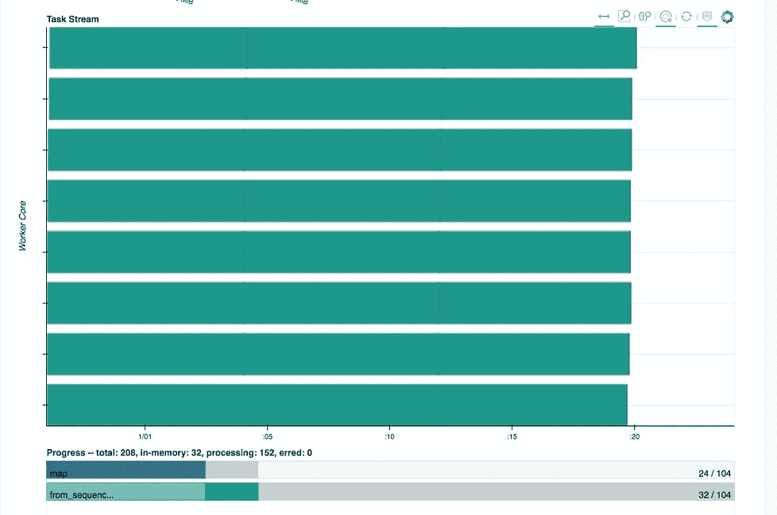
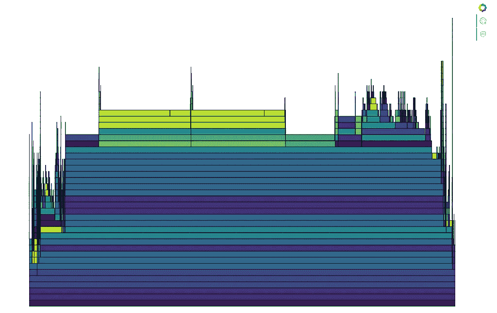
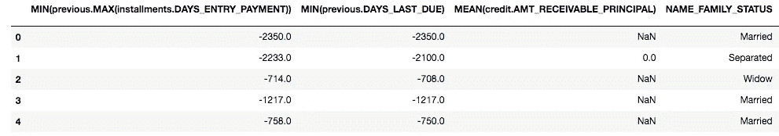

# 利用 Dask 并行化特征工程

> 原文：<https://towardsdatascience.com/parallelizing-feature-engineering-with-dask-3db88aec33b7?source=collection_archive---------4----------------------->


([Source](https://www.pexels.com/photo/timelapse-photography-of-road-with-white-and-red-lights-169976/))

## 如何使用并行处理扩展功能工具

当计算非常慢时，最重要的问题是:“瓶颈是什么？”一旦你知道了答案，合乎逻辑的下一步就是找出如何绕过瓶颈。

通常，正如我们将看到的，瓶颈是我们没有充分利用我们的硬件资源，例如，当我们的计算机有八个内核时，只在一个内核上运行计算。如果我们的代码不是为了使用我们所有的资源而编写的，简单地获得更大的机器——就 RAM 或内核而言——并不能解决问题。因此，解决方案是重写代码，尽可能高效地利用我们拥有的任何硬件。

在本文中，我们将了解如何重构我们的自动化特性工程代码，使其在笔记本电脑的所有内核上并行运行，同时将计算时间减少 8 倍以上。我们将利用两个开源库——[feature tools](https://www.featuretools.com/)用于[自动化特征工程](https://medium.com/@williamkoehrsen/why-automated-feature-engineering-will-change-the-way-you-do-machine-learning-5c15bf188b96)和 [Dask 用于并行处理](https://dask.pydata.org/)——并用真实世界的数据集解决一个问题。


We’ll combine two important technologies: automated feature engineering in Featuretools and parallel computation in Dask.

我们的精确解决方案是针对这个问题的，但是我们开发的一般方法可以用于将您自己的计算扩展到更大的数据集。

> 尽管这里我们将坚持使用一台计算机和 ***多内核*** ，但在未来，我们将使用同样的方法在 ***多台计算机*上运行计算。**

GitHub 上的 [Jupyter 笔记本](https://github.com/Featuretools/Automated-Manual-Comparison/blob/master/Loan%20Repayment/notebooks/Featuretools%20on%20Dask.ipynb)中提供了完整的代码实现。如果您还不熟悉 Featuretools，请查看文档或本文。在这里，我们将主要关注使用 Dask 的 Featuretools，跳过一些自动化特征工程的细节。

# 问题是:数据太多，时间不够

使用 Featuretools 应用自动化特征工程解决家庭信用违约风险问题(目前正在 Kaggle 上进行的[机器学习竞赛，目标是预测客户是否会偿还贷款)的主要问题是，我们有大量数据，这导致特征计算时间非常长。使用](https://www.kaggle.com/c/home-credit-default-risk)[深度特性合成](https://www.featurelabs.com/blog/deep-feature-synthesis/)，我们能够从 *7 个数据表和 5800 万行*客户端信息中自动生成 1820 个特性，但是调用一个只有一个内核的函数需要 *25 个小时*，即使是在具有 64gb RAM 的 EC2 实例上！

假设我们的 EC2 实例——甚至我们的笔记本电脑——有 8 个内核，为了加快计算速度，我们不需要更多的 RAM，我们需要利用这些内核。Featuretools 通过在对深度特征合成的[调用中设置`n_jobs`参数，允许并行处理。然而，目前该函数必须将整个](https://docs.featuretools.com/automated_feature_engineering/afe.html)`[EntitySet](https://docs.featuretools.com/loading_data/using_entitysets.html)`发送给机器上的所有工作线程(内核)。对于一个大的`EntitySet`，如果每个工作者的内存都耗尽了，这会导致问题。我们目前正在特性实验室致力于更好的并行化，但是现在我们用 Dask 解决我们的问题。

## 解决方法:制造许多小问题

方法是将一个大问题分解成许多小问题，然后使用 Dask 一次运行多个小问题——每个小问题在不同的内核上运行。这里重要的一点是，我们使每个问题—任务— **独立于其他问题**,因此它们可以同时运行。因为我们正在为数据集中的每个客户端创建特征，所以每个任务都是为客户端的子集创建特征矩阵。



When one problem is too hard, make lots of little problems.

我们的方法概述如下:

1.  通过划分数据，把一个大问题变成许多小问题
2.  编写函数，从每个数据分区创建一个特征矩阵
3.  使用 Dask 在我们所有的内核上并行运行步骤 2

最后，我们会有一些更小的特征矩阵，然后我们可以将它们组合成一个最终的特征矩阵。同样的方法——将一个大问题分解成许多并行运行的小问题——可以扩展到任何规模的数据集，并在其他分布式计算库中实现，如使用 [PySpark](http://spark.apache.org/docs/2.2.0/api/python/pyspark.html) 的 [Spark](https://spark.apache.org/) 。

> 无论我们有什么资源，我们都希望尽可能高效地使用它们，我们可以将这个框架扩展到更大的数据集。

## 数据分区:分而治之

我们的第一步是创建原始数据集的小分区，每个分区包含来自客户机子集的所有七个表的信息。然后，每个分区可以用于**独立地**计算一组客户端的特征矩阵。

这个操作是这样完成的:获取所有客户端的列表，将其分成 104 个子列表，然后遍历这些子列表，每次都将数据子集化为仅包括子列表中的客户端，并将结果数据保存到磁盘。这个过程的基本伪代码是:

104 个分区是根据反复试验和 3 个一般准则选择的:

1.  我们希望至少有与工作线程(核心)一样多的分区，并且数量应该是工作线程数量的倍数
2.  每个分区必须足够小，以适合单个工作者的内存
3.  更多的分区意味着完成每项任务的时间差异更小

(作为一个额外的优化点，我们将 pandas `object`数据类型转换为`category`，以减少内存使用。这使我们的整个数据集从 4 GB 增加到大约 2 GB。我推荐阅读关于`category`数据类型的 [Pandas 文档](https://pandas.pydata.org/pandas-docs/stable/categorical.html)，这样你就可以有效地使用它们。

将所有 104 个分区保存到磁盘大约需要 30 分钟，但这个过程只需执行一次。



Each partition contains all the data needed to make a feature matrix for a subset of clients.

## 分区中的实体集

Featuretools 中的实体集是一种有用的数据结构，因为它包含多个表以及它们之间的关系。为了从一个分区创建一个`EntitySet`,我们编写一个从磁盘读取分区的函数，然后用表和链接它们的关系生成`EntitySet` 。

这一步的伪代码是:

注意，这个函数*返回*的`EntitySet`，而不是像我们对数据分区那样保存它。对于这个问题，保存*原始数据*是一个更好的选择，因为我们可能想要修改`EntitySets`——比如通过添加有趣的值或领域知识特性——而原始数据永远不会改变。`EntitySets`是动态生成的，然后传递到下一个阶段:计算特征矩阵。

## 实体集的特征矩阵

函数`feature_matrix_from_entityset`正如其名称所暗示的那样:接受先前创建的 EntitySet，并使用深度特征合成生成具有数千个特征的特征矩阵。然后将特征矩阵保存到磁盘。为了确保我们为每个分区创建完全相同的特性，我们生成一次特性定义，然后使用 Featuretools 函数`calculate_feature_matrix`。

下面是整个函数(我们传入一个带有`EntitySet`和分区号的字典，这样我们可以用一个唯一的名称保存特征矩阵):

Creating a feature matrix from an EntitySet and saving it to disk.

`[chunk_size](https://docs.featuretools.com/guides/performance.html#adjust-chunk-size-when-calculating-feature-matrix)`是这个调用中唯一棘手的部分:它用于将特征矩阵计算分解成更小的部分，但是因为我们已经对数据进行了分区，所以这不再是必要的。只要整个 EntitySet 能够容纳在内存中，那么我发现通过将`chunk_size`设置为等于观察的数量来一次计算所有的行会更加节省时间。

我们现在拥有了从磁盘上的数据分区到特性矩阵所需的所有独立部分。这些步骤构成了大部分工作，让 Dask 并行运行这些任务非常简单。

# 释放你的机器

[Dask](https://dask.pydata.org/) 是一个并行计算库，它允许我们同时运行许多计算，要么使用一台机器上的进程/线程(本地)，要么使用许多独立的计算机(集群)。对于单台机器，Dask 允许我们使用线程或进程并行运行计算。

进程不共享内存，在单个内核上运行，更适合不需要通信的计算密集型任务。线程共享内存，但是在 Python 中，由于全局解释器锁(GIL)，两个线程不能同时在同一个程序中操作，只有一些操作可以使用线程并行运行。(关于线程/进程的更多信息，请参见[这篇精彩的文章](https://medium.com/@bfortuner/python-multithreading-vs-multiprocessing-73072ce5600b))

由于计算特征矩阵是计算密集型的，并且可以针对每个分区独立完成，所以我们想要使用**进程**。这些任务不需要共享存储器，因为每个特征矩阵不依赖于其他特征矩阵。用计算机科学的术语来说，通过划分数据，我们使我们的问题[尴尬的并行](http://www.cs.iusb.edu/~danav/teach/b424/b424_23_embpar.html)，因为工人之间不需要交流。

如果我们使用进程启动 Dask 如以下代码所示——我们有 8 个工作线程，每个内核一个，每个工作线程分配 2 GB 内存(总共 16gb/8 个工作线程，这将根据您的笔记本电脑而有所不同)。

```
from dask.distributed import Client# Use all 8 cores
client = Client(processes = True)
```

为了检查是否一切正常，我们可以导航到 localhost:8787，Dask 已经为我们设置了一个散景仪表板。在 Workers 选项卡上，我们看到 8 个工作线程，每个都有 2 GB 的内存:



Workers created by Dask with processes = True (run on a MacBook with 8 cores and 16 GB of RAM).

目前，所有 8 名工人都无所事事，因为我们没有给他们任何事情做。下一步是创建一个“Dask 包”,它基本上是 Dask 分配给工人的任务列表。我们使用`db.from_sequence`方法和分区路径列表来制作“包”。

```
import dask.bag as db
# Create list of partitions
paths = ['../input/partitions/p%d' %  i for i in range(1, 105)]# Create dask bag
b = db.from_sequence(paths)
```

然后，我们把`map`计算任务放到包里。`map`意味着获取一个函数和一个输入列表，并将该函数应用于列表中的每个元素。由于我们首先需要从每个分区创建一个`EntitySet`，我们将相关的函数映射到“包”:

```
# Map entityset function
b = b.map(entityset_from_partition)
```

接下来，我们做另一个映射，这次是制作特征矩阵:

```
# Map feature matrix function
b = b.map(feature_matrix_from_entityset, 
          feature_names = feature_defs)
```

这段代码将获取第一个`map`—`EntitySet`的输出，并将其传递给第二个`map.`。这些步骤实际上并不运行计算，而是创建一个任务列表，然后由 Dask 分配给工人。要运行任务并生成我们称之为的特征矩阵:

```
# Run the tasks
b.compute()
```

Dask 根据从映射构建的任务图(一个[有向无环图](https://en.wikipedia.org/wiki/Directed_acyclic_graph))自动分配任务给工人。当计算发生时，我们可以在散景仪表板上查看任务图表和状态。



Dask task graph midway through the computation process.

左边的一组块代表`entity_set_from_partition`函数调用，右边的块是`feature_matrix_from_entityset.` 。从这个图中，我们可以看出这两个函数之间存在相关性，但是在每个分区的特征矩阵计算之间**没有**。

在散景仪表板上还有许多其他可视化效果，包括任务流(左下方)和操作配置文件(右下方):



Task Stream (left) and Profile (right) of ongoing computation.

从任务流中，我们可以看到所有八个工人同时在使用，总共有 208 个任务要完成。概要文件告诉我们，最长的操作是计算每个分区的特征矩阵。

在我的 MacBook 上，构建和保存所有 104 个特征矩阵花了 6200 秒(1.75 小时)。这是一个相当大的改进，从重写我们的代码到尽可能有效地使用我们可用的硬件。

> 我们没有得到一台更大的计算机，而是重写代码，以最有效地利用我们拥有的资源。然后，当我们得到一台更大的计算机时，我们将能够使用相同的代码来最小化计算时间。

## 构建一个特征矩阵

一旦我们有了单独的特征矩阵，如果我们使用允许在线[学习](https://blog.bigml.com/2013/03/12/machine-learning-from-streaming-data-two-problems-two-solutions-two-concerns-and-two-lessons/)的算法，我们可以直接使用它们来建模。另一种选择是创建一个特征矩阵，可以使用 Pandas 在纯 Python 中完成:

Code to join together feature matrices.

单个特征矩阵有 350，000 行和 1，820 列，与我第一次使用单核制作它时的形状相同。



Subset of complete feature matrix.

# 结论

我们不应该考虑如何获得更多的计算能力，而应该考虑如何尽可能有效地利用我们现有的硬件。在本文中，我们介绍了如何使用 Dask 并行化我们的代码，Dask 让我们使用笔记本电脑完成计算的速度比在单核上快 8 倍。

我们设计的解决方案利用了几个关键概念:

1.  **把问题分解成更小的、独立的块**
2.  **编写函数，一次处理一个块**
3.  **将每个块委托给一个工人，并行计算**

现在，我们不仅可以利用 Featuretools 的自动化特征工程的速度和建模性能，还可以使用 Dask 并行执行我们的计算，并更快地获得结果。此外，我们可以使用相同的方法扩展到更大的数据集，使我们能够很好地应对任何机器学习问题。

如果构建有意义的高性能预测模型是您关心的事情，那么请通过[功能实验室](https://www.featurelabs.com/contact/)与我们联系。虽然这个项目是用开源的 Featuretools 完成的，但[商业产品](https://www.featurelabs.com/product)为创建机器学习解决方案提供了额外的工具和支持。