# 参数推断—最大后验概率

> 原文：<https://towardsdatascience.com/parameter-inference-maximum-aposteriori-estimate-49f3cd98267a?source=collection_archive---------1----------------------->

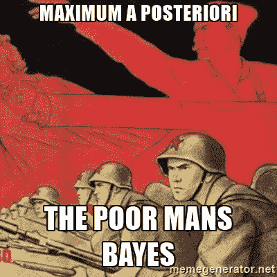

I dare you to not laugh at this comic after going through the post. :D

在[之前的帖子](https://medium.com/towards-data-science/parameter-inference-maximum-likelihood-2382ef895408)中，我们讨论了最大似然估计背后的动机以及如何计算它。我们还学习了一些通过引用单调函数来计算函数对数似然的技巧，以及它们如何使估计函数临界点的整个过程更容易，因为它们保留了这些临界点。

在 MLE 帖子的最后，我试图通过问一个简单的问题来激发使用 MAP(最大后验概率)的原因:

> 如果序列如下所示会怎样:

Img. 1: A sequence of two Heads

> 你认为第三次抛硬币是*反面*的概率是多少？

很明显，在这种情况下，

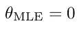

Img. 2

为什么？将#tails (0)和#heads (2)放入 *theta_MLE* 的等式中，

Img. 3

我们得出了结果。这个结果告诉我们，下一次掷硬币是*反面*的概率是 0(也就是说，它预测没有一次掷硬币会出现*反面= >* 硬币总是会出现*正面*)，很明显事实并非如此(除非是硬币被重装载的极端情况)。现在，这在参数估计过程中提出了一个大问题，因为它没有给我们下一次翻转的准确概率。我们知道，即使是公平的硬币也有 25%的几率连续出现两个*头像*(0.5 x 0.5 = 0.25)。所以，硬币也不是不可能是公平的。

# 后面的

虽然我们知道 MLE 是机器学习中的一个强大工具，但它也有缺陷(正如我们刚刚看到的)，这些缺陷发生在我们可用的数据量有限的时候。最大似然估计的问题在于它是一个**点估计，**也就是说，我们被允许在*计算一个特定值*的最大似然估计，这导致**过度拟合**(对于那些以前没有听说过这个术语的人，我建议你参考[Quora 上的这个](https://www.quora.com/What-is-an-intuitive-explanation-of-overfitting)答案)。因为这是一个点估计，所以它与数据过度拟合(连续 2 个*正面对*)，并且它没有考虑硬币可能仍然公平的可能性(或者可能只是稍微偏向*正面*)。显而易见的问题是:我们如何解决这个问题？

通常，我们对世界上正在发生的与数学无关的过程有着**先验信念**。让我们举一个简单的例子:假设你和你的朋友在一个“猜硬币”的游戏中打赌。现在，你可能会认为你的朋友已经稍微操纵了硬币，使其偏向他们，也许会使它有点偏向*的头像；* 55% *正面*和 45% *反面*(没有人会愚蠢到让它极端偏向某个特定的翻转，因为这很容易被察觉)。你对一个随机过程的这些假设被称为先验。用专业术语来说:

> 一个不确定量的**先验概率分布**，通常简称为**，是在考虑一些证据之前，表达一个人对这个量的信念的概率分布。**

**有没有什么方法可以将这些先验的信念用数学方法整合到我们的模型中？**

**是的:我们可以让参数 *theta* 本身成为一个随机变量，这也证明了我们一直在使用的符号是正确的；p(F = F |*theta*)[注意，考虑到这个符号已经暗示了 *theta* 是一个随机变量，这个假设是多么完美]。**

**现在我们可以在*θ*上进行分布，并加入这样的概念，即使在极端情况下(HH)，硬币仍然是公平的。正如我们将看到的，这个概念也有助于我们防止过度拟合。**

**对于任何 *x* ，我们希望能够在看到数据后表达我们的参数*θ*的分布，我们通过在观察到的数据序列上调节*θ*来做到这一点，就像这样:**

**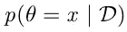**

**Img. 4: Posterior notation**

**其中 D 是一个随机变量，它捕获了手头的观察序列，即我们的数据。现在*θ*是一个随机变量，它可以取特定的标量值 *x* 。因为我们讨论的是抛硬币，所以我们知道上面的等式只对[0，1]中的 *x* 有意义(由于 *x* 是一个概率，所以它必须在 0 和 1 之间)。**

**我知道这很难接受。因此，让我们后退一步，尝试理解 MLE 中发生了什么，以及它与我们正在进行的 MAP 估计相比如何:**

**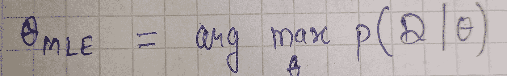**

**Img. 5: MLE - Likelihood is the probability of data **given** the parameter, and we were maximizing this w.r.t. *theta.***

**现在我们感兴趣的是:**

**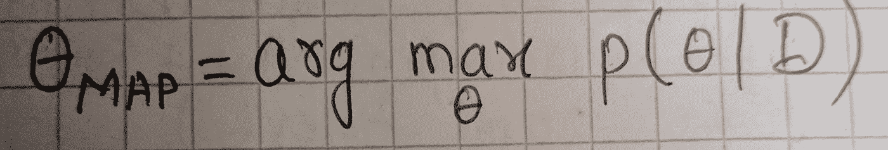**

**Img. 6: MAP — Maximizing the probability of theta **after** we have observed our data.**

**现在还不完全清楚地图术语的直观含义，但是当我们完成这篇文章的时候就会明白了。**

**而*一般为*，**

**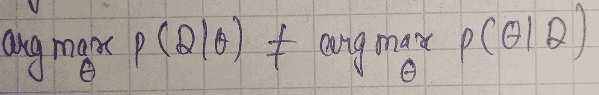**

**Img. 7: MLE != MAP**

**我们可以应用古老的贝叶斯法则来使地图公式变得更加神秘:**

****

**Img. 8: Bayes’ rule on MAP (Posterior)**

**分子包括:**

**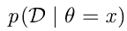**

**Img. 9: Numerator I — Likelihood**

**我们从 MLE 中知道这部分，唯一的区别是它现在用*θ*=*x .*固定，它被称为似然。**

**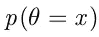**

**Img. 10: Numerator II — Prior**

**这是我们在观察任何数据之前对*θ*值的先验信念。它在之前被称为*，它防止过度拟合。关于前科的一点小动机:***

> **在很多情况下，我们有理由相信，θ的某些值比其他值更有可能。例如，在我们掷硬币的例子中，我们期望这个值在 0.5 左右，像 0 或 1 这样的极端值不太可能出现。这是 Prior 捕获的内容，它将防止极端结果(过度拟合)。**

**分母 p(D)称为*证据*，是一个归一化常数，在我们的例子中并不重要。没有分母，右边的表达式就不再是*概率*，因此范围不会从 0 到 1。“归一化常数”允许我们得到一个事件发生的概率，而不仅仅是这个事件与另一个事件相比的相对可能性。查看[关于堆栈交换的讨论](http://stats.stackexchange.com/questions/129666/why-normalizing-factor-is-required-in-bayes-theorem)。**

**我们应该从所有这些讨论中获得三个术语:**

1.  **在先的；在前的**
2.  **可能性，以及**
3.  **在后面的**

**它们是由贝叶斯法则联系在一起的。因此，先验是我们在观察到任何数据之前对 *theta* 看起来如何的信念，后验是我们在观察到一些数据之后对 *theta* 看起来如何的*的*更新的*信念。***

**现在我们已经建立了可能性(我们在上一篇文章中一直使用)和后验概率(我们现在感兴趣的)之间的联系。而这两者之间的联系是*先验*分布，先验分布是*我们的*模型的一部分。所以，是我们来选择优先。*先验的要点是，我们必须在不看观察的情况下选择它，*这为(可能是主观的)模型假设留下了空间。除了它需要是一个有效的概率分布之外，先验不需要满足任何特定的规则:**

**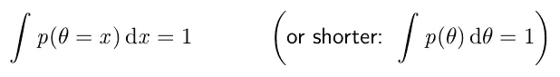**

**Img. 11: Prior is just a probability distribution.**

**让我们看几个前科的例子:**

1.  **我们假设存在除 0(HH 序列的最大似然)之外的其他可能性。现在这个先验是非常弱的，因为它没有给出太多关于这些可能性的信息。**
2.  **我们还可以假设参数*θ*最有可能在 0.4 和 0.5 之间的区域，这大约是 0.5 的真实概率(尽管 MLE 解告诉我们它是 0)。由于我们将假设限制在某个区域，这是一个相当强的*先验的例子。***

**这些主观假设也被称为**归纳偏差**。*通过引入这些主观假设，我们使我们的分析/模型偏向某些解决方案。*这是我们写下模型时必须意识到的事情。**

# **地图估计**

**下图说明了我们对*θ*的先验的几种选择:**

**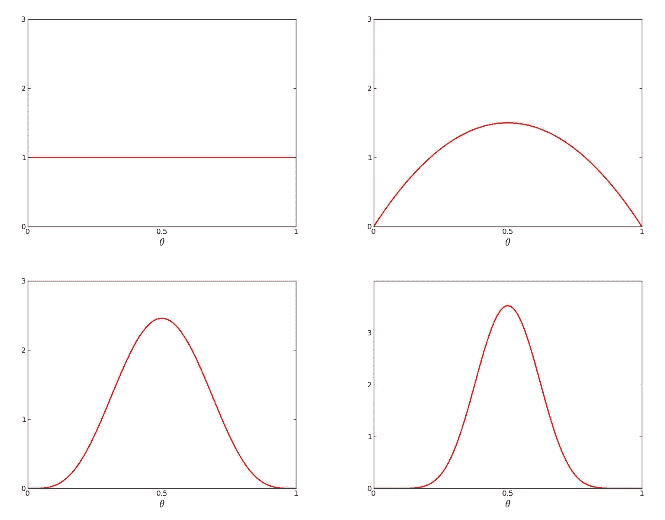**

**Img. 12: Prior choices (x-axis represents probability for theta. y-axis represents probability density)**

**第一张图显示了所有可能参数的均匀分布。它没有对模型施加任何归纳偏差，因此没有比其他方案更倾向于*θ*的任何方案。换句话说，这是我们的最大似然估计。因此，我们可以说 **MLE 是当先验是一致的**时映射的一个特例。**

**其他三个选项对*θ*施加了一些感应偏置。具体来说，我们可以看到它们都以 0.5 为中心，宽度不同(如果您可以推断出后三个模型对先验假设的严格性的降序，则为一个 cookie。；)).这意味着后三种方法都假设真实解在 0.5 左右的小区间内，区间宽度不同。**

**好了，现在我们对我们的先验应该是什么样子有了一些想法。在选择之前的模型的背后，我们能有更多的动机吗？一个可能的动机是，我们可以选择一个先验，这样可以简化进一步的计算(它们不会变得非常广泛)。这是为我们的特定模型(在我们的例子中:抛硬币)选择适当先验的驱动因素之一。**

**由于先验只是另一种概率分布，我们希望选择这种分布，使我们随后的计算更容易。事实证明，每当我们寻找一个直接对应于概率的参数的先验时(就像在我们的例子中，*θ*对应于抛硬币时*尾*出现的概率)，通常存在这样的先验，它们非常适合。**

**在我们的例子中，这个先验将是一个 **Beta 分布**:**

**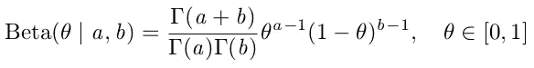**

**Img. 13: [pdf](http://mathinsight.org/probability_density_function_idea) of a beta distibution**

**贝塔分布可以理解为代表一个概率的*分布**——也就是说，它代表一个概率的所有可能值，当我们不知道那个概率是什么的时候。更直观的理解，见[本](http://stats.stackexchange.com/questions/47771/what-is-the-intuition-behind-beta-distribution)。***

**好吧，这看起来非常拜占庭式和令人沮丧的乍一看，但留在我这里。让我们仔细看看；我们开始注意到一些我们以前已经见过的术语:**

**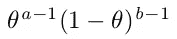**

**Img. 14: We have seen an extremely similar form in MLE.**

**我们已经看到了 Img 中的组件。14 在 MLE 中，除了指数中的# *头*和# *尾*被替换为 a-1 和 b-1。**

**除了*θ*项，我们还有归一化常数，它有[伽马函数](https://en.wikipedia.org/wiki/Gamma_function)。伽玛函数只不过是阶乘函数的扩展，它的参数下移了 1:**

**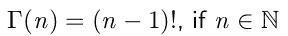**

**Img. 15: Gamma function**

**伽马函数的特殊之处在于它允许我们计算任意实数值的阶乘(伽马函数 1.5 是很好的定义，而 1.5！未定义)。**

**事实上，我们以前在某些地方看到过这种情况，这并不是巧合。我们已经选择了一个*共轭先验*。每当我们有一个先验，它具有与可能性相似的函数形式，并且它们很好地配合在一起，我们就说所谓的**共轭先验，**贝塔分布是我们掷硬币实验的可能性的共轭先验。解释如下:在没有看到任何数据的情况下，我们对掷硬币实验的结果有一种感觉。在我们的实验中，如果我们要掷 a+b-2 硬币，那么我们可以选择优先次序，这样掷硬币中的 a-1 会出现*尾*，剩下的 b-1 会出现*头。***

**所以，如果我们假设硬币是无偏的，我们会选择 a 和 b 相等。我们对这个假设越确定，我们就越会选择 a 和 b。**

**下图说明了 Beta 分布中 a 和 b 的几种选择:**

**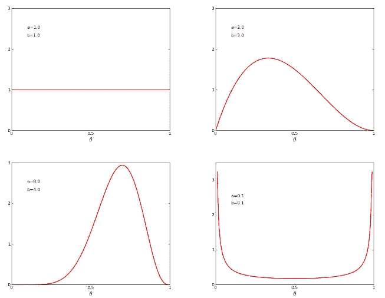**

**Img. 16: Four different Beta distributions (x-axis represents the probability for theta. y-axis represents density)**

**如果你想尝试不同的测试版，请点击这里查看 iPython 笔记本。**

**四幅图的解释:**

**a.选择 a 和 b 为 1(相等)意味着我们对实验没有任何假设。这是贝塔分布的一个重要特征:当 a = b = 1 时，它推广为均匀分布。**

**b.选择一个< b represents that we are less certain about *#反面*比选择一个*#正面*。该图通过显示*尾部*的概率更可能小于 0.5，清楚地说明了这一点。**

**c.相比正面，我们对反面是 T21 的把握是正面的两倍。从图中我们可以看到，翻牌是*反面*的概率偏向大于 0.5。**

**d.选择 a 和 b 为非整数有利于极端解决方案。不幸的是，为 a 和 b 选择非整数并没有任何可行的物理解释，但是它给了我们在建模先验分布时很大的灵活性。**

**从某种意义上说，我们对先前的假设越确定，我们就越能选择 a & b，这从 Img 的‘b’和‘c’图中可以看出。16.**

**既然我们已经通过各种论证论证了β分布是我们掷硬币实验的合适先验，那么让我们把我们所知道的一切代入我们在 Img 中使用的贝叶斯公式。8:**

****

**Img. 17: Bayes formula for Posterior**

**我们知道:**

**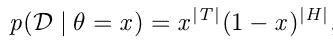**

**Img. 18: MLE part in our MAP solution**

**现在你可能会想，我们在之前得到的[的可能性中有*θ*:](https://medium.com/towards-data-science/parameter-inference-maximum-likelihood-2382ef895408)**

****

**Img. 19 : Likelihood**

**我们现在有 *x* 而不是*θ*的原因是因为我们已经假设*θ*本身是一个随机变量，可以取一个特定的值 *x.***

**因为我们已经决定先验是一个 Beta 分布，它采用以下形式:**

**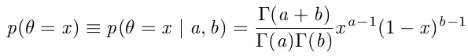**

**Img. 20: Prior**

**将这些值代入贝叶斯法则:**

**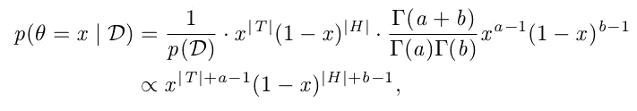**

**Img. 21: MAP formulation**

**第二个陈述通过省略 p(D)和贝塔分布的归一化常数引入了比例符号，因为它们都是常数 w.r.t. *x.* (此外，省略常数不会改变最大值的位置，只会改变其值。)**

**考虑上图中的第二个语句。我们可以看到为什么β分布或共轭先验通常是强大的，因为这一项实际上看起来像可能性，除了它有这些校正项 a-1 和 b-1。所以不管|T|和|H|有多极端(比如我们只抛了两次硬币)，我们都有这些修正项 a & b。**

**我们在这里所做的基本上是将结果从极端边际结果中抽离出来，就像我们在数据太少的情况下得到的最大似然结果一样。共轭先验之所以是先验的绝佳选择，是因为它们确实有这种效果。**

**好了，现在我们只剩下以下术语:**

**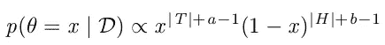**

**Img. 22: MAP with proportionality**

**我们如何找到把比例符号变成等号的乘法常数？**

> **让我们绕一个弯子，看看如何得出用常规方法无法求解(或至少很难求解)的特定积分的解:**

**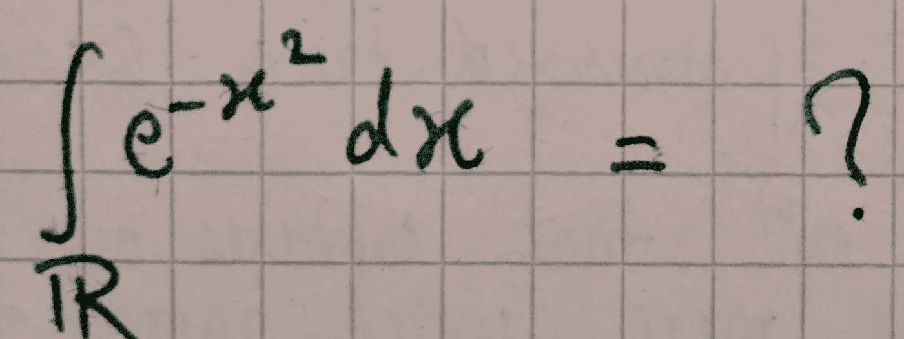**

**Img. 23: A not-so-easy integral**

> **你认为你能解析地解出这个纸上积分吗？我不是数学专业的，但对我来说，答案是肯定的和否定的。是的，你可以，但如果你能想出解决方案，用传统的微积分规则得出结果将需要相当长的时间。不，嗯，因为类似的推理需要太长时间。**
> 
> **如果你非常了解你的概率分布，你会知道下面的积分是:**

**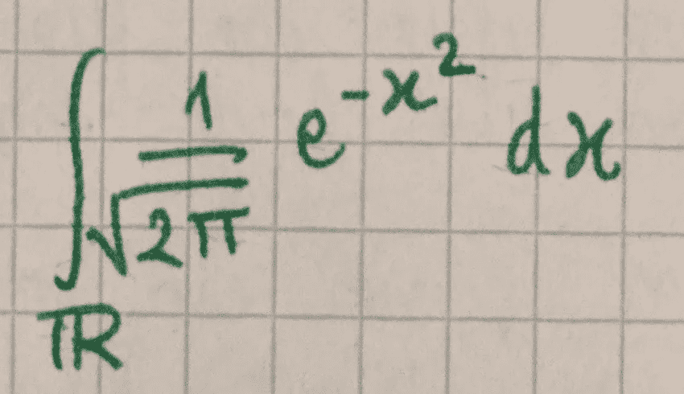**

**Img. 24: Standard gaussian pdf**

> **均值和单位方差为 0 的标准高斯分布的 pdf，即 X ~ N(0，1)，它等于 1。如果你想温习高斯语，我认为 ikipedia 的文章相当可靠。**
> 
> **如果上面的积分等于 1，那么只需要通过两边乘以 sq.rt(2*pi)来重新排列项，就可以得出我们刚才所说的实际积分的答案(Img。23).，我们看到:**

**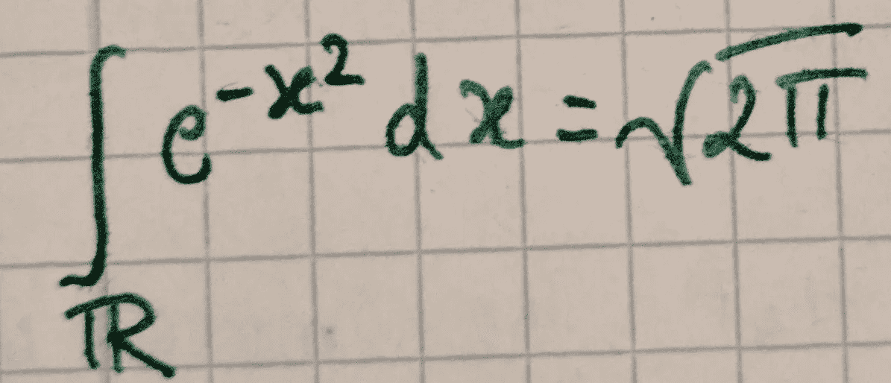**

**Img. 25 : Answer to the not-so-easy integral**

> **因此，从某种意义上说，我们通过逆向工程找到了一个相当困难的积分的解。**

**现在我们有了一个非常方便的技巧，让我们看看是否可以应用它来找出我们的 MAP 估计的比例常数。**

**我们知道我们的先验分布总和为 1:**

**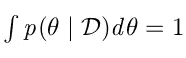**

**Img. 26: The only constraint on prior**

**以及 Img 中的 RHS。MAP 的 22 表达式与 pdf 成比例，pdf 积分为 1。注意到和我们的酷魔术惊人的相似了吗？**

**因此，通过逆向工程，后验概率也必须是贝塔分布，这里唯一起作用的常数是相应贝塔分布的归一化常数:**

**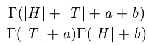**

**Img. 27: Constant of Proportionality for our MAP**

**没有其他常数使我们的 MAP 估计的 RHS 积分为 1。但是因为它*必须*积分为 1，这是唯一的工作常数。**

**每当我们应该解决一个困难的积分，我们仔细检查它，并试图找到它是否看起来像一个 pdf。如果是这样，我们可以很容易地逆向工程这个 pdf 的归一化常数，然后可以很容易地解决积分。**

**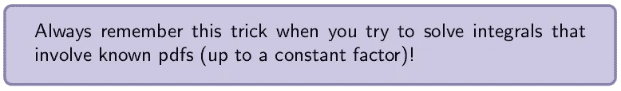**

**Img. 28: Note on the reverse engineering trick**

**这种逆向工程技巧的一个直接且非常好的结果是，我们可以很容易地确定我们的后验概率的分布。这使我们知道，我们的后验需要是一个贝塔分布，我们也知道参数:**

**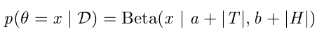**

**Img. 29: Posterior — Beta distribution**

**现在我们可以找到我们的参数 *theta* 的最大值，就像我们在 MLE [post](https://medium.com/towards-data-science/parameter-inference-maximum-likelihood-2382ef895408) 中所做的一样(我跳过了实际的计算；这是对数在 Img 方程中的一个简单应用。21 找出最大值)，我们得出以下结果:**

**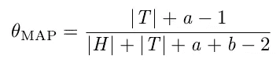**

**Img. 30: MAP Solution**

**将这个 MAP 估计与 ML 估计(|T|/|H|+|T|)进行比较，我们看到它们非常相似。项|T|/|H|+|T|再次出现在 MAP estimate 中，只不过它被我们先前的信念所修正。**

***根据我们先前的想法，在看到(i.i.d .)数据后，theta_MAP 是 theta 的最佳猜测。***

****称为最大后验估计(MAP)。****

**注意这里最重要的一点:后验工作*非常*直观。如果我们只有很少的数据(就像在我们的第二个实验中，我们只有两次抛硬币，两次都是*头*)，先验的影响会更强。另一方面，对于固定的 a & b，如果我们进行足够多的抛硬币(例如，一百万次)，那么 a & b 的影响几乎可以忽略不计，并且我们非常接近 MLE。这非常直观，因为在低数据范围内，先验防止过拟合，而如果我们从随机过程中获得大量可靠信息，我们就不再需要先验信息了。我们可以从数据本身获得所有信息。换句话说，当我们在数据中游泳时，MLE 占主导地位。**

**这个过程结束了吗？我们已经融入了我们对世界运作方式和随机过程展开方式的假设。还有什么要完成的？现在我们可以坐下来看 LOTR 三部曲了。**

**或者我们可以吗？事实证明，当我们将我们先前的信念结合到模型中时，我们隐含地倾向于某些解决方案(通过假设在抛硬币过程中的 beta 分布，我们使 MAP 估计偏向特定的解决方案；看起来像 Beta pdf 的表单)。那么所有其他也能影响一个过程的前科呢，尽管是以一种非常微妙的方式？有没有什么方法可以把它们也合并到我们的模型中？正如你已经知道的，答案是肯定的，我们将在下一篇文章中深入讨论它，当我们谈论我们模型的完全贝叶斯分析时。**

**我意识到这篇文章有时并不容易理解，其中涉及到很多数学问题。我希望我让你更容易和直观地理解地图估计的过程。如果你发现任何具体的部分太深奥，随时留下评论，我会尽快处理。**

****资源**:我在慕尼黑工业大学的研究生院教授的 ML 课程。在这里随意观看讲座[。](https://www.youtube.com/channel/UCpyPuMAyBvERU8YMngGy11g)**

**如果你觉得这篇文章有趣，请推荐并分享它，这样其他人也可以从中受益。**