# 参数推断—最大似然

> 原文：<https://towardsdatascience.com/parameter-inference-maximum-likelihood-2382ef895408?source=collection_archive---------1----------------------->

The never ending debate of Frequentists and Bayesians. (Image source: [xkcd](https://xkcd.com/1132/))

他的文章深入探讨了理论机器学习最重要的概念之一，即。，参数推断。当我觉得需要的时候，我会试着专注于对概念的直觉理解，同时嵌入数学公式。如果你曾经在大学上过本科/研究生水平的机器学习课程，你一定遇到过参数推断。当我第一次遇到这种情况时，我绞尽脑汁了好一阵子，试图理解圆周率的概念(不是一个众所周知的参数推断的缩写)，这就是为什么我觉得有必要写一篇文章，让其他人更容易理解。我希望当我们完成这篇文章后，你能从中获取一些有价值的东西。我们开始吧。

PI 可以自由地描述为确定参数的过程，这些参数控制着从实验中生成的数据集。例如，如果我们抛硬币十次，得到下面的数据集，

Img. 1: 10 flips of a coin

产生这十次翻转的参数是什么？事实证明，参数推断的过程并非完全无关紧要，需要相当多的数学知识才能理解。如果你了解对数、微积分(准确地说是微分)和基本概率的基础知识，这篇文章应该不难理解。无论如何，让我们言归正传。PI 可以被认为是一个分步骤的过程，有三个主要步骤:

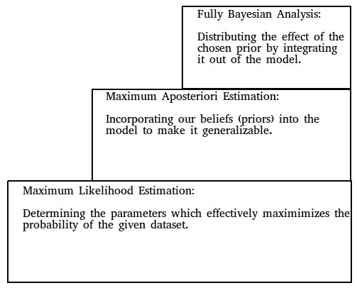

Img. 2: Three steps to Parameter Inference.

我们从最低的一步开始，然后努力到达最高的一步。每一步都比前一步稍微复杂一些，但同时，它为我们提供了一个更健壮的模型来描述数据。这篇文章将详细讨论最底层的步骤*最大似然估计*，后续文章将讨论另外两个步骤。*(附带提示:使用笔和纸可以轻松理解术语和公式，因为介质尚不支持数学符号)*。好吧，那么 MLE 是什么？

# 最大似然估计

如图所示，最大似然估计的整个过程围绕着确定使数据概率最大化的参数。回到抛硬币的例子，你认为第 11 次抛硬币是反面的概率是多少？有两个合乎逻辑的答案:

1.  如果你说 0.5，这是一个合理的答案，因为翻转是相互独立的，下一次翻转是*尾*有 1/2 的机会，即 0.5。
2.  另一个答案可能是 0.3。这个答案背后的基本原理是，我们可以预期硬币的翻转会继续到目前为止发生的方式(直到第十次翻转)。

我暂时不会告诉你正确的答案。让我们一起努力找出哪一个是正确的。好的，那么我们需要找出*P_11*(*F_11*=*Tails*)，其中 P _ 11 是第 11 次翻转的概率，F _ 11 是第 11 次翻转。这产生了一般情况: *i* th 翻转为 *Tails:*

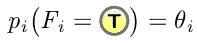

Img. 3

其中 *F_i* 表示第 *i* 次翻转，而*θ_ I*是控制第 *i* 次翻转的参数。为了表示概率分布取决于*θ_ I*，我们可以写为:

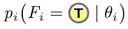

Img. 4

你看到这里的问题了吗？我们有依赖于参数 *theta_1* 到 *theta_10* (i = 1 到 10) *的数据。这就提出了一个问题，那就是我们如何把它推广到。暂时还是坚持现有的，即 *theta_1* 到 *theta_10。**

翻转序列的所有随机性由参数 *theta_1* 至 *theta_10:* 控制(建模)

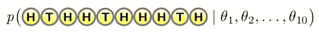

Img. 5

我们目前对 *theta_1 了解多少..theta_10* ？他们是否以某种方式与 *theta_11* 联系在一起？乍一看，似乎没有什么联系。现在我们可以开始 MLE 的过程了:我们需要找到 *theta_i 的*使得

Img. 6

是尽可能高的。这是 MLE 背后的原则:

Img. 7

MLE 着眼于数据的概率(所谓的*可能性；* Img。5 & 6】并且它试图找到使该序列的可能性/概率最大化的那些参数*θ_ 1*到*θ_ 10*。最后一次重申，我们要选择那些参数，在这些参数下，我们的观察变得最有可能。这就是这个过程被称为 MLE 的原因。

现在让我们尝试实际模拟 Img 中描述的概率。5 & 6.为了能够计算出数据的最大似然估计，我们需要做出两个关键假设:

一、抛硬币互不影响，即互不相关*(第一次抛硬币的结果不影响第二次抛硬币的结果，以此类推) *:**

*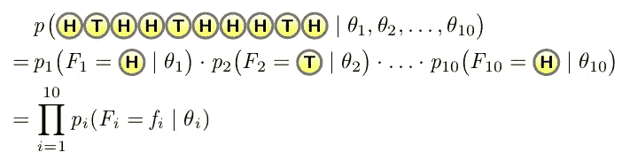*

*Img. 8: The independence assumption allows us to simplify the complex likelihood term into ten simpler factors.*

*Img 中的第三个语句。8 只是一个简写符号，描述第二条语句中十项的乘积。*

*第一个假设允许我们大大简化似然项，但是请注意，速记符号中仍然存在 *theta_i* 。这意味着我们仍然没有等式中的 *theta_11* 。*

*还有一个假设可以进一步解开这个等式。这是因为硬币(一般来说，实验设置)没有显著变化:*

*二。翻转在数量上是相同的，即它们是*同分布的:**

*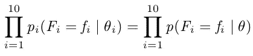*

*Img. 9: Since the flips are taking place under similar circumstances, we can assume that the parameter governing the flips is one and same.*

*第二个假设是翻转是同分布的，允许我们从*θ*中去掉下标 *i* 。这意味着我们观察到的所有 10 次翻转本质上都是由同一个参数*θ决定的；不再有十个参数来控制十次不同的翻转，我们现在只有一个参数来控制整个硬币翻转的顺序，这也包括第 11 次翻转。从某种意义上来说，我们正在把前 10 次抛硬币和第 11 次抛硬币联系起来。我们很快就会看到，这将是推论的关键。**

*注意:我们所做的两个假设在机器学习中使用得如此频繁，以至于它们作为一个实体有一个特殊的名称， **i.i.d .假设**:*

***总的来说，这 10 次翻转是独立的，并且分布相同。***

*这允许我们明确地写下我们试图优化的可能性。记住 *theta* 被定义为翻转出现*尾部*的概率；我们的序列 w . r . t .*θ*的概率现在可以表述为:*

**

*Img. 10: First term is the probability of *Heads, second for Tails, third and fourth for Heads, fifth for Tails and so on. Note that this formula corresponds to the sequence of our coin flip.**

*因此，通过这种非常广泛和非常直观的假设，我们将似然函数简化为一个相当简单的多项式；我们可以开始优化参数 *theta 的函数。**

*根据我们的模型假设:*

*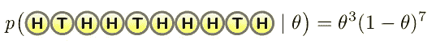*

*Img. 11*

*上述简化的多项式可以解释为*θ*的函数，即*f(θ)*。现在我们想找出这个函数的最大值(最大似然)。对如何进行有什么想法吗？*

*没错！从这里开始都是基本的高中数学。我们取导数*df/d(θ)*，设为零，求解*θ。*然后验证[临界点](http://mathinsight.org/critical_points_monotone_increase_decrease_refresher)(函数斜率为零的点:极大值、极小值和鞍点。在这种情况下，我们只关心最大值)，通过将它们插入到 *f(theta)* 的二阶导数中。*

*原则上，这相当简单。除了一个警告:f(theta) 的二阶导数已经很难看了，因为我们需要应用[乘积法则](https://www.math.ucdavis.edu/~kouba/CalcOneDIRECTORY/productruledirectory/ProductRule.html) *两次*才能得到它。这是可行的，但要实现这一目标，需要大量单调的技术工作。有什么方法可以简化我们的计算吗？*

*数学的美妙之处在于它为我们提供了无数的途径来找到一个特定的解决方案。其中一些比另一些容易几倍。我们将应用一个更简单的途径来优化我们的似然函数:*

> *让我们稍微了解一下高中微积分，分析一下单调函数(如果你已经对这个概念很熟悉了，可以继续到本节末尾)。我们已经知道如何找出函数的最大值或最小值，并且实际的最大值和最小值被称为函数的临界点*。*数学中有一条规则，即*如果我们将一个单调函数应用于我们正在优化的另一个函数，单调函数的应用将保留原始函数的临界点*(维基百科文章* *是了解更多关于单调函数的极好来源)。***
> 
> **如果 x1 < x2 = > f(x1) < f(x2):这是一个*单调递增函数*。**
> 
> **如果 x1 < x2 = > f(x1) > f(x2):这是一个*单调递减函数*。**
> 
> *[*对数函数*](http://catalog.flatworldknowledge.com/bookhub/reader/4372?e=fwk-redden-ch07_s03) *是单调递增函数的一个例子:**

*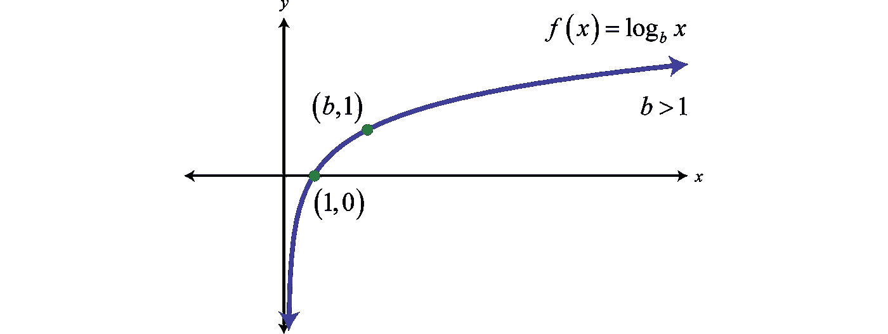*

*Img 12: A monotonically increasing function — log(x)*

> **因此，我们可以断定* log f(theta) *与* f(theta)具有相同的最大值。*

*因此，如果我们将 log 应用于我们的似然函数，我们将得到与我们直接优化它所得到的相同的最大值。*

*所以我们想找出:*

*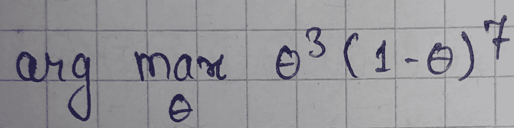*

*Img. 13: arg max f(theta)*

*[Arg max](http://math.stackexchange.com/questions/312012/what-is-the-difference-between-arg-max-and-max) 是指我们想知道这个函数最大化时*θ*的*值，而不是函数本身的*最大值*。这意味着我们**而不是**真正关心的是函数的实际最大值。相反，我们感兴趣的是函数具有最大值的*θ*的值(在继续之前，让它沉淀片刻)。**

*取该函数的日志:*

*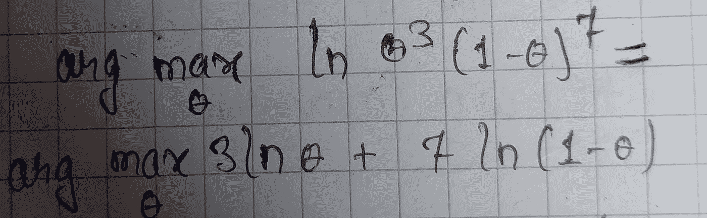*

*Img. 13: log arg max f(theta)*

*我们用 *g(theta)* 表示这个函数:对数似然。*

*对*g(θ)*求导*

*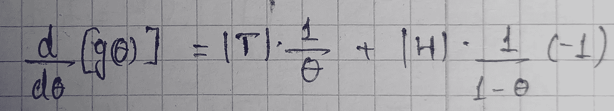*

*Img. 14: derivative of g(theta)*

*其中|T|是尾部的数量(在我们的示例中为 3)，而|H|是头部的数量(在我们的示例中为 7)。我引入 T 和 H 是为了使解决方案具有普遍性。*

*将*g’(θ)*的值设置为零(以找到*θ*的临界值):*

*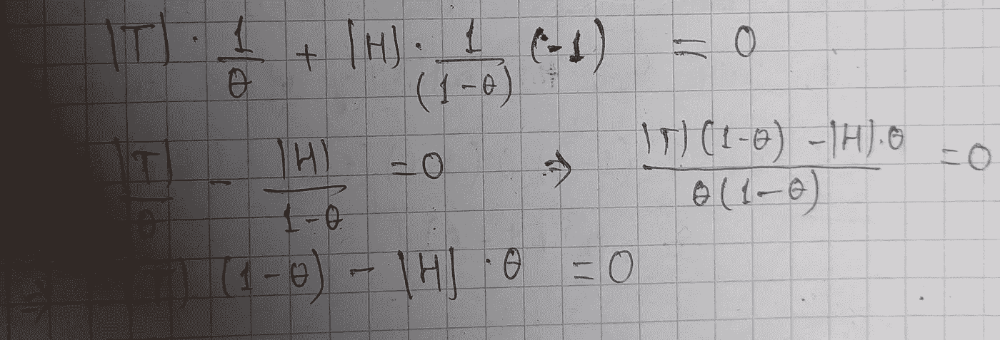*

*Img. 15: Critical value of theta — I*

**

*Img. 16: Critical value of theta — II*

*因此，任何硬币序列的最大似然估计(MLE ):*

*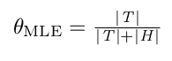*

*Img. 17: Theta MLE*

*我们已经得到了参数*θ*的最大似然估计，该参数控制着我们的硬币投掷数据集。回到原来的问题，第 11 次翻转是*尾*的概率是多少？*

*设|T| = 3 和|H| = 7，我们得到的答案为 0.3。这证明了 30%是我们最初问题的合理答案。*

*现在我们需要在二阶导数中代入*θ*的这个临界值，来验证它确实是最大值。为了简洁起见，我在这里跳过了这个验证。但是请继续下去，说服自己这确实是最大值。*

*这个最大值被称为*θ的 *MLE。*这个特殊的 *theta* 是最有可能让我们观察到的序列。**

*直觉上，这个 30%的值也是合理的，因为我们预计硬币会以开始的方式继续翻转。所以，我们发现当我们看数据时，MLE 解释了我们的直觉，这很好。*

# *MLE 的缺点？*

*显然，正如我们在阶梯图中已经看到的，找到最大似然并不是参数估计的结束。我们还剩下*最大事后估计*和*完全贝叶斯分析。*那么，是什么促使我们不止步于 MLE 并完成流程呢？你能想出一个理由吗？*

*如果序列如下所示会怎样:*

**

*Img. 18: A sequence of two Heads*

*你认为第三次翻转是*反面*的概率是多少？*

*在即将到来的[帖子](https://medium.com/@rahulbohare/parameter-inference-maximum-aposteriori-estimate-49f3cd98267a)中，我们将探索 MLE 的缺点，找出 MAP ( *最大后验估计*)和*完全贝叶斯分析*背后的直观原理，并且还将建立 ML 中的几个关键概念，即。共轭先验，归纳先验和一种允许我们计算不可解积分的技术。*

*如果你心中有任何概念对你来说没有直观的意义，并希望看到类似的帖子，请在评论中告诉我，我会尽力提出来。*

## *资源:*

1.  *我在慕尼黑工业大学的研究生院教授的精彩的 ML 课程。你可以在这个 YouTube [频道](https://www.youtube.com/channel/UCpyPuMAyBvERU8YMngGy11g)观看所有讲座。*

*如果你喜欢这篇文章，请随意推荐和分享，这样其他人也可以从中受益。*