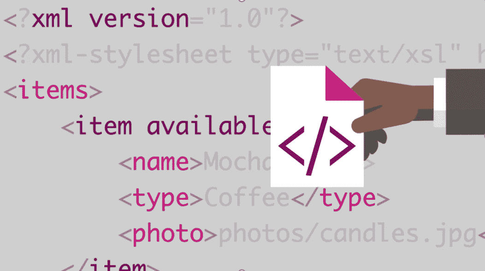
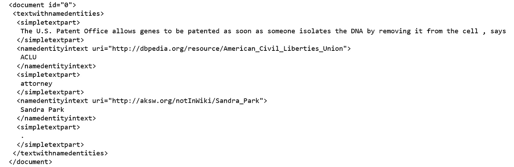
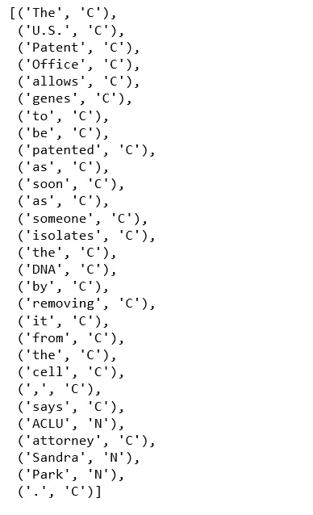
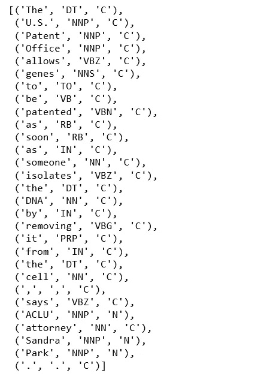
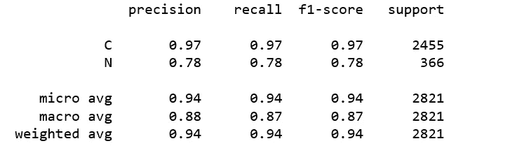

# 解析 XML，一次性识别命名实体

> 原文：<https://towardsdatascience.com/parsing-xml-named-entity-recognition-in-one-shot-629a8b9846ee?source=collection_archive---------5----------------------->



Photo credit: Lynda.com

## 条件随机场，序列预测，序列标记

[解析 XML](https://www.w3schools.com/xml/xml_parser.asp) 是一个旨在读取 XML 并为程序使用 XML 创造一种方式的过程。XML 解析器是一种软件，它读取 XML 文件，并将这些文件中的信息提供给应用程序。

在读取 XML 文件时，解析器会检查格式的语法，并报告任何违规情况。

我们今天的主要目标不是解析 XML，而是命名实体识别(NER)，但是我们要使用的数据是以 XML 格式存储的。

NER 的任务是确定文本中提到的实体的身份。例如，给定句子“[巴黎是法国的首都](https://en.wikipedia.org/wiki/Entity_linking)”，思路是确定“巴黎”指的是[巴黎](https://en.wikipedia.org/wiki/Paris)的城市，而不是[巴黎希尔顿](https://en.wikipedia.org/wiki/Paris_Hilton)。

“巴黎是法国的首都”这句话暗示**巴黎**是一个国家的首都，暗示**巴黎**是一个城市，而不是一个人的名字。

命名文档集合中发现的实体的任务极具挑战性。幸运的是，[UPB](https://github.com/dice-group/n3-collection)[数据科学小组从德国](https://github.com/dice-group)提供了一组用于 NLP 交换格式的命名实体识别的带注释的训练数据集，我们将使用其中一个名为 500newsgoldstandard.xml 的数据集，可以在这里[找到](https://raw.githubusercontent.com/dice-group/n3-collection/master/500newsgoldstandard.xml)。

# 数据

为了研究数据，我们使用`prettify()`以分层格式的嵌套数据结构获取文档:

```
with codecs.open("500newsgoldstandard.xml", "r", "utf-8") as file:
    soup = BeautifulSoup(file, "html.parser")
print(soup.prettify())
```

数据创建者侧重于识别三类主要的命名实体:人、地点和组织。从第一份文件中我们可以看到:



Figure 1

该文件有一句话“美国专利局允许基因获得专利，只要有人通过从细胞中取出 DNA 来分离 DNA，美国公民自由联盟的律师桑德拉·帕克说”，其中“美国公民自由联盟”(一个组织)和“桑德拉·帕克”(一个人的名字)被标记为命名实体。因为它们在`namedentityintext`标签之间。

# 数据预处理

文本预处理包括遍历`textwithnamedentities`下元素的每个子元素，否则我们将“N”标记为命名实体“C”的一部分。

以下代码返回文档列表，每个文档都包含单词和标签对。

```
docs = []
for elem in soup.find_all("document"):
    texts = []
    for child in elem.find("textwithnamedentities").children:
        if type(child) == Tag:
            if child.name == "namedentityintext":
                label = 'N'
            else:
                label = 'C'
            for w in child.text.split(" "):
                if len(w) > 0:
                    texts.append((w, label))
    docs.append(texts)
```

我们可以再次调查第一份文件。

```
docs[0]
```



Figure 2

# 位置标签

我们将对文档列表应用单词标记和词性标注。

```
data = []
for i, doc in enumerate(docs):
    tokens = [t for t, label in doc]
    tagged = pos_tag(tokens)
    data.append([(w, pos, label) for (w, label), (word, pos) in zip(doc, tagged)])
```

这为我们提供了包含单个单词、POS 标签及其标签的元组列表。

```
data[0]
```



Figure 3

# 条件随机场

在命名实体识别领域，我们的输入数据是连续的，我们预测相互依赖以及依赖于其他观察变量的变量，也就是说，我们在对数据点进行预测时考虑周围的上下文，再想想“巴黎是法国的首都”与“巴黎希尔顿”。

所以我们会定义一些特征，比如词的身份、词的部分、下/标题/上标志、词的后缀、词的形状、词的词性标签；此外，使用来自邻近单词的一些信息，以及不在文档开头的单词的所有这些特征，不在文档结尾的单词的所有这些特征。

# 条件随机场 Python 库，Python-Crfsuite

[Python-crfsuite](https://github.com/scrapinghub/python-crfsuite) 是一个绑定到 [CRFsuite](https://github.com/chokkan/crfsuite) 的 Python，这是一个用于标记顺序数据的条件随机字段(CRF)的实现。该库已被广泛用于命名实体识别。

以下代码大部分摘自 [python-crfsuite](https://github.com/scrapinghub/python-crfsuite) ，用于上述特征提取:

features_crfsuite.py

## 训练模型

train_crfModel.py

## 评估结果

evaluate_results.py



Figure 4

对于第一次尝试来说还不算太差！

[Jupyter 笔记本](https://github.com/susanli2016/NLP-with-Python/blob/master/NER%20500newsgoldstandard.ipynb)可以在 [Github](https://github.com/susanli2016/NLP-with-Python/blob/master/NER%20500newsgoldstandard.ipynb) 上找到。享受这周剩下的时光。

参考资料:

 [## 条件随机场简介

### 假设你有一系列贾斯汀比伯生活中某一天的快照，你想给每张照片贴上…

blog.echen.me](http://blog.echen.me/2012/01/03/introduction-to-conditional-random-fields/)  [## 在 Python 中使用 CRF 执行序列标记

### 在自然语言处理中，从给定的文本中抽取特定类型的词或短语是一项常见的任务

www.albertauyeung.com](http://www.albertauyeung.com/post/python-sequence-labelling-with-crf/)