# 第 1 部分:从头开始的神经网络—基础

> 原文：<https://towardsdatascience.com/part-1-a-neural-network-from-scratch-foundation-e2d119df0f40?source=collection_archive---------8----------------------->

在这一系列文章中，我将解释神经网络的内部工作原理。我将为其背后的理论奠定基础，并展示如何用几行简单易懂的 Java 代码编写一个合格的神经网络。

这是系列文章的第一部分:

*   [第一部分:基础](https://medium.com/@tobias_hill/part-1-a-neural-network-from-scratch-foundation-e2d119df0f40)。
*   [第二部分:梯度下降和反向传播](https://medium.com/@tobias_hill/part-2-gradient-descent-and-backpropagation-bf90932c066a)。
*   [第 3 部分:用 Java 实现](https://medium.com/@tobias_hill/part-3-implementation-in-java-7bd305faad0)。
*   第四部分:更好、更快、更强。
*   [第 5 部分:训练网络阅读手写数字](https://medium.com/@tobias_hill/part-5-training-the-network-to-read-handwritten-digits-c2288f1a2de3)。
*   [额外 1:我如何通过数据扩充提高 1%的准确度](https://medium.com/@tobias_hill/extra-1-how-i-got-1-better-accuracy-by-data-augmentation-2475c509349a)。
*   [号外 2:MNIST 游乐场](https://machinelearning.tobiashill.se/extra-2-a-mnist-playground/)。

# 背景

几周前，我决定学习机器学习。我最感兴趣的是*应用机器学习*以及这种范式可能带来的商业机会和新软件。我认为一个合理的前进方式是选择任何框架，如 [TensorFlow](https://www.tensorflow.org/) 或 [DL4J](https://deeplearning4j.org/) 并开始尝试。所以我做了…并且变得沮丧。原因是，仅仅在这些框架中的任何一个中建立一个良好行为的神经网络就需要对概念和内部工作有相当多的理解:*激活函数、优化器、正则化、退出、学习速率退火、*等。——我分明是在黑暗中摸索。

我只是需要对这一切有更深的理解。因此，我一头扎进了浩瀚的互联网信息海洋，经过一周的阅读，我不幸地意识到，没有多少信息转化为知识。我不得不重新思考。

长话短说:我决定自己建立一个小型神经网络。作为一个获取知识的游乐场。

结果很好。从零开始构建时所需的实践/理论组合正是我加深理解的正确方式。这是我学到的。

# 神经网络

从外部来看，神经网络只是一个函数。因此，它可以接受输入并产生输出。这个函数是高度参数化的，这是非常重要的。

有些参数是我们自己设定的。这些参数被称为超参数，可以被视为我们的神经网络的*配置。然而，大多数参数是网络固有的，我们无法直接控制。为了理解为什么这些是重要的，我们需要看看它的内部。*

一个简单的神经网络通常由一组隐藏层组成，每个隐藏层包含许多神经元，在图中标记为黄色。输入图层标记为蓝色。

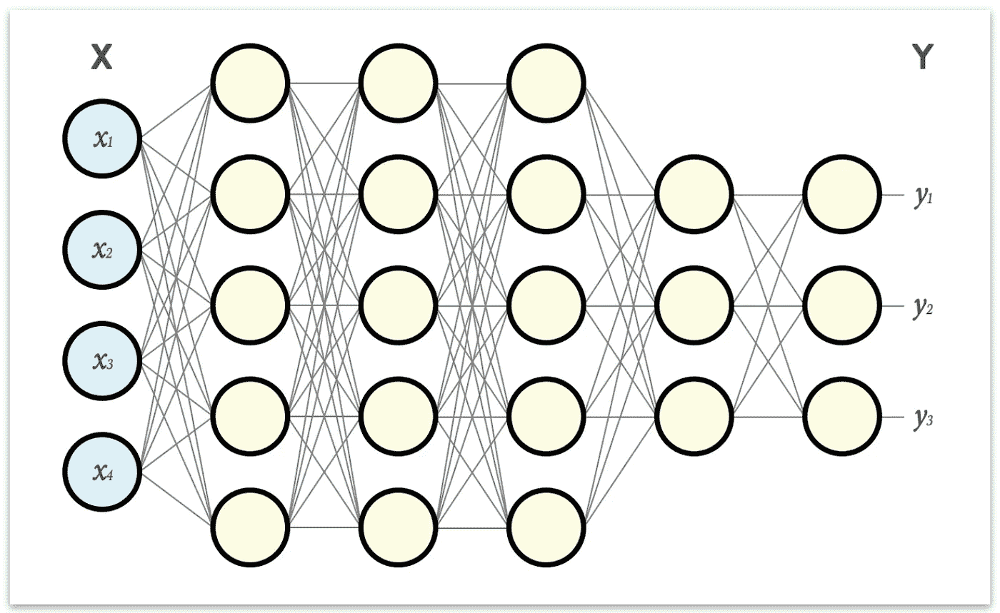

在上面的配置中，输入是大小为 4 的向量 X，输出是大小为 3 的向量 Y。

如图所示，一层中的每个神经元与下一层中的每个神经元之间都有联系。每个这样的连接实际上都是一个参数或*权重*。在这个例子中，我们已经有了 94 个权重形式的额外参数。在更大的网络中，数量可能更多。这些权重将定义网络的行为方式以及将输入转换为期望输出的能力。

# 神经元

在我解释如何将网络作为一个整体来转换数据之前，我们需要进一步放大。向单个神经元问好:

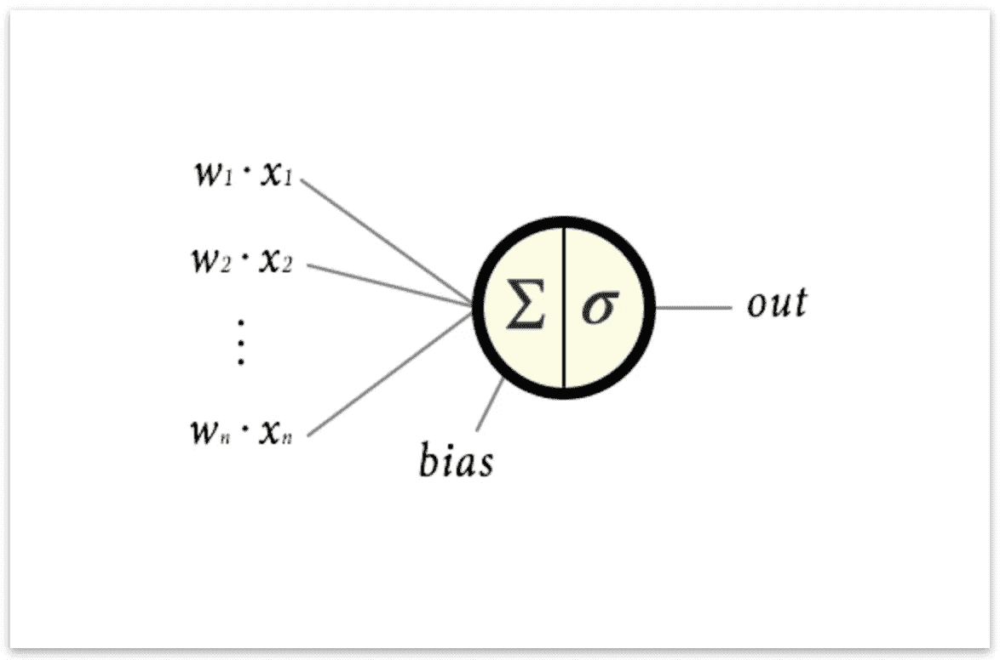

每个神经元的输入是前一层中每个神经元输出的加权和。在示例中，这将是:

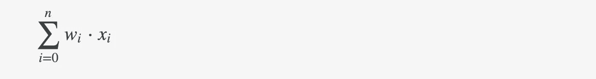

在此基础上，我们添加了一个称为 bias 的标量值， *b* ，它给出了神经元的总输入:

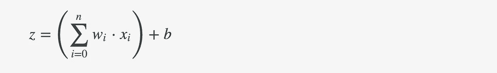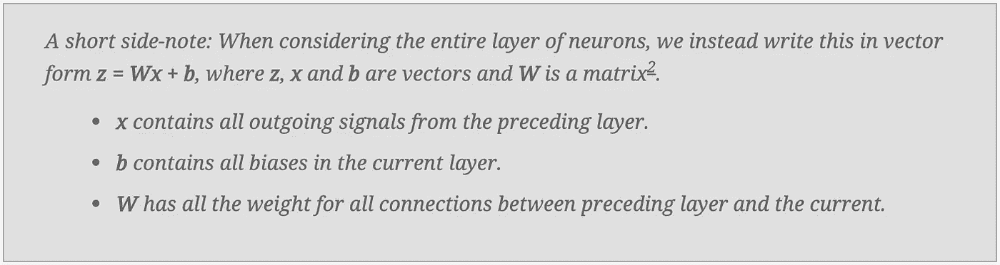

然后，输入信号在神经元内通过应用称为*激活函数*的东西进行转换，表示为 **σ** 。*激活函数*的名称源于这样一个事实，即如果输入信号 **z** 足够大，该函数通常被设计为让信号通过神经元，但是如果 **z** 不够大，则限制神经元的输出。我们可以认为这是神经元*触发*或*活跃*，如果刺激足够强的话。

更重要的是，激活功能增加了网络的非线性，这在试图有效地拟合网络时很重要(通过*拟合网络*我的意思是*训练网络产生我们想要的输出*)。没有它，网络将只是其输入的线性组合。

经常使用被称为整流线性单元或 ReLU 的激活函数(或其变体)。ReLU 很简单:

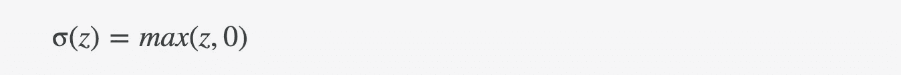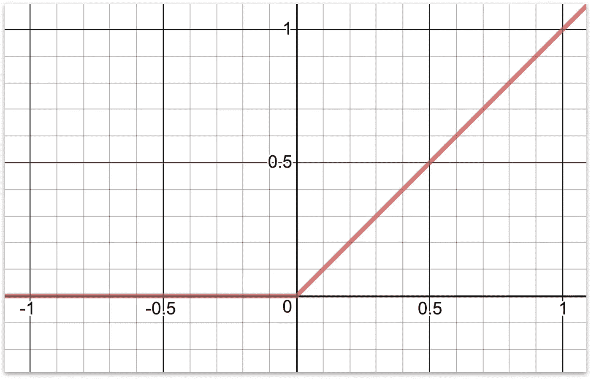

另一种常见的激活功能是这种逻辑功能，称为 sigmoid 功能:

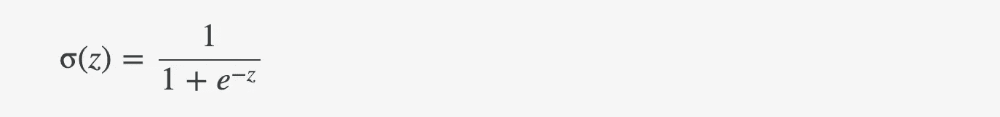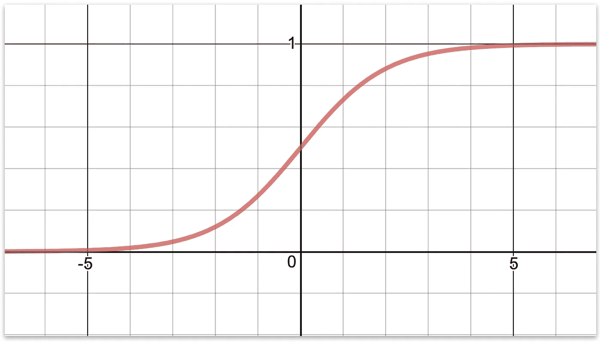

正如你从图中看到的，它们都以我描述的方式运行:*如果足够大，它们让信号通过，如果不够大，则限制信号通过。*

最后，在将激活函数应用于 z，得到σ(z)之后，我们得到了神经元的输出。

或者以向量形式陈述:在将激活函数应用于向量 **z** 之后，得到 **σ(z)** (其中函数被应用于向量 **z** 中的每个元素)我们从*得到该层中所有神经元*的输出。

# 正向输送

现在我们有了描述如何将整个神经网络(即“函数”)应用于一些数据*以获得输出 ***y = f(x)*** *的所有零碎信息。**

*我们只是通过网络中的每一层传送数据。这叫做*进给* *前进*它的工作原理是这样的:*

*输入 **x** 并从第一个隐藏层开始:*

*   *对于当前层 **n** 中的每个神经元，取前一层 **n - 1 中每个相连神经元输出的加权和。**添加偏差并应用激活功能。*
*   *进行到层 **n + 1** 但是现在使用层 **n** 的输出值作为输入。*
*   *现在一层一层地进行，直到你到达最后一层。这些神经元的输出将给出 **y** 。*

*让我们看一个简单的例子:*

*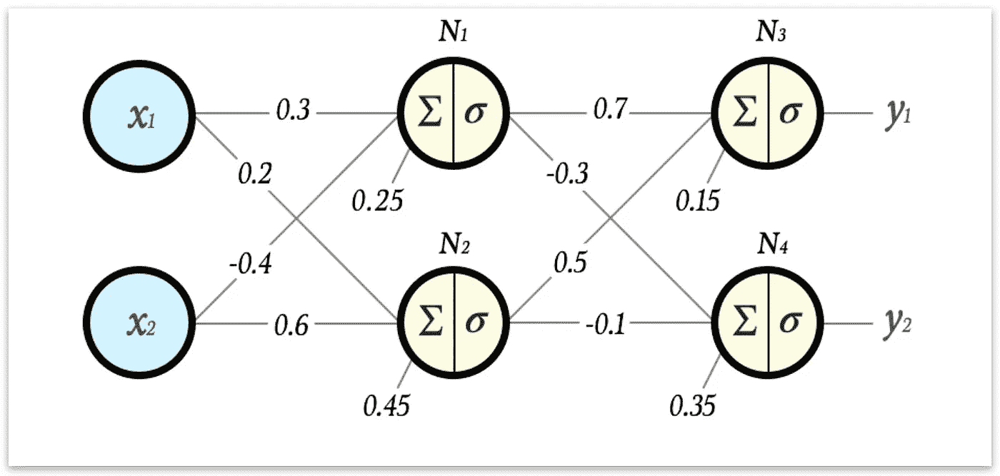*

*假设我们已经选择 sigmoid 函数作为所有层中的激活:*

**

*现在让我们一层一层地，一个神经元一个神经元地，计算这个网络在输入向量***×x*=【2 ^ 3】**上会给出什么输出。*

*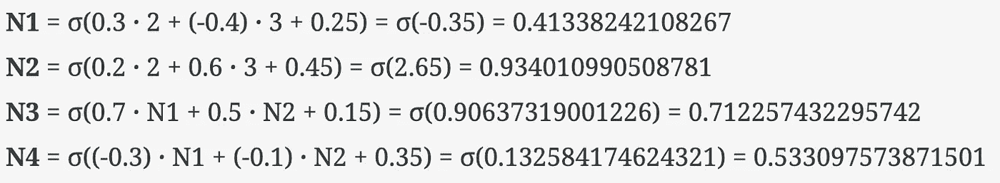*

*因此，这个网络在输入 ***x* = [2 3]** 上产生输出
**y =[0.7122574322957417 0.5330975738715015】**。*

*如果我们幸运，或者擅长设置初始权重和偏差，这可能正是我们想要的输入输出。更有可能的是*根本不是*我们想要的。如果是后者，我们可以调整权重和偏差，直到得到我们想要的输出。*

*让我们思考一下，为什么神经网络是这样设计的，为什么调整权重和偏差可能是使网络的行为更符合我们的预期所需要的。*

# *神经网络的表达能力*

*网络的高度参数化使得它非常能够模仿几乎任何函数。如果我们试图模拟的函数比通过一组权重和偏差可能表达的更复杂，我们可以创建一个稍微大一点的网络(*更深*和/或*更宽*)，这将为我们提供更多的参数，从而更好地将网络与我们想要的函数相匹配。*

*还要注意，通过构造神经网络的方式，我们可以自由选择输入的任何维度和输出的任何维度。通常，神经网络被设计为降低维度——即*将高维空间中的点映射到低维空间中的点。*这是典型的用于*分类的数据。*在本文的最后，我会用一个例子来说明这个问题。*

*现在考虑在每个神经元中发生了什么:**∑(*Wx+b)***——即，我们将来自前一层的信号馈送给激活函数，但是我们*缩放*并且*首先翻译*它。那么，把一个论点转化成一个函数，意味着什么呢？考虑一会儿吧。*

*为了简单起见，让我们看看当我们缩放函数的输入时，在二维空间中会发生什么。*

*这是 sigmoid 函数在非比例输入下的样子，即**∑(x)**:*

*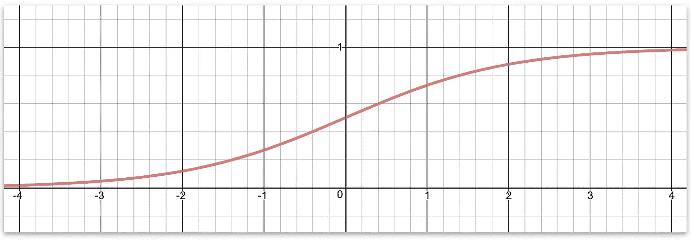*

*如果我们将输入放大 5 倍，即**∑(5x)**，结果会是这样。如您所见，并且可能已经猜到，缩放输入会在 x 轴上压缩或扩展函数。*

*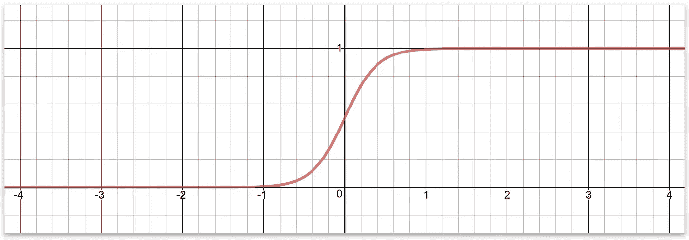*

*最后，向输入中添加一个标量意味着我们在 x 轴上移动函数。这里是 **σ(5x - 4):***

*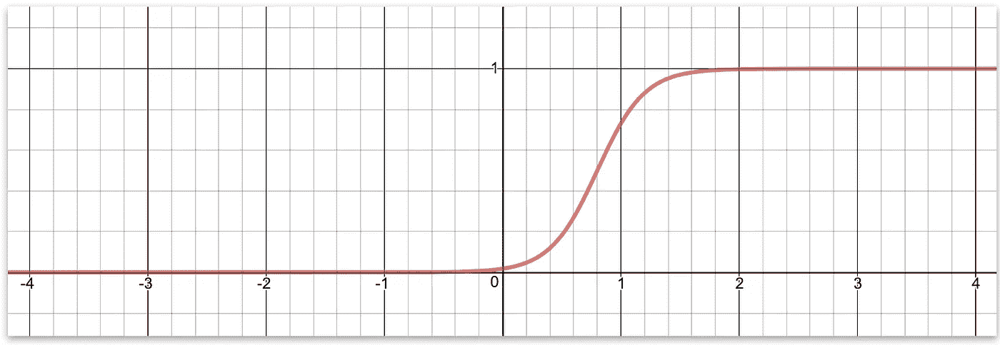*

*因此，通过缩放和转换输入到激活函数，我们可以移动它和拉伸它。*

*还要记住，一层的输出是下一层的输入。也就是说，在层 L 中产生的曲线(例如上面的任何一个)在被馈送到层 L+1 中的激活函数之前将被缩放和转换。所以现在我们需要问，缩放和转换来自层 L 中函数的输出**意味着什么？缩放仅仅意味着改变信号的大小，即沿着 **y 轴**拉伸或压缩信号。平移显然意味着沿 y 轴**移动。*****

*那么这给了我们什么呢？*

*虽然上面的讨论没有证明任何事情，但它强烈地表明，通过改变神经网络的权重和偏差，我们可以按照我们的喜好，以非线性的方式拉伸和转换输入值(甚至是单独的*向量分量*)。*

*还要考虑网络的深度将使权重在不同的尺度上起作用，并对总函数有不同的贡献-即早期权重在广义上改变总函数，而输出图层之前的权重在更详细的级别上起作用。*

*这为神经网络提供了非常高的表达能力，但代价是需要调整大量参数。幸运的是，我们不必手动调谐。我们可以让网络自我调整，使输出更好地满足我们的期望。这是通过称为*梯度下降*和*反向传播*的过程完成的，这是本系列的下一篇文章的主题，[第 2 部分:梯度下降和反向传播](https://medium.com/@tobias_hill/part-2-gradient-descent-and-backpropagation-bf90932c066a)。*

# *现在，一个函数如何智能地行动？*

*我们已经得出结论，神经网络可以模拟从向量 **x** 到另一个向量 **y** 的映射(函数)。在这一点上，我们可以问:*这对我们有什么帮助？**

*使用神经网络的一个非常常见的方法是对它从未见过的数据进行分类。因此，在结束这篇已经很长的文章之前，我将简要介绍一个分类的实际例子。我们将在后面的文章中回到这个例子。*

*当编写神经网络时，通常扔给它的第一个任务是*手写数字的分类*(有点像机器学习中的“Hello World”)。对于这项任务，有一个由 60 000 张手写数字图像组成的数据集，称为 [MNIST 数据集](http://yann.lecun.com/exdb/mnist/)。分辨率为 28 x 28，每个像素中的颜色是 0 到 255 之间的灰度值。数据集被*标记为*，这意味着它指定了每个图像代表什么数字。*

*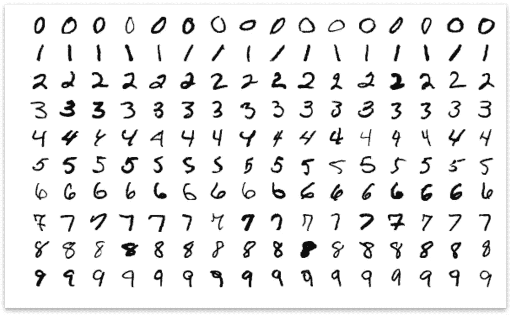*

*如果我们展平每幅图像，即把图像的每一行都排成一长行，我们将得到一个大小为 28 x 28 = 784 的向量。此外，我们将灰度值归一化到 0 和 1 之间的范围。现在，如果我们可以将这个向量 **x** 输入到一个神经网络，并作为输出得到一个**y**-大小为 10 的向量，告诉网络认为输入代表什么数字(即输出向量的每个元素告诉网络给出图像是 0、1、2、…、9 的概率)，那就好了。由于 MNIST 数据集被标记，我们可以训练这个网络，这实质上意味着:*自动调整权重和偏差*。最酷的事情是，如果训练做得正确，网络将能够对它以前从未见过的手写数字图像进行分类。*

*这怎么可能？*

*我将尝试用一个结论来解释这一点:每个输入向量 **x** 都可以被视为 784 维空间中的一个点。想想吧。长度为 3 的向量表示 3D 中的一个点。长度为 784 的向量代表 784D 中的一个点。由于每个像素值在 0 和 1 之间被归一化，我们知道该数据集的所有点位于单位立方体内，即在所有 784 个轴上的 0 和 1 之间。有理由认为，在这个空间中，代表一个数 N 的所有点彼此相当接近。例如，数字 2 的所有图像将在某个子空间中彼此靠近，而所有 7 的图像也将靠近，但在不同的子空间中。在设计这个网络时，我们决定输出应该是一个大小为 10 的向量，其中每个分量都是一个概率。这意味着输出是 10 维单位立方体中的一个点。我们的神经网络将 728D 立方体中的点映射到 10D 立方体中的点。*

*现在，**在这种特殊情况下拟合网络**真正的意思是用我们的神经网络功能在 784d-输入空间中找到那些子空间，并以这样一种方式转换(缩放，翻译)它们，使得它们在 10D 中明显可分。例如:我们希望数字 7 的所有输入(尽管它们可能略有不同)输出一个向量 y，其中表示数字 7 的分量接近 1，而所有其他 9 个分量接近 0。*

*我倾向于认为拟合过程是围绕这些子空间的收缩包装表面(超平面)。如果我们不过度收缩这些表面(这将导致所谓的*过度拟合*)，网络尚未看到的数字很可能仍会在正确的子空间内结束——换句话说，网络将能够说:*“嗯，我以前从未见过这个数字，但它在我认为是数字 7 的子空间内”*。*

*这有点酷！*

*好的，这就是介绍。欢迎反馈！*

*现在，进入本系列的下一篇文章，你将学习如何训练神经网络，[第 2 部分:梯度下降和反向传播](https://medium.com/@tobias_hill/part-2-gradient-descent-and-backpropagation-bf90932c066a)。*

*脚注:*

*这篇文章描述了一个密集的前馈网络——一个多层感知器。选择这种网络设计是因为它简单易用。不过，很高兴知道有许多不同的网络，它们都适合不同类型的任务。*

*所以你可能会想，怎么可能用这么短的向量符号来编写整个层操作呢？如果你回忆一下矩阵与向量相乘的工作原理，你会意识到在做 **Wx** 时，你实际上是在反复地对 x 向量进行加权求和(W 矩阵中的每一行),从而得到一个向量。加上 b 向量就会得到 z。*

*严格地说，事情不是这样的。但我发现这是一个有益的精神形象。*

**原载于 2018 年 11 月 28 日*[*machine learning . tobiashill . se*](https://machinelearning.tobiashill.se/part-1-neural-network-from-scratch/)*。**