# 第 2 部分:梯度下降和反向传播

> 原文：<https://towardsdatascience.com/part-2-gradient-descent-and-backpropagation-bf90932c066a?source=collection_archive---------4----------------------->

在本文中，您将了解如何使用反向传播和随机梯度下降来训练神经网络。这些理论将被彻底地描述并且一个详细的例子计算被包括在内，其中权重和偏差都被更新。

这是系列文章的第二部分:

*   [第一部分:基础](https://medium.com/@tobias_hill/part-1-a-neural-network-from-scratch-foundation-e2d119df0f40)。
*   [第二部分:梯度下降和反向传播](https://medium.com/@tobias_hill/part-2-gradient-descent-and-backpropagation-bf90932c066a)。
*   [第 3 部分:用 Java 实现](https://medium.com/@tobias_hill/part-3-implementation-in-java-7bd305faad0)。
*   第四部分:更好、更快、更强。
*   [第 5 部分:训练网络阅读手写数字](https://medium.com/@tobias_hill/part-5-training-the-network-to-read-handwritten-digits-c2288f1a2de3)。
*   [额外 1:我如何通过数据扩充提高 1%的准确度](https://medium.com/@tobias_hill/extra-1-how-i-got-1-better-accuracy-by-data-augmentation-2475c509349a)。
*   [号外 2:MNIST 游乐场](https://machinelearning.tobiashill.se/extra-2-a-mnist-playground/)。

我假设你已经读过上一篇文章，并且你对神经网络如何转换数据有一个很好的想法。如果上一篇文章需要良好的想象力(考虑多维度的子空间),那么另一方面，这篇文章在数学方面要求更高。振作起来:纸和笔。寂静的房间。仔细一想。一夜好眠。时间，耐力和努力。它会被理解的。

# 监督学习

在上一篇文章中，我们得出结论，神经网络可以用作高度可调的向量函数。我们通过改变权重和偏差来调整这个函数，但是很难手动改变它们。它们通常太多了，即使少一些，手工也很难得到好的结果。

好的一面是，我们可以通过训练网络，让网络自己调整这一点。这可以用不同的方法来完成。这里我将描述一种叫做*监督学习*的东西。在这种学习中，我们有一个被*标记为*的数据集，即我们已经有了该数据集中每个输入的预期输出。这将是我们的训练数据集。我们还确保我们有一个从未训练过网络的带标签的数据集。这将是我们的测试数据集，并将用于验证经过训练的网络对*看不见的数据*的分类有多好。

当训练我们的神经网络时，我们通过网络从训练数据集中输入一个又一个样本，并对每个样本的结果进行检查。特别是，我们检查结果与我们的预期(标签)相差多少。我们期望的和我们得到的之间的差异被称为成本(有时这被称为*误差*或*损失*)。成本告诉我们我们的神经网络在特定样本上的正确或错误程度。然后，可以使用这种方法来稍微调整网络，以便下次通过网络馈送该样本时，误差会更小。

有几种不同的成本函数可以使用(例如，见[列表](https://stats.stackexchange.com/questions/154879/a-list-of-cost-functions-used-in-neural-networks-alongside-applications))。

在本文中，我将使用二次成本函数:

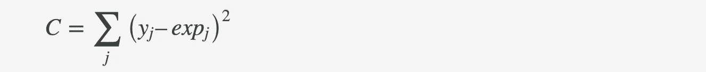

(有时，这也写在一个常数 0.5 前面，这将使它稍微干净，当我们区分它。我们将坚持上面的版本。)

回到我们第一部分的例子。

如果我们预期:

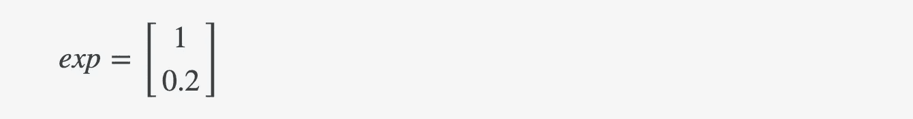

…并且得到了…

…成本将是:

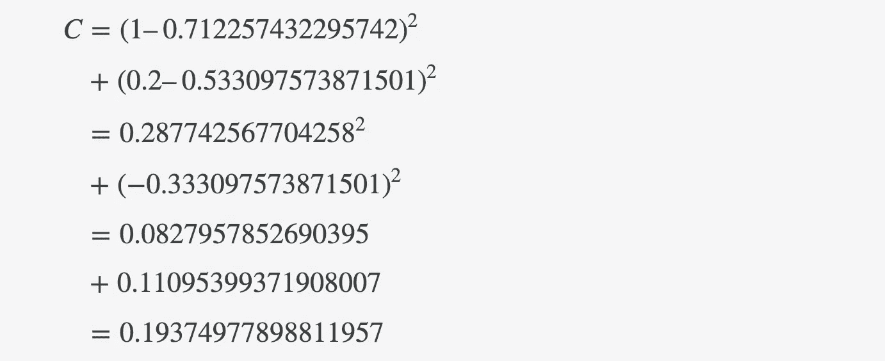

由于成本函数写在上面，误差的大小明显地取决于网络输出和我们期望的值。如果我们用输入值来定义成本(如果我们也考虑所有权重、偏差和使用了什么激活函数，那么输入值当然与输出值相关),我们可以写成:

C = C(y，exp) = C(W，b，Sσ，x，exp) *-即成本是一个函数****W****8、****b****iases，该组激活函数，输入****【x****和*

**成本只是所有这些输入的标量值。由于函数是连续可微的(有时只有*分段可微。*例如，当使用重新激活时，我们可以为成本函数设想一个连续的丘陵和山谷景观。在更高维度中，这种景象很难想象，但是只有两个重量 **W** ₁和 **W** ₂，看起来可能有点像这样:**

**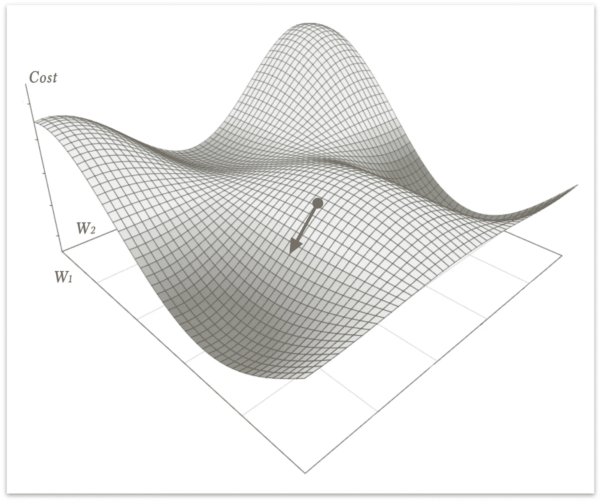**

**假设我们精确地得到了图像中红点指定的成本值(在那个简化的例子中，仅仅基于一个 **W** ₁和 **W** ₂)。我们现在的目标是改进神经网络。如果我们能够降低成本，神经网络将更好地分类我们的标记数据。优选地，我们希望在这个场景中找到成本函数的*全局最小值*。换句话说:*所有山谷中最深的*。这样做很难，而且对于神经网络这样复杂的功能，没有显式的方法。然而，我们可以通过使用称为梯度下降的迭代过程来找到一个*局部最小值*。局部最小值可能足以满足我们的需求，如果不是，我们可以随时调整网络设计，以获得新的成本-景观，以局部和迭代探索。**

# **梯度下降**

**从多变量微积分我们知道，一个函数的梯度，在一个特定点的∇f 将是一个与曲面相切的矢量，指向函数增长最快的方向。相反，负梯度-∇f 将指向函数下降最快的方向。这个事实我们可以用来从我们当前的权重 **W** 计算新的权重 **W** ⁺:**

**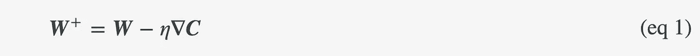**

**在上面的等式中 *η* 只是一个叫做学习率的小常数。这个常数告诉我们，我们将使用多少梯度向量来将当前的权重集更改为新的权重集。如果选择得太小，权重将被调整得太慢，并且我们向局部最小值的收敛将花费很长时间。如果设置得太高，我们可能会过冲和错过(或者得到一个有弹性的不收敛的迭代行为)。**

**上面等式中的所有东西只是简单的矩阵运算。我们需要仔细研究的是成本函数相对于权重的梯度:**

**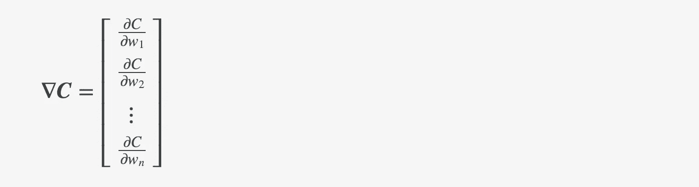**

**如你所见，我们暂时对具体的标量成本值 C 不感兴趣，而是当权重改变时*成本函数改变多少* *(逐个计算)*。**

**如果我们展开纯矢量形式(等式 1)，它看起来像这样:**

**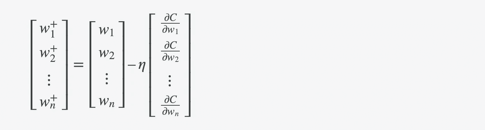**

**使用渐变的好处是，它会调整那些最需要改变的权重，而那些不需要改变的权重会减少。这与负梯度向量正好指向最大下降方向的事实密切相关。要看到这一点，请再次查看上面简化的成本函数景观图像，并尝试将红色梯度向量分离为沿轴的分量向量。**

**梯度下降的想法在 N 维中同样有效，尽管很难将其可视化。梯度仍然会告诉哪些组件需要改变更多，哪些组件需要改变更少，以减少函数 c。**

**到目前为止，我只是谈论了重量。偏见呢？同样的推理对他们同样有效，但是我们计算(这更简单):**

**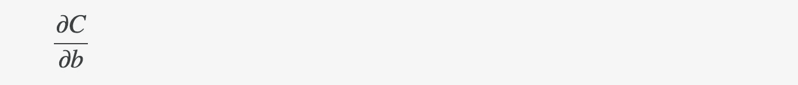**

**现在是时候看看我们如何计算权重和偏差的偏导数了。这会让我们进入一个更危险的领域，所以系好安全带。为了理解这一切，我们首先需要了解…**

# **注释**

**本文的其余部分是符号密集型的。你将看到的许多符号和字母只是作为下标的索引，帮助我们跟踪我所指的是哪一层和哪一个神经元。不要让这些指数让数学表达式变得令人生畏。索引有助于使其更加精确。以下是如何阅读它们的简短指南:**

****

**还请注意，神经元的输入在上一篇文章中被称为*(这很常见)，但在这里被改为 ***i*** 。原因是我觉得把它记成输入的 ***i*** *和输出*的 ***o*** *比较容易。****

# ***反向传播***

***描述如何计算偏导数的最简单方法是看一个特定的单个重量:***

******

***我们还将看到，如果特定权重连接到最后一个输出层，或者连接到任何前面的隐藏层，则在如何处理偏导数方面会略有不同。***

# ***最后一层***

***现在考虑单个重量***w******的最后一层:******

******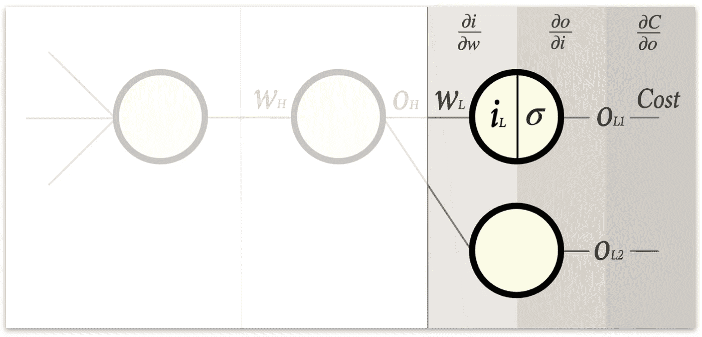******

******我们的任务是找到:******

******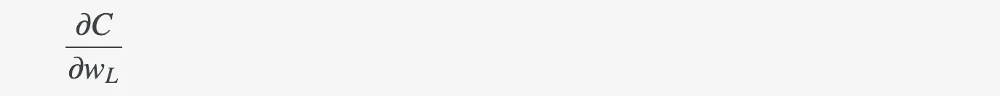******

******如上一篇文章所述，权重和成本函数之间有几个步骤:******

*   ******我们将权重乘以前一层的输出，并添加一个偏差。结果是输入***I****ʟ**到神经元。*******
*   *******这个 ***i*** *ʟ* 然后被馈入激活函数 **σ** ，从神经元***o****ʟ₁*产生一个输出*******
*   ******最后这个***o****ʟ₁*用在了成本函数中。******

******公平地说，很难计算…******

************

******…只是看着它。******

******然而，如果我们把它分成我刚才描述的三个步骤，事情会变得容易得多。由于这三个步骤是链式函数，我们可以通过使用微积分中的链式法则来分离所有步骤的导数:******

******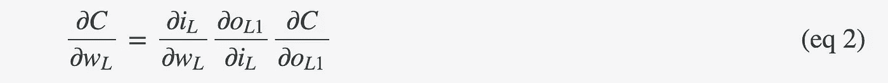******

******事实上，这三个偏导数的计算非常简单:******

******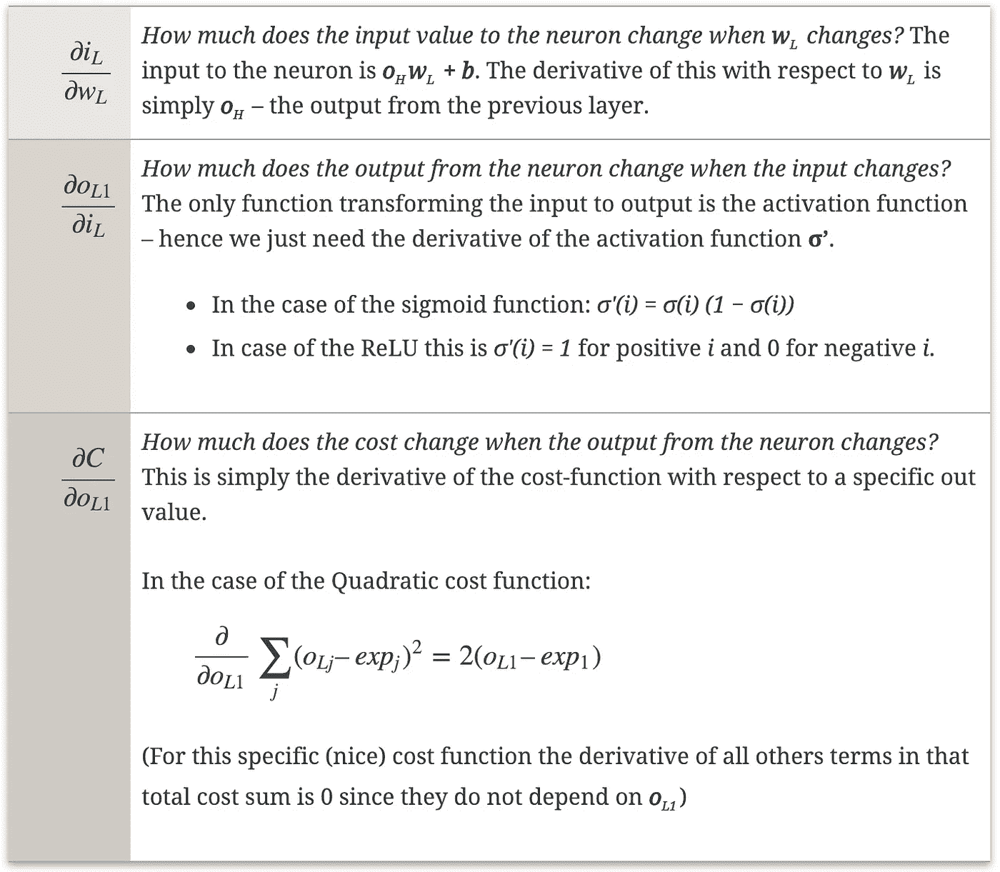******

******这意味着我们拥有计算所需的所有三个因素******

************

******换句话说，我们现在知道如何更新最后一层中的所有权重。******

******让我们从这里开始往回走。******

# ******隐藏层******

******现在考虑单个权重***【w】******在隐藏层最后一层之前:*********

*********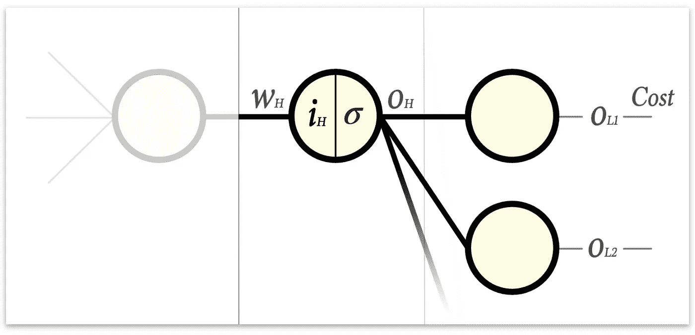*********

*********我们的目标是找到:*********

*********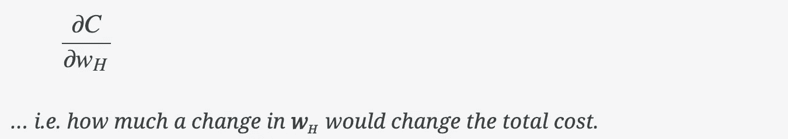*********

*********我们像在最后一层中那样进行。链式法则给了我们:*********

*********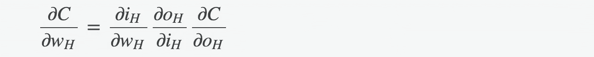*********

*********前两个因子与之前相同，并解析为:*********

*   *********前一层的输出和…*********
*   *********激活函数的导数。*********

*********然而，这个因素…*********

*********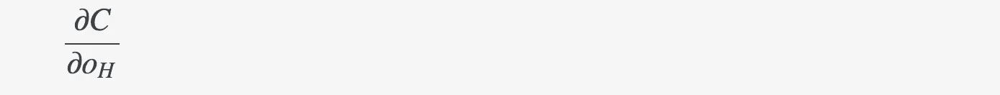*********

*********…有点棘手。原因是 ***o*** *ʜ* 的变化明显改变了最后一层中所有神经元的输入，因此，与我们只需关心来自单个最后一层神经元的一个输出相比，在更广泛的意义上改变了成本函数(我已经通过在上图中使连接更宽来说明这一点)。*********

******为了解决这个问题，我们需要将总成本函数的偏导数分解为来自最后一层的每一个贡献。******

******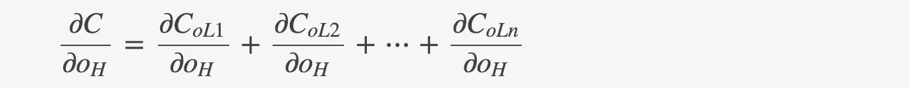******

******…其中每一项都描述了当**ʜ*发生变化时，成本会发生多大的变化，但仅针对通过特定输出神经元发送的那部分信号。*******

******让我们检查一下第一个神经元的单个项。同样，如果我们用链式法则把它分开，会更清楚一点:******

******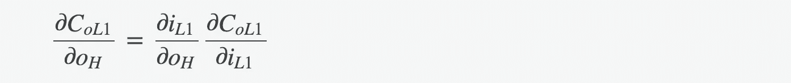******

******让我们来看看每一项:******

******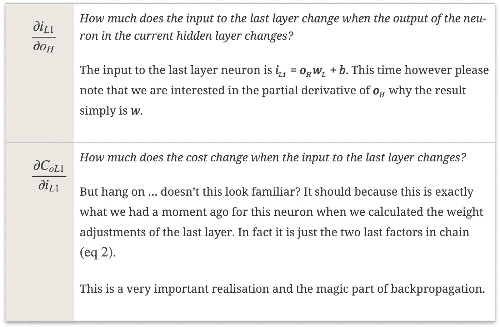******

******让我们暂停一会儿，让一切都水落石出。******

******总结一下我们刚刚发现的情况:******

*   ******为了知道如何更新隐藏层中的特定权重，我们根据该权重对成本进行偏导数。******
*   ******通过应用链式法则，我们得到了三个因素，其中两个我们已经知道如何计算。******
*   ******该链中的第三个因素是我们在上一层中已经计算过的两个因素的乘积的加权和。******
*   ******这意味着我们可以像在上一层中那样计算该隐藏层中的所有权重，唯一的区别是我们使用来自前一层的已经计算的数据，而不是成本函数的导数。******

******从计算的角度来看，这是一个非常好的消息，因为我们只依赖于我们刚刚做的计算(仅最后一层),我们不必遍历更深。这有时被称为*动态编程*，一旦找到动态算法，这通常是加速算法的根本方法。******

******由于我们仅依赖于最后一层中的一般计算(特别是我们不依赖于成本函数)，我们现在可以逐层向后进行。就我们如何计算权重更新而言，任何隐藏层都不同于任何其他层。我们说我们让成本(或*误差*或*损失)*反向传播。当我们到达第一层时，我们就完成了。在这一点上，我们对等式(等式 1)中的所有权重进行偏导数，并准备在成本函数中进行梯度下降。******

******你知道吗:就是这样。******

# ******嘿，等等…偏见！？******

******好的，我听到了。实际上它们遵循相同的模式。唯一的区别是最后一层和隐藏层表达式的导数链中的**第一项**将是:******

******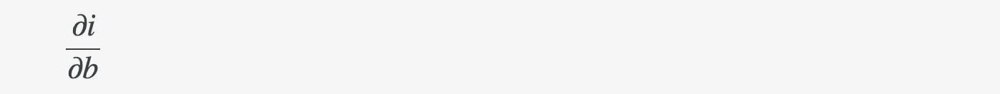******

******…而不是******

******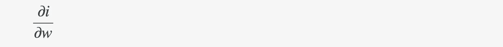******

******既然输入给神经元的是***o****ʜ****w****ʟ****+b***那对 b*的偏导数干脆就是 1。因此，在权重情况下，我们将链乘以上一层的输出，我们只需忽略偏差情况下的输出，然后乘以 1。*******

*******所有其他计算都是相同的。您可以将偏差视为权重计算的一个更简单的子案例。偏差的变化不依赖于前一个神经元的输出这一事实实际上是有道理的。这些偏置是“从侧面”添加的，而不考虑通过导线到达神经元的数据。*******

# *******一个例子*******

*******从我最近陷入反向传播的境地来看，我可以想象上面的阅读可能是很难消化的。不要麻痹大意。在实践中，这是非常简单的，如果用一个例子来说明，可能所有的事情都会变得更清楚、更容易理解。*******

*******让我们以[第 1 部分:基础](https://medium.com/@tobias_hill/part-1-a-neural-network-from-scratch-foundation-e2d119df0f40)中的例子为基础:*******

**************

*******让我们从 ***w*** ₅:开始*******

******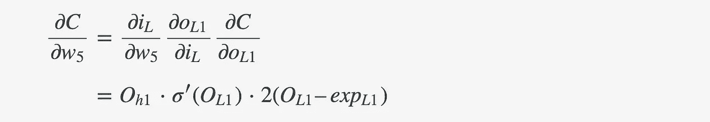******

******通过从第 1 部分的[中的正向传递中选取数据，并使用上述成本计算示例中的数据，我们将逐个因素进行计算。此外，让我们假设在本例中，我们的学习率为 *η* = 0.1。](https://medium.com/@tobias_hill/part-1-a-neural-network-from-scratch-foundation-e2d119df0f40)******

******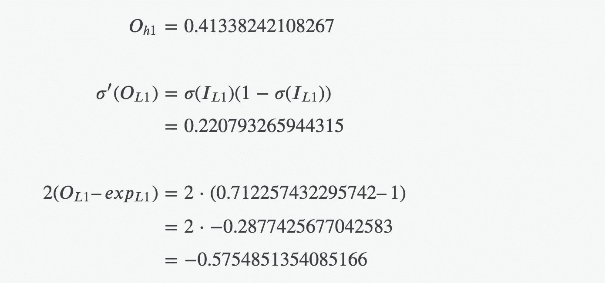************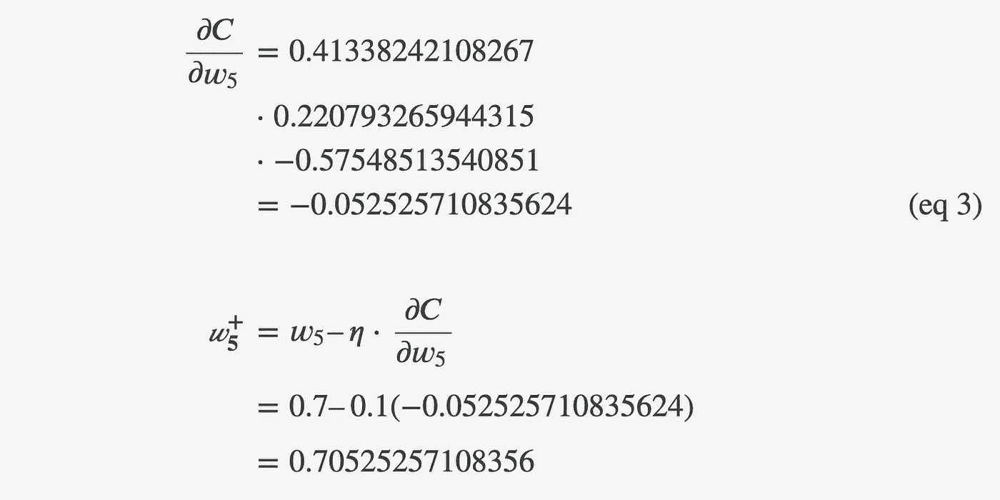******

******同样，我们可以计算最后一层中的所有其他参数:******

******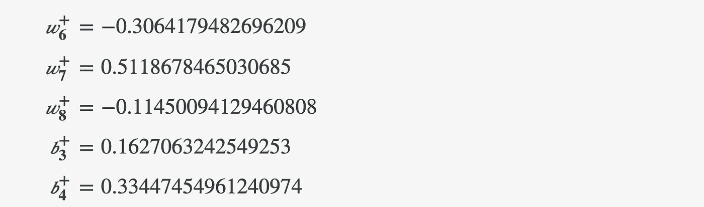******

******现在我们向后移动一层，聚焦于 ***w*** *₁* :******

******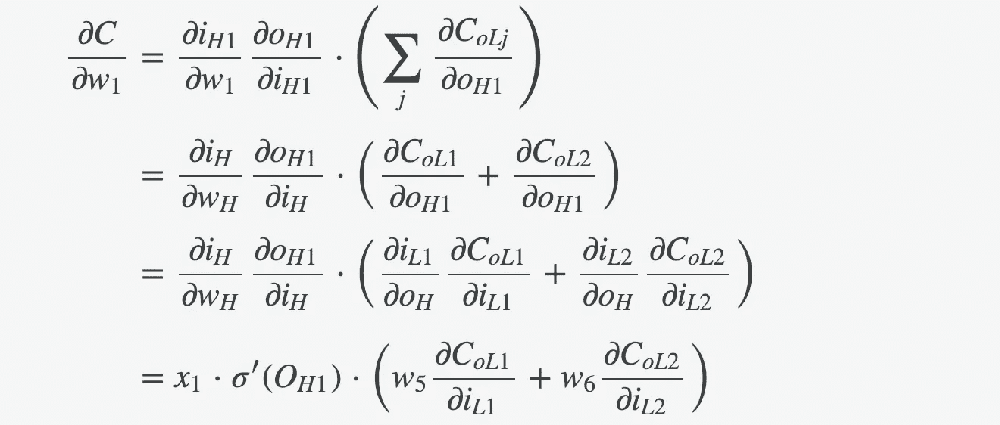******

******再一次，通过从第 1 部分的[中的前向通道中选取数据，并通过使用来自上面的数据，可以直接计算出每个因素。](https://medium.com/@tobias_hill/part-1-a-neural-network-from-scratch-foundation-e2d119df0f40)******

******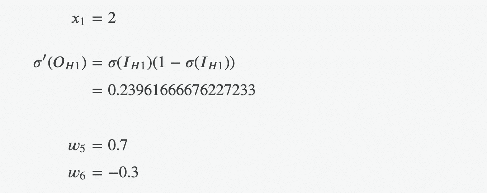******

******根据最后一层的计算:******

******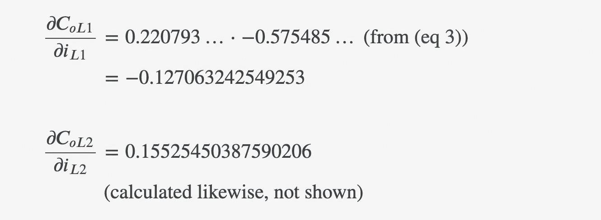******

******现在我们拥有了一切，终于可以找到 ***w*** *₁* :******

******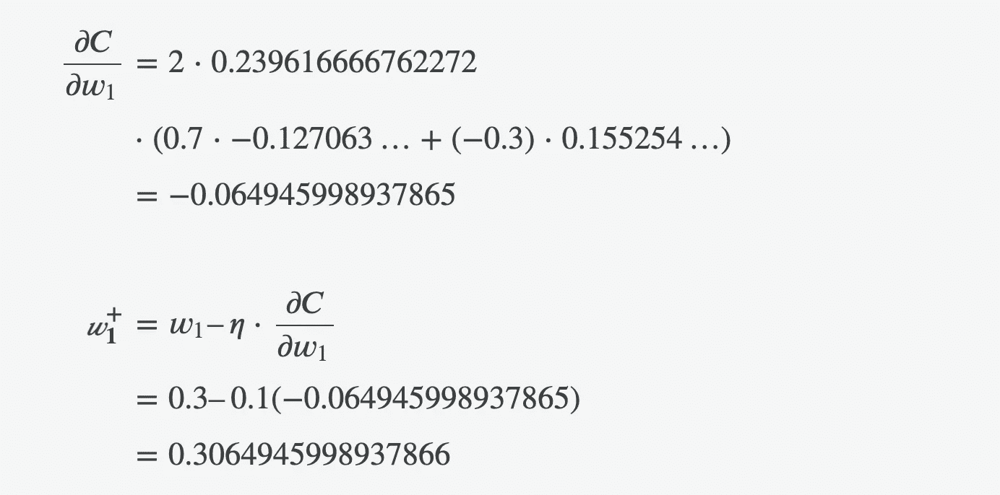******

******以同样的方式，我们可以计算隐藏层中的所有其他参数:******

******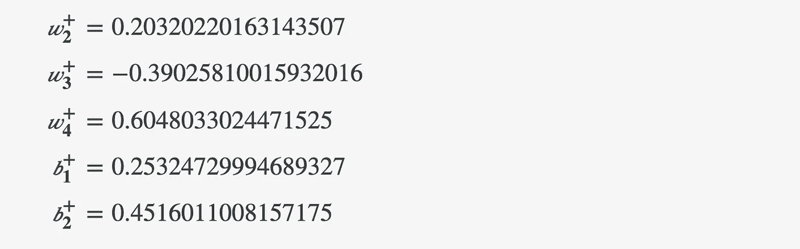******

******就是这样。我们已经成功地更新了全网的权重和偏差！******

# ******健全性检查******

******让我们验证一下，网络现在在输入端的表现稍好一些******

******x = [2，3]******

******第一次我们通过网络输入向量，我们得到了输出******

******y = [0.712257432295742，0.533358751]******

******…成本为 0.1988811957 美元。******

******现在，在我们更新了权重之后，我们得到了输出******

******y =[0.719269360605]54666******

******…并且成本为 0.18118540884。19861.886868686867******

******请注意，这两个组件都已向我们预期的[1，0.2]方向略微移动，网络的总成本现在更低了。******

******反复训练会更好！******

******下一篇文章将展示这在 java 代码中的表现。当您觉得准备好了，请开始:[第 3 部分:用 Java 实现](https://medium.com/@tobias_hill/part-3-implementation-in-java-7bd305faad0)。******

******欢迎反馈！******

*******原载于 2018 年 12 月 4 日*[*machine learning . tobiashill . se*](https://machinelearning.tobiashill.se/part-2-gradient-descent-and-backpropagation/)*。*******