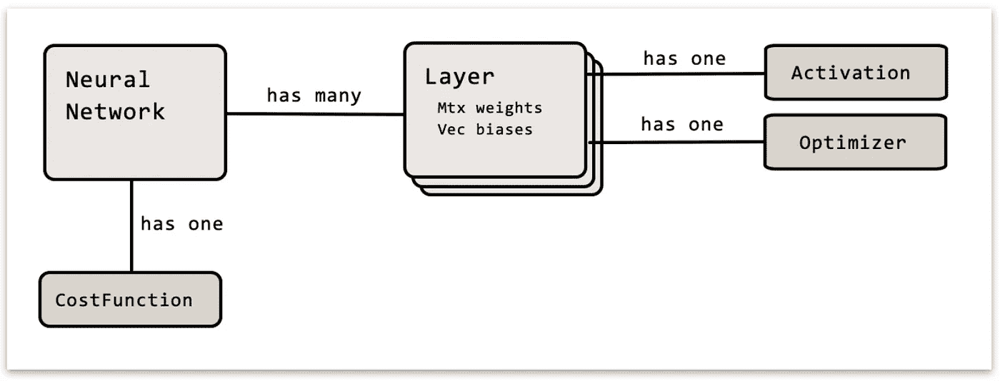
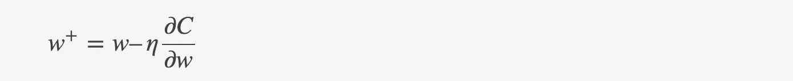

# 第 3 部分:Java 实现

> 原文：<https://towardsdatascience.com/part-3-implementation-in-java-7bd305faad0?source=collection_archive---------15----------------------->

在本文中，您将看到如何用易于理解的 java 代码实现前两篇文章中介绍的理论。完整的神经网络实现可以下载、详细检查、构建和实验。

这是系列文章的第三部分:

*   [第一部分:基础](https://medium.com/@tobias_hill/part-1-a-neural-network-from-scratch-foundation-e2d119df0f40)。
*   [第二部分:梯度下降和反向传播](https://medium.com/@tobias_hill/part-2-gradient-descent-and-backpropagation-bf90932c066a)。
*   [第 3 部分:用 Java 实现](https://medium.com/@tobias_hill/part-3-implementation-in-java-7bd305faad0)。
*   第四部分:更好、更快、更强。
*   [第 5 部分:训练网络阅读手写数字](https://medium.com/@tobias_hill/part-5-training-the-network-to-read-handwritten-digits-c2288f1a2de3)。
*   [额外 1:我如何通过数据扩充提高 1%的准确度](https://medium.com/@tobias_hill/extra-1-how-i-got-1-better-accuracy-by-data-augmentation-2475c509349a)。
*   [号外 2:MNIST 游乐场](https://machinelearning.tobiashill.se/extra-2-a-mnist-playground/)。

我假设您已经阅读了前两篇文章，并且对神经网络的前向传递和学习/训练传递有了相当好的理解。

这篇文章会很不一样。它将用几段 java 代码来展示和描述这一切。

我所有的代码，一个完全工作的神经网络实现，可以在这里找到、检查和下载[。](https://bitbucket.org/tobias_hill/neuralnet/src/master/)

# 追求

通常在编写软件时，我会使用大量的开源软件。这样我能更快地得到好的结果，并且我能使用别人花了很多心思的好的抽象概念。

然而这一次不同了。我的目标是展示一个神经网络是如何工作的，并且只需要你了解其他开源库。如果你设法阅读 Java 8 代码，你应该没问题。这些都在几个简短而整洁的文件里。

这个野心的结果是我甚至没有导入线性代数的库。相反，创建了两个简单的类，只包含所需的操作——满足通常的猜想:Vec 和 Matrix 类。这两个都是非常普通的实现，包含典型的算术运算加、减、乘和点积。

向量和矩阵的好处在于，它们通常可以用来使代码更有表现力、更整洁。通常，当您面临对一个集合中的每个元素与另一个集合中的每个其他元素进行运算时，例如对一组输入进行*加权求和，您很有可能可以将数据排列成向量和/或矩阵，并获得非常紧凑且富有表现力的代码。神经网络也不例外。*

我也尽可能地通过使用 Vec 和 Matrix 类型的对象来压缩计算。结果是整洁的，离数学表达式不远。for-loops 中没有 for-loops 模糊了俯视图。然而，在检查代码时，我鼓励你确保对 Vec 或 Matrix 类型对象的任何看起来简洁的调用实际上都产生了一系列算术运算，这些运算在[第 1 部分](https://medium.com/@tobias_hill/part-1-a-neural-network-from-scratch-foundation-e2d119df0f40)和[第 2 部分](https://medium.com/@tobias_hill/part-2-gradient-descent-and-backpropagation-bf90932c066a)中有定义。

Vec 类上的两个操作不像我上面提到的典型操作那样常见。这些是:

*   [外积](https://en.wikipedia.org/wiki/Outer_product) (Vec.outerProduct())，它是列向量和行向量的逐元素乘法，产生一个矩阵。
*   [Hadamard 乘积](https://en.wikipedia.org/wiki/Hadamard_product_(matrices)) (Vec.elementProduct())，它只是两个向量(都是列向量或行向量)的逐元素乘法，产生一个新向量。

# 概观

典型的**神经网络**有许多层。每个**层**可以是任意大小，包含前一层与其自身之间的权重以及偏差。每一层还配置了一个**激活**和一个**优化器**(后面会详细介绍)。

无论何时设计高度可配置的东西，构建器模式都是一个好的选择。这为我们提供了一种非常简单易懂的方法来定义和创建神经网络:

要使用这样一个网络，通常要么给它提供一个输入向量，要么在调用**evaluate()**-方法时添加一个预期结果。当进行后者时，网络将观察实际输出和预期输出之间的差异，并存储这一印象。换句话说，它将反向传播错误。出于很好的原因(我将在下一篇文章中回到这一点)，网络不会立即更新它的权重和偏差。要做到这一点，也就是让任何印象“深入人心”，必须调用**updatefromleang()**。例如:

# 正向输送

让我们深入研究一下 **evaluate()** 方法中的前馈通道。请注意下面(第 9 行和第 10 行)输入数据是逐层传递的:

在层内，输入向量与权重相乘，然后加上偏差。这又被用作激活功能的输入。见第 11 行。该层还存储输出向量，因为它用于反向传播。

(我将在下一篇文章中回到 out 变量上的 get 和 set 操作的原因。现在就把它看作是 Vec 类型的变量)

# 激活功能

该代码包含一些预定义的激活函数。其中每一个都包含实际的激活函数， **σ** ，以及导数，**σ’**。

# 成本函数

还包括一些成本函数。二次曲线看起来像这样:

成本函数有一种计算总成本(作为标量)的方法，但也有一种重要的成本函数微分法，可用于

# 反向传播

正如我在前面关于前馈传递的部分中提到的:如果一个预期的结果被传递给 evaluate 函数，网络将通过调用 **learnFrom()** -method 从中学习。请参见第 12–13 行。

在该方法中，实际的反向传播发生了。在这里，你应该能够在代码中详细地遵循[第 2 部分](https://medium.com/@tobias_hill/part-2-gradient-descent-and-backpropagation-bf90932c066a)的步骤。看到[第二部分](https://medium.com/@tobias_hill/part-2-gradient-descent-and-backpropagation-bf90932c066a)中相当冗长的数学表达式可以归结为以下内容，这也多少令人欣慰:

请注意，反向传播中的*学习*(偏导数)是通过调用**adddeltaweightsandbias()**-方法逐层存储的。

直到调用**update from learning()**-方法后，权重和偏差才会改变:

之所以将此设计为两个独立的步骤，是因为它允许网络观察大量样本并从中学习……然后最终更新权重和偏差，作为所有观察的平均值。这实际上叫做*批量梯度下降*或*小型批量梯度下降*。我们将在下一篇文章中回到这些变体。现在，您也可以在每次调用后调用 updateFromLearning 来评估(带着期望)以使网络在每次采样后得到改进。在每个样本之后更新网络，这被称为*随机梯度下降*。

这就是**updateWeightsAndBias()**-方法的样子。请注意，权重和偏差的所有计算更改的平均值被提供给优化器对象上的两个方法 **updateWeights()** 和 **updateBias()** 。

我们还没有真正讨论过优化器的概念。我们已经说过，权重和偏差是通过减去用一些小的学习率缩放的偏导数来更新的，即:

是的，这是一个很好的方法，也很容易理解。然而，还有其他方法。其中一些稍微复杂一些，但是提供了更快的收敛。关于如何更新权重和偏差的不同策略通常被称为优化器。我们将在下一篇文章中看到另一种方法。因此，将此作为网络可以配置使用的可插拔[策略](https://en.wikipedia.org/wiki/Strategy_pattern)是合理的。

现在，我们只是使用简单的梯度下降策略来更新我们的权重和偏差:

差不多就是这样。通过几行代码，我们有可能配置一个神经网络，通过它输入数据，并让它学习如何对看不见的数据进行分类。这将在[第 5 部分:训练网络读取手写数字](https://medium.com/@tobias_hill/part-5-training-the-network-to-read-handwritten-digits-c2288f1a2de3)中显示。

但首先，让我们把这个提升几个档次。第四部分:更好、更快、更强再见。

欢迎反馈！

*原载于 2018 年 12 月 15 日*[*machine learning . tobiashill . se*](https://machinelearning.tobiashill.se/part-3-implementation-in-java/)*。*