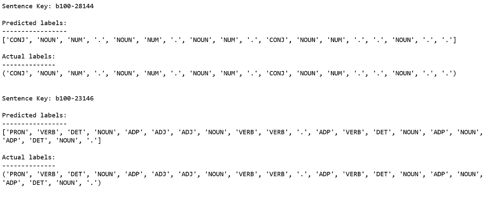
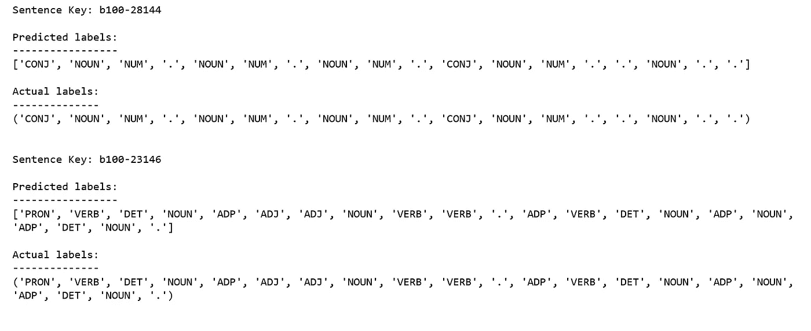

# 基于隐马尔可夫链模型的词性标注

> 原文：<https://towardsdatascience.com/part-of-speech-tagging-with-hidden-markov-chain-models-e9fccc835c0e?source=collection_archive---------2----------------------->


Photo Credit: Pixabay

[词性标注](https://en.wikipedia.org/wiki/Part-of-speech_tagging) (POS)是用名词、动词、形容词、副词等词性对句子进行标注的过程。

[隐马尔可夫模型](https://en.wikipedia.org/wiki/Hidden_Markov_model) (HMM)是一个简单的概念，可以解释大多数复杂的实时过程，如语音识别和语音生成、机器翻译、生物信息学的基因识别、计算机视觉的人类手势识别等等。

在本帖中，我们将使用[石榴](http://pomegranate.readthedocs.io/)库为词性标注构建一个隐马尔可夫模型。我们不会深入统计词性标注器的细节。不过，如果你有兴趣，这里有[纸](http://www.coli.uni-saarland.de/~thorsten/publications/Brants-ANLP00.pdf)。

数据是布朗文集[的副本](https://en.wikipedia.org/wiki/Brown_Corpus)，可以在这里找到[。](https://github.com/susanli2016/Text-Mining-with-Python)

# 数据

导入库并读取数据。

```
import matplotlib.pyplot as plt
import numpy as npfrom IPython.core.display import HTML
from itertools import chain
from collections import Counter, defaultdict
from pomegranate import State, HiddenMarkovModel, DiscreteDistribution
import randomSentence = namedtuple("Sentence", "words tags")def read_data(filename):
    """Read tagged sentence data"""
    with open(filename, 'r') as f:
        sentence_lines = [l.split("\n") for l in f.read().split("\n\n")]
    return OrderedDict(((s[0], Sentence(*zip(*[l.strip().split("\t")
                        for l in s[1:]]))) for s in sentence_lines if s[0]))def read_tags(filename):
    """Read a list of word tag classes"""
    with open(filename, 'r') as f:
        tags = f.read().split("\n")
    return frozenset(tags)Sentence = namedtuple("Sentence", "words tags")def read_data(filename):
    """Read tagged sentence data"""
    with open(filename, 'r') as f:
        sentence_lines = [l.split("\n") for l in f.read().split("\n\n")]
    return OrderedDict(((s[0], Sentence(*zip(*[l.strip().split("\t")
                        for l in s[1:]]))) for s in sentence_lines if s[0]))def read_tags(filename):
    """Read a list of word tag classes"""
    with open(filename, 'r') as f:
        tags = f.read().split("\n")
    return frozenset(tags)class Subset(namedtuple("BaseSet", "sentences keys vocab X tagset Y N stream")):
    def __new__(cls, sentences, keys):
        word_sequences = tuple([sentences[k].words for k in keys])
        tag_sequences = tuple([sentences[k].tags for k in keys])
        wordset = frozenset(chain(*word_sequences))
        tagset = frozenset(chain(*tag_sequences))
        N = sum(1 for _ in chain(*(sentences[k].words for k in keys)))
        stream = tuple(zip(chain(*word_sequences), chain(*tag_sequences)))
        return super().__new__(cls, {k: sentences[k] for k in keys}, keys, wordset, word_sequences,
                               tagset, tag_sequences, N, stream.__iter__)def __len__(self):
        return len(self.sentences)def __iter__(self):
        return iter(self.sentences.items())class Dataset(namedtuple("_Dataset", "sentences keys vocab X tagset Y training_set testing_set N stream")):
    def __new__(cls, tagfile, datafile, train_test_split=0.8, seed=112890):
        tagset = read_tags(tagfile)
        sentences = read_data(datafile)
        keys = tuple(sentences.keys())
        wordset = frozenset(chain(*[s.words for s in sentences.values()]))
        word_sequences = tuple([sentences[k].words for k in keys])
        tag_sequences = tuple([sentences[k].tags for k in keys])
        N = sum(1 for _ in chain(*(s.words for s in sentences.values())))

        # split data into train/test sets
        _keys = list(keys)
        if seed is not None: random.seed(seed)
        random.shuffle(_keys)
        split = int(train_test_split * len(_keys))
        training_data = Subset(sentences, _keys[:split])
        testing_data = Subset(sentences, _keys[split:])
        stream = tuple(zip(chain(*word_sequences), chain(*tag_sequences)))
        return super().__new__(cls, dict(sentences), keys, wordset, word_sequences, tagset,
                               tag_sequences, training_data, testing_data, N, stream.__iter__)def __len__(self):
        return len(self.sentences)def __iter__(self):
        return iter(self.sentences.items())data = Dataset("tags-universal.txt", "brown-universal.txt", train_test_split=0.8)print("There are {} sentences in the corpus.".format(len(data)))
print("There are {} sentences in the training set.".format(len(data.training_set)))
print("There are {} sentences in the testing set.".format(len(data.testing_set)))
```

***语料库中有 57340 个句子。***

***训练集中有 45872 个句子。***

***测试集中有 11468 个句子。***

看一眼数据。句子

```
key = 'b100-38532'
print("Sentence: {}".format(key))
print("words:\n\t{!s}".format(data.sentences[key].words))
print("tags:\n\t{!s}".format(data.sentences[key].tags))
```

***句子:b100–38532***

***词语:***

***(‘也许’，‘它’，‘曾经’，‘对’，‘对’，’, ';')***

***标签:***

***(‘ADV’，‘PRON’，‘动词’，‘ADJ’，’, '.')***

统计语料库中的独特元素。

```
print("There are a total of {} samples of {} unique words in the corpus."
      .format(data.N, len(data.vocab)))
print("There are {} samples of {} unique words in the training set."
      .format(data.training_set.N, len(data.training_set.vocab)))
print("There are {} samples of {} unique words in the testing set."
      .format(data.testing_set.N, len(data.testing_set.vocab)))
print("There are {} words in the test set that are missing in the training set."
      .format(len(data.testing_set.vocab - data.training_set.vocab)))
```

***语料库中共有 1161192 个样本 56057 个独特词。***

***训练集中有 50536 个唯一词的 928458 个样本。***

测试集中有 25112 个唯一词的 232734 个样本。

***测试集中有 5521 个词是训练集中缺失的。***

使用数据集访问单词。x 和带有数据集的标签。Y

```
for i in range(2):    
    print("Sentence {}:".format(i + 1), data.X[i])
    print()
    print("Labels {}:".format(i + 1), data.Y[i])
    print()
```

***句子 1:('先生'，'波德格'，'曾'，'谢过'，'他'，'庄重地'，'和'，'现在'，'他'，'造了'，'用了'，'的'，'了'，'建议'，'。')***

***标签 1:('名词'，'名词'，'动词'，'动词'，' PRON '，'等)、'康吉'、' ADV '、' PRON '、'动词'、'名词'、' ADP '、' DET '、'名词'、'等)***

***第二句:('但是'，'那里'，'似乎'，'要'，'成为'，'一些'，'不同'，'的'，'意见'，'作为'，'要'，'如何'，'远'，'板'，'应该'，'去'，'，'和'，'谁的'，'建议'，'它'，'应该'，'跟随'，')***

***标签 2: ('CONJ '，' PRT '，'动词'，' PRT '，'动词'，' DET '，'名词'，' ADP '，' ADP '，' ADV '，' ADV '，' DET '，'名词'，'动词'，'动词'，'、' CONJ '、' DET '、'名词'、' PRON '、'动词'、'动词'、')***

了解 data.stream()的工作原理。

```
print("\nStream (word, tag) pairs:\n")
for i, pair in enumerate(data.stream()):
    print("\t", pair)
    if i > 3: break
```

***流(词、标记)对:(“先生”、“名词”)***

***(‘波德格’，‘名词’)***

***(‘曾’，‘动词’)***

***(‘谢’，‘动词’)***

***(‘他’，‘PRON’)***

# **构建一个最频繁的类标记器(MFC)**

对计数

```
def pair_counts(tags, words):
    d = defaultdict(lambda: defaultdict(int))
    for tag, word in zip(tags, words):
        d[tag][word] += 1

    return d
tags = [tag for i, (word, tag) in enumerate(data.training_set.stream())]
words = [word for i, (word, tag) in enumerate(data.training_set.stream())]
```

MFC 标记器

```
FakeState = namedtuple('FakeState', 'name')class MFCTagger:
    missing = FakeState(name = '<MISSING>')

    def __init__(self, table):
        self.table = defaultdict(lambda: MFCTagger.missing)
        self.table.update({word: FakeState(name=tag) for word, tag in table.items()})

    def viterbi(self, seq):
        """This method simplifies predictions by matching the Pomegranate viterbi() interface"""
        return 0., list(enumerate(["<start>"] + [self.table[w] for w in seq] + ["<end>"]))

tags = [tag for i, (word, tag) in enumerate(data.training_set.stream())]
words = [word for i, (word, tag) in enumerate(data.training_set.stream())]word_counts = pair_counts(words, tags)
mfc_table = dict((word, max(tags.keys(), key=lambda key: tags[key])) for word, tags in word_counts.items())mfc_model = MFCTagger(mfc_table)
```

用模型做预测。

```
def replace_unknown(sequence):

    return [w if w in data.training_set.vocab else 'nan' for w in sequence]def simplify_decoding(X, model):

    _, state_path = model.viterbi(replace_unknown(X))
    return [state[1].name for state in state_path[1:-1]]
```

MFC Tagger 解码序列示例

```
for key in data.testing_set.keys[:2]:
    print("Sentence Key: {}\n".format(key))
    print("Predicted labels:\n-----------------")
    print(simplify_decoding(data.sentences[key].words, mfc_model))
    print()
    print("Actual labels:\n--------------")
    print(data.sentences[key].tags)
    print("\n")
```



Figure 1

看起来不错。

评估模型准确性。

```
def accuracy(X, Y, model):

    correct = total_predictions = 0
    for observations, actual_tags in zip(X, Y):

        # The model.viterbi call in simplify_decoding will return None if the HMM
        # raises an error (for example, if a test sentence contains a word that
        # is out of vocabulary for the training set). Any exception counts the
        # full sentence as an error (which makes this a conservative estimate).
        try:
            most_likely_tags = simplify_decoding(observations, model)
            correct += sum(p == t for p, t in zip(most_likely_tags, actual_tags))
        except:
            pass
        total_predictions += len(observations)
    return correct / total_predictions
```

评估 MFC 标记的准确性。

```
mfc_training_acc = accuracy(data.training_set.X, data.training_set.Y, mfc_model)
print("training accuracy mfc_model: {:.2f}%".format(100 * mfc_training_acc))mfc_testing_acc = accuracy(data.testing_set.X, data.testing_set.Y, mfc_model)
print("testing accuracy mfc_model: {:.2f}%".format(100 * mfc_testing_acc))
```

***训练准确率 mfc_model: 95.72%***

***测试准确率 mfc_model: 93.01%***

很好，让我们看看我们是否能做得更好！

# 构建一个隐马尔可夫模型(HMM)标记器

```
def unigram_counts(sequences):return Counter(sequences)tags = [tag for i, (word, tag) in enumerate(data.training_set.stream())]
tag_unigrams = unigram_counts(tags)
```

二元组计数

```
def bigram_counts(sequences):d = Counter(sequences)
    return dtags = [tag for i, (word, tag) in enumerate(data.stream())]
o = [(tags[i],tags[i+1]) for i in range(0,len(tags)-2,2)]
tag_bigrams = bigram_counts(o)
```

序列开始计数

```
def starting_counts(sequences):

    d = Counter(sequences)
    return dtags = [tag for i, (word, tag) in enumerate(data.stream())]
starts_tag = [i[0] for i in data.Y]
tag_starts = starting_counts(starts_tag)
```

序列结束计数。

```
def ending_counts(sequences):

    d = Counter(sequences)
    return dend_tag = [i[len(i)-1] for i in data.Y]
tag_ends = ending_counts(end_tag)
```

嗯 Tagger

```
basic_model = HiddenMarkovModel(name="base-hmm-tagger")tags = [tag for i, (word, tag) in enumerate(data.stream())]
words = [word for i, (word, tag) in enumerate(data.stream())]tags_count=unigram_counts(tags)
tag_words_count=pair_counts(tags,words)starting_tag_list=[i[0] for i in data.Y]
ending_tag_list=[i[-1] for i in data.Y]starting_tag_count=starting_counts(starting_tag_list)#the number of times a tag occured at the start
ending_tag_count=ending_counts(ending_tag_list)      #the number of times a tag occured at the endto_pass_states = []
for tag, words_dict in tag_words_count.items():
    total = float(sum(words_dict.values()))
    distribution = {word: count/total for word, count in words_dict.items()}
    tag_emissions = DiscreteDistribution(distribution)
    tag_state = State(tag_emissions, name=tag)
    to_pass_states.append(tag_state)basic_model.add_states()start_prob={}for tag in tags:
    start_prob[tag]=starting_tag_count[tag]/tags_count[tag]for tag_state in to_pass_states :
    basic_model.add_transition(basic_model.start,tag_state,start_prob[tag_state.name])end_prob={}for tag in tags:
    end_prob[tag]=ending_tag_count[tag]/tags_count[tag]
for tag_state in to_pass_states :
    basic_model.add_transition(tag_state,basic_model.end,end_prob[tag_state.name])transition_prob_pair={}for key in tag_bigrams.keys():
    transition_prob_pair[key]=tag_bigrams.get(key)/tags_count[key[0]]
for tag_state in to_pass_states :
    for next_tag_state in to_pass_states :
        basic_model.add_transition(tag_state,next_tag_state,transition_prob_pair[(tag_state.name,next_tag_state.name)])basic_model.bake()
```

HMM 标记的解码序列示例。

```
for key in data.testing_set.keys[:2]:
    print("Sentence Key: {}\n".format(key))
    print("Predicted labels:\n-----------------")
    print(simplify_decoding(data.sentences[key].words, basic_model))
    print()
    print("Actual labels:\n--------------")
    print(data.sentences[key].tags)
    print("\n")
```



Figure 2

评估 HMM 标记器的准确性。

```
hmm_training_acc = accuracy(data.training_set.X, data.training_set.Y, basic_model)
print("training accuracy basic hmm model: {:.2f}%".format(100 * hmm_training_acc))hmm_testing_acc = accuracy(data.testing_set.X, data.testing_set.Y, basic_model)
print("testing accuracy basic hmm model: {:.2f}%".format(100 * hmm_testing_acc))
```

***训练准确率基本 hmm 模型:97.49%***

***测试准确率基本 hmm 模型:96.09%***

我们的 HMM 标记确实改善了结果，

现在我们已经完成了模型的构建。源代码可以在 [Github](https://github.com/susanli2016/Text-Mining-with-Python/blob/master/Hidden%20Markov%20Models%20for%20POS.ipynb) 上找到。我期待听到反馈或问题。