# 建立一个能在你自己的游戏中打败你的人工智能

> 原文：<https://towardsdatascience.com/pathwayz-ai-3c338fb7b33?source=collection_archive---------4----------------------->

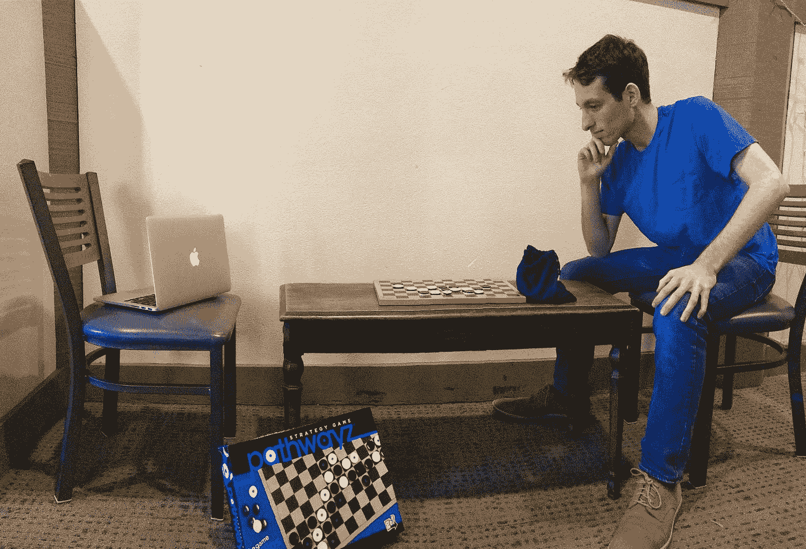

***11 岁时，我发明了一种桌游。*** *我没想到会有什么结果。八年，三个出版商，两个代理商，一个* [*疯狂的故事*](http://pathwayzgame.com/the-story/) *后来，Pathwayz 上架了。这款游戏赢得了 2014 年的玩具博士最佳选择，并在 2015 年被门萨推荐。Pathwayz 已经在网上销售，在 Barnes & Noble，以及北美的数百家商店。*

*Pathwayz 类似于奥赛罗和围棋。人工智能已经* [*已经*](#c44e) *掌握了那些游戏。1997 年，物流泰洛击败奥赛罗世界冠军。2016 年，AlphaGo 战胜围棋世界冠军。但是从来没有人为 Pathwayz 创造过人工智能。2017 年，迈克尔·塔克、尼克尔·普拉巴拉和我决定改变这种状况。我们参加了* CS 221:人工智能——原理与技术*。我们应用我们所学到的知识来构建 PAI，这是世界上最好的(也是唯一的)Pathwayz AI。*

*我们的主要挑战是游戏中的大* [*树的大小*](#ade4) *。我们实验了各种* [*反射*](#7617) *和* [*搜索*](#9727) *型号，其中我们通过括号打***。我们最好的 PAI 由 52 个特定于域的特征组成，通过时间差异学习在 5，000 多个游戏中训练权重，应用于窄束 minimax 算法。对抗业余人类玩家，PAI 在 33 场比赛中赢了 33 场。在与我们队的比赛中，PAI 以 5 比 0 击败了 Nikhil Prabala，4 比 1 击败了 Michael Tucker，3 比 2 击败了 me。****22 岁，在自己的游戏上输给了一台电脑。****

**派的打法教会了我们* [*新策略*](#1167) *。PAI 通过与自己对弈，也让我们试探了一下***；在 1000 场比赛中，第一名球员的胜率为 49.4%，因此似乎没有明显的球员优势。***

**这篇文章详细记录了我们如何创造 PAI。我正在分享这项工作，以便其他人可以从中学习和借鉴。我们的 PAI 版本非常熟练，因为它没有使用神经网络。我们精心选择的功能，加上前瞻功能，使得顶级玩家的开发变得更加高效。在 [*下一次迭代*](#d614) *中，神经网络和其他改进呈现出超人发挥的潜力。***

***我已经包括了基本的术语解释，因此接触较少的读者可以了解更多关于 Pathwayz 和/或 AI 的信息。因此，这是一个很长的帖子。随意跳到你觉得有趣或相关的部分。或者你可以完全跳过阅读，而是在这里* *与 PAI* [*版本对战。我建议按这个顺序玩:1。PAI 基线，2。PAI 高级基线，3。派·TDL 和 4。派 TDL 光束极小化。*](http://pathwayzgame.com/play.html)**

# ****path wayz 简介****

**Pathwayz 是一款双人战略游戏。就像在《奥赛罗》和《围棋》中一样，你必须提前计划以智胜对手。一个玩家是白人；另一个是黑色的。目标是用你的颜色在 8x12 木板的长边上建立一条路径。路径可以是正交的，也可以是对角线的，可以在任何方向来回交织。**

**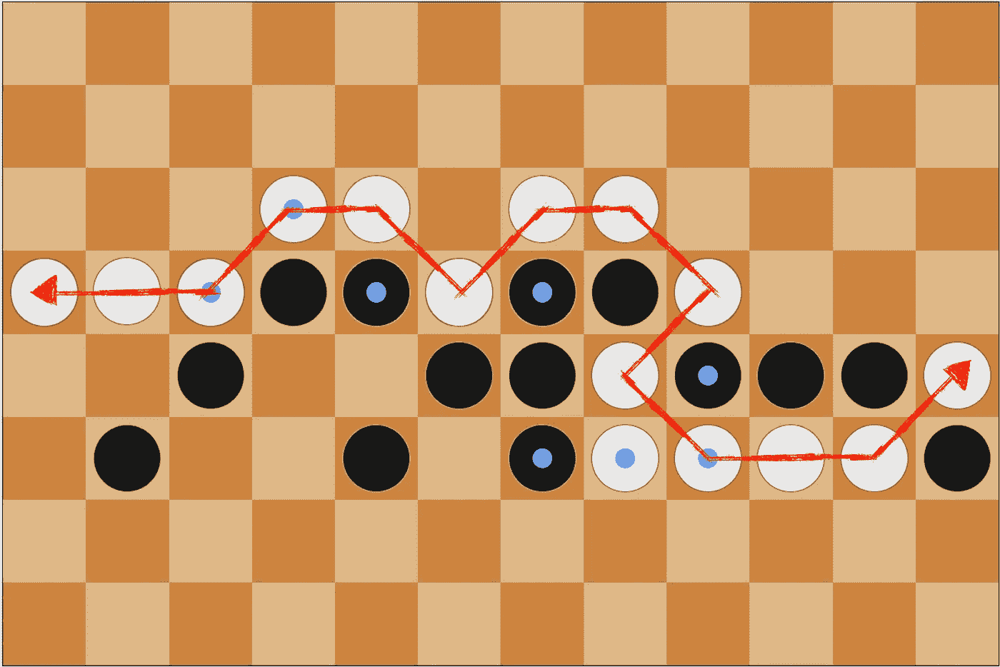**

***White just won this game by connecting the left and right sides of the board.***

**每回合，你可以放置一个你颜色的普通棋子或一个对手颜色的永久棋子。你为什么要给你的对手一个永久的棋子？因为它*翻转*周围的棋子。**

**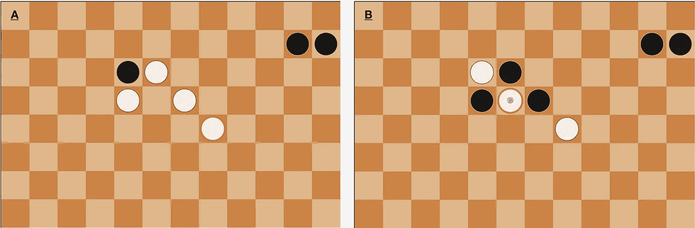**

*****A:*** *White places a regular piece, circled red.* ***B:*** *Black places a permanent piece, which flips the four adjacent pieces.***

**完整说明是[这里](http://pathwayzgame.com/rules-2/)，一个样例游戏是[这里](http://pathwayzgame.com/watch/)。**

# ****玩游戏的人工智能时间线****

**这是一个玩游戏的人工智能的时间轴:**

**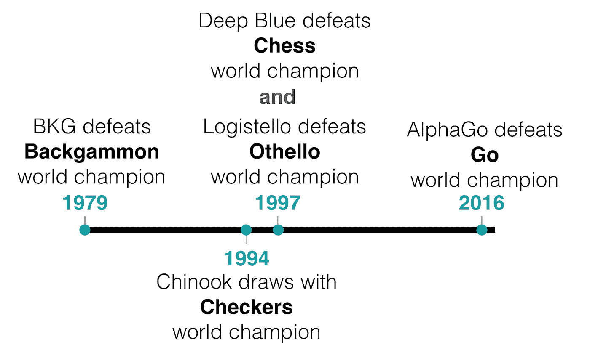**

***From Deep Blue to AlphaGo, AIs have defeated the world champions of Chess, Go, and other board games.***

**人工智能现在比人类更擅长西洋双陆棋、跳棋、国际象棋、奥赛罗和围棋。参见 Audrey Keurenkov 的[关于 AlphaGo](http://www.andreykurenkov.com/writing/ai/a-brief-history-of-game-ai/) 之前人工智能游戏的“简要”历史，以获得更深入的时间线。**

**2017 年，迈克尔·塔克(Michael Tucker)、尼基尔·普拉巴拉(Nikhil Prabala)和我着手为 Pathwayz 打造全球首个 AI PAI。奥赛罗和西洋双陆棋的人工智能与我们的 PAI 开发尤其相关。**

**与 Pathwayz 一样，奥赛罗是一种相对年轻的游戏——至少与古代的双陆棋、跳棋、国际象棋和围棋相比是如此。没有一个大规模的大师级游戏数据库来训练人工智能。相反， [Logistello](https://skatgame.net/mburo/log.html) 和其他奥赛罗人工智能依赖于**领域特定功能**(即奥赛罗特有的战略元素)。**

**[步步高 AI TD-Gammon](http://cling.csd.uwo.ca/cs346a/extra/tdgammon.pdf)，通过**时间差学习**(一种**强化学习**)取得成功。它通过与自己对抗来学习，一路调整特征值。**

**PAI 同样使用特定领域的特征和时间差异学习。我将在这篇文章的后面讨论这些技术。**

# ****数百万、数十亿、数万亿、数不清的动作****

**构建一个玩游戏的人工智能的难度取决于游戏的树的大小。树的大小取决于**的宽度**和**的深度**。**

**考虑井字游戏的树大小作为一个简单的例子。当棋盘是空的时，有 9 种可能的移动:9 的宽度。第一步后，有 8 个可能的移动:宽度 8。在这种情况下(以及在其他布局游戏中)，宽度随着棋盘填满而减小:9、8、7、6、5、4、3、2、1。**

**井字游戏最多有 9 层**层**。(“Ply”只是对单个玩家回合的花哨称呼。在一些游戏中，单个玩家的回合被认为是“一回合”，1 回合= 1 回合。在其他游戏中，两个玩家的回合都被认为是“一回合”，1 回合=回合。为了避免混淆，我还是坚持用“ply”。)假设我赢了 5 层。那个游戏的**深度**是 5。井字最大深度为 9。**

**总博弈树由所有可能的移动组合组成。**

**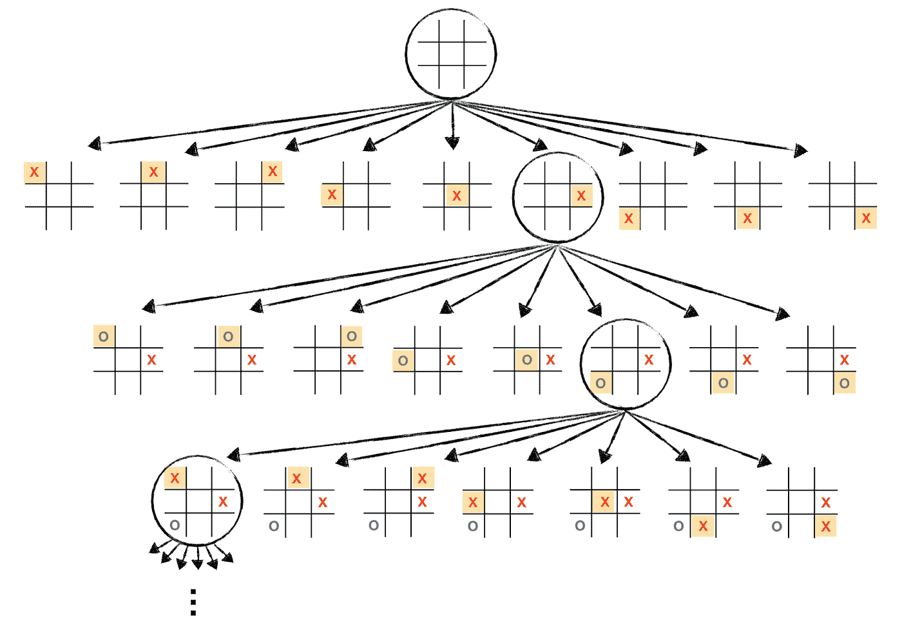**

***Here is a small portion of tic-tac-toe’s game tree, just the first three plies of a single branch.***

**我们可以用宽度对深度的幂来估计井字游戏的总树大小。我们假设每个人都是很好的井字游戏玩家，那么所有游戏都以平局告终，占满了整个棋盘。在本例中，深度为 9。平均宽度为 5。如果我们从宽度到深度，或 5⁹，我们得到大约 1.95 * 10⁶，这是井字游戏(超级近似)的树的大小。我们可以使用类似的方法来估计其他游戏的树的大小。**

**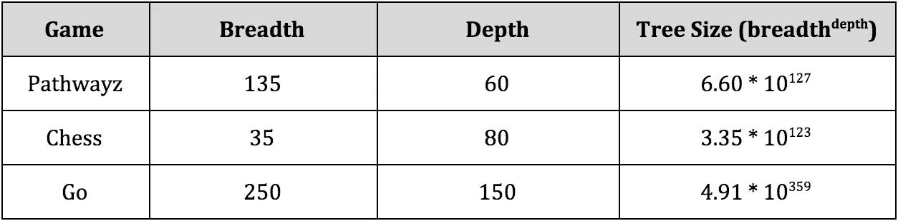**

***Here is the complexity — approximate breadth, depth, and tree size — of Pathwayz, Chess, and Go.***

**我们在构建 PAI 时面临的主要挑战是它的树很大。6.60 * 10 的⁷很大。这比地球上沙粒的数量还要多。事实上，6.60 * 10 ⁷比填满整个宇宙的沙粒数还要多。**

**在这方面，Pathwayz 让人想起国际象棋和[围棋](https://storage.googleapis.com/deepmind-media/alphago/AlphaGoNaturePaper.pdf)。它的树比国际象棋的树大。它的树宽介于国际象棋和围棋之间。为了处理如此复杂的树，我们尝试了不同的方法。这些方法分为两类:**

1.  ****反射模型**(随机、基线、对抗基线、手加权智能特征和 TDL 加权智能特征)，其中 PAI 只是评估其当前的一组移动。**
2.  ****搜索模型**(蒙特卡罗树搜索，expectimax，minimax，beam minimax，和 narrowing beam minimax)其中 PAI 向前看，探索博弈树。**

# ****反射模型:应用评估函数****

**我们使用了一个基于状态的模型来模拟博弈树。状态描述当前玩家和棋盘布局。**

**每一层，PAI 都会查看所有合法的步骤，并选择它认为“最好”的一个它如何决定哪一步是最好的？PAI 使用一个**评估函数**，计算给定游戏状态的值。我们试验了各种可能的功能。**

## ****一级:随机****

**PAI 选择随机移动。这显然不是一个好策略…**

## ****第二级:基线****

**PAI 选择最大化***myLongestPath***的移动:PAI 在连续路径中遍历的列数。**

**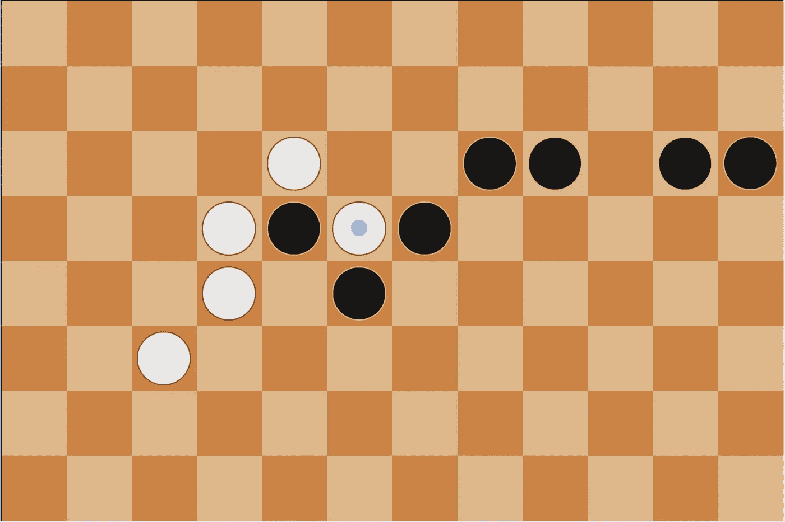**

***White’s* myLongestPath *is 4, and black’s is 5 (note that the two unconnected pieces do not contribute).***

**当一个策略在 50%的时间里表现得比基线更好时，我们知道这个策略是合理的。**

## ****第三级:对抗基线****

**PAI 选择最大化***my longestpath–0.4 * yourlengestpath***的移动。由于 PAI 现在推进了自己的路径*并且*阻挡了对手的路径，因此游戏效果显著提高。对抗性底线有时会击败新手。**

**当一个策略在 50%的情况下比对手的基线表现得更好时，我们知道这个策略是好的。**

## ****第 4 级:手动加权智能功能****

**myLongestPath 和 *yourLongestPath* 只是评估游戏状态的两种方式。还有数不清的其他因素表明一个球员做得有多好。比如，你们每个人有几件永久的？比你的对手多还是少？你控制多少列？你的道路容易改变吗？容易被屏蔽？你使用对角线、分叉或直线队形吗？等等。**

**这些被称为**特定领域特性**或**智能特性**。迈克尔、Nikhil 和我一起想出了 440 个可能的特征。我们缩小到我们最喜欢的特征。我们最好的 PAI 只使用 52，原因我稍后解释。**

**我们设计了一些方法来衡量每个玩家的以下方面:**

*   **路径长度**
*   **路径持久性**
*   **列数**
*   **永久件数**
*   **带有 *x* 空邻居的常规块的数量**
*   **一次可以翻转的棋子数量**

**我们的突破是建立前瞻功能。通过存储路径的左右边界，我们能够有效地估计:**

*   **未来路径长度**
*   **如果一条路径被阻塞**
*   **如果有人离胜利只有一步之遥**

**我们创建了各种其他特性，包括平方、交互和指示器特性。我们精心挑选了**权重**:每个特征的正值或负值。我们给我们认为更重要的特征分配更高的权重。例如，我们尝试给 *myLongestPath* 权重 10， *yourLongestPath* 权重-6，给*myNumPerm—*my numberm—我的永久块数量—权重 3。**

**我们通过**标准化**特征值(即，将它们全部压缩到相同的范围内)，乘以它们的权重，并将结果相加，创建了一个评估函数。我们还创建了一个+/-一百万的**效用函数**，增加了一个玩家在输赢情况下的评价函数。**

**牌型灵巧的牌手是个好牌手。作为 Pathwayz 的发明者，我玩过成千上万的游戏，可能比任何人都多，非常适合体重特征。然而，我主要是凭直觉来权衡的。在我们最喜欢的 52 个特性中，我不知道它们的重要性到底有多大。这就是时差学习的作用。**

## ****第 5 级:TDL 加权智能特性****

**PAI 通过**时间差学习** (TDL)学习特征权重。对于每一层，PAI 使用其当前重量来评估纸板——将该值存储在 V1 中。然后 PAI 移动，对手移动，PAI 再次使用它的重量来评估棋盘——存储这个新值 V2。在 TDL，**奖励预测误差(R)** 是 V2 减去 V1。换句话说，你的错误是你最初的评估函数与新的董事会状态相比有多错误。**学习速率 alpha (α)** 就是你学习的速率。alpha 值为 1.0 意味着您会完全忽略旧值，只考虑最新的数据。alpha 值为 0.5 意味着您对旧值和最新数据进行了平均。大多数阿尔法值要小得多(我们实验了 0.00001 到 0.01)，这样你就可以逐渐学习，随着时间的推移积累更强的证据。**

**每两层，PAI 计算奖励预测误差(R)。给定学习率(α)，PAI 更新其特征权重向量，增加 R * α。如果 PAI 在两层之后的表现好于预期，则董事会之前的特征会得到更积极的重视。如果 PAI 在两层之后表现得比预期的差，那么特性的权重会更负。我们为赢/输提供了一大笔正面/负面的游戏结束奖励。PAI 在 10，000 场比赛中与自己的版本进行了比赛，以了解其领域特定功能的权重。**

**TDL 的要素是**开发**和**探索**。我们希望 PAI 利用它所学到的东西，做出越来越好的动作。然而，我们也希望 PAI 继续探索，而不是过于专注于一个场景。如果 PAI 总是下“最好的”当前棋，它可能会卡在**局部最小值**中，忽略更好的路径。因此，我们使用了探索概率。PAI 根据随机ε(如果ε <得分最高的棋步，如果ε <得分第二高的棋步，如果ε < ⅞得分第三高的棋步等)探究了其十大棋步。).**

**我们还想**调整**权重，所以我们创建了一个自动化的**训练管道**。如果 PAI 在训练中赢了太多的游戏，它就会变得过于自信，增加它所有的特征权重(包括那些应该是负的)。在赢得至少 60%的游戏后，PAI 的对手采用 PAI 的当前权重，这确保了 PAI 总是在适当的技能水平上受到挑战。**

**相反，如果 PAI 输了太多的游戏，它会变得悲观，减少所有的特征权重(包括应该是正的)。在赢了不到 40%的游戏后，PAI 会切换到对抗底线的游戏，它可以学会持续地击败这个底线。PAI 随后恢复了信心，在回到更具挑战性的对手面前之前调整了特征。**

**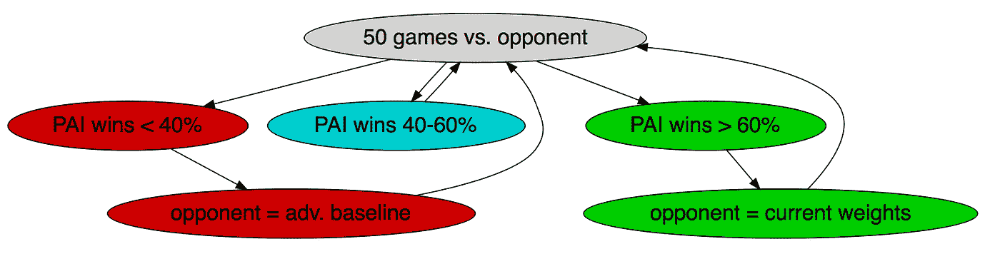**

***We used an automated training pipeline. If PAI ever won too few games, PAI’s opponent became adversarial baseline. If PAI ever won too many games, PAI’s opponent adopted its current weights.***

**我们将拥有 52 个功能的 PAI 用于 5000 款游戏。**

**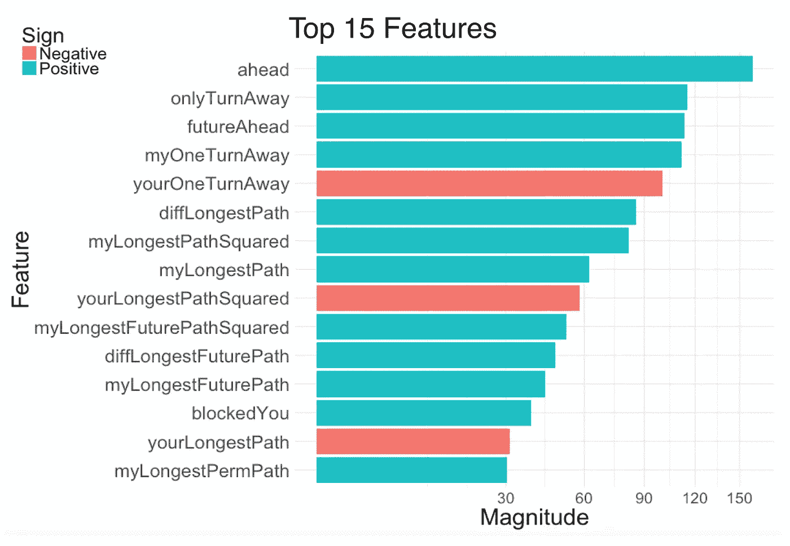**

***Here are the top 15 feature weights after the first 5,000 games of training. There are two key takeaways.* ***1:*** *Lookahead features make up 8/15 of the top features.* ***2:*** *Positive features make up 12/15\. PAI focuses on getting ahead more than on blocking.***

**具有 TDL 加权特征的 PAI 可以持续击败业余人类玩家。我们最终将拥有 440 个功能的 PAI 用于另外 5000 款游戏。(这个版本表现稍差，原因我稍后解释。)**

# ****搜索模型:探索游戏树****

## ****第 6 关:蒙特卡洛树搜索****

**PAI 的上述版本都依赖于使用评估函数来对当前的一组可能的移动进行评分。但是他们都没有展望未来。**

****蒙特卡罗树搜索** (MCTS)是一种“向前看”的算法 PAI 没有使用评估函数，而是快速测试尽可能多的场景。它随机地和自己玩成吨成吨的游戏(在我们的例子中:每层 250，000 个游戏)。根据随后的胜率，PAI 可以估计哪些举措会带来更好的结果。**

**结果并不惊人。Pathwayz 中的随机移动通常很糟糕(例如给你的对手一个永久棋子)，所以随机抽样是一个弱预测器。**

## ****第七级:Expectimax****

**用我们的评价函数探索博弈树怎么样？**

****Expectimax** 是一种针对随机对手进行前瞻的算法。对于 PAI 的每个可能的移动，它考虑对手的所有后续移动，应用我们的评估函数，并平均这些值。PAI 选择平均值最高的棋步。因为我们的评估函数需要时间(与模拟随机移动相比)，PAI 无法预见未来。特别是在游戏开始的时候，当树的宽度很大的时候，向前看似乎要花很长时间。所以 PAI 只向前看了一层。**

**请注意，expectimax 针对随机的*对手进行优化。像 MCTS 一样，结果并不令人惊讶，因为在 Pathwayz 中随机抽样是一个弱预测器。***

## ****第 8 级:极小极大****

**探索游戏树对抗非随机对手怎么样？**

****Minimax** 是一种预测最有可能的对手的算法。Minimax 的工作方式类似于 expectimax。然而，PAI 并没有对对手可能的移动进行平均，而是假设对手会尽最大努力移动。PAI 最大化其自身移动的评价函数，同时最小化其对手移动的评价函数。**

**请注意，在面对次优对手时，极小极大并不是最佳玩法。换句话说，它总是从其他玩家那里获得最好的，而不是利用常见的错误。**

**更迫切的担忧是 minimax(像 expectimax)在 Pathwayz 看不到很远。由于巨大的树宽，尤其是早期游戏，PAI 最初只限于向前看一层。然而，随着游戏的进展，我们确实增加了前瞻深度，所以 PAI minimax 是一个令人生畏的终极玩家。**

## ****第 9 级:光束最小值最大值****

**派还能看得更远吗？**

****波束极小最大值**是一种通过减少宽度来增加前瞻深度的算法。在每一层，PAI 选择最上面的 X 步，然后*只*向前看那些步。在随后的关卡中，PAI 再次缩小了宽度— *只看对手的最佳 X 步，然后看自己的最佳 X 步。(在我们的例子中，X 是 5。)***

**如果最佳长期移动在这些 X 移动之外，那么波束极小最大将错过它。拥有无限的计算能力，minimax 永远是比 beam minimax 更好的玩家。(当对手离胜利只有一步之遥时，我们让 PAI 恢复到更彻底的 minimax 算法。由于广度有限，计算时间在这个阶段仍然是合理的。)然而，在我们有限的时间和计算资源下，beam minimax 允许 PAI 提前多考虑一层，这使它成为一个更优秀的玩家。**

## **第 10 级:缩小光束最小值最大值**

**我们 PAI 的最终版本使用了**窄光束 minimax** 。PAI 模拟自己的前十步棋，然后是对手的前五步棋，然后是自己的最佳棋。这种窄束允许 PAI 在合理的时间内预测三层，同时考虑更大的一组(十个)可能的移动。**

**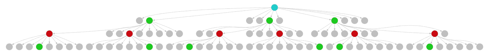**

***Here is an example of narrowing beam minimax, with breadths of 3, then 2, then 1 at each level.***

# ****定量结果****

**为了比较我们不同 pai 的表现，我们让他们参加了循环赛。这些 pai 在 20 场比赛中互相比赛，总共 720 场比赛。虽然没有已知的第一个或第二个玩家的优势，我们让每个 PAI 玩相同次数的黑白游戏，以确保公平的比赛。请注意，本次锦标赛中的 minimax 和 beam minimax PAIs 使用的是最初手工挑选的特征权重(而不是 TDL 训练的权重)。还要注意，在这种情况下，“波束极小最大”是我们的“窄波束极小最大”算法的简写。**

**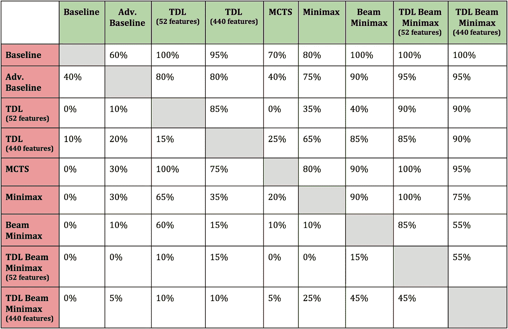**

**Here are the results of our round-robin tournament. Win rates are down the columns, loss rates across the rows.**

**TDL 训练的特征对表现有显著的影响。通过 TDL 训练的两个反射模型比对抗基线表现得好得多。拥有 52 个特征的 TDL 设法在我们最初的光束极小值中获得了 60%的胜率；一个反射模型打败了一个对抗性的搜索模型是一个了不起的成就。我们认为具有 440 个特征的 TDL 遭受过度拟合。它对自己和光束 TDL 极小极大进行训练，所以对这些玩家是最佳的，但对其他玩家是次优的。相比之下，具有 52 个特征的 TDL 适应性更强。**

**窄光束 minimax 赢得了锦标赛。经过 52 个特征训练的版本击败了拥有 440 个特征的对手。我们把这次胜利归功于前者的多才多艺和后者的过度配合。重要的是要记住，20 场比赛容易受到相当大的差异。然而，定量结果符合我们的定性直觉。**

**最终，将 TDL 特征与前瞻算法相结合，产生了一个聪明的、适应性强的播放器。当我们在一个人工智能海报展览会上展示我们的成果时，我们为第一个击败我们最好的反射 PAI(经过 52 个特征训练的 PAI)的人提供了 50 美元的奖金。派以 33 比 0 击败了人类。诚然，他们都是业余选手，尽管有些人连续玩了多次，有些人有围棋或其他类似棋盘游戏的经验。**

**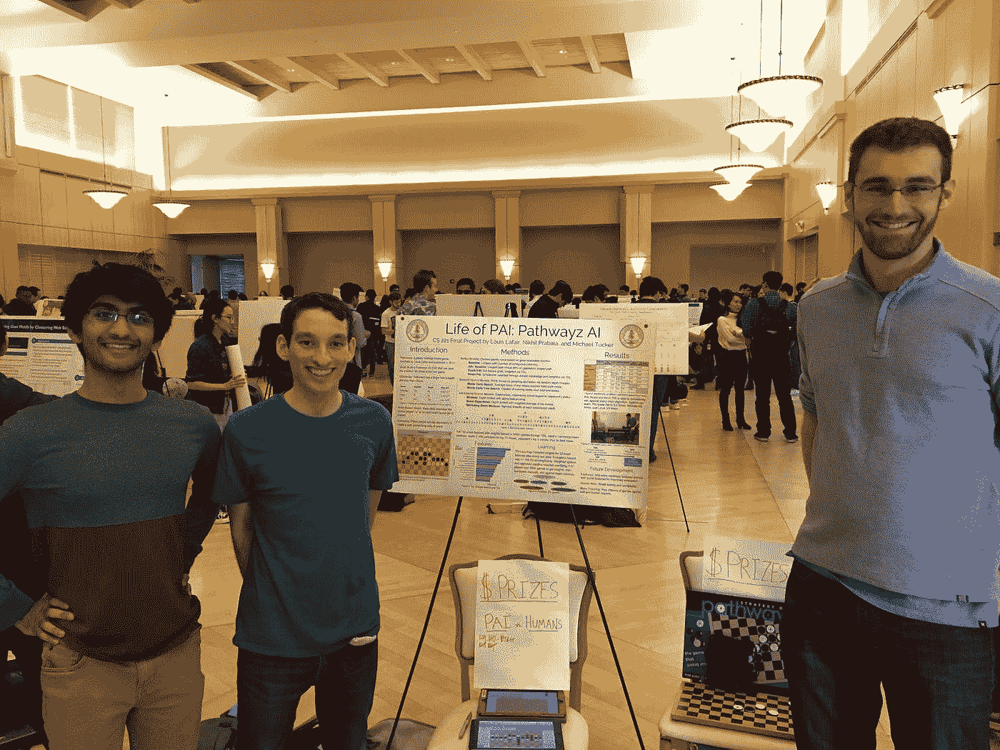**

***Pictured from left to right: Nikhil Prabala, Louis Lafair, and Michael Tucker at the* CS 221 Artificial Intelligence — Principle and Techniques *poster fair.***

**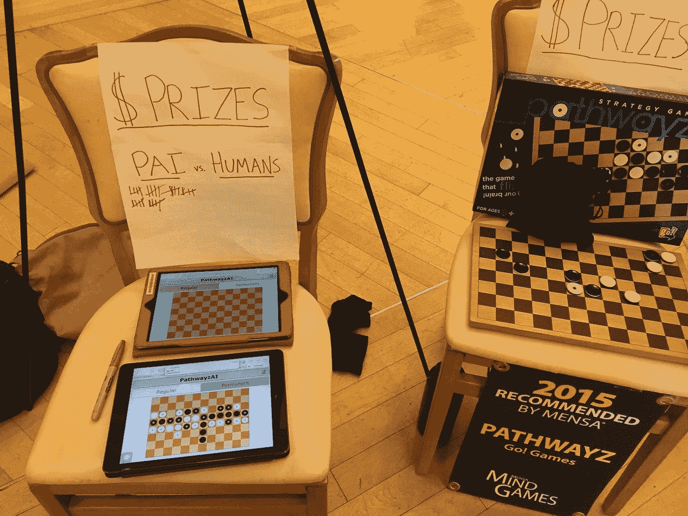**

***The reflex TDL-weighted PAI defeated amateur humans in 33 straight games at the poster fair, played on the pictured iPads. No one won the $50 reward.***

**最后，我们让我们最好的前瞻 PAI(通过 TDL 训练的具有 52 个特征的窄光束 minimax)与我们更有经验的团队对抗。PAI 以 5 比 0 击败了 Nikhil Prabala，4 比 1 击败了 Michael Tucker，3 比 2 击败了 me。**

**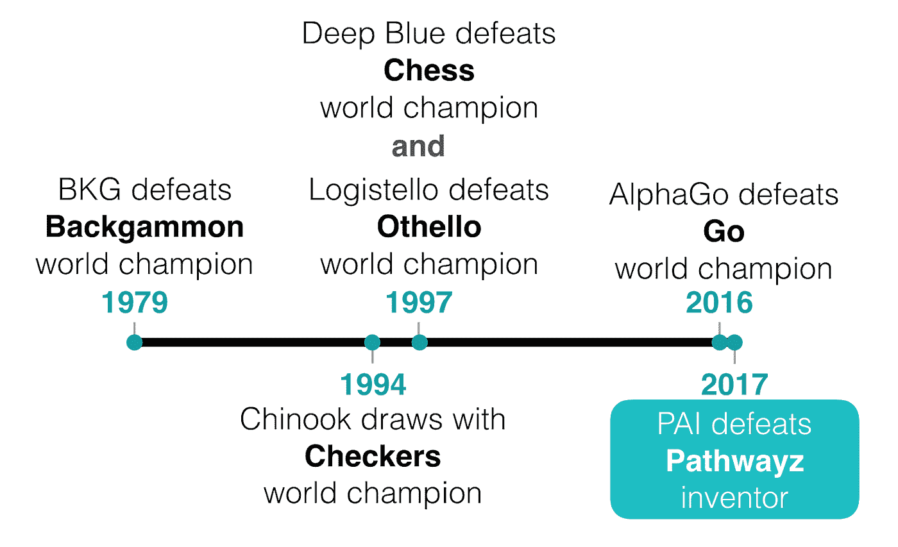**

***In 2017, PAI gets added to the timeline of notable game-playing AIs.***

# ****拜师学艺****

**PAI 作为第一个 Pathwayz AI，可以教我们新的 Pathwayz 方法。它的打法有几处让人惊讶。大多数人类玩家都很保守，会等到游戏中期或结束时才翻盘。派，另一方面，是侵略性的，在最初的几个动作中持续翻转。PAI 试图(经常成功地)获得早期领先，这样它就可以在比赛结束时进行进攻而不是防守。**

**根据定义，反射模式是一个贪婪的玩家，所以它的侵略性是有道理的。**

**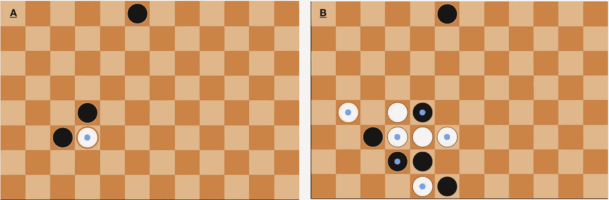**

*****A:*** *Reflex TDL-weighted PAI (black) plays a permanent piece, aggressively flipping at start of game.* ***B:*** *Later in the same game, PAI has now played permanents in four of its first six moves***

**搜索模型的侵略性更令人惊讶。**

**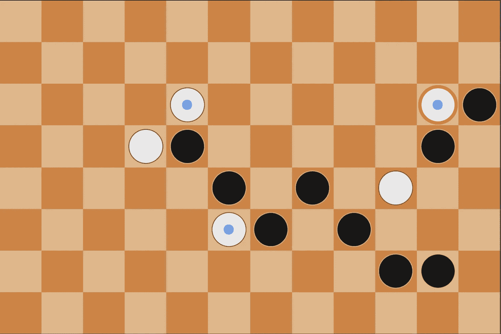**

***PAI beam minimax (black) has learned that getting ahead early is helpful. PAI tends to go on the aggressive.***

**同样令人惊讶的是 PAI 阻挡空翻的能力。PAI 有时会在非常规空间打球，只是为了阻挡对手的翻转。**

**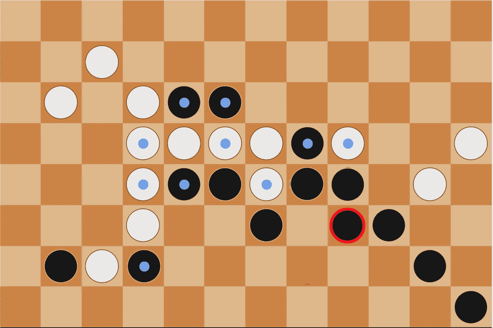**

***PAI (black) strategically places to block a dangerous flip.***

**PAI 会尽一切可能阻止(或至少延长)对手的胜利，有时甚至会翻转自己的棋子。**

**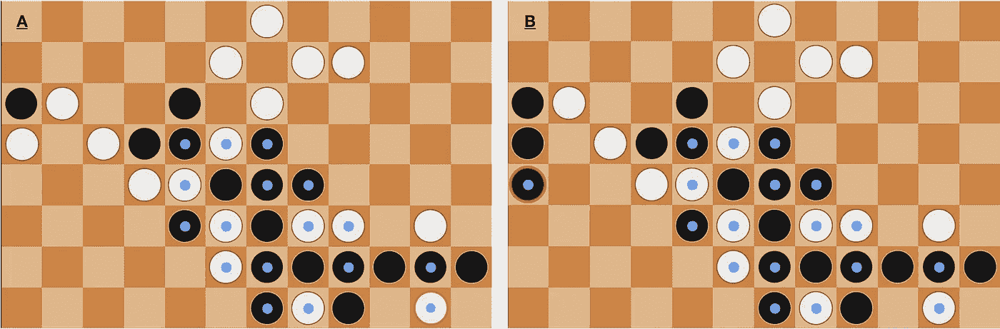**

*****A:*** *I (black) am one turn away from winning.* ***B:*** *PAI (white) makes an end-game sacrifice, flipping its own piece to prevent a winning flip next turn.***

**继续玩和发展 PAI 会揭示更多新颖的策略。**

# ****有先发制人的优势吗？****

**许多双人策略游戏中都存在第一个玩家的优势。在围棋中，第二名棋手获得补偿以消除第一名棋手的优势。在国际象棋中，第一个玩家的[胜率在 55%](https://en.chessbase.com/post/the-sonas-rating-formula-better-than-elo-) 左右。胜率的计算方法是:(胜+ 1/2 平)/总游戏数。**

**鉴于历史数据的缺乏，在 Pathwayz 没有已知的第一玩家优势。有些人认为先发制人有优势。**

**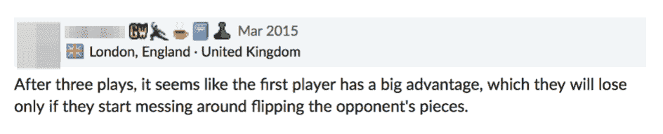**

***A commenter on BoardGameGeek.com believes there’s a first-player advantage in Pathwayz.***

**我们决定看看这个理论是否成立，以及在多大程度上成立。在 Pathwayz 白棋先走。我们在 1000 场比赛中发挥了我们最好的反射(因此也是最快的)PAI。白棋赢了 487 场，黑棋赢了 499 场，他们平了 14 场。换句话说，第一个玩家的胜率是 49.4%。如果有的话，似乎有一个次要的第二玩家优势，虽然它可能会随着更多的模拟或更先进的人工智能而减少。黑棋的优势如此之小，以至于我们可以假设(直到一个更大的游戏数据库存在)没有明显的玩家优势。**

# ****下一级****

**我们精心选择的功能，加上前瞻功能，使得顶级玩家的开发变得更加高效。与使用神经网络相比，我们能够用更少的时间(和更少的计算能力)构建、训练和测试 PAI。**

**对于未来的迭代，我们有几种方法可以继续改进 PAI。第一，我们要训练 PAI 对抗人类玩家；我们已经建立了开始这样做的基础设施。第二，我们想尝试将蒙特卡罗树搜索与我们的评估函数相结合，有效地增加预见性。第三，我们希望试验不同的特性集，在 52 和 440 之间，不要过度拟合。最后，我们希望使用神经网络，允许更复杂、更微妙的非线性策略。**

**目前的 PAI 是一个强大的玩家，但不是不可阻挡的。随着神经网络的发展，PAI(像 [AlphaGo Zero](https://www.nature.com/articles/nature24270) )展示了超人游戏的潜力。**

# ****鸣谢****

**PAI 是许多人投入大量时间和大量帮助的结果。感谢 Percy Liang 和 Stefano Ermon 教授 *CS221:人工智能——原理与技术*。感谢扎克·巴恩斯的反馈。感谢 Dylan Hunn 提供初始 GUI。感谢一路走来尝试与 PAI 对战的所有人。**

**当然，非常感谢**迈克尔·塔克**和 **Nikhil Prabala** ，他们花费了无数的时间(也失去了太多的睡眠)来共同开发 PAI。这篇博文在很大程度上借鉴了我们为 *CS 221 撰写的最终**联合论文**:人工智能——原理和技术。***