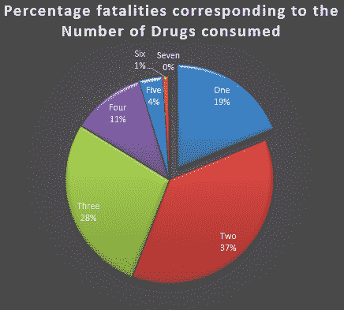
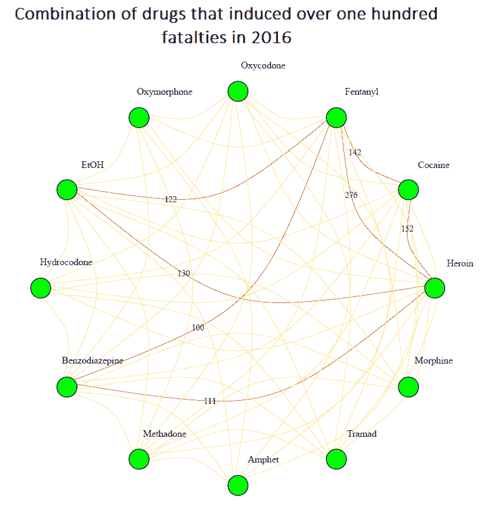
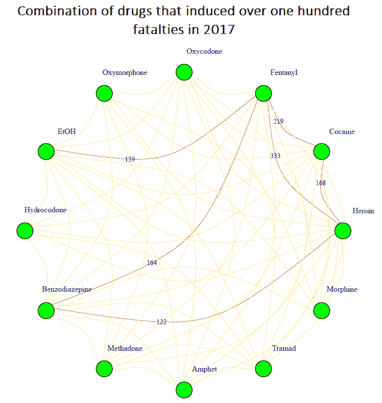
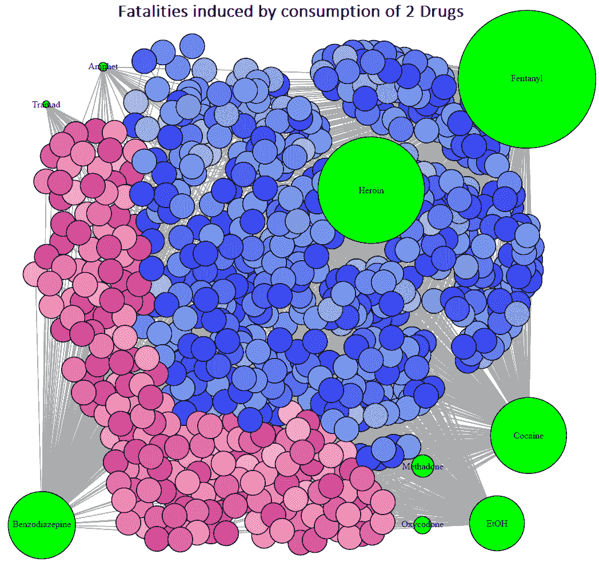
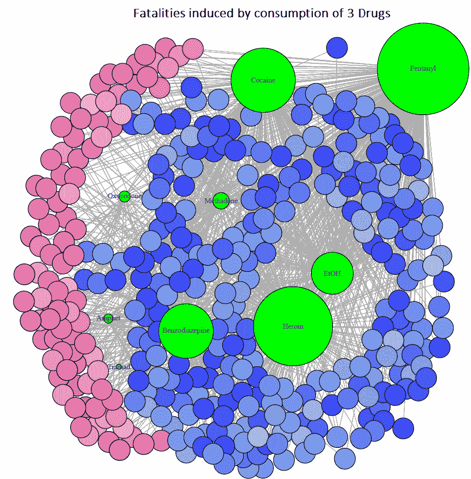
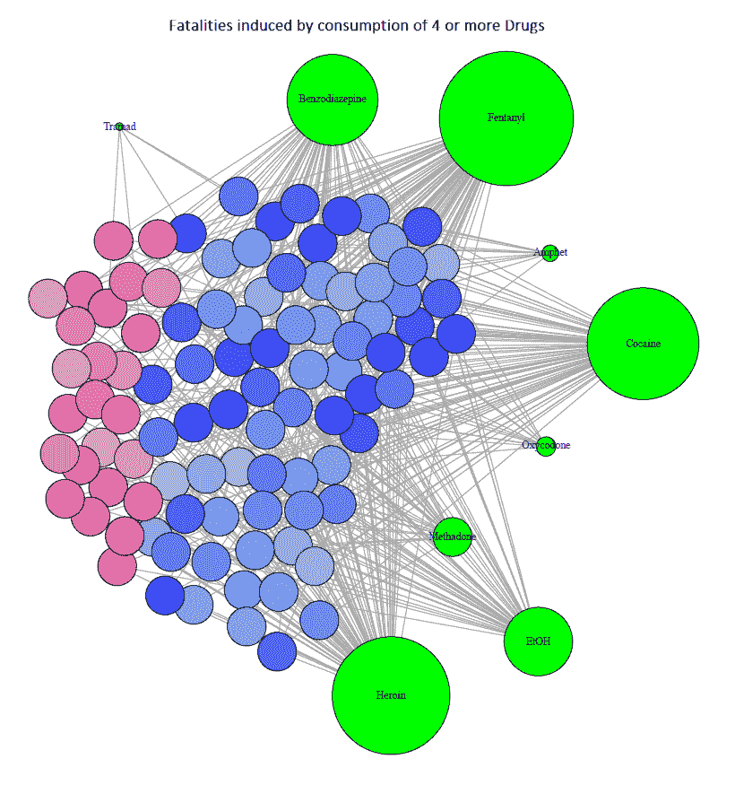

# 意外药物过量死亡的模式

> 原文：<https://towardsdatascience.com/patterns-in-accidental-drug-overdose-fatalities-994573a2be72?source=collection_archive---------12----------------------->

Pixabay

意外阿片类药物过量导致的死亡已经成为美国最严重的公共卫生危机之一。死亡人数令人心痛，全国每个公共卫生机构都在努力扭转这一趋势，因为这种流行病导致的死亡率逐年攀升。

为了发现阿片类药物过量死亡的模式，我开始着手分析 2016-17 年康涅狄格州的[意外药物过量死亡的公开数据集。我的目标是深入了解药物滥用受害者的行为，这可能有助于采取预防措施，帮助抗击这种流行病。](https://data.ct.gov/Health-and-Human-Services/Accidental-Drug-Related-Deaths-2012-2017/rybz-nyjw/data)

# 关键指标

首先，我对数据进行了探索性分析，以确定将成为分析焦点的关键指标。在对几个不同的参数进行分析后，我能够专注于导致大多数药物过量死亡的共同因素。超过 80%的死亡是由于过量服用多种药物的致命组合而不是一种药物引起的。从这个角度来看，将分析建立在因服用多种药物而导致的死亡上是有意义的，因为它们占了死亡的大多数。

# 方法论

为了探索药物和死亡之间的关系，我决定对数据集进行社会网络分析。通过改变不同参数生成的社交网络可以相互比较，从而可以识别任何新兴模式。使用统计编程语言 r 中的社会网络分析包进行分析。

# 分析

*1)确定致命的药物组合*

由于我们的分析基于药物组合导致的死亡，因此在 2016 年和 2017 年建立了一个药物与死亡相关的网络。本质上，如果可卡因和海洛因是过量致死毒性报告的一部分，那么在这个网络中它们之间就会有联系。为了找出最重要的问题，与导致 100 多人死亡的两种药物的联系用红色标出。

*   我们观察到，大多数用药过量死亡都与芬太尼有关，芬太尼是一种阿片类药物，因此表明阿片类药物危机有多严重。
*   其次，芬太尼和海洛因在这两年都是意外过量死亡人数最多的药物。
*   第三，在比较两个网络中的死亡人数时，涉及芬太尼这种药物的死亡人数在 2017 年大幅上升*。*相比之下，涉及芬太尼的死亡人数*而非*有所下降，但可卡因和海洛因的死亡人数略有上升。这清楚地表明，2017 年，药物消费模式发生了转变，从其他药物转向芬太尼。

*2)药物和人口统计学*

为了深入了解 2017 年药物过量伤亡者的人口统计数据，基于药物过量受害者死亡时消耗的*数量*创建了三个社交网络，分别为*两个*、*三个*和*四个或更多个*。

蓝色和粉红色的节点代表男性和女性死亡，每种颜色的深度随着年龄的增长而增加。此外，绿色节点表示死亡时消耗的药物。绿色节点的大小取决于蓝色或粉色节点的“度数”或链接数量。绿色节点的大小显示了在服用多种药物时导致大多数意外过量死亡的药物。

*   在所有三个网络中，芬太尼在与其他药物结合使用时是导致死亡人数最多的药物。紧随其后的分别是海洛因和可卡因。
*   从视觉上看，很明显，在所有三个网络中，因药物过量导致的意外死亡问题对男性人口的影响不成比例地大于女性人口。由两种、三种和四种或更多种药物引起的女性死亡率分别为 32%、29%和 23.5%。这一趋势表明，男性人口更容易因消费大量药物而成为意外药物过量的受害者。

# 离别赠言

当我们深入分析时，很容易忽略这样一个事实，即每一个用蓝色或粉色表示的空节点，都曾经是一个宝贵的生命，和我们每个人有着同样的梦想和渴望。仅这一事实就足以让每个参与扭转局面和控制阿片类药物流行的人的努力有了意义。