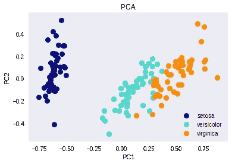
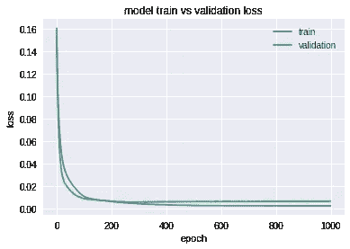
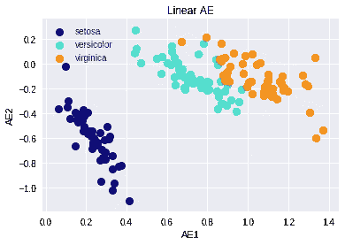
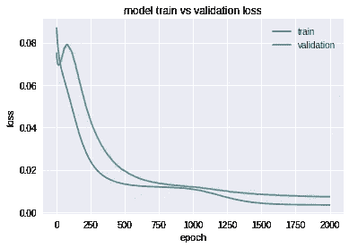
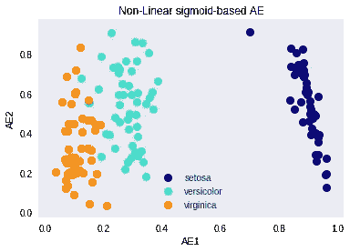
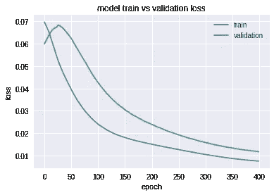

# PCA 与自动编码器

> 原文：<https://towardsdatascience.com/pca-vs-autoencoders-1ba08362f450?source=collection_archive---------1----------------------->

Behind Shinjuku Station, Tokyo.

在本教程中，我将解释 PCA 和自动编码器(AE)之间的关系。我假设你对什么是 PCA 和 AE 有一个基本的了解，但是如果你不熟悉 PCA 或自动编码器，请阅读[1，2]。

关于使用线性激活自动编码器(AE)来近似主成分分析(PCA)，已经写了很多。从数学的角度来看，最小化 PCA 中的重建误差与 AE [3]相同。

然而，为什么要把自己局限于线性变换呢？神经网络非常灵活，因此我们可以通过使用非线性激活函数引入非线性[4]。此外，随着特征数量的增加，与 AE 相比，PCA 将导致更慢的处理。我们的假设是，声发射跨越的子空间将类似于主成分分析发现的子空间[5]。

在这项研究中，我们将看到 PCA、线性和非线性自动编码器之间的异同。请注意，非线性 AE 将是非线性的，除非输入数据被线性跨越。

首先，让我们加载虹膜数据集，并在[0，1]之间缩放。

让我们创建一个函数，根据原始标签绘制数据。

然后，我们使用数据集来拟合主成分分析，并绘制前两个主成分分析图。我们可以看到出现了两个大斑点，使用目标标签，我们可以看到这三个集群是如何包含在这两个斑点中的。

A plot of PC1 against PC2.

我们的第一个网络是一个线性 AE，有 3 层(编码、隐藏和解码)，编码和解码层有“线性激活”，隐藏层有两个神经元。本质上，这种结构通过将隐藏层中的数据从四个特征减少到两个特征来近似 PCA。如您所见，该模型收敛得非常好，我们的验证损失已降至零。在通过隐藏层传递训练数据之后，我们得到两个新的向量，并且通过将它们彼此相对绘制，我们清楚地形成了类似于 PCA 的斑点和集群。

Left: the linear AE train and validation loss. Right: A plot of AE1 against AE2.

让我们创建第二个 AE，这一次我们将用一个 sigmoid 代替两个线性激活函数。这种网络结构可以被认为是具有非线性变换的 PCA，并且类似于上面的网络结构，它收敛到局部最小值，并且我们可以绘制得到的密集向量。

Left: the sigmoid-based AE train and validation loss. Right: A plot of AE1 against AE2.

我们的最后一个 AE 使用了带有 L1 正则化的 relu 激活。换句话说，我们希望通过使用具有受限表示的非线性 AE 来近似 PCA[2]。类似于先前的网络，它收敛到局部最小值，并且两个密集向量显示包含在两个斑点中的三个集群。

Left: the relu-based AE train and validation loss. Right: A plot of AE1 against AE2.

在训练所有 3 个自动编码器并通过隐藏层推送我们的训练数据后，我们比较前 2 个 PC 和 AE 的密集特征。我们可以清楚地看到，在所有模型中，这些向量中的数字并不相同。通过绘制每两个向量并观察得到的集群，这一点非常清楚。接下来，我们将比较具有 2 个和 3 个聚类的简单 KMEANS 如何对数据进行分类。

A comparison of all four plots.

我们想知道，用 KMEANS (k=2 & 3)聚类的每个结果是否可以在所有模型中相似地标记数据，即使密集范围非常不同。以下是训练集中样本的打印分类向量和指标。打印输出和度量显示，使用由不同算法创建的不同密集表示，可以找到两个相同或三个非常相似的集群。我们可以看到，当对两个斑点进行聚类时，度量分数基本相同，并且当对三个已知的花类进行聚类时，度量数字非常接近。请注意，由于神经网络的随机性，可能会出现微小的差异。

我要感谢 Natanel Davidovits 和 Gal Yona 的宝贵评论、校对和评论。

Ori Cohen 在机器学习、脑机接口和神经生物学领域获得了计算机科学博士学位。

参考资料:

[1] [在 keras 建造 AE](https://blog.keras.io/building-autoencoders-in-keras.html)

[2] [使用 Iris 分三步进行 PCA](http://sebastianraschka.com/Articles/2015_pca_in_3_steps.html)

[3] [CSC 411:第 14 讲:主成分分析&自动编码器](https://www.cs.toronto.edu/~urtasun/courses/CSC411/14_pca.pdf)，第 16 页。

[4] [深度学习自动编码器教程](https://lazyprogrammer.me/a-tutorial-on-autoencoders/)

[5][PCA 和自动编码器](https://stats.stackexchange.com/questions/120080/whatre-the-differences-between-pca-and-autoencoder)有什么区别