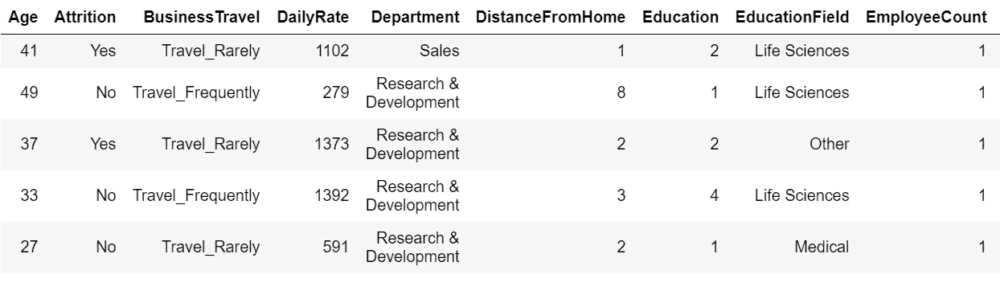
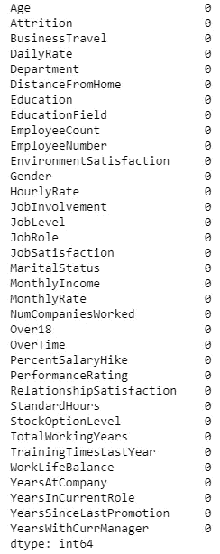
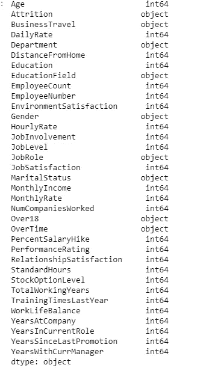
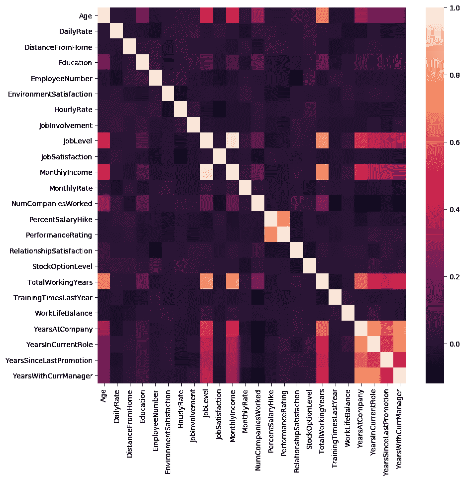
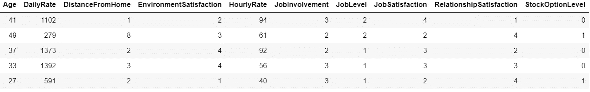
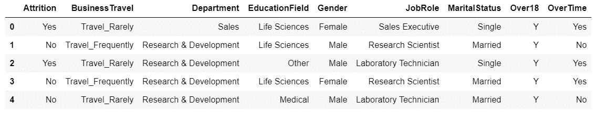
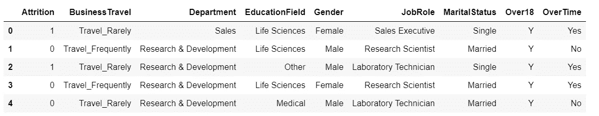
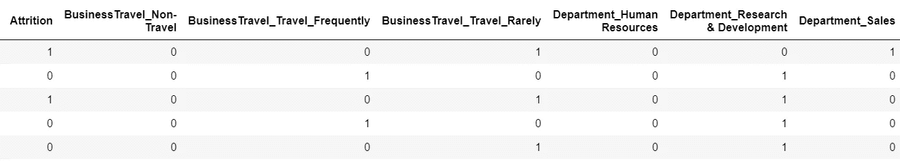
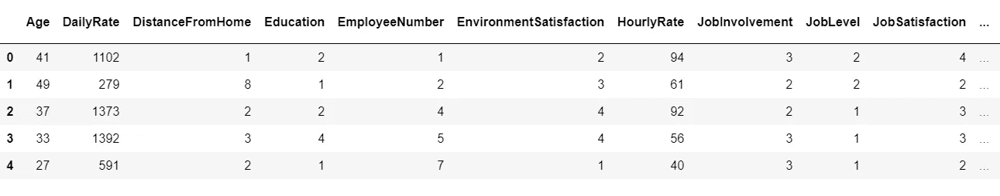

# 带有流失预测的人员分析

> 原文：<https://towardsdatascience.com/people-analytics-with-attrition-predictions-12adcce9573f?source=collection_archive---------2----------------------->


Pixabay Image

每年都有许多公司雇佣许多员工。公司投入时间和金钱来培训这些员工，不仅如此，公司内部也有针对现有员工的培训计划。这些计划的目的是提高员工的工作效率。但是人力资源分析在这方面有什么用呢？而且仅仅是为了提高员工的业绩吗？

**人力资源分析**

> 人力资源分析(HR analytics)是分析领域中的一个领域，指的是将分析过程应用于组织的人力资源部门，以期提高员工绩效，从而获得更好的投资回报。人力资源分析不仅仅是收集员工效率的数据。相反，**旨在通过收集数据来提供对每个流程的洞察，然后使用这些数据来做出如何改进这些流程的相关决策。**

**人力资源流失**

> 人力资源流失是指员工随着时间的推移逐渐流失。一般来说，相对较高的流失率对公司来说是个问题。人力资源专业人员通常在设计公司薪酬计划、工作文化和激励系统方面发挥领导作用，帮助组织留住优秀员工。

自然减员对公司有什么影响？人力资源分析如何帮助分析流失？我们将在这里讨论第一个问题，对于第二个问题，我们将编写代码，并尝试一步一步地理解这个过程。

**减员影响公司**

> 高员工流失率的一个主要问题是它给组织带来的成本。职位发布、招聘流程、文书工作和新员工培训是失去员工和替换他们的一些常见费用。此外，定期的员工流动会阻碍您的组织随着时间的推移增加其集体知识库和经验。如果你的业务面向客户，这一点尤其重要，因为客户通常更喜欢与熟悉的人互动。如果不断有新员工加入，就更有可能出现错误和问题。

希望这些基础知识有意义。让我们继续编码，并尝试找出人力资源分析如何帮助理解自然减员。

# 介绍

为了开始练习，我使用了从 Kaggle 下载的 [IBM HR Analytics 员工流失&性能数据集](https://www.kaggle.com/pavansubhasht/ibm-hr-analytics-attrition-dataset)。该数据集包括诸如年龄、员工角色、日薪、工作满意度、在公司的年数、在当前角色的年数等特征。在这个练习中，我们将尝试研究导致员工流失的因素。这是一个由 IBM 数据科学家创建的虚构数据集。

让我们开始工作吧。

# 数据准备:加载、清理和格式化

```
#Load the data
hr_data = pd.read_csv("HR-Employee-Attrition.csv")
hr_data.head()
```



HR Data Snapshot

```
#Missing values check
hr_data.isnull().sum()
```



Missing values

幸运的是，我们没有任何缺失值，从上面的 HR 数据快照来看，我们似乎也不需要格式化数据。

# 数据分析

让我们看一下数据，看看这些特征是如何影响数据和员工流失的。我们需要先检查要素的数据类型，为什么？因为我们只能看到一个数据集中数值/连续值的分布。为了获取分类/对象值的峰值，我们必须将它们与数值变量绑定，然后您将能够看到它们与数据集的相关性，或者您可以用虚拟变量替换分类变量。

```
#Check the structure of dataset
hr_data.dtypes
```



Structure of HR Data

在这个练习中，我们的目标是预测员工流失，重要的是要了解哪些变量对流失的影响最大。但在此之前，我们需要知道变量是否相关如果相关，我们可能希望在建模过程中避免这些。

有许多连续变量，我们可以查看它们的分布，并创建一个配对图网格，但这将有太多的代码来查看相关性，因为有许多变量。相反，我们可以创建一个数字变量的 seaborn 热图，并查看相关性。相关性不太差的变量(即相关值趋向于 0)，我们将挑选这些变量，并与它们一起前进，将留下强相关的变量(即相关值趋向于 1)。



Correlation Heatmap of HR Data(Numerical variables)

从上面的热图中，我们现在可以看出哪些变量相关性差，哪些变量相关性强。

```
#Let's remove the strongly correlated variables
hr_data_uc = hr_data_num[['Age','DailyRate','DistanceFromHome', 
                       'EnvironmentSatisfaction', 'HourlyRate',                     
                       'JobInvolvement', 'JobLevel',
                       'JobSatisfaction', 
                       'RelationshipSatisfaction', 
                       'StockOptionLevel',
                        'TrainingTimesLastYear']].copy()
hr_data_uc.head()
```



HR_Data_with_UC

停下来想一想，我们这里没有什么，两件事，一，分类变量和任何关于损耗的信息。让我们把这些和上面的数据框架结合起来。

```
#Copy categorical data
hr_data_cat = hr_data[['Attrition', 'BusinessTravel','Department',
                       'EducationField','Gender','JobRole',
                       'MaritalStatus',
                       'Over18', 'OverTime']].copy()
hr_data_cat.head()
```



HR Categorical variable

我们先用 1 和 0 代替减员中的是和否。

```
Num_val = {'Yes':1, 'No':0}
hr_data_cat['Attrition'] = hr_data_cat["Attrition"].apply(lambda x: Num_val[x])
hr_data_cat.head()
```



HR Categorical Data

现在用虚拟值替换其他分类变量。

```
hr_data_cat = pd.get_dummies(hr_data_cat)
hr_data_cat.head()
```



HR Categorical Data

现在我们已经有了数字格式的所有数据，我们现在可以组合 hr_data_num 和 hr_data_cat。

```
hr_data_final = pd.concat([hr_data_num, hr_data_cat], axis=1)
hr_data_final.head()
```



Final HR Data

# 数据建模

我们有了最终的数据集。我们现在必须开始建模——预测损耗。等等？你是不是也和我一样迷茫？我们已经有了流失数据，那么还能预测什么呢？在回归和分类问题中，大多数情况下，您使用可用值运行模型，并通过比较观察值和真实值来检查模型的准确性等指标。如果你没有真值，你怎么知道预测是正确的。现在你会意识到，训练数据阶段是多么重要。我们以一种可以预测(几乎)正确结果的方式训练该模型。

在这个数据集中，我们没有任何缺失的损耗值，我们将把数据分为训练和测试。我们将根据训练数据训练模型，并根据测试数据预测结果。

在这个特定的练习中，我们将使用随机森林分类器。在开始编写代码之前，让我们先了解一下 RF 分类器的背景。

**随机森林分类器**

> 弱估计量的个数组合起来形成强估计量。

随机森林的工作原理是装袋。这是决策树的集合。bagging 方法用于通过组合弱模型来增加总体结果。它是如何组合结果的？在分类问题的情况下，它采用在装袋过程中预测的类的模式。

我敢打赌，你们很多人一定在想，为什么我们选择随机森林来解决这个特殊的问题？为了回答这个问题，首先让我们来写代码。

**模型建立**

```
from sklearn.cross_validation import train_test_split
from sklearn.ensemble import RandomForestClassifier
from sklearn.metrics import accuracy_scoretarget = hr_data_final['Attrition']
features = hr_data_final.drop('Attrition', axis = 1)#create the train/test split
X_train, X_test, y_train, y_test = train_test_split(features, target, test_size=0.4, random_state=10)#Create the model and train
model = RandomForestClassifier()
model.fit(X_train,y_train)#predict the results for test
test_pred = model.predict(X_test)#test the accuracy
accuracy_score(y_test, test_pred)
```

该模型给出了 0.84 的准确度分数，不算太差。即使使用默认参数，随机森林也能很好地工作。这是我们在这个问题上使用射频的原因之一。尽管这可以通过调整随机森林分类器的超参数来改善。随机森林也不容易过拟合，因为它具有随机性。

随机森林模型的一个最好的特征是——它提供了数据/模型中变量/特征的重要性。对于这个人力资源分析问题，我们想知道哪个特性/因素对流失的影响最大，RF 的 one function 可以为我们提供这些信息。这是我们使用射频的另一个原因。

```
feat_importances = pd.Series(model.feature_importances_, index=features.columns)
feat_importances = feat_importances.nlargest(20)
feat_importances.plot(kind='barh')
```


看来月收入对员工流失的贡献最大。

# 摘要

在这篇文章中，我们看到了数据在人力资源部门的重要性(实际上在大多数地方都很重要)。我们看到了如何避免使用相关值，以及为什么在建模时不使用相关值很重要。我们使用了随机森林，并了解了它如何优于其他可用的机器学习算法。最重要的是，我们发现了对员工最重要的因素，如果不满足这些因素，可能会导致员工流失。

# 参考

1.  [GitHub 回购](https://github.com/SharmaNatasha/Machine-Learning-using-Python/blob/master/Regression%20project/HR_Analytics.ipynb)
2.  [Kaggle 数据集](https://www.kaggle.com/pavansubhasht/ibm-hr-analytics-attrition-dataset/data)
3.  [人力资源流失](http://smallbusiness.chron.com/meaning-attrition-used-hr-61183.html)
4.  [人力资源分析](https://www.techopedia.com/definition/28334/human-resources-analytics-hr-analytics)