# 感知器学习算法:其工作原理的图形解释

> 原文：<https://towardsdatascience.com/perceptron-learning-algorithm-d5db0deab975?source=collection_archive---------0----------------------->

这篇文章将讨论著名的*感知机学习算法，*最初由 [Frank Rosenblatt](http://citeseerx.ist.psu.edu/viewdoc/download?doi=10.1.1.335.3398&rep=rep1&type=pdf) 于 1943 年提出，后来由 [Minsky 和 Papert](http://science.sciencemag.org/content/165/3895/780) 于 1969 年完善并仔细分析。这是我之前关于[麦卡洛克-皮茨神经元](/mcculloch-pitts-model-5fdf65ac5dd1)模型和[感知器](/4d8c70d5cc8d)模型的帖子的后续。

*引用注:本文的概念、内容和结构完全基于 IIT 马德拉斯大学教授的*[***Mitesh Khapra***](https://www.cse.iitm.ac.in/~miteshk/)***讲座幻灯片和视频* [*CS7015:深度学习*](https://www.cse.iitm.ac.in/~miteshk/CS7015.html) *。***

# **感知器**

**你可以浏览我之前关于感知器模型的帖子(上面有链接),但我假设你不会。因此，感知器不是我们今天在人工神经网络或任何深度学习网络中使用的 Sigmoid 神经元。**

****

**感知器模型是比麦卡洛克-皮茨神经元更通用的计算模型。它接受一个输入，对其进行聚合(加权和)，只有当聚合和大于某个阈值时才返回 1，否则返回 0。如上所示重写阈值，并使其成为具有可变权重的常量输入，我们最终会得到如下结果:**

****

**单个感知器只能用于实现**线性可分的**功能。它接受实数和布尔输入，并将一组**权重**与它们相关联，同时还有一个**偏差**(我上面提到的阈值)。我们学习权重，我们得到函数。让我们用一个感知器来学习一个 OR 函数。**

## **或使用感知器的功能**

****

**上面所发生的是，我们基于不同输入集的 or 函数输出定义了几个条件(当输出为 1 时，加权和必须大于或等于 0)，我们基于这些条件求解权重，并且我们得到了一条完美地将正输入与负输入分开的线。**

**没有任何意义吗？也许现在是你浏览我所说的那篇文章的时候了。Minsky 和 Papert 还提出了一种使用一组示例(数据)学习这些权重的更具原则性的方法。请注意，这不是一个乙状结肠神经元，我们不会做任何梯度下降。**

# ****热身——线性代数基础****

## **矢量**

**向量可以用多种方式定义。对物理学家来说，矢量是位于空间任何地方的任何东西，有大小和方向。对于一个 CS 爱好者来说，向量只是一个用来存储一些数据的数据结构——整数、字符串等等。在本教程中，我希望你用数学家的方式想象一个矢量，其中矢量是一个箭头，它的尾部在原点，在空间中延伸。这不是描述向量的最好的数学方法，但是只要你有直觉，你就可以做得很好。**

***注:以下截图是我从*[*3 blue 1 brown*](http://www.3blue1brown.com/)*的视频上借来的*[*Vectors*](https://www.youtube.com/watch?v=fNk_zzaMoSs&list=PLZHQObOWTQDPD3MizzM2xVFitgF8hE_ab)*。如果你还不知道他，请查看他的系列文章***[*微积分*](https://www.youtube.com/playlist?list=PLZHQObOWTQDMsr9K-rj53DwVRMYO3t5Yr) *。当谈到数学可视化时，他简直不可思议。*****

## ****矢量表示法****

**二维向量可以在 2D 平面上表示如下:**

**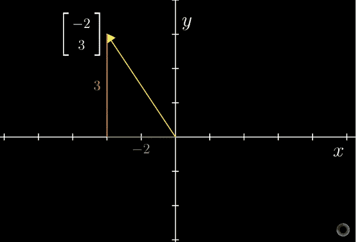**

***Source:* [*3Blue1Brown*](http://www.3blue1brown.com/)*’s video on* [*Vectors*](https://www.youtube.com/watch?v=fNk_zzaMoSs&list=PLZHQObOWTQDPD3MizzM2xVFitgF8hE_ab)**

**将这一思想推进到 3 维，我们在 3 维空间中得到如下箭头:**

**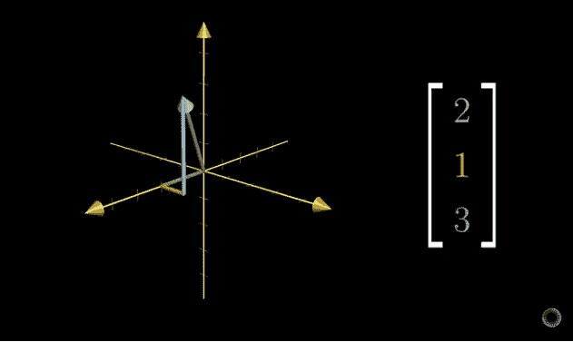**

***Source:* [*3Blue1Brown*](http://www.3blue1brown.com/)*’s video on* [*Vectors*](https://www.youtube.com/watch?v=fNk_zzaMoSs&list=PLZHQObOWTQDPD3MizzM2xVFitgF8hE_ab)**

## **两个向量的点积**

**以使本教程更加枯燥为代价，让我们看看什么是点积。假设你有两个向量 oh size **n+1** 、 **w** 和 **x** ，这些向量的点积( ***w.x*** )可以计算如下:**

**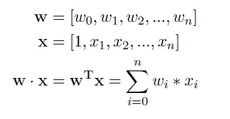**

**The transpose is just to write it in a matrix multiplication form.**

**在这里， **w** 和 **x** 只是一个 **n+1 维**空间中的两个孤独的箭头(直观地说，它们的点积量化了一个向量向另一个向量的方向移动了多少)。所以从技术上讲，感知器只是在计算一个蹩脚的点积(在检查它是大于还是小于 0 之前)。感知器给出的区分正例与反例的判定边界线实际上就是 **w . x** = 0。**

## **两个向量之间的角度**

**现在，如果你知道向量之间的角度和它们各自的大小，同样的点积可以用不同的方法计算。方法如下:**

****

**反过来，你可以得到两个向量之间的角度，只要你知道向量，只要你知道如何计算向量的大小和它们的点积。**

**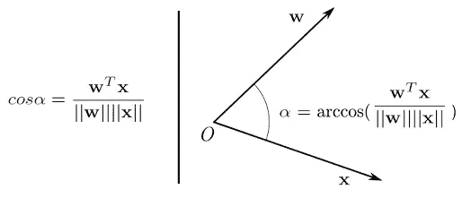**

**当我说 **w** 和 **x** 的夹角余弦为 0 时，你看到了什么？我看到箭头 **w** 垂直于箭头 **x** 在一个 n+1 维空间(说实话在 2 维空间)。所以基本上，当两个向量的点积为 0 时，它们是互相垂直的。**

## **设置问题**

**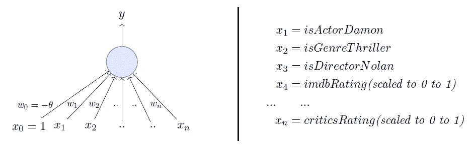**

**我们将使用一个感知器来估计我是否会根据上述输入的历史数据来观看电影。数据有正反两个例子，正的是我看的电影即 1。基于这些数据，我们将使用感知器学习算法来学习权重。为了视觉上的简单，我们将只假设二维输入。**

# **感知机学习算法**

**我们的目标是找到能够完美分类我们数据中的正输入和负输入的 **w** 向量。我将直接进入算法。这是:**

**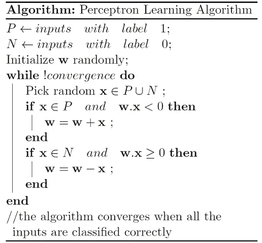**

**我们用一些随机向量初始化 **w** 。然后我们迭代数据中的所有例子，( *P* U *N* )包括正面和负面的例子。现在，如果一个输入 **x** 属于 *P* ，理想情况下，点积 **w.x** 应该是多少？我会说大于或等于 0，因为这是我们的感知机在一天结束时唯一想要的，所以让我们给它。而如果 **x** 属于 *N* ，那么点积必须小于 0。因此，如果您查看 while 循环中的 if 条件:**

**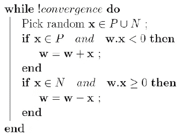**

****情况 1:** 当 **x** 属于 *P* 及其点积**w . x**0
**情况 2:** 当 **x** 属于 *N* 及其点积 **w.x** ≥ 0**

**只有在这些情况下，我们才更新随机初始化的 **w** 。否则，我们根本不接触 **w** ，因为案例 1 和案例 2 违反了感知器的规则。所以我们在例 1 中把 **x** 加到 **w** (咳咳矢量相加咳咳)，在例 2 中把 **w** 减去 **x** 。**

## **为什么指定的更新规则会起作用？**

**但是为什么会这样呢？如果你已经明白了为什么会这样，你就明白了我这篇文章的全部主旨，现在你可以继续你的生活了，谢谢你的阅读，再见。但是如果你不确定为什么这些看似任意的 x**x**和 **w** 的运算会帮助你学习到完美的 **w** 可以完美的分类 *P* 和 *N* ，请继续使用我的方法。**

**我们已经建立了当 **x** 属于 *P* 时，我们要**w . x**0，基本感知器法则。我们这样说也是指当 **x** 属于 *P* 时， **w** 与 **x** 之间的角度应大于 90 度。填空。**

**答: **w** 和 **x** 之间的角度应该小于 90°，因为角度的余弦与点积成正比。**

**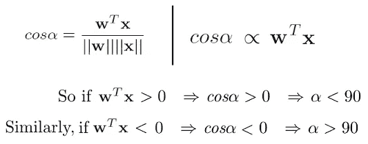**

**所以不管 **w** 向量可能是什么，只要它与正例数据向量( **x** E *P* )的角度小于 90 度，与负例数据向量( **x** E *N* )的角度大于 90 度，我们就没事了。理想情况下，它应该是这样的:**

**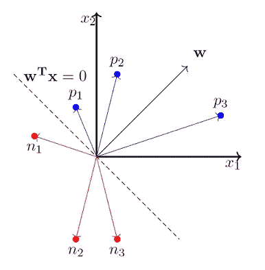**

**x_0 is always 1 so we ignore it for now.**

**所以我们现在强烈认为当 **x** 属于 *P* 类时 **w** 和 **x** 之间的角度应该小于 90°，当 **x** 属于 *N* 类时它们之间的角度应该大于 90°。停下来，说服你自己，上面的陈述是真实的，你确实相信它们。这就是为什么这一更新有效的原因:**

**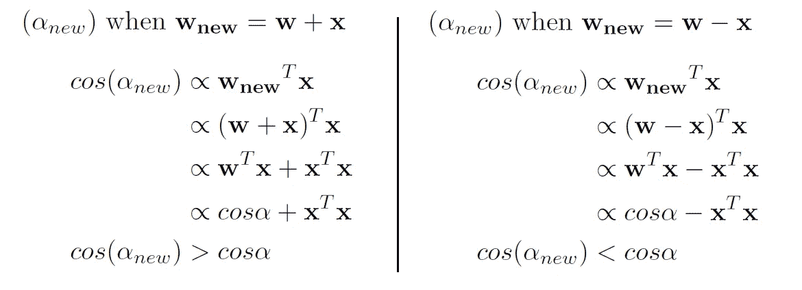**

**Now this is slightly inaccurate but it is okay to get the intuition.**

**因此，当我们将 **x** 与 **w** 相加时，当 x 属于 P 并且**w . x**0(情况 1)时，我们实际上是**增加 *cos(alpha)*** 值，这意味着**减少 *alpha* 值**，即 **w** 与 **x** 、**之间的角度类似的直觉也适用于 **x** 属于 *N* 且 **w.x** ≥ 0 的情况(情况 2)。****

**这里有一个玩具模拟，模拟了我们最终可能如何学习正面例子中小于 90 度的角度和负面例子中大于 90 度的角度。**

**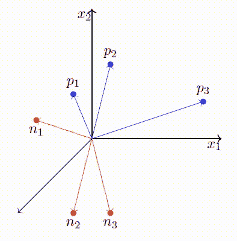**

**We start with a random vector **w**.**

# **收敛性的证明**

**现在，你没有理由相信这一定会收敛于所有类型的数据集。看起来可能会有这样的情况，w 继续四处移动，永远不会收敛。但是人们已经证明了这个算法是收敛的。我附上哥伦比亚大学的迈克尔·柯林斯教授的证明— [在这里找到论文](http://www.cs.columbia.edu/~mcollins/courses/6998-2012/notes/perc.converge.pdf)。**

# **结论**

**在这篇文章中，我们快速地看了一下什么是感知机。然后我们用线性代数的一些基础知识热身。然后我们看了一下*感知器学习算法*，然后继续想象它为什么工作，即如何学习适当的权重。**

**感谢你阅读这篇文章。自己活也让别人活！
答**

****

**Photo by [Roman Mager](https://unsplash.com/photos/5mZ_M06Fc9g?utm_source=unsplash&utm_medium=referral&utm_content=creditCopyText) on [Unsplash](https://unsplash.com/search/photos/math?utm_source=unsplash&utm_medium=referral&utm_content=creditCopyText)**