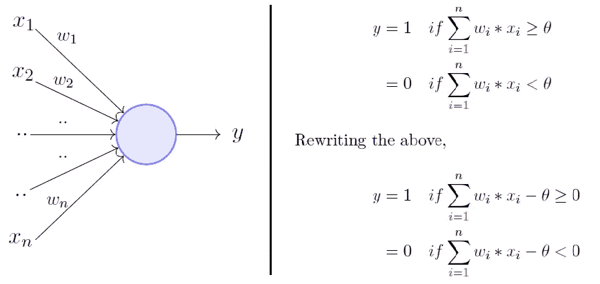
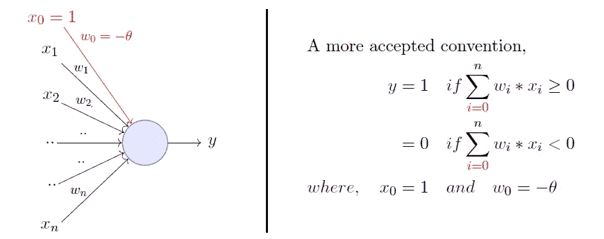
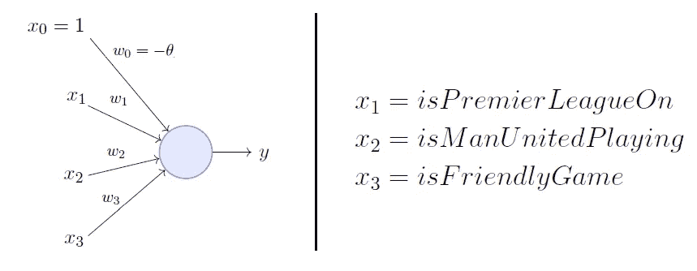
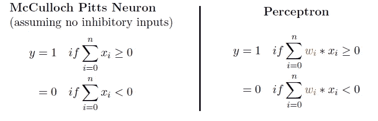
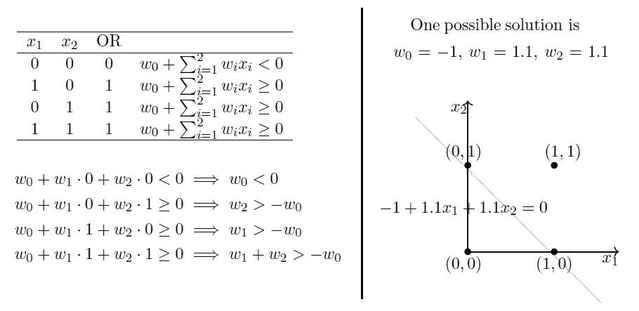
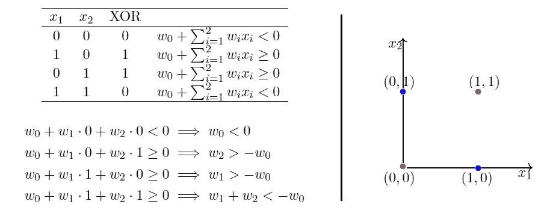
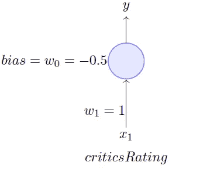
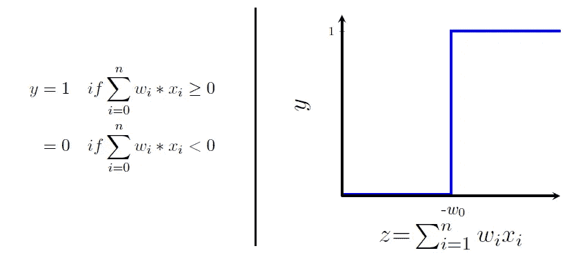
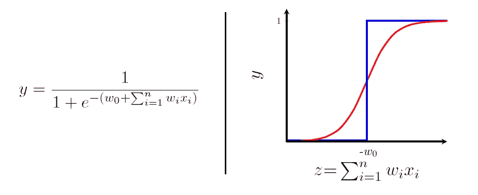

# 感知器:人工神经元(麦卡洛克-皮茨神经元的本质升级)

> 原文：<https://towardsdatascience.com/perceptron-the-artificial-neuron-4d8c70d5cc8d?source=collection_archive---------0----------------------->

深度神经网络的最基本单元被称为*人工神经元*，它接受输入，对其进行处理，将其传递给类似 [Sigmoid](https://en.wikipedia.org/wiki/Sigmoid_function) 的激活函数，并返回激活的输出。在这篇文章中，我们将只讨论在“激活”部分出现之前提出的*感知机*模型。

美国心理学家弗兰克·罗森布拉特(Frank Rosenblatt)在 1958 年提出了*经典感知机*模型。由[明斯基和 Papert](http://science.sciencemag.org/content/165/3895/780) (1969)进一步提炼和仔细分析——他们的模型被称为*感知器*模型。这是我上一篇关于[麦卡洛克-皮茨神经元](/mcculloch-pitts-model-5fdf65ac5dd1)的文章的后续，我建议你至少快速浏览一下，以便更好地欣赏明斯基-帕佩特的贡献。

*引用注:本文的概念、内容和结构灵感来自于* [***米特什·m·卡普拉***](https://www.cse.iitm.ac.in/~miteshk/) *教授关于*[*NPTEL*](http://nptel.ac.in)*的* [*深度学习*](https://onlinecourses.nptel.ac.in/noc18_cs41/preview) *课程的精彩讲座和材料。看看吧！*

# 感知器

Minsky-Papert 提出的*感知器*模型是一个比麦卡洛克-皮茨神经元更通用的计算模型。它通过引入输入的数字权重(重要性的度量)的概念和学习这些权重的机制，克服了 M-P 神经元的一些限制。输入不再像 M-P 神经元那样局限于布尔值，它还支持实输入，这使它更加有用和通用。

现在，这非常类似于 M-P 神经元，但是我们取输入的加权和，并且仅当和大于任意阈值( ***、θ***)时将输出设置为 1。然而，根据惯例，我们没有手动编码阈值参数 ***thetha*** ，而是将其添加为输入之一，权重为- ***theta*** ，如下所示，这使得它可以学习(在我的下一篇文章中会详细介绍这一点— *感知器学习算法*)。

考虑使用可用的行为数据预测我是否会在电视上观看随机的足球比赛的任务(与我的 M-P neuron 帖子中的例子相同)。让我们假设我的决定完全依赖于 3 个二进制输入(为简单起见是二进制)。

在这里， ***w_0*** 之所以被称为偏见，是因为它代表了先验(preference)。一个足球狂可能有一个非常低的门槛，可以观看任何足球比赛，而不考虑联赛、俱乐部或比赛的重要性[ ***theta = 0*** ]。另一方面，像我这样的选择性观众可能只观看英超联赛的足球比赛，以曼联比赛为特色，并且不友好。重点是，**权重**和**偏差**将取决于数据(在这种情况下是我的观看历史)。

根据数据，如果需要，模型可能必须赋予 *isManUnitedPlaying* 输入很大的重要性(高权重),并惩罚其他输入的权重。

# 感知器 vs 麦卡洛克-皮茨神经元

使用*感知器*可以实现什么样的功能？它与麦卡洛克-皮茨神经元有多大不同？

从等式中可以清楚地看出，即使是一个*感知器*也会将输入空间分成两半，正的和负的。产生输出 1 的所有输入位于一侧(正半空间)，产生输出 0 的所有输入位于另一侧(负半空间)。

换句话说，单个*感知器*只能用来实现**线性可分**功能，就像 M-P 神经元一样。那有什么区别呢？为什么我们声称*感知器*是 M-P 神经元的升级版？这里，包括阈值的权重可以是学习的**和输入可以是真实的**值。****

# **使用感知器的布尔函数**

## **还是功能——能做！**

**只是重温过去的美好时光，或者用感知机的方式发挥作用。**

****

**Try solving the equations on your own.**

**上面的‘可能解’是通过解左边的线性方程组得到的。很明显，解决方案将输入空间分成两个空间，负半空间和正半空间。我鼓励您尝试使用 AND 和其他布尔函数。**

**现在，如果你真的试着解上面的线性方程，你会发现可能有多个解。但是哪种解决方案是最好的呢？为了更正式地定义“最佳”解决方案，我们需要理解错误和错误表面，这将在我的下一篇关于*感知器学习算法的文章中进行。***

## **XOR 函数—做不到！**

**现在让我们来看一个非线性布尔函数，也就是说，你不能画一条线来区分正输入和负输入。**

****

**请注意，第四个等式与第二个和第三个等式相矛盾。关键是，对于非线性分离的数据，没有*感知器*解决方案。因此，关键是一个**单个** *感知器*无法学会分离本质上是非线性的数据。**

> ****异或事件****
> 
> **在 Minsky 和 Papert 于 1969 年出版的书中，作者暗示，由于单个人工神经元无法实现某些功能，如逻辑功能的 XOR，因此更大的网络也有类似的局限性，因此应该放弃。后来对三层感知器的研究显示了如何实现这样的功能，从而避免了这项技术被抹杀。**
> 
> **— *维基百科***

# **(可选)乙状结肠神经元的动机**

**正如我前面提到的，我们今天使用的人工神经元与我们看到的*感知器*略有不同，区别在于激活功能。给你。有些人可能会说一个*感知器*使用的阈值逻辑非常苛刻。例如，如果你看一个决定我是否要看电影的问题，只基于一个实值输入( ***x_1*** = *评论*)，如果我们设置的阈值是 0.5(***w _ 0***=-0.5)和***【w _ 1***= 1，那么我们的设置将是这样的:**

****

**对于一部*= 0.51 的电影，会有什么样的决定？*是的！* 对于一部*= 0.49 的电影，会有什么决定？*不！有些人可能会说，我们会看一部评分为 0.51 的电影，而不是一部评分为 0.49 的电影，这太苛刻了，这就是西格蒙德出现的原因。现在说服你自己，这个苛刻的阈值并不仅仅归因于我们在这里选择的一个特定问题，它可能发生在我们处理的任何或每一个问题上。这是*感知器*功能本身的一个特征，其行为类似于阶跃函数。*****

******

***z 值越过阈值(- ***w_0*** )时会有这种决策的突变(从 0 到 1)。对于大多数真实世界的应用，我们期望一个从 0 到 1 逐渐变化的更平滑的决策函数。***

***引入输出函数比阶跃函数平滑得多的 sigmoid 神经元似乎是一件合乎逻辑且显而易见的事情。请注意，sigmoid 函数是一个具有典型“S”形曲线的数学函数，也称为 **sigmoid** 曲线。有许多功能可以帮您完成这项工作，下面列出了一些:***

******

***- [Wikipedia](https://en.wikipedia.org/wiki/Sigmoid_function)***

***最简单的一个例子是逻辑函数。***

******

***Quick Question: What happens to **y** when **z** is infinite? Or when it is -infinite?***

***我们不再看到围绕 ***w_0*** 的急剧转变。此外，输出不再是二进制的，而是介于 0 和 1 之间的真实值，可以解释为概率。因此，我们得到的不是“是/否”的决定，而是“是”的概率。这里的输出是**平滑**、**连续**和**可微**，这是任何学习算法都喜欢的。要自己验证这一点，请翻翻深度学习中的**反向传播**概念。***

# ***结论***

***在这篇文章中，我们看了一个*感知器*，深度神经网络的基本单元。我们还通过例子展示了*感知器*与麦卡洛克-皮茨神经元相比，如何更加一般化，并克服了当时的一些相关限制。我们也简单地建立了乙状结肠神经元的动机。***

***在我的下一篇文章中，我们将仔细观察著名的 [*感知器学习算法*](/d5db0deab975) ，并尝试获得它为什么工作的直觉，而不进入任何复杂的证明，以及从头开始用 Python 实现该算法。***

***感谢您阅读文章。自己活也让别人活！
答***

******

***Photo by [Clint Adair](https://unsplash.com/photos/BW0vK-FA3eg?utm_source=unsplash&utm_medium=referral&utm_content=creditCopyText) on [Unsplash](https://unsplash.com/?utm_source=unsplash&utm_medium=referral&utm_content=creditCopyText)***