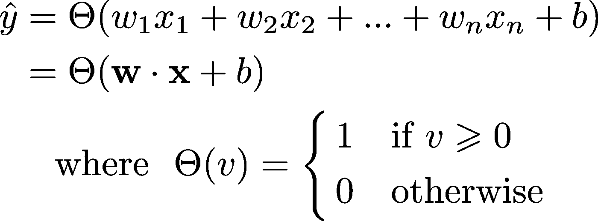
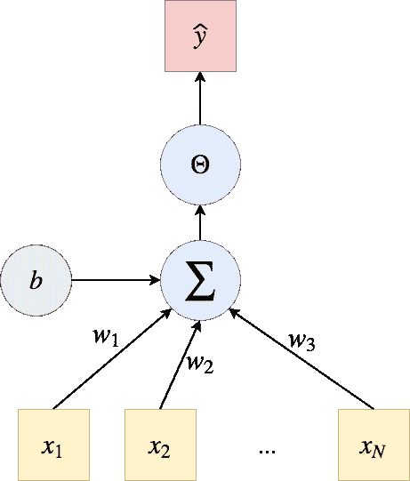
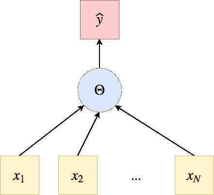
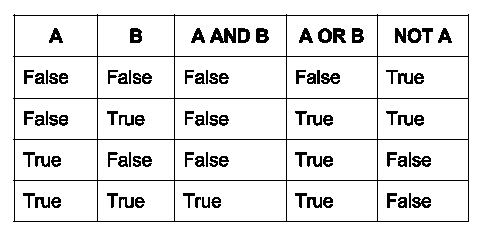
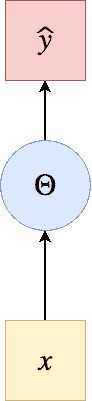
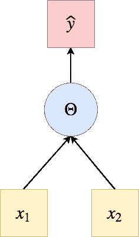
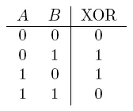
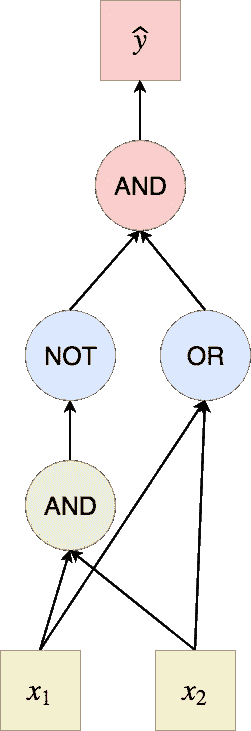

# 感知器、逻辑函数和异或问题

> 原文：<https://towardsdatascience.com/perceptrons-logical-functions-and-the-xor-problem-37ca5025790a?source=collection_archive---------1----------------------->

## 深度学习药丸#2

今天我们将探索感知器能做什么，它有什么限制，我们将为超越这些限制做准备！图形和代码支持的一切。

## 来自[深度学习药丸#1](/https-medium-com-francesco-cicala-whats-whys-and-hows-of-perceptron-f87c66f512c5) 的元素

在本系列的[第 1 部分](/https-medium-com-francesco-cicala-whats-whys-and-hows-of-perceptron-f87c66f512c5)中，我们引入了感知器作为实现以下功能的模型:



对于参数 ***w*** 和 *b* 的特定选择，输出ŷ仅取决于输入向量 ***x*** 。我用ŷ(“y 帽”)来表示这个数字是由模型产生/预测的。很快，你就会体会到这种符号的简易性。


## 计算图形

为了可视化一个模型的**架构**，我们使用了所谓的**计算图**:一个用来表示数学函数的有向图。变量和操作都是节点；变量被输入到操作中，操作产生变量。

我们感知机的计算图是:



σ符号通过权重***w*** 和偏差 *b* 表示输入***x*** 的线性组合。由于这种符号非常复杂，从现在开始，我将按照以下方式简化计算图形:



# 感知器能做什么？

我正在介绍一些感知器可以用它的*能力*实现什么的例子(我将在本系列的后续部分讨论这个术语！).逻辑函数是一个很好的起点，因为它们将把我们带到感知器背后的理论的自然发展，因此也是**神经网络**。



## 非逻辑函数

让我们从一个非常简单的问题开始:

> 感知器能实现非逻辑功能吗？



NOT(x)是一个 1 变量函数，这意味着我们一次只有一个输入:N=1。此外，它是一个**逻辑函数**，因此输入和输出都只有两种可能的状态:0 和 1(即假和真):Heaviside 阶跃函数似乎符合我们的情况，因为它产生一个二进制输出。

考虑到这些因素，我们可以说，如果存在一个可以实现 NOT(x)函数的感知器，它就像左边显示的那样。
给定两个参数 *w* 和 *b* ，它将执行以下计算:
ŷ=θ(*wx+b)*

最基本的问题是:是否存在两个值，如果作为参数选取，允许感知器实现非逻辑功能？当我说*感知器实现一个函数时，*我的意思是，对于函数域中的每个输入，感知器返回相同的数字(或向量),函数将返回相同的输入。
回到我们的问题:这些值之所以存在，是因为我们可以很容易地找到它们:让我们选择 *w = -1* 和 *b = 0.5。*

我们得到了:

```
NOT(0) = 1
NOT(1) = 0
```

我们得出结论，初始问题的答案是:是的，一个感知器可以实现 NOT 逻辑功能；我们只需要**正确设置它的参数**。请注意，我的解决方案不是唯一的；事实上，对于这个特殊的问题，作为(w，b)点的解是无限的！可以用自己喜欢的；)

## 和逻辑功能

下一个问题是:

> 感知器能实现 AND 逻辑功能吗？



AND 逻辑函数是一个二元函数，*和(x1，x2)* ，具有二进制输入和输出。

该图与以下计算相关:
ŷ=θ(*w1 * x1+w2 * x2+b*

这次我们有三个参数: *w1* 、 *w2、*和 *b* 。你能猜出这些参数的哪三个值能让感知机解决**和问题**吗？

解:
*w1 = 1，w2 = 1，b = -1.5*

它会打印:

```
AND(1, 1) = 1
AND(1, 0) = 0
AND(0, 1) = 0
AND(0, 0) = 0
```

## 或逻辑函数

*或(x1，x2)* 也是一个二元函数，它的输出是一维的(即一个数)，有两种可能的状态(0 或 1)。因此，我们将使用一个与之前相同架构的感知器。解决 OR 问题的三个参数是什么？

解:
*w1 = 1，w2 = 1，b = -0.5*

```
OR(1, 1) = 1
OR(1, 0) = 1
OR(0, 1) = 1
OR(0, 0) = 0
```

## XOR —所有(感知器)对一(逻辑功能)

我们的结论是，一个单一的感知器与亥维赛激活功能可以实现每一个基本的逻辑功能:非，与和或。它们被称为基本的，因为任何逻辑函数，无论多么复杂，都可以通过这三者的组合来获得。我们可以推断，**如果把我们刚刚搭建的三个感知器适当的连接起来，就可以实现任何逻辑功能！让我们来看看如何:**

> 我们如何建立一个由**基本逻辑感知器**组成的网络，使其实现异或功能？



解决方案:



输出是:

```
XOR(1, 1) = 0
XOR(1, 0) = 1
XOR(0, 1) = 1
XOR(0, 0) = 0
```

这些就是我们一直在寻找的预测！我们只是把上面的三个感知器组合起来，得到一个更复杂的逻辑函数。

有些人可能想知道，就像我们对前面的函数所做的那样，是否有可能找到单个感知器的参数值，这样它就可以自己解决 XOR 问题。

我不会让你为寻找这三个数字而大费周章，因为那是没有用的:答案是它们不存在。**为什么？**答案是异或问题不是**线性** **可分**，我们在本系列下一章深入讨论！

我将在几天后发表它，我们将讨论我刚才提到的线性可分性。我将从几何的角度重塑我今天介绍的主题。这样，我们今天得到的每一个结果都会得到它自然直观的解释。

如果你喜欢这篇文章，我希望你能考虑给它一些掌声！每一次鼓掌都是对我极大的鼓励:)还有，随时在[*Linkedin*](https://www.linkedin.com/in/francescocicala/)*上联系我！*

*很快再见，
弗兰克*