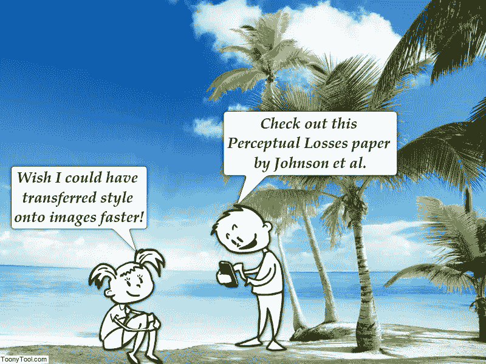
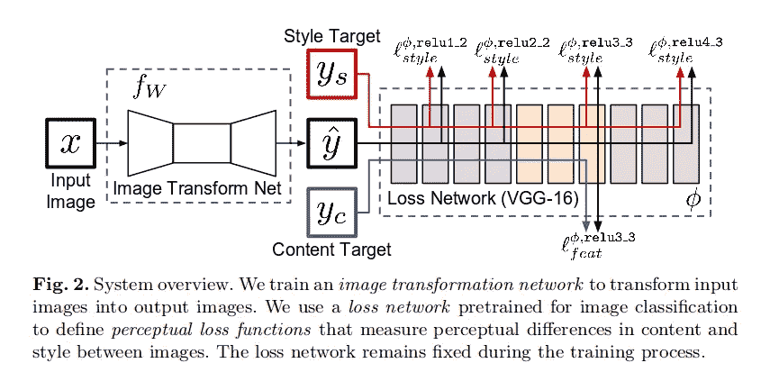
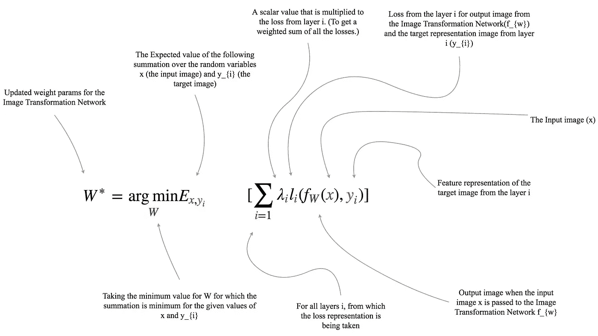
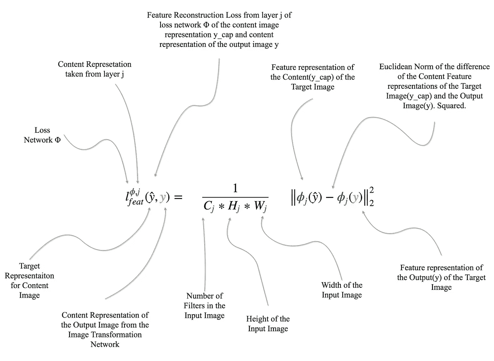
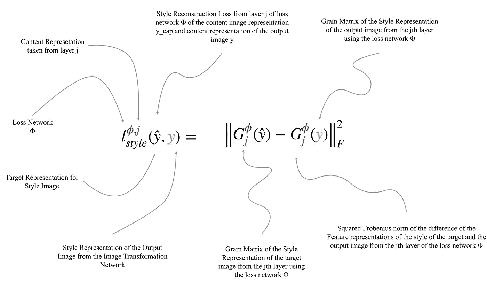
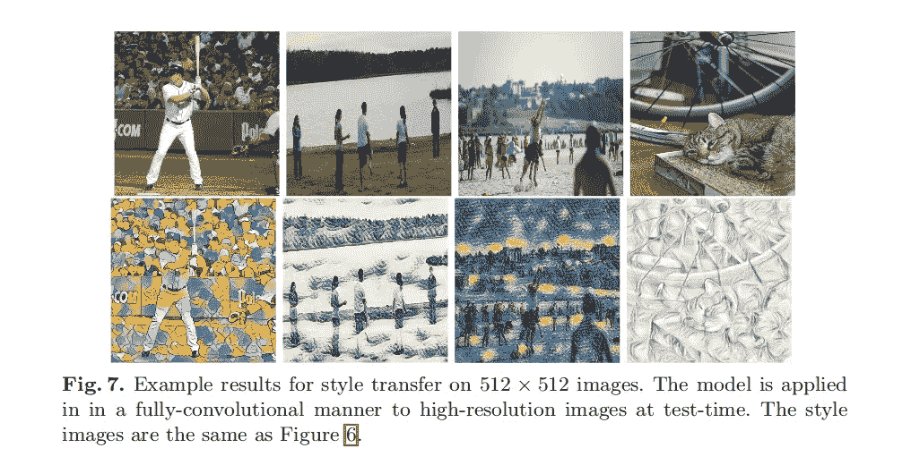
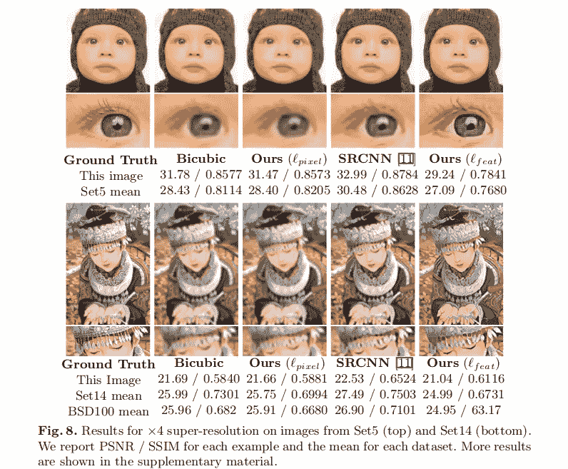
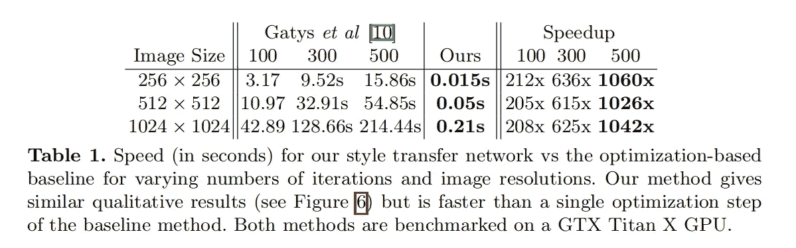

# 实时风格转换和超分辨率的感知损失

> 原文：<https://towardsdatascience.com/perceptual-losses-for-real-time-style-transfer-and-super-resolution-637b5d93fa6d?source=collection_archive---------5----------------------->

**[Fig. 1] Two toons discussing Neural Style Transfer at the beach.**

*这是一篇论文的论文摘要:* ***实时风格传递和超分辨率的感知损失*** *作者:贾斯廷·约翰逊，亚历山大阿拉希，李菲菲。
论文:*

# *概观*

*本文提出使用 ***感知损失函数*** 来训练用于图像变换任务的前馈网络*，而不是使用* ***逐像素损失函数*** 。*

> ***每像素损失函数？**
> 根据两幅图像各自的像素值进行比较。
> 因此，如果两个图像在感知上相同，但是基于甚至一个像素彼此不同，那么基于每像素损失函数，它们将彼此非常不同。*
> 
> ***感知损失函数？**
> 基于来自预训练卷积神经网络(在图像分类任务上训练，比如说 ImageNet 数据集)的高级表示，比较两幅图像*。**

*他们在两个图像转换任务上评估他们的方法:
(i)风格转换
(ii)单幅图像超分辨率*

*对于风格转移，他们训练前馈网络，试图解决 [Gatys et al. 2015](https://arxiv.org/pdf/1508.06576v2.pdf) 提出的优化问题。*

*对于超分辨率，他们尝试使用感知损失，并表明它比使用每像素损失函数获得更好的结果。*

# *方法*

**

***[Fig. 2] Model Architecture***

*所提出的模型架构由两个组件组成:
(i)图像变换网络(`f_{w}` )
(ii)损失网络(φ)*

## *图像变换网络*

*图像变换网络是一个深度残差卷积神经网络，它被训练来解决 Gatys 提出的优化问题。*

*给定一个输入图像(x ),该网络将其转换成输出图像(ŷ).*

*使用使用输出图像(ŷ)计算的损失并将其与以下各项进行比较来学习该网络的权重(w):风格转移情况下的风格图像(`y_{s}`)和内容图像(`y_{c}`)的表示
-超分辨率情况下的内容图像`y_{c}`。*

*使用[随机梯度下降](https://en.wikipedia.org/wiki/Stochastic_gradient_descent)来训练图像变换网络，以获得最小化所有损失函数的加权和的权重(W)。*

**

***[Fig. 3] Weight update equation Explained.***

## *损耗网络*

*损耗网络(φ)是 ImageNet 数据集上预先训练的 VGG16。*

*损失网络用于从内容和样式图像中获得内容和样式表示:
(i)内容表示取自层` *relu3_3* `。【*图 2*
(二)样式表示取自图层` *relu1_2* `、` *relu2_2* `、` *relu3_3* `、` *relu4_3* `。【*图 2**

*这些表示用于定义两种类型的损失:*

****特征重建损失***
用输出图像(ŷ)和来自层` *relu3_3* '的内容表示并在图像中使用以下损失函数*

**

***[Fig. 4] Feature Reconstruction Loss Explained.***

****风格重建损失*** 利用输出图像(ŷ)和来自层` *relu1_2* 、` *relu2_2* 、` *relu3_3* 和` *relu4_3* 的风格表示，并使用来自图像的以下损失函数*

**

***[Fig. 5] Style Reconstruction Loss Explained.***

*在风格转移的情况下，总损失通常是特征重建损失和风格重建损失的加权和。和超分辨率的特征重建损失的加权乘积。*

*这些损失用于学习图像变换网络的权重。*

# *结果*

## *风格转移*

**

***[Fig. 6] Results of Style Transfer (from the paper)***

*   *在 COCO 数据集上训练的网络(用于内容图像)。*
*   *80k 训练图像调整为 256x256 补丁。*
*   *批量:4 个*
*   *40k 次迭代(大约 2 个时期)*
*   *使用的优化器:Adam*
*   *学习率:1e-3*
*   *在 Titan X GPU 上进行培训大约需要 4 个小时*
*   *对比 Gatys 等人提出的方法*【1】*。*

## *单幅图像超分辨率*

**

***[Fig. 7] Results of Super-Resolution (x4) (from paper)***

*   *使用来自 MS-COCO 的 10k 图像的 288x288 补丁进行训练*
*   *通过使用宽度σ=1.0 的高斯内核进行模糊处理和使用双三次插值进行下采样，准备好低分辨率输入。*
*   *批量:4 个*
*   *迭代次数:20 万次*
*   *优化器:亚当*
*   *学习率:1e-3*
*   *对比 Sr CNN*【3】**

**

***[Fig. 8] Table showing the speed in seconds of the approach in this paper against Gatys’ paper (from the paper)***

*正如我们所看到的，我们使用本文的方法得到了相似的结果，并且在推理过程中比 Gatys 的方法几乎快*3 个数量级。**

**这种方法的最大缺点是，我们必须针对每种风格或每种分辨率训练 ***一个网络，*** 即不能仅使用一个网络来执行 ***任意*** 风格转换。**

**使用 Gatys，我们能够仅使用一个网络来执行 ***任意*** 风格的传输，这是我们使用本文提出的方法无法做到的。**

## **参考**

*****【1】***贾斯廷·约翰逊、阿拉希、李菲菲。:实时风格转换和超分辨率的感知损失。arXiv:1603.08155(2016 年 3 月)**

*****【2】***Gatys，L.A .，Ecker，A.S .，Bethge，m .:艺术风格的神经算法。arXiv 预印本 arXiv:1508.06576 (2015)**

*****【3】***董，c，洛伊，C.C .，何，k，唐，x .:学习一种用于图像超分辨率的深度卷积网络。参加:计算机视觉-ECCV 2014。施普林格(2014 年)**

***所以，简而言之，这就是论文的全部内容！* ***如果我发现一些有趣的见解需要补充，我会更新这个故事！*** *一定要走纸！***

***喜欢什么你请 read❓
👏 👏 👏 👏 👏***

***喜欢我的作品❓
跟着我❗️***

** [## 阿鲁纳瓦查克拉博蒂| LinkedIn

### 查看 Arunava Chakraborty 在 LinkedIn 上的职业简介。LinkedIn 是世界上最大的商业网络，帮助…

www.linkedin.com](https://www.linkedin.com/in/iarunava/)  [## 阿鲁纳瓦(@amArunava) |推特

### 阿鲁纳瓦(@amArunava)的最新推文:“从@fastdotai 上的#DeepLearning 课程 1 开始，已完成第 1 周…

twitter.com](https://twitter.com/amArunava)  [## 阿鲁纳瓦

### 订阅深入了解 Python 里的所有东西。

www.youtube.com](https://www.youtube.com/channel/UC2ZFGaNzZt-sUy2qZT6L7Zw) 

给我发消息！
我们连线吧！**